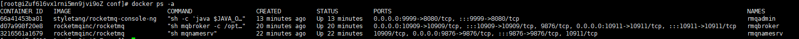
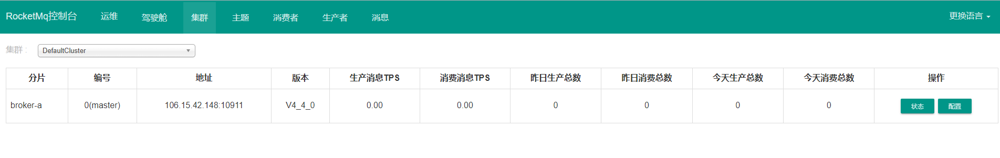

## 1. 下载RocketMQ所需的镜像

```bash
# 这里下载的是下面2个，可以使用docker search搜索，选择star多的下载
[root@iZuf616vx1rni5mn9jvi9oZ conf]# docker images
REPOSITORY                      TAG       IMAGE ID       CREATED        SIZE
rocketmqinc/rocketmq            latest    09bbc30a03b6   2 years ago    380MB
styletang/rocketmq-console-ng   latest    7df83bb6e638   4 years ago    702MB
```

## 2.启动NameServer服务

#### 创建NameServer数据存储路径：

```bash
mkdir -p /home/rocketmq/data/namesrv/logs /home/rocketmq/data/namesrv/store
```

#### 构建 NameServer 容器

```bash
docker run -d --name rmqnamesrv -p 9876:9876 -v /home/rocketmq/data/namesrv/logs:/root/logs -v /home/rocketmq/data/namesrv/store:/root/store -e "MAX_POSSIBLE_HEAP=100000000" rocketmqinc/rocketmq sh mqnamesrv
```

## 3. 启动Broker服务

#### 创建Broker数据存储路径：

```bash
mkdir -p /home/rocketmq/data/broker/logs /home/rocketmq/data/broker/store
```

#### 创建conf目录

```bash
mkdir /home/rocketmq/conf
```

然后在`/home/rocketmq/conf`目录下创建`broker.conf`文件：

```bash
# 所属集群名称，如果节点较多可以配置多个
brokerClusterName = DefaultCluster
#broker名称，master和slave使用相同的名称，表明他们的主从关系
brokerName = broker-a
#0表示Master，大于0表示不同的slave
brokerId = 0
#表示几点做消息删除动作，默认是凌晨4点
deleteWhen = 04
#在磁盘上保留消息的时长，单位是小时
fileReservedTime = 48
#有三个值：SYNC_MASTER，ASYNC_MASTER，SLAVE；同步和异步表示Master和Slave之间同步数据的机制；
brokerRole = ASYNC_MASTER
#刷盘策略，取值为：ASYNC_FLUSH，SYNC_FLUSH表示同步刷盘和异步刷盘；SYNC_FLUSH消息写入磁盘后才返回成功状态，ASYNC_FLUSH不需要；
flushDiskType = ASYNC_FLUSH
# 设置broker节点所在服务器的ip地址
brokerIP1 = 服务器外网ip
```

#### 构建 Broker 容器：

```bash
docker run -d  --name rmqbroker --link rmqnamesrv:namesrv -p 10911:10911 -p 10909:10909 -v  /home/rocketmq/data/broker/logs:/root/logs -v /home/rocketmq/data/broker/store:/root/store -v /home/rocketmq/conf/broker.conf:/opt/rocketmq-4.4.0/conf/broker.conf -e "NAMESRV_ADDR=namesrv:9876" -e "MAX_POSSIBLE_HEAP=200000000" rocketmqinc/rocketmq sh mqbroker -c /opt/rocketmq-4.4.0/conf/broker.conf
```

## 4. 启动控制台

```bash
docker run -d --name rmqadmin -e "JAVA_OPTS=-Drocketmq.namesrv.addr=服务器外网ip:9876 \
-Dcom.rocketmq.sendMessageWithVIPChannel=false \
-Duser.timezone='Asia/Shanghai'" -v /etc/localtime:/etc/localtime -p 9999:8080 styletang/rocketmq-console-ng
```

查看docker运行的容器



最后访问`http://服务器外网ip:9999/#/cluster`

