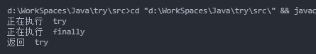
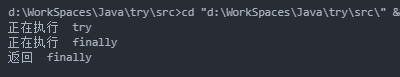

**`finally`是无论如何都要执行的，除非在`try/catch`的语句块中使用的`System.exit()`**

为了弄清楚Java中`try/catch/finally`中使用`return`语句的跳转，使用下面示例：

#### 1. 首先在`try`中使用`return`，`finally`中不使用`return`
```java
public class App {
    public static void main(String[] args) throws Exception {
        App app = new App();
        String res = app.test();
        System.out.println(res);
    }

    public String test() {
        try {
            System.out.println("正在执行  try");
            return new String("返回  try");
        } catch (Throwable throwable) {
            System.out.println("异常");
            return new String("catch");
        } finally {
            System.out.println("正在执行  finally");
            // return new String("返回  finally");
        }
    }
}
```
##### 执行结果

由此可见执行顺序：`try中语句——>finally中语句——>try中return语句`

#### 2. 在`try`中使用`return`，`finally`中也使用`return`

```java
public class App {
    public static void main(String[] args) throws Exception {
        App app = new App();
        String res = app.test();
        System.out.println(res);
    }

    public String test() {
        try {
            System.out.println("正在执行  try");
            return new String("返回  try");
        } catch (Throwable throwable) {
            System.out.println("异常");
            return new String("catch");
        } finally {
            System.out.println("正在执行  finally");
            return new String("返回  finally");
        }
    }
}

```
##### 执行结果

执行顺序：`try中语句——>finally中语句——>finally中的return`

#### 3. 在`catch`中使用`return`

```java
public class App {
    public static void main(String[] args) throws Exception {
        App app = new App();
        String res = app.test();
        System.out.println(res);
    }

    public String test() {
        try {
            System.out.println("正在执行  try");
            throw new Throwable("Some error");
        } catch (Throwable throwable) {
            System.out.println("异常");
            return new String("catch");
        } finally {
            System.out.println("正在执行  finally");
            return new String("返回  finally");
        }
    }
}

```
执行顺序和前面类似：`try中语句——>catch中语句——>finally中语句——>finally中return`

#### 综上所述
在执行完`try`和`catch`语句中后，都会执行`finally`中的语句，此时，如果`finally`中有`return`就直接从这里跳出。如果没有的话，就从`try`或者`catch`中的`return`中返回。
