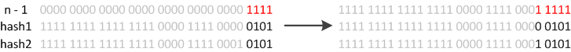

### HashMap 要点

从 `HashMap` 的命名，也可以看出：**`HashMap` 以散列方式存储键值对**。

**`HashMap` 允许使用空值和空键**。（`HashMap` 类大致等同于 `Hashtable`，除了它是不同步的并且允许为空值。）这个类不保序；特别是，它的元素顺序可能会随着时间的推移变化。

**`HashMap` 有两个影响其性能的参数：初始容量和负载因子**。

```java
    /**
     * The default initial capacity - MUST be a power of two.
     */
    static final int DEFAULT_INITIAL_CAPACITY = 1 << 4; // aka 16

    /**
     * The maximum capacity, used if a higher value is implicitly specified
     * by either of the constructors with arguments.
     * MUST be a power of two <= 1<<30.
     */
    static final int MAXIMUM_CAPACITY = 1 << 30;

    /**
     * The load factor used when none specified in constructor.
     */
    static final float DEFAULT_LOAD_FACTOR = 0.75f;
```


- 容量是哈希表中桶的数量，初始容量就是哈希表创建时的容量。
- 加载因子是散列表在其容量自动扩容之前被允许的最大饱和量。当哈希表中的 entry 数量超过负载因子和当前容量的乘积时，散列表就会被重新映射（即重建内部数据结构），一般散列表大约是存储桶数量的两倍。

> 加载因子 = 填入表中的元素个数 / 散列表的长度
>
> - 加载因子越大，填的元素个数越多，空间利用率高，但是发生冲突的机会也变大。
> - 加载因子越小，填的元素个数越少，空间利用率低，发生冲突机会减小，提高扩容rehash的次数。

通常，默认加载因子（0.75）在时间和空间成本之间提供了良好的平衡。HashMap的初始容量大小默认是16，为了减少冲突发生的概率，当HashMap的数组长度到达一个临界值的时候，就会触发扩容，把所有元素rehash之后再放在扩容后的容器中，这是一个相当耗时的操作。

> 临界值 = DEFAULT_INITIAL_CAPACITY * DEFAULT_LOAD_FACTOR
>
> 即默认情况下是16x0.75=12时，就会触发扩容操作。

`HashMap` 不是线程安全的。

### HashMap 原理

#### HashMap 数据结构

`JDK1.8之后`：

- 数据结构：**数组＋单链表＋红黑树**。原先 `数组＋单链表` 的数据结构，变更为 `数组＋单链表＋红黑树` 的结构。当出现哈希冲突时，数据会存入数组指定桶的单链表，**当链表长度达到 8，则将其转换为红黑树结构，长度为6时，又会转换为链表**，这样其查询的时间复杂度可以降低到 $O(logN)$，以改进性能（因为链表的查询性能较差，改成红黑树查询效率更高）

`HashMap` 的核心字段：

- `table` - `HashMap` 使用一个 `Node[]` 类型的数组 `table` 来储存元素。
- `size` - 初始容量。 初始为 16，每次容量不够自动扩容
- `loadFactor` - 负载因子。自动扩容之前被允许的最大饱和量，默认 0.75。

```java
public class HashMap<K,V> extends AbstractMap<K,V>
    implements Map<K,V>, Cloneable, Serializable {

    // 该表在初次使用时初始化，并根据需要调整大小。分配时，长度总是2的幂。
    transient Node<K,V>[] table;
    // 保存缓存的 entrySet()。请注意，AbstractMap 字段用于 keySet() 和 values()。
    transient Set<Map.Entry<K,V>> entrySet;
    // map 中的键值对数
    transient int size;
    // 这个HashMap被结构修改的次数结构修改是那些改变HashMap中的映射数量或者修改其内部结构（例如，重新散列）的修改。
    transient int modCount;
    // 下一个调整大小的值（容量*加载因子）。
    int threshold;
    // 散列表的加载因子
    final float loadFactor;
    
    // 当链表中的节点大于等于8时，链表会转换为红黑树
    static final int TREEIFY_THRESHOLD = 8;
	
    // 当链表中的节点小于等于6时，红黑树会转换为链表
    static final int UNTREEIFY_THRESHOLD = 6;
}
```

#### HashMap 构造方法

```java
public HashMap(); // 默认加载因子0.75
public HashMap(int initialCapacity); // 默认加载因子0.75；以 initialCapacity 初始化容量
public HashMap(int initialCapacity, float loadFactor); // 以 initialCapacity 初始化容量；以 loadFactor 初始化加载因子
public HashMap(Map<? extends K, ? extends V> m) // 默认加载因子0.75
```

#### put 方法的实现

put 方法大致的思路为：

- 对 key 的 `hashCode()` 做 hash 计算，然后根据 hash 值再计算 Node 的存储位置;
- 如果没有哈希碰撞，直接放到桶里；如果有哈希碰撞，以链表的形式存在桶后。
- 如果哈希碰撞导致链表过长(大于等于 `TREEIFY_THRESHOLD`，数值为 8)，就把链表转换成红黑树；
- 如果节点已经存在就替换旧值
- 桶数量超过 容量*负载因子（即 load factor * current capacity），HashMap 调用 `resize` 自动扩容一倍

```java
public V put(K key, V value) {
    return putVal(hash(key), key, value, false, true);
}

static final int hash(Object key) {
    int h;
    return (key == null) ? 0 : (h = key.hashCode()) ^ (h >>> 16);
}

final V putVal(int hash, K key, V value, boolean onlyIfAbsent,
                   boolean evict) {
    Node<K,V>[] tab; Node<K,V> p; int n, i;
    if ((tab = table) == null || (n = tab.length) == 0)
        n = (tab = resize()).length;
    if ((p = tab[i = (n - 1) & hash]) == null)
        tab[i] = newNode(hash, key, value, null);
    else {
        Node<K,V> e; K k;
        if (p.hash == hash &&
            ((k = p.key) == key || (key != null && key.equals(k))))
            e = p;
        else if (p instanceof TreeNode)
            e = ((TreeNode<K,V>)p).putTreeVal(this, tab, hash, key, value);
        else {
            for (int binCount = 0; ; ++binCount) {
                if ((e = p.next) == null) {
                    p.next = newNode(hash, key, value, null);
                    if (binCount >= TREEIFY_THRESHOLD - 1) // -1 for 1st
                        treeifyBin(tab, hash);
                    break;
                }
                if (e.hash == hash &&
                    ((k = e.key) == key || (key != null && key.equals(k))))
                    break;
                p = e;
            }
        }
        if (e != null) { // existing mapping for key
            V oldValue = e.value;
            if (!onlyIfAbsent || oldValue == null)
                e.value = value;
            afterNodeAccess(e);
            return oldValue;
        }
    }
    ++modCount;
    if (++size > threshold)
        resize();
    afterNodeInsertion(evict);
    return null;
}
```

**为什么计算 hash 使用 hashcode 无符号位移 16 位？**

假设要添加两个对象 a 和 b，如果数组长度是 16，这时对象 a 和 b 通过公式 (n - 1) & hash 运算，也就是 (16-1)＆a.hashCode 和 (16-1)＆b.hashCode，15 的二进制为 0000000000000000000000000001111，假设对象 A 的 hashCode 为 1000010001110001000001111000000，对象 B 的 hashCode 为 0111011100111000101000010100000，你会发现上述与运算结果都是 0。这样的哈希结果就太让人失望了，很明显不是一个好的哈希算法。

但如果我们将 hashCode 值右移 16 位（h >>> 16 代表[无符号右移](https://blog.csdn.net/cobbwho/article/details/54907203)16 位），刚好可以将该二进制数对半切开，并且使用位异或运算（如果两个数对应的位置相反，则结果为 1，反之为 0），这样的话，就能避免上面的情况发生。这就是 hash() 方法的具体实现方式。**简而言之，就是尽量打乱 hashCode 真正参与运算的低 16 位。**

#### get 方法的实现

在理解了 put 之后，get 就很简单了。大致思路如下：

- 对 key 的 hashCode() 做 hash 计算，然后根据 hash 值再计算桶的 index
- 如果桶中的第一个节点命中，直接返回；
- 如果有冲突，则通过 `key.equals(k)` 去查找对应的 entry
  - 若为树，则在红黑树中通过 key.equals(k) 查找，O(logn)；
  - 若为链表，则在链表中通过 key.equals(k) 查找，O(n)。

具体代码的实现如下：

```java
public V get(Object key) {
    Node<K,V> e;
    return (e = getNode(hash(key), key)) == null ? null : e.value;
}

static final int hash(Object key) {
    int h;
    return (key == null) ? 0 : (h = key.hashCode()) ^ (h >>> 16);
}

final Node<K,V> getNode(int hash, Object key) {
    Node<K,V>[] tab; Node<K,V> first, e; int n; K k;
    if ((tab = table) != null && (n = tab.length) > 0 &&
        (first = tab[(n - 1) & hash]) != null) {
        if (first.hash == hash && // always check first node
            ((k = first.key) == key || (key != null && key.equals(k))))
            return first;
        if ((e = first.next) != null) {
            if (first instanceof TreeNode)
                return ((TreeNode<K,V>)first).getTreeNode(hash, key);
            do {
                if (e.hash == hash &&
                    ((k = e.key) == key || (key != null && key.equals(k))))
                    return e;
            } while ((e = e.next) != null);
        }
    }
    return null;
}
```

#### hash 方法的实现

HashMap **计算桶下标（index）公式：`key.hashCode() ^ (h >>> 16)`**。

下面针对这个公式来详细讲解。

在 `get` 和 `put` 的过程中，计算下标时，先对 `hashCode` 进行 `hash` 操作，然后再通过 `hash` 值进一步计算下标，如下图所示：


在对 `hashCode()` 计算 hash 时具体实现是这样的：

```java
static final int hash(Object key) {
    int h;
    return (key == null) ? 0 : (h = key.hashCode()) ^ (h >>> 16);
}
```

可以看到这个方法大概的作用就是：高 16bit 不变，低 16bit 和高 16bit 做了一个异或。

在设计 hash 方法时，因为目前的 table 长度 n 为 2 的幂，而计算下标的时候，是这样实现的(使用 `&` 位操作，而非 `%` 求余)：

```java
(n - 1) & hash
```

设计者认为这方法很容易发生碰撞。为什么这么说呢？不妨思考一下，在 n - 1 为 15(0x1111) 时，其实散列真正生效的只是低 4bit 的有效位，当然容易碰撞了。

因此，设计者想了一个顾全大局的方法(综合考虑了速度、作用、质量)，就是把高 16bit 和低 16bit 异或了一下。设计者还解释到因为现在大多数的 hashCode 的分布已经很不错了，就算是发生了碰撞也用 O(logn)的 tree 去做了。仅仅异或一下，既减少了系统的开销，也不会造成的因为高位没有参与下标的计算(table 长度比较小时)，从而引起的碰撞。

之前已经提过，在获取 HashMap 的元素时，基本分两步：

1. 首先根据 hashCode()做 hash，然后确定 bucket 的 index；
2. 如果 bucket 的节点的 key 不是我们需要的，则通过 keys.equals()在链中找。

在 JDK8 之前的实现中是用链表解决冲突的，在产生碰撞的情况下，进行 get 时，两步的时间复杂度是 O(1)+O(n)。因此，当碰撞很厉害的时候 n 很大，O(n)的速度显然是影响速度的。

因此在 JDK8 中，利用红黑树替换链表，这样复杂度就变成了 O(1)+O(logn)了，这样在 n 很大的时候，能够比较理想的解决这个问题，在 JDK8：HashMap 的性能提升一文中有性能测试的结果。

#### resize 的实现

当 `put` 时，如果发现目前的 bucket 占用程度已经超过了 Load Factor 所希望的比例，那么就会发生 resize。在 resize 的过程，简单的说就是把 bucket 扩充为 2 倍，之后重新计算 index，把节点再放到新的 bucket 中。

当超过限制的时候会 resize，然而又因为我们使用的是 2 次幂的扩展(指长度扩为原来 2 倍)，所以，元素的位置要么是在原位置，要么是在原位置再移动 2 次幂的位置。

怎么理解呢？例如我们从 16 扩展为 32 时，具体的变化如下所示:



因此元素在重新计算 hash 之后，因为 n 变为 2 倍，那么 n-1 的 mask 范围在高位多 1bit(红色)，因此新的 index 就会发生这样的变化：


因此，我们在扩充 HashMap 的时候，不需要重新计算 hash，只需要看看原来的 hash 值新增的那个 bit 是 1 还是 0 就好了，是 0 的话索引没变（相与)，是 1 的话索引变成“原索引+oldCap”。可以看看下图为 16 扩充为 32 的 resize 示意图：


这个设计确实非常的巧妙，既省去了重新计算 hash 值的时间，而且同时，由于新增的 1bit 是 0 还是 1 可以认为是随机的，因此 resize 的过程，均匀的把之前的冲突的节点分散到新的 bucket 了。

```java
final Node<K,V>[] resize() {
        Node<K,V>[] oldTab = table;
        int oldCap = (oldTab == null) ? 0 : oldTab.length;
        int oldThr = threshold;
        int newCap, newThr = 0;
        if (oldCap > 0) {
            if (oldCap >= MAXIMUM_CAPACITY) {
                threshold = Integer.MAX_VALUE;
                return oldTab;
            }
            else if ((newCap = oldCap << 1) < MAXIMUM_CAPACITY &&
                     oldCap >= DEFAULT_INITIAL_CAPACITY)
                newThr = oldThr << 1; // double threshold
        }
        else if (oldThr > 0) // initial capacity was placed in threshold
            newCap = oldThr;
        else {               // zero initial threshold signifies using defaults
            newCap = DEFAULT_INITIAL_CAPACITY;
            newThr = (int)(DEFAULT_LOAD_FACTOR * DEFAULT_INITIAL_CAPACITY);
        }
        if (newThr == 0) {
            float ft = (float)newCap * loadFactor;
            newThr = (newCap < MAXIMUM_CAPACITY && ft < (float)MAXIMUM_CAPACITY ?
                      (int)ft : Integer.MAX_VALUE);
        }
        threshold = newThr;
        @SuppressWarnings({"rawtypes","unchecked"})
        Node<K,V>[] newTab = (Node<K,V>[])new Node[newCap];
        table = newTab;
        if (oldTab != null) {
            for (int j = 0; j < oldCap; ++j) {
                Node<K,V> e;
                if ((e = oldTab[j]) != null) {
                    oldTab[j] = null;
                    if (e.next == null)
                        newTab[e.hash & (newCap - 1)] = e;
                    else if (e instanceof TreeNode)
                        ((TreeNode<K,V>)e).split(this, newTab, j, oldCap);
                    else { // preserve order
                        Node<K,V> loHead = null, loTail = null;
                        Node<K,V> hiHead = null, hiTail = null;
                        Node<K,V> next;
                        do {
                            next = e.next;
                            if ((e.hash & oldCap) == 0) {
                                if (loTail == null)
                                    loHead = e;
                                else
                                    loTail.next = e;
                                loTail = e;
                            }
                            else {
                                if (hiTail == null)
                                    hiHead = e;
                                else
                                    hiTail.next = e;
                                hiTail = e;
                            }
                        } while ((e = next) != null);
                        if (loTail != null) {
                            loTail.next = null;
                            newTab[j] = loHead;
                        }
                        if (hiTail != null) {
                            hiTail.next = null;
                            newTab[j + oldCap] = hiHead;
                        }
                    }
                }
            }
        }
        return newTab;
    }
```

