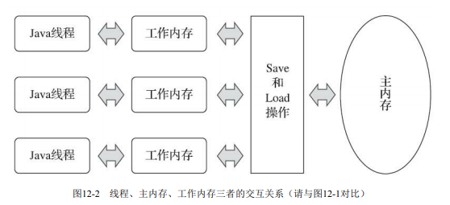

《Java虚拟机规范》中曾试图定义一种“Java内存模型” （Java Memory Model，JMM）来屏蔽各种硬件和操作系统的内存访问差异，以实现让Java程序在各种平台下都能达到一致的内存访问效果。

# 1. 主内存与工作内存

Java内存模型的主要目的是定义程序中各种变量的访问规则，即关注在虚拟机中把**变量值**存储到内存和从内存中取出变量值这样的底层细节。

此处的**变量**（Variables）与Java编程中所说的变量有所区别，它包括了**实例字段**、**静态字段**和**构成数组对象**的元素，但是**不包括局部变量**与**方法参数**，因为后者是线程私有的，不会被共享，自然就不会存在竞争问题。

为了获得更好的执行效能，Java内存模型并没有限制执行引擎使用处理器的特定寄存器或缓存来和主内存进行交互，也没有限制即时编译器是否要进行调整代码执行顺序这类优化措施。

Java内存模型规定了所有的变量都存储在主内存（Main Memory）中。每条线程还有自己的工作内存，线程的工作内存中保存了被该线程使用的变量的主内存副本。线程对变量的所有操作（读取、赋值等）都必须在工作内存中进行，而不能直接读写主内存中的数据。不同的线程之间也无法直接访问对方工作内存中的变 量，线程间变量值的传递均需要通过主内存来完成。

这里所讲的主内存、工作内存与Java内存区域中的Java堆、栈、方法区等并不是同一 个层次的对内存的划分，这两者基本上是没有任何关系的。如果两者一定要勉强对应起来，那么从变量、主内存、工作内存的定义来看，主内存主要对应于Java堆中的对象实例数据部分，而工作内存则对应于虚拟机栈中的部分区域。从更基础的层次上说，主内存直接对应于物理硬件的内存，而为了 获取更好的运行速度，虚拟机（或者是硬件、操作系统本身的优化措施）可能会让工作内存优先存储于寄存器和高速缓存中，因为程序运行时主要访问的是工作内存。

# 2. 内存间交互操作

关于主内存与工作内存之间具体的交互协议，即一个变量如何从主内存拷贝到工作内存、如何从 工作内存同步回主内存这一类的实现细节，Java内存模型中定义了以下8种操作来完成。Java虚拟机实现时必须保证下面提及的每一种操作都是原子的、不可再分的（对于double和long类型的变量来说， load、store、read和write操作在某些平台上允许有例外）。

- `lock（锁定）`：作用于主内存的变量，它把一个变量标识为一条线程独占的状态。
- `unlock（解锁）`：作用于主内存的变量，它把一个处于锁定状态的变量释放出来，释放后的变量才可以被其他线程锁定。
- `read（读取）`：作用于主内存的变量，它把一个变量的值从主内存传输到线程的工作内存中，以 便随后的`load`动作使用。
- `load（载入）`：作用于工作内存的变量，它把`read`操作从主内存中得到的变量值放入工作内存的 变量副本中。
- `use（使用）`：作用于工作内存的变量，它把工作内存中一个变量的值传递给执行引擎，每当虚 拟机遇到一个需要使用变量的值的字节码指令时将会执行这个操作。
- `assign（赋值）`：作用于工作内存的变量，它把一个从执行引擎接收的值赋给工作内存的变量， 每当虚拟机遇到一个给变量赋值的字节码指令时执行这个操作。
- `store（存储）`：作用于工作内存的变量，它把工作内存中一个变量的值传送到主内存中，以便随 后的`write`操作使用。
- `write（写入）`：作用于主内存的变量，它把`store`操作从工作内存中得到的变量的值放入主内存的 变量中。

如果要把一个变量从主内存拷贝到工作内存，那就要按顺序执行`read`和`load`操作，如果要把变量从 工作内存同步回主内存，就要按顺序执行`store`和`write`操作。注意，Java内存模型只要求上述两个操作 必须按顺序执行，但不要求是连续执行。也就是说`read`与`load`之间、`store`与`write`之间是可插入其他指令 的，如对主内存中的变量a、b进行访问时，一种可能出现的顺序是`read a、read b、load b、load a`。除此 之外，Java内存模型还规定了在执行上述8种基本操作时必须满足如下规则：

- 不允许`read`和`load`、`store`和`write`操作之一单独出现，即不允许一个变量从主内存读取了但工作内 存不接受，或者工作内存发起回写了但主内存不接受的情况出现。
- 不允许一个线程丢弃它最近的`assign`操作，即变量在工作内存中改变了之后必须把该变化同步回 主内存。
- 不允许一个线程无原因地（没有发生过任何`assign`操作）把数据从线程的工作内存同步回主内存 中。
- 一个新的变量只能在主内存中“诞生”，不允许在工作内存中直接使用一个未被初始化（`load`或 `assign`）的变量，换句话说就是对一个变量实施`use`、`store`操作之前，必须先执行`assign`和`load`操作。
- 一个变量在同一个时刻只允许一条线程对其进行`lock`操作，但`lock`操作可以被同一条线程重复执 行多次，多次执行`lock`后，只有执行相同次数的`unlock`操作，变量才会被解锁。
- 如果对一个变量执行`lock`操作，那将会清空工作内存中此变量的值，在执行引擎使用这个变量 前，需要重新执行`load`或`assign`操作以初始化变量的值。
- 如果一个变量事先没有被`lock`操作锁定，那就不允许对它执行`unlock`操作，也不允许去`unlock`一个 被其他线程锁定的变量。
- 对一个变量执行`unlock`操作之前，必须先把此变量同步回主内存中（执行`store`、`write`操作）。

# 3. 对`volatile`变量的特殊规则

当一个变量被定义成volatile之后，它将具备两项特性：

第一项是**保证此变量对所有线程的可见性**，这里的“可见性”是指当一条线程修改了这个变量的值，新值对于其他线程来说是可以立即得知的。而普通变量并不能做到这一点，普通变量的值在线程间传递时均需要通过主内存来完成。比如， 线程A修改一个普通变量的值，然后向主内存进行回写，另外一条线程B在线程A回写完成了之后再对主内存进行读取操作，新变量值才会对线程B可见。

`volatile`变量在各个线程的工作内存中是不存在一致性问题的，但是Java里面的运算操作符并非原子操作， 这导致`volatile`变量的运算在并发下一样是不安全的。

由于`volatile`变量只能保证可见性，在不符合以下**两条规则**的运算场景中，我们仍然要通过加锁 （使用`synchronized`、`java.util.concurrent`中的锁或原子类）来保证原子性：

- 运算结果并不依赖变量的当前值，或者能够确保只有单一的线程修改变量的值。
- 变量不需要与其他的状态变量共同参与不变约束。

使用`volatile`变量的第二个语义是**禁止指令重排序优化**，普通的变量仅会保证在该方法的执行过程中所有依赖赋值结果的地方都能获取到正确的结果，而不能保证变量赋值操作的顺序与程序代码中的执行顺序一致

最后，来看看Java内存模型中对volatile变量定义的特殊规则的定义。假定T表示 一个线程，V和W分别表示两个volatile型变量，那么在进行read、load、use、assign、store和write操作时需要满足如下规则：

- 只有当线程T对变量V执行的前一个动作是load的时候，线程T才能对变量V执行use动作；并且， 只有当线程T对变量V执行的后一个动作是use的时候，线程T才能对变量V执行load动作。线程T对变量 V的use动作可以认为是和线程T对变量V的load、read动作相关联的，必须连续且一起出现。

这条规则要求在工作内存中，每次使用V前都必须先从主内存刷新最新的值，用于保证能看见其他线程对变量V所做的修改。

- 只有当线程T对变量V执行的前一个动作是assign的时候，线程T才能对变量V执行store动作；并 且，只有当线程T对变量V执行的后一个动作是store的时候，线程T才能对变量V执行assign动作。线程 T对变量V的assign动作可以认为是和线程T对变量V的store、write动作相关联的，必须连续且一起出 现。

这条规则要求在工作内存中，每次修改V后都必须立刻同步回主内存中，用于保证其他线程可以 看到自己对变量V所做的修改。

- 假定动作A是线程T对变量V实施的use或assign动作，假定动作F是和动作A相关联的load或store动 作，假定动作P是和动作F相应的对变量V的read或write动作；与此类似，假定动作B是线程T对变量W 实施的use或assign动作，假定动作G是和动作B相关联的load或store动作，假定动作Q是和动作G相应的 对变量W的read或write动作。如果A先于B，那么P先于Q。

这条规则要求volatile修饰的变量不会被指令重排序优化，从而保证代码的执行顺序与程序的顺序 相同。

# 4. 针对long和double型变量的特殊规则

Java内存模型要求lock、unlock、read、load、assign、use、store、write这八种操作都具有原子性， 但是对于64位的数据类型（long和double），在模型中特别定义了一条宽松的规定：允许虚拟机将没有 被volatile修饰的64位数据的读写操作划分为两次32位的操作来进行，即允许虚拟机实现自行选择是否要保证64位数据类型的load、store、read和write这四个操作的原子性，这就是所谓的“long和double的非 原子性协定”.

如果有多个线程共享一个并未声明为volatile的long或double类型的变量，并且同时对它们进行读取 和修改操作，那么某些线程可能会读取到一个既不是原值，也不是其他线程修改值的代表了“半个变量”的数值。

在实际开发中，除非该数据有明确可知的线程竞争，否则我们在编写 代码时一般不需要因为这个原因刻意把用到的long和double变量专门声明为volatile。

# 5. 原子性、可见性与有序性

## 5.1 .原子性

由Java内存模型来直接保证的原子性变量操作包括read、load、assign、use、store和write这六个， 基本数据类型的访问、读写都是具备原子性的（例外就是long和double的非原子性 协定，读者只要知道这件事情就可以了，无须太过在意这些几乎不会发生的例外情况）。 

如果应用场景需要一个更大范围的原子性保证（经常会遇到），Java内存模型还提供了lock和 unlock操作来满足这种需求，尽管虚拟机未把lock和unlock操作直接开放给用户使用，但是却提供了更 高层次的字节码指令monitorenter和monitorexit来隐式地使用这两个操作。这两个字节码指令反映到Java 代码中就是同步块——synchronized关键字，因此在synchronized块之间的操作也具备原子性。

## 5.2 可见性

可见性就是指当一个线程修改了共享变量的值时，其他线程能够立即得知这个修改。

Java内存模型是通过在变量修改后将新值同步回主内存，在变量读取前从主内存刷新变量值这种依赖主内存作为传递媒介的方式来实现可见性的，无论是 普通变量还是volatile变量都是如此。

普通变量与volatile变量的区别是，volatile的特殊规则保证了新值 能立即同步到主内存，以及每次使用前立即从主内存刷新。因此我们可以说volatile保证了多线程操作 时变量的可见性，而普通变量则不能保证这一点。

除了volatile之外，Java还有两个关键字能实现可见性，它们是synchronized和final。

同步块的可见性是由“对一个变量执行unlock操作之前，必须先把此变量同步回主内存中（执行store、write操 作）”这条规则获得的。

而final关键字的可见性是指：被final修饰的字段在构造器中一旦被初始化完成，并且构造器没有把“this”的引用传递出去（this引用逃逸是一件很危险的事情，其他线程有可能通过这个引用访问到“初始化了一半”的对象），那么在其他线程中就能看见final字段的值。

## 5.3 有序性

Java程序中天然的有序性可以 总结为一句话：如果在本线程内观察，所有的操作都是有序的；如果在一个线程中观察另一个线程， 所有的操作都是无序的。

Java语言提供了volatile和synchronized两个关键字来保证线程之间操作的有序性，volatile关键字本 身就包含了禁止指令重排序的语义，而synchronized则是由“一个变量在同一个时刻只允许一条线程对 其进行lock操作”这条规则获得的，这个规则决定了持有同一个锁的两个同步块只能串行地进入。

# 6. 先行发生原则

如果Java内存模型中所有的有序性都仅靠volatile和synchronized来完成，那么有很多操作都将会变得非常啰嗦，但是我们在编写Java并发代码的时候并没有察觉到这一点，这是因为Java语言中有一 个“先行发生”（Happens-Before）的原则。这个原则非常重要，**它是判断数据是否存在竞争，线程是否安全的非常有用的手段。**

**先行发生是Java内存模型中定义的两项操作之间的偏序关系**。比如说操作A先行发生于操作B，其实就是说在发生操作B之前，操作A产生的影响能被操作B 观察到，“影响”包括修改了内存中共享变量的值、发送了消息、调用了方法等。

下面是Java内存模型下一些“天然的”先行发生关系，这些先行发生关系无须任何同步器协助就已 经存在，可以在编码中直接使用。如果两个操作之间的关系不在此列，并且无法从下列规则推导出来，则它们就没有顺序性保障，虚拟机可以对它们随意地进行重排序：

- 程序次序规则（Program Order Rule）：在一个线程内，按照控制流顺序，书写在前面的操作先行发生于书写在后面的操作。注意，这里说的是控制流顺序而不是程序代码顺序，因为要考虑分支、循 环等结构。
- 管程锁定规则（Monitor Lock Rule）：一个unlock操作先行发生于后面对同一个锁的lock操作。这 里必须强调的是“同一个锁”，而“后面”是指时间上的先后。
- volatile变量规则（Volatile Variable Rule）：对一个volatile变量的写操作先行发生于后面对这个变量 的读操作，这里的“后面”同样是指时间上的先后。
- 线程启动规则（Thread Start Rule）：Thread对象的start()方法先行发生于此线程的每一个动作
- 线程终止规则（Thread Termination Rule）：线程中的所有操作都先行发生于对此线程的终止检 测，我们可以通过Thread::join()方法是否结束、Thread::isAlive()的返回值等手段检测线程是否已经终止 执行。
- 线程中断规则（Thread Interruption Rule）：对线程interrupt()方法的调用先行发生于被中断线程 的代码检测到中断事件的发生，可以通过Thread::interrupted()方法检测到是否有中断发生。
- 对象终结规则（Finalizer Rule）：一个对象的初始化完成（构造函数执行结束）先行发生于它的 finalize()方法的开始。
- 传递性（Transitivity）：如果操作A先行发生于操作B，操作B先行发生于操作C，那就可以得出 操作A先行发生于操作C的结论。

