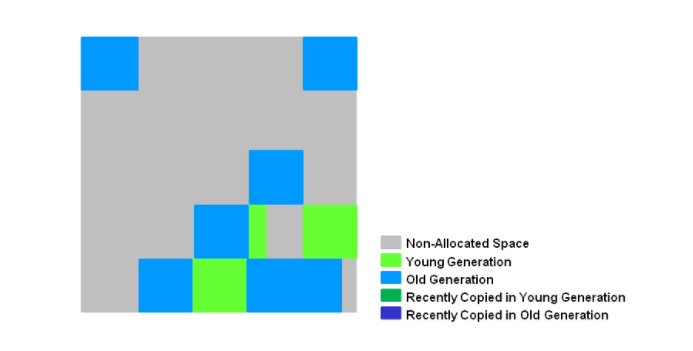

##### 转载自：[JVM垃圾收集](https://dunwu.github.io/javacore/jvm/jvm-gc.html#_4-2-full-gc)

# 一、如何判断对象需要回收？
## 1.1 引用计数算法
给对象添加一个引用计数器，当对象增加一个引用时计数器加1，引用失效时计数器减1。引用计数为0的对象可被回收。

两个对象出现循环引用的情况下，此时引用计数器永远不为0，导致无法对它们进行回收。

```java
public class ReferenceCountingGC {
    public Object instance = null;

    public static void main(String[] args) {
        ReferenceCountingGC objectA = new ReferenceCountingGC();
        ReferenceCountingGC objectB = new ReferenceCountingGC();
        objectA.instance = objectB;
        objectB.instance = objectA;
    }
}
```
因为循环引用的存在，所以 Java 虚拟机不适用引用计数算法。

## 1.2 可达性分析算法
通过一系列的称为`GC Roots`的对象作为起点，从这些节点开始向下搜索，节点所走过的路径称为引用链，当一个对象到`GC Roots`没有任何引用链相连的话，则证明此对象不可用。即能到达的对象视为存活，不能到达的对象视为失活。

可作为`GC Roots`的对象包括以下几种：

- 虚拟机栈中引用的对象
- 本地方法栈中引用的对象（Native)方法
- 方法区中，类静态属性引用的对象
- 方法区中，常量引用的对象

## 1.3 引用类型
无论是通过引用计算算法判断对象的引用数量，还是通过可达性分析算法判断对象的引用链是否可达，判定对象是否可被回收都与引用有关。

Java 具有四种强度不同的引用类型。

### 1.3.1 强引用
`被强引用关联的对象不会被垃圾收集器回收。`
创建方法：使用`new`一个新对象的方式来创建强引用。

```java
Object obj = new Object();
```
### 1.3.2 软引用
`被软引用（Soft Reference）关联的对象，只有在内存不够的情况下才会被回收。`

创建方法：使用 `SoftReference` 类来创建软引用。

```java
Object obj = new Object();
SoftReference<Object> sf = new SoftReference<Object>(obj);
obj = null; // 使对象只被软引用关联
```
### 1.3.3 弱引用
`被弱引用（Weak Reference）关联的对象一定会被垃圾收集器回收，也就是说它只能存活到下一次垃圾收集发生之前。`

创建方法：使用 `WeakReference` 类来实现弱引用。

```java
Object obj = new Object();
WeakReference<Object> wf = new WeakReference<Object>(obj);
obj = null;
```
`WeakHashMap` 的 `Entry` 继承自 `WeakReference`，主要用来实现缓存。

```java
private static class Entry<K,V> extends WeakReference<Object> implements Map.Entry<K,V>
```
### 1.3.4 虚引用
又称为幽灵引用或者幻影引用。一个对象是否有虚引用的存在，完全不会对其生存时间构成影响，也无法通过虚引用取得一个对象实例。

为一个对象设置虚引用关联的唯一目的就是`能在这个对象被收集器回收时收到一个系统通知。`

创建方法：使用 `PhantomReference` 来实现虚引用。

```java
Object obj = new Object();
PhantomReference<Object> pf = new PhantomReference<Object>(obj);
obj = null;
```
虚引⽤必须和引⽤队列（ReferenceQueue）联合使⽤。当垃圾回收器准备回收⼀个对象时，如果发现它还有虚引⽤，就会在回收对象的内存之前，把这个虚引⽤加⼊到与之关联的引⽤队列中。程序可以通过判断引⽤队列中是 否已经加⼊了虚引⽤，来了解被引⽤的对象是否将要被垃圾回收。程序如果发现某个虚引⽤已经被加⼊到引⽤队列，那么就可以在所引⽤的对象的内存被回收之前采取必要的⾏动。

### 1.4 方法区的回收
因为方法区主要存放永久代对象，而永久代对象的回收率比年轻代差很多，因此在方法区上进行回收性价比不高。

**主要是对常量池的回收和对类的卸载。**

类的卸载条件很多，需要满足以下三个条件，并且满足了也不一定会被卸载：

 - 该类所有的实例都已经被回收，也就是 Java 堆中不存在该类的任何实例。
 - 加载该类的 `ClassLoader` 已经被回收
 - 该类对应的 `java.lang.Class` 对象没有在任何地方被引用，也就无法在任何地方通过反射访问该类方法。

可以通过 `-Xnoclassgc` 参数来控制是否对类进行卸载。

### 1.5  `finalize()`
`finalize()` 类似 C++ 的析构函数，用来做关闭外部资源等工作。但是 `try-finally` 等方式可以做的更好，并且该方法运行代价高昂，不确定性大，无法保证各个对象的调用顺序，因此最好不要使用` finalize()`。

当一个对象可被回收时，如果需要执行该对象的 `finalize()` 方法，那么就有可能通过在该方法中让对象重新被引用，从而实现自救。

# 二、垃圾回收算法
## 2.1 垃圾收集性能
垃圾收集器的性能指标主要有两点：
 - **停顿时间**：停顿时间是因为 `GC` 而导致程序不能工作的时间长度。
 - **吞吐量**：吞吐量关注在特定的时间周期内一个应用的工作量的最大值。对关注吞吐量的应用来说长暂停时间是可以接受的。由于高吞吐量的应用关注的基准在更长周期时间上，所以快速响应时间不在考虑之内。
## 2.2 标记 - 清除（Mark-Sweep）算法
将需要回收的对象进行标记，然后清理掉被标记的对象。

**缺点**：
 - 标记和清除过程效率都不高；
 - 会产生大量不连续的内存碎片，导致无法给大对象分配内存。

## 2.3 标记 - 整理（Mark-Compact）算法
让所有存活的对象都向一端移动，然后直接清理掉端边界以外的内存。

**不足**：这种做法能够解决内存碎片化的问题，但代价是压缩算法的性能开销。

## 2.4 复制（Copying）
将内存划分为大小相等的两块，每次只使用其中一块，当这一块内存用完了就将还存活的对象复制到另一块上面，然后再把使用过的内存空间进行一次清理。

**不足**：主要不足是只使用了内存的一半。

> 现在的商业虚拟机都采用这种收集算法来回收年轻代，但是并不是将内存划分为大小相等的两块，而是分为一块较大的 Eden 空间和两块较小的 Survior 空间。每次使用 Eden 空间和其中一块 Survivor。在回收时，将 Eden 和 Survivor 中还存活着的对象一次性复制到另一块 Survivor 空间上，最后清理 Eden 和使用过的那一块 Survivor。

## 2.5 分代收集

它根据对象存活周期将内存划分为几块，不同块采用适当的收集算法。

一般将 Java 堆分为年轻代和老年代。
- 年轻代使用：**复制** 算法
- 老年代使用：**标记 - 清理** 或者 **标记 - 整理** 算法
### 2.5.1 新生代
新生代是大部分对象创建和销毁的区域，在通常的 Java 应用中，绝大部分对象生命周期都是很短暂的。

其内部又分为 `Eden` 区域，作为对象初始分配的区域；两个 `Survivor`，有时候也叫 `from、to `区域，被用来放置从 `Minor GC `中保留下来的对象。

新生成的对象会被分配在`Eden`区域，第一次GC会随机选取一个`survivor`作为`to`区域，另一个区域就是`from`区，将`Eden`区域存活的对象复制到`to`区域。第二次GC时，`from`和`to`区职责互换，这时会将`Eden`区和上一次的`to`区域中存活的对象复制到`from`区域。

JVM 会随意选取一个 `Survivor` 区域作为 `to`，然后会在 GC 过程中进行区域间拷贝，也就是将 `Eden` 中存活下来的对象和 `from` 区域的对象，拷贝到这个to区域。这种设计主要是为了防止内存的碎片化，并进一步清理无用对象。

Java 虚拟机会记录 `Survivor` 区中的对象一共被来回复制了几次。如果一个对象被复制的次数为 15（对应虚拟机参数 `-XX:+MaxTenuringThreshold`），那么该对象将被晋升（promote）至老年代。另外，如果单个 `Survivor` 区已经被占用了 50%（对应虚拟机参数 `-XX:TargetSurvivorRatio`），那么较高复制次数的对象也会被晋升至老年代。

### 2.5.2 老年代
放置长生命周期的对象，通常都是从 `Survivor` 区域拷贝过来的对象。当然，也有特殊情况，**如果对象较大**，JVM 会试图直接分配在 Eden 其他位置上；**如果对象太大**，完全无法在新生代找到足够长的连续空闲空间，JVM 就会直接分配到老年代。

### 2.5.3 永久代
这部分就是早期 Hotspot JVM 的方法区实现方式了，储存 Java 类元数据、常量池、Intern 字符串缓存。在 JDK 8 之后就不存在永久代这块儿了。

### 2.5.4 JVM参数
JVM 允许对堆空间大小、各代空间大小进行设置，以调整 JVM GC。
|配置|  描述|
|--|--|
| -Xss | 虚拟机栈大小。 |
|-Xms|堆空间初始值。|
|-Xmx|堆空间最大值。|
|-Xmn|新生代空间大小。|
|-XX:NewSize|新生代空间初始值。|
|-XX:MaxNewSize|新生代空间最大值。|
|-XX:NewRatio|新生代与年老代的比例。默认为 2，意味着老年代是新生代的 2 倍。|
|-XX:SurvivorRatio|新生代中调整 eden 区与 survivor 区的比例，默认为 8。即 eden 区为 80% 的大小，两个 survivor 分别为 10% 的大小。|
|-XX:PermSize|永久代空间的初始值。|
|-XX:MaxPermSize|永久代空间的最大值。|

# 三、垃圾回收器
## 3.1 串行收集器
串行收集器是` client` 模式下的默认收集器配置。因为在客户端模式下，分配给虚拟机管理的内存一般来说不会很大。Serial 收集器收集几十兆甚至一两百兆的年轻代停顿时间可以控制在一百多毫秒以内，只要不是太频繁，这点停顿是可以接受的。

**串行收集器采用单线程 `stop-the-world` 的方式进行收集**。当内存不足时，串行 GC 设置停顿标识，待所有线程都进入安全点（Safepoint）时，应用线程暂停，串行 GC 开始工作，**采用单线程方式回收空间并整理内存**。

单线程意味着复杂度更低、占用内存更少，垃圾回收效率高；但同时也意味着不能有效利用多核优势。事实上，串行收集器**特别适合堆内存不高、单核甚至双核 CPU 的场合**。

### Serial 收集器

> 开启选项：-XX:+UseSerialGC
打开此开关后，使用 Serial + Serial Old 收集器组合来进行内存回收。

### Serial Old 收集器
Serial Old 是 Serial 收集器的老年代版本，也是给 Client 模式下的虚拟机使用。如果用在 Server 模式下，它有两大用途：

 - 在 JDK 1.5 以及之前版本（Parallel Old 诞生以前）中与 Parallel Scavenge 收集器搭配使用。
 - 作为 CMS 收集器的后备预案，在并发收集发生 Concurrent Mode Failure 时使用。

## 3.2 并行收集器
**并行收集器是 server 模式下的默认收集器。**

> 开启选项：-XX:+UseParallelGC
打开此开关后，使用 Parallel Scavenge + Serial Old 收集器组合来进行内存回收。
开启选项：-XX:+UseParallelOldGC
打开此开关后，使用 Parallel Scavenge + Parallel Old 收集器组合来进行内存回收。

其他收集器都是以关注停顿时间为目标，而**并行收集器是以关注吞吐量（Throughput）为目标的垃圾收集器。**

 - 停顿时间越短就越适合需要与用户交互的程序，良好的响应速度能提升用户体验；
 - 而高吞吐量则可以高效率地利用 CPU 时间，尽快完成程序的运算任务，主要适合在后台运算而不需要太多交互的任务。

`吞吐量 = 运行用户代码时间 / (运行用户代码时间 + 垃圾收集时间)`

并行收集器与串行收集器工作模式相似，都是 stop-the-world 方式，**只是暂停时并行地进行垃圾收集**。并行收集器**年轻代采用复制算法**，**老年代采用标记-整理**，在回收的同时还会**对内存进行压缩**。并行收集器**适合对吞吐量要求远远高于延迟要求的场景，并且在满足最差延时的情况下，并行收集器将提供最佳的吞吐量。**

**在注重吞吐量以及 CPU 资源敏感的场合，都可以优先考虑 Parallel Scavenge 收集器 + Parallel Old 收集器。**

### Parallel Scavenge 收集器

Parallel Scavenge 收集器提供了两个参数用于精确控制吞吐量，分别是：

 - `-XX:MaxGCPauseMillis` ：控制最大垃圾收集停顿时间，收集器将尽可能保证内存回收时间不超过设定值。
 - `-XX:GCTimeRatio`： 直接设置吞吐量大小的（值为大于 0 且小于 100 的整数）。
 - 
缩短停顿时间是以牺牲**吞吐量**和**年轻代空间**来换取的：年轻代空间变小，垃圾回收变得频繁，导致吞吐量下降。

Parallel Scavenge 收集器还提供了一个参数 `-XX:+UseAdaptiveSizePolicy`，这是一个开关参数，打开参数后，就不需要手工指定年轻代的大小`-Xmn`、Eden 和 Survivor 区的比例`-XX:SurvivorRatio`、晋升老年代对象年龄`-XX:PretenureSizeThreshold`等细节参数了，虚拟机会根据当前系统的运行情况收集性能监控信息，动态调整这些参数以提供最合适的停顿时间或者最大的吞吐量，这种方式称为 **GC 自适应的调节策略**（GC Ergonomics）。

### Parallel Old 收集器

是 Parallel Scavenge 收集器的老年代版本，使用**多线程**和 “**标记-整理**” 算法。

## 3.3 并发标记清除收集器

> 开启选项：-XX:+UseConcMarkSweepGC
打开此开关后，使用 CMS + ParNew + Serial Old 收集器组合来进行内存回收。

**并发标记清除收集器是以获取最短停顿时间为目标。**

开启后，年轻代使用 ParNew 收集器；老年代使用 CMS 收集器，如果 CMS 产生的碎片过多，导致无法存放浮动垃圾，JVM 会出现 Concurrent Mode Failure ，此时使用 Serial Old 收集器来替代 CMS 收集器清理碎片。

### CMS 收集器

**CMS 收集器是一种以获取最短停顿时间为目标的收集器。**

CMS（Concurrent Mark Sweep），Mark Sweep 指的是标记 - 清除算法.

#### CMS 回收机制
CMS 收集器运行步骤如下：

 1. **初始标记**：仅仅只是标记一下 GC Roots 能直接关联到的对象，速度很快，需要停顿。stop-the-word
 2. **并发标记**：进行 GC Roots Tracing 的过程，它在整个回收过程中耗时最长，不需要停顿。
 3. **重新标记**：为了修正并发标记期间因用户程序继续运作而导致标记产生变动的那一部分对象的标记记录，需要停顿。stop-the-word
 4. **并发清除**：回收在标记阶段被鉴定为不可达的对象。不需要停顿。

在整个过程中耗时最长的**并发标记**和**并发清除**过程中，**收集器线程都可以与用户线程一起工作，不需要进行停顿。**

#### CMS 回收年轻代详细步骤

##### 1. 堆空间被分割为三块空间

年轻代分割成一个 Eden 区和两个 Survivor 区。年老代一个连续的空间。就地完成对象收集。除非有 FullGC 否则不会压缩。

##### 2. CMS 年轻代垃圾收集如何工作

年轻代被标为浅绿色，年老代被标记为蓝色。如果你的应用已经运行了一段时间，CMS 的堆看起来应该是这个样子。对象分散在年老代区域里。

使用 CMS，年老代对象就地释放。它们不会被来回移动。这个空间不会被压缩除非发生 FullGC。

##### 3. 年轻代收集
从 Eden 和 Survivor 区复制活跃对象到另一个 Survivor 区。所有达到他们的年龄阈值的对象会晋升到年老代。


##### 4. 年轻代回收之后
一次年轻代垃圾收集之后，Eden 区和其中一个 Survivor 区被清空。

最近晋升的对象以深蓝色显示在上图中，绿色的对象是年轻代幸免的还没有晋升到老年代对象.

#### CMS 回收年老代详细步骤
##### 1. CMS 的年老代收集
发生两次 stop the world 事件：初始标记和重新标记。当年老代达到特定的占用比例时，CMS 开始执行。


 - 初始标记是一个短暂暂停的、可达对象被标记的阶段。
 - 并发标记寻找活跃对象在应用连续执行时。
 - 最后，在重新标记阶段，寻找在之前并发标记阶段中丢失的对象。

##### 2. 年老代收集-并发清除
在之前阶段没有被标记的对象会被就地释放。不进行压缩操作。


**注意**：未被标记的对象等于死亡对象

##### 3. 年老代收集-清除之后
清除阶段之后，你可以看到大量内存被释放。你还可以注意到没有进行压缩操作。

最后，CMS 收集器会再次进入重新设置阶段，等待下一次垃圾收集时机的到来。

#### CMS 特点
CMS 收集器具有以下**缺点**：

 - 并发收集 - 并发指的是用户线程和 GC 线程同时运行。
 - 吞吐量低 - 低停顿时间是以牺牲吞吐量为代价的，导致 CPU 利用率不够高。
 - 无法处理浮动垃圾 - 可能出现 `Concurrent Mode Failure`。**浮动垃圾是指并发清除阶段由于用户线程继续运行而产生的垃圾**，这部分垃圾只能到下一次 GC 时才能进行回收。由于浮动垃圾的存在，因此需要预留出一部分内存，意味着 CMS 收集不能像其它收集器那样等待老年代快满的时候再回收。
 	- 可以使用 `-XX:CMSInitiatingOccupancyFraction` 来改变触发 CMS 收集器工作的内存占用百分，如果这个值设置的太大，导致预留的内存不够存放浮动垃圾，就会出现 Concurrent Mode Failure，这时虚拟机将临时启用 Serial Old 收集器来替代 CMS 收集器。
 - 标记 - 清除算法导致的空间碎片，往往出现老年代空间剩余，但无法找到足够大连续空间来分配当前对象，不得不提前触发一次 Full GC。
	 - 可以使用 `-XX:+UseCMSCompactAtFullCollection` ，用于在 CMS 收集器要进行 Full GC 时开启内存碎片的合并整理，内存整理的过程是无法并发的，空间碎片问题没有了，但是停顿时间不得不变长了。
	 - 可以使用 `-XX:CMSFullGCsBeforeCompaction` ，用于设置执行多少次不压缩的 Full GC 后，来一次带压缩的（默认为 0，表示每次进入 Full GC 时都要进行碎片整理）。


### ParNew 收集器

> 开启选项：-XX:+UseParNewGC

ParNew 收集器其实是 Serial 收集器的多线程版本。

是 Server 模式下的虚拟机首选年轻代收集器，除了性能原因外，主要是因为除了 Serial 收集器，只有它能与 CMS 收集器配合工作。

ParNew 收集器也是使用 `-XX:+UseConcMarkSweepGC` 后的默认年轻代收集器。

ParNew 收集器默认开启的线程数量与 CPU 数量相同，可以使用 `-XX:ParallelGCThreads` 参数来设置线程数。

## 3.4 G1收集器

> 开启选项：-XX:+UseG1GC

前面提到的垃圾收集器一般策略是关注吞吐量或停顿时间。而 **G1 是一种兼顾吞吐量和停顿时间的 GC 收集器**。G1 是 Oracle JDK9 以后的默认 GC 收集器。**G1 可以直观的设定停顿时间的目标**，相比于 CMS GC，G1 未必能做到 CMS 在最好情况下的延时停顿，但是最差情况要好很多。

G1 最大的特点是引入分区的思路，弱化了分代的概念，合理利用垃圾收集各个周期的资源，解决了其他收集器甚至 CMS 的众多缺陷

### 分区和分代
旧的垃圾收集器一般采取分代收集，Java 堆被分为年轻代、老年代和永久代。收集的范围都是整个年轻代或者整个老年代。

G1 取消了永久代，并把年轻代和老年代划分成多个大小相等的独立区域（Region），年轻代和老年代不再物理隔离。G1 可以直接对年轻代和老年代一起回收。

通过引入 Region 的概念，从而将原来的一整块内存空间划分成多个的小空间，使得每个小空间可以单独进行垃圾回收。这种划分方法带来了很大的灵活性，使得可预测的停顿时间模型成为可能。**通过记录每个 Region 垃圾回收时间以及回收所获得的空间**（这两个值是通过过去回收的经验获得），**并维护一个优先列表**，**每次根据允许的收集时间**，**优先回收价值最大的 Region**。

每个 Region 都有一个 Remembered Set，用来记录该 Region 对象的引用对象所在的 Region。通过使用 Remembered Set，在做可达性分析的时候就可以避免全堆扫描。

### G1 回收机制
如果**不计算**维护 Remembered Set 的操作，G1 收集器的运作大致可划分为以下几个步骤：

 - 初始标记
 - 并发标记
 - 最终标记：为了修正在并发标记期间因用户程序继续运作而导致标记产生变动的那一部分标记记录，**虚拟机将这段时间对象变化记录在线程的 Remembered Set Logs 里面**，最终标记阶段需要把 Remembered Set Logs 的数据合并到 Remembered Set 中。这阶段需要停顿线程，但是可并行执行。
- 筛选回收 ：首先对各个 Region 中的回收价值和成本进行排序，根据用户所期望的 GC 停顿时间来制定回收计划。此阶段其实也可以做到与用户程序一起并发执行，但是因为只回收一部分 Region，时间是用户可控制的，而且停顿用户线程将大幅度提高收集效率。

**具备如下特点**：

 - 空间整合：整体来看是基于“标记 - 整理”算法实现的收集器，从局部（两个 Region 之间）上来看是基于“复制”算法实现的，这意味着运行期间不会产生内存空间碎片。
 - 可预测的停顿：能让使用者明确指定在一个长度为 M 毫秒的时间片段内，消耗在 GC 上的时间不得超过 N 毫秒。

### G1 回收年轻代详细步骤
#### 1. G1 初始堆空间
堆空间是一个被分成许多固定大小区域的内存块。


Java 虚拟机启动时选定区域大小。Java 虚拟机通常会指定 2000 个左右的大小相等、每个大小范围在 1 到 32M 的区域。

#### 2. G1 堆空间分配
实际上，这些区域被映射成 Eden、Survivor、年老代空间的逻辑表述形式。

活跃对象从一个区域疏散（复制、移动)到另一个区域。区域被设计为并行的方式收集，可以暂停或者不暂停所有的其它用户线程。

明显的区域可以被分配成 **Eden**、**Survivor**、**Old** 区域。另外，有第四种类型的区域叫做**极大区域**(Humongous regions)。这些区域被设计成保持标准区域大小的 50%或者更大的对象。它们被保存在一个连续的区域集合里。最后，**最后一个类型的区域就是堆空间里没有使用的区域**。

#### 3. G1 的年轻代
堆空间被分割成大约 2000 个区域。最小 1M，最大 32M，蓝色区域保持年老代对象，绿色区域保持年轻代对象。

**注意**：区域没有必要像旧的收集器一样是保持连续的。

#### 4. G1 的年轻代收集

这是一个 stop the world 暂停。为下一次年轻代垃圾回收计算 Eden 和 Survivor 的大小。保留审计信息有助于计算大小。类似目标暂停时间的事情会被考虑在内。

这个方法使重调区域大小变得很容易，按需把它们调大或调小。

#### 5. G1 年轻代回收的尾声
活跃对象被疏散到 Survivor 或者年老代区域。


关于 G1 的年轻代回收做以下总结：

 - 堆空间是一块单独的内存空间被分割成多个区域。
 - 年轻代内存是由一组非连续的区域组成。这使得需要重调大小变得容易。
 - 年轻代垃圾回收是 stop the world 事件，所有应用线程都会因此操作暂停。
 - 年轻代垃圾收集使用多线程并行回收。
 - 活跃对象被复制到新的 Survivor 区或者年老代区域

### G1 回收年老代详细步骤
#### 1. 初始标记阶段
年轻代垃圾收集肩负着活跃对象初始标记的任务。在日志文件中被标为`GC pause (young)(inital-mark)`


#### 2. 并发标记阶段
如果发现空区域(“X”标示的)，在重新标记阶段它们会被马上清除掉。当然，决定活性的审计信息也在此时被计算。


#### 3. 重新标记阶段
空的区域被清除和回收掉。所有区域的活性在此时计算。


#### 4. 复制/清理阶段
G1 选择活性最低的区域，这些区域能够以最快的速度回收。然后这些区域会在年轻代垃圾回收过程中被回收。在日志中被指示为`[GC pause (mixed)]`。所以年轻代和年老代在同一时间被回收。


#### 5. 复制/清理阶段之后
被选择的区域已经被回收和压缩到图中显示的深蓝色区和深绿色区中。


## 3.5 总结
| 收集器 | 串行/并行/并发 |年轻代/老年代|收集算法|目标|适用场景|
|--|--|--|--|--|--|
|Serial  | 串行 |年轻代 |复制 | 响应速度优先| 单 CPU 环境下的 Client 模式|
| Serial Old |串行  | 老年代|标记-整理 | 响应速度优先| 单 CPU 环境下的 Client 模式、CMS 的后备预案|
| ParNew |串行 + 并行  |年轻代 |复制算法 | 响应速度优先|多 CPU 环境时在 Server 模式下与 CMS 配合 |
|Parallel Scavenge  |  串行 + 并行|年轻代	 | 复制算法	|吞吐量优先 |在后台运算而不需要太多交互的任务 |
| Parallel Old | 串行 + 并行 |老年代 | 标记-整理|吞吐量优先 | 在后台运算而不需要太多交互的任务|
| CMS |  并行 + 并发|老年代 | 标记-清除|响应速度优先 |集中在互联网站或 B/S 系统服务端上的 Java 应用 |
|G1  |  并行 + 并发|年轻代 + 老年代 |标记-整理 + 复制算法 |响应速度优先 | 面向服务端应用，将来替换 CMS|

# 四、内存分配与回收策略
对象的内存分配，也就是在堆上分配。主要分配在年轻代的 Eden 区上，少数情况下也可能直接分配在老年代中、

## 4.1 Minor GC
当 Eden 区空间不足时，触发 Minor GC。

Minor GC 发生在年轻代上，因为年轻代对象存活时间很短，因此 Minor GC 会频繁执行，执行的速度一般也会比较快。

Minor GC 工作流程：
1. Java 应用不断创建对象，通常都是分配在 Eden 区域，当其空间不足时（达到设定的阈值），触发 minor GC。仍然被引用的对象（绿色方块）存活下来，被复制到 JVM 选择的 Survivor 区域，而没有被引用的对象（黄色方块）则被回收。
2. 经过一次 Minor GC，Eden 就会空闲下来，直到再次达到 Minor GC 触发条件。这时候，另外一个 Survivor 区域则会成为 To 区域，Eden 区域的存活对象和 From 区域对象，都会被复制到 To 区域，并且存活的年龄计数会被加 1。
3. 类似第二步的过程会发生很多次，直到有对象年龄计数达到阈值，这时候就会发生所谓的晋升（Promotion）过程，如下图所示，超过阈值的对象会被晋升到老年代。这个阈值是可以通过 `-XX:MaxTenuringThreshold` 参数指定。

## 4.2 Full GC
Full GC 发生在老年代上，老年代对象和年轻代的相反，其存活时间长，因此 Full GC 很少执行，而且执行速度会比 Minor GC 慢很多。

## 4.3 内存分配策略
### 1. 对象优先在 Eden 分配
大多数情况下，对象在年轻代 Eden 区分配，当 Eden 区空间不够时，发起 Minor GC。
### 2. 大对象直接进入老年代
大对象是指需要连续内存空间的对象，最典型的大对象是那种很长的字符串以及数组。

经常出现大对象会提前触发垃圾收集以获取足够的连续空间分配给大对象。

`-XX:PretenureSizeThreshold`，大于此值的对象直接在老年代分配，避免在 Eden 区和 Survivor 区之间的大量内存复制。

### 3. 长期存活的对象进入老年代
为对象定义年龄计数器，对象在 Eden 出生并经过 Minor GC 依然存活，将移动到 Survivor 中，年龄就增加 1 岁，增加到一定年龄则移动到老年代中。

`-XX:MaxTenuringThreshold` 用来定义年龄的阈值。

### 4. 动态对象年龄判定
虚拟机并不是永远地要求对象的年龄必须达到 `MaxTenuringThreshold` 才能晋升老年代，如果在 Survivor 区中**相同年龄所有对象大小的总和大于 Survivor 空间的一半**，则**年龄大于或等于该年龄的对象可以直接进入老年代**，无需等到 `MaxTenuringThreshold` 中要求的年龄。

### 5. 空间分配担保
在发生 Minor GC 之前，虚拟机先检查老年代最大可用的连续空间是否大于年轻代所有对象总空间，如果条件成立的话，那么 Minor GC 可以确认是安全的；

如果不成立的话虚拟机会查看 `HandlePromotionFailure` 设置值是否允许担保失败，如果允许那么就会继续检查老年代最大可用的连续空间是否大于历次晋升到老年代对象的平均大小，如果大于，将尝试着进行一次 Minor GC，尽管这次 Minor GC 是有风险的；如果小于，或者 `HandlePromotionFailure` 设置不允许冒险，那这时也要改为进行一次 Full GC。


## 4.4  Full GC 的触发条件

对于 Minor GC，其触发条件非常简单，当 Eden 区空间满时，就将触发一次 Minor GC。而 Full GC 则相对复杂，有以下条件：
### 1. 调用 `System.gc()`

此方法的调用是建议虚拟机进行 Full GC，虽然只是建议而非一定，但很多情况下它会触发 Full GC，从而增加 Full GC 的频率，也即增加了间歇性停顿的次数。因此强烈建议能不使用此方法就不要使用，让虚拟机自己去管理它的内存。可通过` -XX:DisableExplicitGC `来禁止 RMI 调用` System.gc()`。

### 2. 老年代空间不足
老年代空间不足的常见场景为前文所讲的大对象直接进入老年代、长期存活的对象进入老年代等，当执行 Full GC 后空间仍然不足，则抛出 `java.lang.OutOfMemoryError: Java heap space`。为避免以上原因引起的 Full GC，调优时应尽量做到让对象在 Minor GC 阶段被回收、让对象在年轻代多存活一段时间以及不要创建过大的对象及数组。

### 3. 方法区空间不足

JVM 规范中运行时数据区域中的方法区，在 HotSpot 虚拟机中又被习惯称为**永久代**，永久代中存放的是类的描述信息、常量、静态变量等数据，当系统中要加载的类、反射的类和调用的方法较多时，永久代可能会被占满，在未配置为采用 CMS GC 的情况下也会执行 Full GC。如果经过 Full GC 仍然回收不了，那么 JVM 会抛出` java.lang.OutOfMemoryError: PermGen space` 错误。为避免永久代占满造成 Full GC 现象，可采用的方法为增大 Perm Gen 空间或转为使用 CMS GC。

### 4. Minor GC 的平均晋升空间大小大于老年代可用空间

如果发现统计数据说之前 Minor GC 的平均晋升大小比目前老年代剩余的空间大，则不会触发 Minor GC 而是转为触发 Full GC。

### 5. 对象大小大于 To 区和老年代的可用内存
由 `Eden 区`、`From 区`向` To 区`复制时，对象大小大于 To 区可用内存，则把该对象转存到老年代，且老年代的可用内存小于该对象大小
