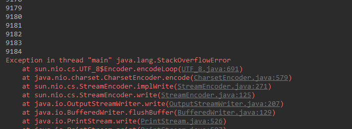
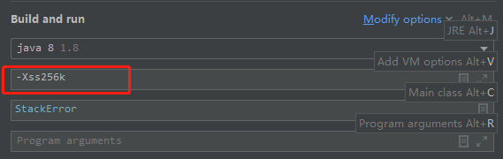
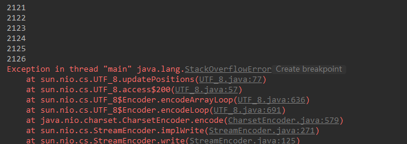
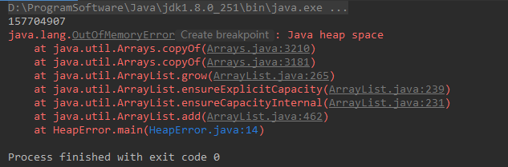
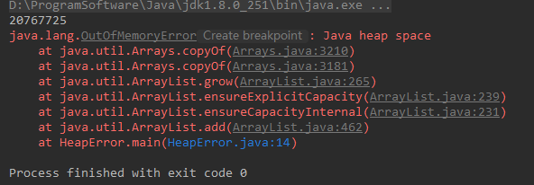

# 1. 栈溢出`StackOverflowError`

栈是线程私有的，生命周期与线程相同，每个方法在执行的时候都会创建一个栈帧，用来存储局部变量表，操作数栈，动态链接，方法出口等信息。

**栈溢出**：方法执行时创建的栈帧个数超过了栈的深度。

**原因举例**：方法递归

【示例】：

```java
public class StackError {
    private int i = 0;

    public void fn() {
        System.out.println(i++);
        fn();
    }

    public static void main(String[] args) {
        StackError stackError = new StackError();
        stackError.fn();
    }
}
```

【输出】：



**解决方法**：调整JVM栈的大小：`-Xss`

> **-Xss** **size**
>
> Sets the thread stack size (in bytes). Append the letter `k` or `K` to indicate KB, `m` or `M` to indicate MB, and `g` or `G` to indicate GB. The default value depends on the platform:
>
> - Linux/x64 (64-bit): 1024 KB
> - macOS (64-bit): 1024 KB
> - Oracle Solaris/x64 (64-bit): 1024 KB
> - Windows: The default value depends on virtual memory
>
> The following examples set the thread stack size to 1024 KB in different units:
>
> -Xss1m
> -Xss1024k
> -Xss1048576
>
> This option is similar to `-XX:ThreadStackSize`.

在IDEA中点击Run菜单的Edit Configuration如下图：



设置后，再次运行，会发现i的值变小，这是因为设置的-Xss值比原来的小：



# 2. 堆溢出`OutOfMemoryError:Java heap space`

堆中主要存放的是对象。

**堆溢出**：不断的`new`对象会导致堆中空间溢出。如果虚拟机的栈内存允许动态扩展，当扩展栈容量无法申请到足够的内存时。

【示例】：

```java
public class HeapError {
    public static void main(String[] args) {
        List<String> list = new ArrayList<>();

        try {
            while (true) {
                list.add("Floweryu");
            }
        } catch (Throwable e) {
            System.out.println(list.size());
            e.printStackTrace();
        }
    }
}
```

【输出】：



**解决方法**：调整堆的大小：`Xmx`

> **-Xmx** **size**
>
> Specifies the maximum size (in bytes) of the memory allocation pool in bytes. This value must be a multiple of 1024 and greater than 2 MB. Append the letter `k` or `K` to indicate kilobytes, `m` or `M` to indicate megabytes, and `g` or `G` to indicate gigabytes. The default value is chosen at runtime based on system configuration. For server deployments, `-Xms` and `-Xmx` are often set to the same value. The following examples show how to set the maximum allowed size of allocated memory to 80 MB by using various units:
>
> -Xmx83886080
> -Xmx81920k
> -Xmx80m
>
> The `-Xmx` option is equivalent to `-XX:MaxHeapSize`.

设置`-Xmx256M`后，输入如下，比之前小：

