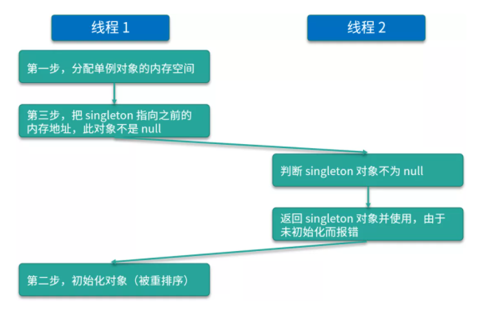

# 双重锁实现线程安全的单例模式

```java
public class SingleInstance {
    private volatile static SingleInstance instance = null;

    private SingleInstance() { }

    public static SingleInstance getInstance() {
        if (instance == null) {
            synchronized(SingleInstance.class) {
                if (instance == null) {
                    instance = new SingleInstance();
                }
            }
        }
        return instance;
    }
}
```

在双重检查锁模式中为什么需要使用 volatile 关键字？

假如 `Instance` 类变量是没有用 `volatile` 关键字修饰的，会导致这样一个问题：

在线程执行到第 1 行的时候，代码读取到 instance 不为 null 时，instance 引用的对象有可能还没有完成初始化。

造成这种现象主要的原因是创建对象不是原子操作以及指令重排序。

第二行代码可以分解成以下几步：

```java
memory = allocate();  // 1：分配对象的内存空间
ctorInstance(memory); // 2：初始化对象
instance = memory;  // 3：设置instance指向刚分配的内存地址
```

根源在于代码中的 2 和 3 之间，可能会被重排序。例如：

```java
memory = allocate();  // 1：分配对象的内存空间
instance = memory;  // 3：设置instance指向刚分配的内存地址
// 注意，此时对象还没有被初始化！
ctorInstance(memory); // 2：初始化对象
```

这种重排序可能就会导致一个线程拿到的 instance 是非空的但是还没初始化完全。



**为什么要 double-check？去掉任何一次的 check 行不行？**

先来看第二次的 `check`，这时你需要考虑这样一种情况，有两个线程同时调用 `getInstance` 方法，由于 `singleton` 是空的 ，因此两个线程都可以通过第一重的` if `判断；然后由于锁机制的存在，会有一个线程先进入同步语句，并进入第二重 `if` 判断 ，而另外的一个线程就会在外面等待。

不过，当第一个线程执行完 `new Singleton() `语句后，就会退出 `synchronized` 保护的区域，这时如果没有第二重 `if (singleton == null)` 判断的话，那么第二个线程也会创建一个实例，此时就破坏了单例，这肯定是不行的。

而对于第一个 check 而言，如果去掉它，那么所有线程都会串行执行，效率低下，所以两个 check 都是需要保留的。