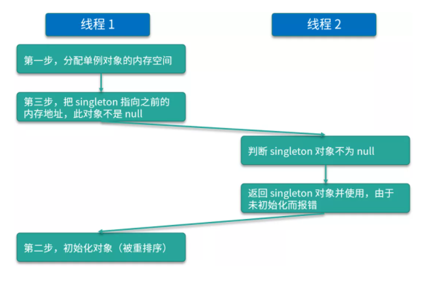

#  `volatile`关键字

## `volatile` 的作用

 - **保证可见性**： 保证了不同线程对这个变量进行操作时的可见性，即一个线程修改了某个共享变量，另外一个线程能读到这个修改的值。

 - **禁止指令重排**：不管怎么重排序，（单线程）程序的执行结果不会改变。由于编译器或 CPU 的优化，代码的实际执行顺序可能与我们编写的顺序是不同的，这在单线程的情况下是没问题的，但是一旦引入多线程，这种乱序就可能会导致严重的线程安全问题。用了 volatile 关键字就可以在一定程度上禁止这种重排序。

- **不保证原子性：**决定了它不能彻底地保证线程安全

## volatile 的应用

如果 `volatile` 变量修饰符使用恰当的话，它比 `synchronized` 的使用和执行成本更低，因为它不会引起线程上下文的切换和调度。但是，**`volatile` 无法替代 `synchronized` ，因为 `volatile` 无法保证操作的原子性**。

通常来说，**使用 `volatile` 必须具备以下 2 个条件**：

- **对变量的写操作不依赖于当前值**：`共享变量只有被赋值和读取。`因为赋值操作是原子性操作，而 volatile 同时保证了 可见性，所以是线程安全的。
- **该变量没有包含在具有其他变量的表达式中**

【示例】状态标记量

```java
volatile boolean flag = false;

while(!flag) {
    doSomething();
}

public void setFlag() {
    flag = true;
}
```

【示例】双重锁实现线程安全的单例模式

```java
class Singleton {
    private volatile static Singleton instance = null;

    private Singleton() {}

    public static Singleton getInstance() {
        if(instance==null) {
            synchronized (Singleton.class) {
                if(instance==null)
                    instance = new Singleton();
            }
        }
        return instance;
    }
}
```

在双重检查锁模式中为什么需要使用 volatile 关键字？

假如 `Instance` 类变量是没有用 `volatile` 关键字修饰的，会导致这样一个问题：

在线程执行到第 1 行的时候，代码读取到 instance 不为 null 时，instance 引用的对象有可能还没有完成初始化。

造成这种现象主要的原因是创建对象不是原子操作以及指令重排序。

第二行代码可以分解成以下几步：

```java
memory = allocate();  // 1：分配对象的内存空间
ctorInstance(memory); // 2：初始化对象
instance = memory;  // 3：设置instance指向刚分配的内存地址
```

根源在于代码中的 2 和 3 之间，可能会被重排序。例如：

```java
memory = allocate();  // 1：分配对象的内存空间
instance = memory;  // 3：设置instance指向刚分配的内存地址
// 注意，此时对象还没有被初始化！
ctorInstance(memory); // 2：初始化对象
```

这种重排序可能就会导致一个线程拿到的 instance 是非空的但是还没初始化完全。



**为什么要 double-check？去掉任何一次的 check 行不行？**

先来看第二次的 `check`，这时你需要考虑这样一种情况，有两个线程同时调用 `getInstance` 方法，由于 `singleton` 是空的 ，因此两个线程都可以通过第一重的` if `判断；然后由于锁机制的存在，会有一个线程先进入同步语句，并进入第二重 `if` 判断 ，而另外的一个线程就会在外面等待。

不过，当第一个线程执行完 `new Singleton() `语句后，就会退出 `synchronized` 保护的区域，这时如果没有第二重 `if (singleton == null)` 判断的话，那么第二个线程也会创建一个实例，此时就破坏了单例，这肯定是不行的。

而对于第一个 check 而言，如果去掉它，那么所有线程都会串行执行，效率低下，所以两个 check 都是需要保留的。

## volatile 的原理

观察加入 volatile 关键字和没有加入 volatile 关键字时所生成的汇编代码发现，**加入 `volatile` 关键字时，会多出一个 `lock` 前缀指令**。**`lock` 前缀指令实际上相当于一个内存屏障**（也成内存栅栏），内存屏障会提供 3 个功能：

- 它确保指令重排序时不会把其后面的指令排到内存屏障之前的位置，也不会把前面的指令排到内存屏障的后面；即在执行到内存屏障这句指令时，在它前面的操作已经全部完成；
- 它会强制将对缓存的修改操作立即写入主存；
- 如果是写操作，它会导致其他 CPU 中对应的缓存行无效。

## volatile 的问题

`volatile` 的要点中，已经提到，**`volatile` 不保证原子性，所以 volatile 并不能保证线程安全**。比如更新的时候需要依赖原来的值，而最典型的就是 a++ 的场景。

如何做到线程安全呢？有两种方案：

- `volatile` + `synchronized` - 可以参考：【示例】双重锁实现线程安全的单例模式(上文)
- 使用原子类替代 `volatile`

