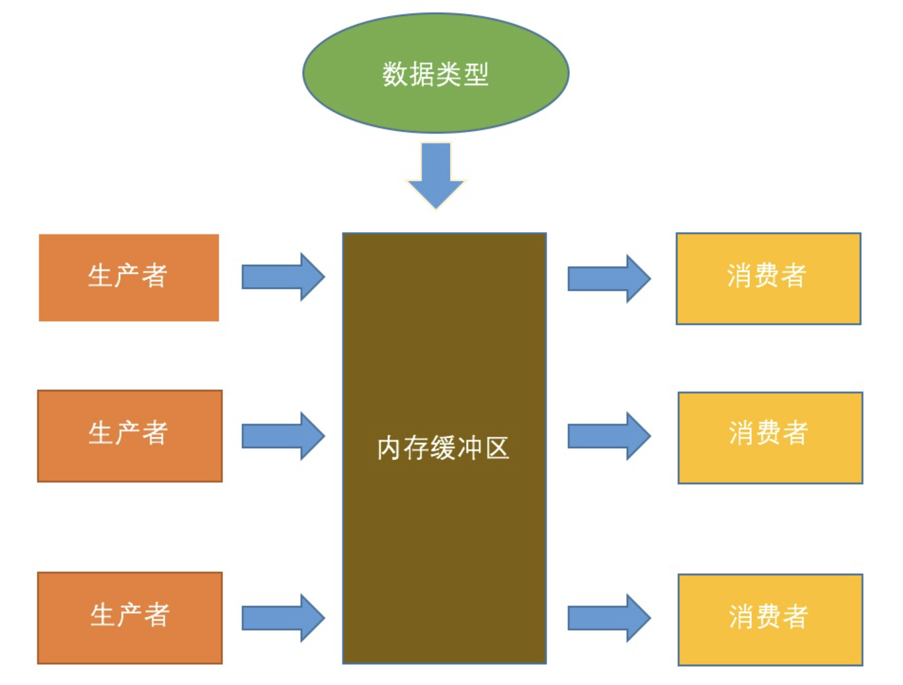

1. `wait()、notify/notifyAll() `方法是`Object`的本地`final`方法，无法被重写。
2. `wait()`使当前线程阻塞，前提是必须先获得锁，一般配合`synchronized` 关键字使用。即，一般在`synchronized` 同步代码块里使用 `wait()、notify/notifyAll() `方法。
3. 由于 `wait()、notify/notifyAll() `在`synchronized` 代码块执行，说明当前线程一定是获取了锁的。
当线程执行`wait()`方法时候，会释放当前的锁，然后让出CPU，进入等待状态。
只有当 `notify/notifyAll()` 被执行时候，才会唤醒一个或多个正处于等待状态的线程，然后继续往下执行，直到执行完`synchronized` 代码块的代码或是中途遇到`wait() `，再次释放锁。
也就是说，`notify/notifyAll() `的执行只是唤醒沉睡的线程，而不会立即释放锁，锁的释放要看代码块的具体执行情况。所以在编程中，尽量在使用了`notify/notifyAll()` 后立即退出临界区，以唤醒其他线程让其获得锁
4. ` wait() `需要被`try catch`包围，以便发生异常中断也可以使`wait`等待的线程唤醒。
5. `notify` 和`wait `的顺序不能错，如果A线程先执行`notify`方法，B线程在执行`wait`方法，那么B线程是无法被唤醒的。
6. `notify` 和 `notifyAll`的区别:
	`notify`方法只唤醒一个等待（对象的）线程并使该线程开始执行。所以如果有多个线程等待一个对象，这个方法只会唤醒其中一个线程，选择哪个线程取决于操作系统对多线程管理的实现。notifyAll 会唤醒所有等待(对象的)线程，尽管哪一个线程将会第一个处理取决于操作系统的实现。如果当前情况下有多个线程需要被唤醒，推荐使用`notifyAll `方法。
7. 在多线程中要测试某个条件的变化，使用if 还是while？
	要注意，`notify`唤醒沉睡的线程后，线程会接着上次的执行继续往下执行。所以在进行条件判断时候，可以先把 `wait` 语句忽略不计来进行考虑；显然，要确保程序一定要执行，并且要保证程序直到满足一定的条件再执行，要使用`while`进行等待，直到满足条件才继续往下执行。如下代码：
```java
public class K {
    //状态锁
    private Object lock;
    //条件变量
    private int now,need;
    public void produce(int num){
        //同步
        synchronized (lock){
           //当前有的不满足需要，进行等待，直到满足条件
            while(now < need){
                try {
                    //等待阻塞
                    lock.wait();
                } catch (InterruptedException e) {
                    e.printStackTrace();
                }
                System.out.println("我被唤醒了！");
            }
           // 做其他的事情
        }
    }
}
```
显然，只有当前值满足需要值的时候，线程才可以往下执行，所以，必须使用`while `循环阻塞。注意，`wait() `当被唤醒时候，只是让`while`循环继续往下走.如果此处用if的话，意味着if继续往下走，会跳出if语句块。

#### 生产者消费者问题

如上图，假设有一个公共的容量有限的池子，有两种人，一种是生产者，另一种是消费者。需要满足如下条件：

1. 生产者产生资源往池子里添加，前提是池子没有满，如果池子满了，则生产者暂停生产，直到自己的生成能放下池子。

2. 消费者消耗池子里的资源，前提是池子的资源不为空，否则消费者暂停消耗，进入等待直到池子里有资源数满足自己的需求。

##### 仓库类：

```java
import java.util.LinkedList;

/**
 *  生产者和消费者的问题
 *  wait、notify/notifyAll() 实现
 */
public class Storage1 implements AbstractStorage {
    //仓库最大容量
    private final int MAX_SIZE = 100;
    //仓库存储的载体
    private LinkedList list = new LinkedList();

    //生产产品
    public void produce(int num){
        //同步
        synchronized (list){
            //仓库剩余的容量不足以存放即将要生产的数量，暂停生产
            while(list.size()+num > MAX_SIZE){
                System.out.println("【要生产的产品数量】:" + num + "\t【库存量】:"
                        + list.size() + "\t暂时不能执行生产任务!");

                try {
                    //条件不满足，生产阻塞
                    list.wait();
                } catch (InterruptedException e) {
                    e.printStackTrace();
                }
            }

            for(int i=0;i<num;i++){
                list.add(new Object());
            }

            System.out.println("【已经生产产品数】:" + num + "\t【现仓储量为】:" + list.size());

            list.notifyAll();
        }
    }

    //消费产品
    public void consume(int num){
        synchronized (list){

            //不满足消费条件
            while(num > list.size()){
                System.out.println("【要消费的产品数量】:" + num + "\t【库存量】:"
                        + list.size() + "\t暂时不能执行生产任务!");

                try {
                    list.wait();
                } catch (InterruptedException e) {
                    e.printStackTrace();
                }
            }

            //消费条件满足，开始消费
            for(int i=0;i<num;i++){
                list.remove();
            }

            System.out.println("【已经消费产品数】:" + num + "\t【现仓储量为】:" + list.size());

            list.notifyAll();
        }
    }
}
```
##### 抽象仓库类

```java
public interface AbstractStorage {
    void consume(int num);
    void produce(int num);
}
```
##### 生产者

```java
public class Producer extends Thread{
    //每次生产的数量
    private int num ;

    //所属的仓库
    public AbstractStorage abstractStorage;

    public Producer(AbstractStorage abstractStorage){
        this.abstractStorage = abstractStorage;
    }

    public void setNum(int num){
        this.num = num;
    }

    // 线程run函数
    @Override
    public void run()
    {
        produce(num);
    }

    // 调用仓库Storage的生产函数
    public void produce(int num)
    {
        abstractStorage.produce(num);
    }
}
```
##### 消费者：

```java
public class Consumer extends Thread{
    // 每次消费的产品数量
    private int num;

    // 所在放置的仓库
    private AbstractStorage abstractStorage1;

    // 构造函数，设置仓库
    public Consumer(AbstractStorage abstractStorage1)
    {
        this.abstractStorage1 = abstractStorage1;
    }

    // 线程run函数
    public void run()
    {
        consume(num);
    }

    // 调用仓库Storage的生产函数
    public void consume(int num)
    {
        abstractStorage1.consume(num);
    }

    public void setNum(int num){
        this.num = num;
    }
}
```
##### 测试：

```java
public class Test{
    public static void main(String[] args) {
        // 仓库对象
        AbstractStorage abstractStorage = new Storage1();

        // 生产者对象
        Producer p1 = new Producer(abstractStorage);
        Producer p2 = new Producer(abstractStorage);
        Producer p3 = new Producer(abstractStorage);
        Producer p4 = new Producer(abstractStorage);
        Producer p5 = new Producer(abstractStorage);
        Producer p6 = new Producer(abstractStorage);
        Producer p7 = new Producer(abstractStorage);

        // 消费者对象
        Consumer c1 = new Consumer(abstractStorage);
        Consumer c2 = new Consumer(abstractStorage);
        Consumer c3 = new Consumer(abstractStorage);

        // 设置生产者产品生产数量
        p1.setNum(10);
        p2.setNum(10);
        p3.setNum(10);
        p4.setNum(10);
        p5.setNum(10);
        p6.setNum(10);
        p7.setNum(80);

        // 设置消费者产品消费数量
        c1.setNum(50);
        c2.setNum(20);
        c3.setNum(30);

        // 线程开始执行
        c1.start();
        c2.start();
        c3.start();

        p1.start();
        p2.start();
        p3.start();
        p4.start();
        p5.start();
        p6.start();
        p7.start();
    }
}
```
##### 输出：

```java
【要消费的产品数量】:50 【库存量】:0    暂时不能执行生产任务!
【已经生产产品数】:80   【现仓储量为】:80
【已经生产产品数】:10   【现仓储量为】:90
【已经生产产品数】:10   【现仓储量为】:100
【要生产的产品数量】:10 【库存量】:100  暂时不能执行生产任务!
【要生产的产品数量】:10 【库存量】:100  暂时不能执行生产任务!
【要生产的产品数量】:10 【库存量】:100  暂时不能执行生产任务!
【要生产的产品数量】:10 【库存量】:100  暂时不能执行生产任务!
【已经消费产品数】:30   【现仓储量为】:70
【已经消费产品数】:20   【现仓储量为】:50
【已经生产产品数】:10   【现仓储量为】:60
【已经生产产品数】:10   【现仓储量为】:70
【已经生产产品数】:10   【现仓储量为】:80
【已经生产产品数】:10   【现仓储量为】:90
【已经消费产品数】:50   【现仓储量为】:40
```

