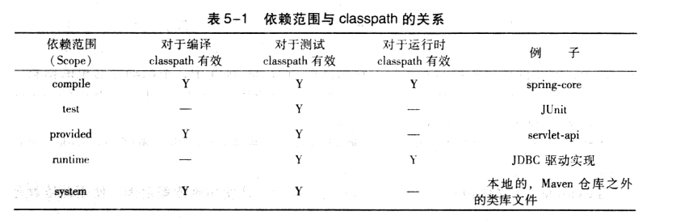
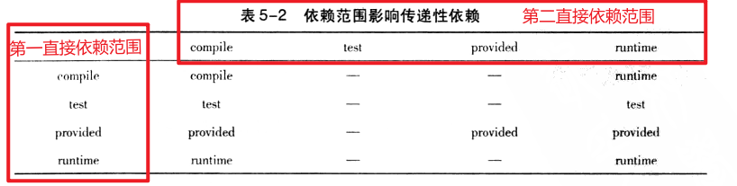

### 1. Maven的依赖配置

#### 1.1 基本坐标：`groupId, artifactId, version`

#### 1.2 依赖类型：`type`

默认值为`jar`

```xml
<xs:element name="type" minOccurs="0" type="xs:string" default="jar">
```

#### 1.3 依赖范围：`scope`

用来控制**编译classpath**，**测试classpath**，**运行classpath**的关系

- compile：编译依赖范围。没有指定，会默认使用该依赖范围。使用此依赖范围的依赖，对于**编译、测试、运行三种classpath**都有效。
- test：测试依赖范围。之对于**测试classpath**有效，在编译主代码或者运行项目时无法使用此依赖。
- provided：已提供依赖范围。对于**编译和测试classpath**有效，在运行时无效。
- runtime：运行时依赖范围。对于**测试和运行classpath**有效，在编译时无效。
- system：系统依赖范围。该依赖和三种classpath关系，和provided依赖范围一致。但是，使用system范围依赖时必须通过`systemPath`元素显式指定依赖文件的路径。由于此类依赖不是通过maven仓库解析的，而且往往与本机系统绑定，可能造成的构建不可移植，谨慎使用。`<systemPath>`标签可以引用环境变量。

```xml
<dependency>
    <groupId>com.baeldung</groupId>
    <artifactId>custom-dependency</artifactId>
    <version>1.3.2</version>
    <scope>system</scope>
    <systemPath>${project.basedir}/libs/custom-dependency-1.3.2.jar</systemPath>
</dependency>
```

- import：导入依赖范围。在maven2.0.9加入，该依赖不会对三种classpath产生实际影响。



#### 1.4 标记依赖是否可选：`optional`

#### 1.5 排除传递性依赖：`exclusions`

### 2. 传递依赖

假设A依赖于B，B依赖于C，则A对于B是第一直接依赖，B对于C是第二直接依赖，A对于C是传递性依赖。

第一直接依赖的范围和第二直接依赖的范围决定了传递性依赖的范围。



举个例子：

Floweryu项目有一个com.A的直接依赖，该依赖是第一直接依赖，依赖范围是test。

而com.A又有一个com.B的直接依赖，该依赖是第二直接依赖，依赖范围是compile。

所以，com.B是Floweryu的传递性依赖，对照上表可知，第一依赖范围是test，第二依赖范围是compile，传递性依赖范围是test

### 3. 依赖调解

**Maven依赖调解第一原则：**路径最近者优先。

> 项目A中有以下两个依赖关系：
>
> A -> B -> C -> X(1.0)    路径为3
>
> A -> B -> X(2.0)   路径为2
>
> 则X(2.0)会被解析使用

依赖调解第一原则不能解决所有问题：

> 比如下面的依赖关系：
>
> A -> B -> Y(1, 0)
>
> A -> C -> Y(2, 0)
>
> 两条路径长度一样，谁先解析

在Maven2.0.8版本之前，这是不确定的。从Maven2.0.9版本开始，Maven定义了依赖调解第二原则。

**Maven依赖调解第二原则**：第一声明者优先。

**在依赖长度相等的情况下，在POM中依赖声明的顺序决定了谁会被解析使用，顺序靠前的依赖会被使用。**

### 4. 可选依赖

> 有这样一个依赖关系：项目A依赖于项目B，项目B依赖于项目X和Y，B对X和Y的依赖都是可选依赖：
>
> A -> B，B -> X(可选)，B -> Y(可选)
>

根据传递性依赖的定义，如果这三个依赖的范围都是compile，则X，Y就是A的compile范围传递性依赖。

然而，这里X，Y是可选依赖，依赖将不会得以传递，即X，Y将不会对A有任何影响。

**为什么要设计可选依赖呢？**

假如项目B实现了两个特性，一个特性依赖于X，另一个特性依赖于Y，并且这两个特性是互斥的，不能同时使用。

则A在使用项目B的时候，如果需要使用X依赖，就需要在POM中显示声明X依赖。如果要使用Y依赖，就需要显示声明Y依赖。

### 5. 优化依赖

```bash
mvn dependency:list
mvn dependency:tree
mvn dependency:analyze
```


