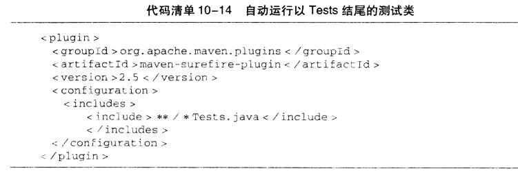
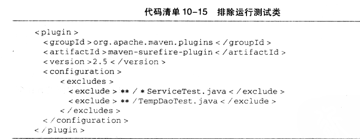

### 跳过测试用例

**maven package -Dmaven.test.skip=true**

该命令会跳过测试代码的编译

**maven package -DskipTests**

该命令跳过测试，但是还会编译测试代码

### 动态运行测试用例

- `mvn test -Dtest = 测试类名`：指定运行测试类
- `mvn test -Dtest = Random * Test`：可以使用*匹配多个字符，来运行测试类
- `mvn test -Dtest = A, B`：使用逗号分隔，也可以和*结合使用

### 包含和排除测试类

