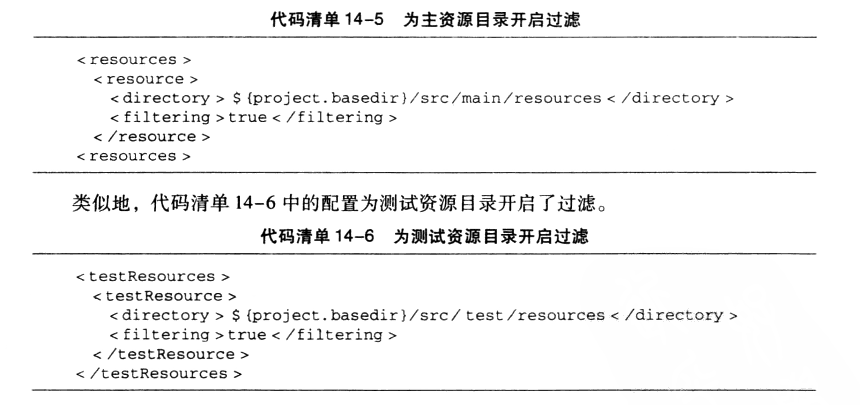

### 1. Maven属性

#### 1. 1 内置属性

主要有两个常用的内置属性

- `${basedir}`：表示项目根目录，即包含pom.xml文件的目录
- `${version}`：表示项目版本

#### 1.2 POM属性

用户可以使用该属性引用POM文件中对应元素的值。

- `${project.artifactId}`：对应了`<project><artifactId>`元素的值。
- `${project.build.sourceDirectory}`：项目的主源码目录，默认为**src/main/java/**
- `${project.build.testSourceDirectory}`：项目的测试源码目录，默认为**src/test/java/**
- `${project.build.directory}`：项目构建输出目录，默认为**target/**
- `${project.outputDirectory}`：项目主代码编译输出目录，默认为**target/classes**
- `${project.testOutputDirectory}`：项目测试代码编译输出目录，默认为**target/testclasses**
- `${project.groupId}`：项目的**groupId**
- `${project.artifactId}`：项目的**artifactId**
- `${project.version}`：项目的**version**，与`${version}`等价
- `${project.build.finalName}`：项目打包输出文件的名称，默认为`${project.artifactId}`

上述属性都对应了一个POM元素，默认值都是再POM中定义的。

#### 1.3 自定义属性

可以在POM的`<properties>`属性下自定义Maven属性。

```xml
<properties>
    <project.build.sourceEncoding>UTF-8</project.build.sourceEncoding>
    <spring.version>4.3.10.RELEASE</spring.version>
</properties>
```

然后再其它地方使用$符号使用。

#### 1.4 Settings属性

用户使用以`settings.` 开头的属性引用`settings.xml`文件中XML元素的值。例如：`${settings.localRepository}`指向用户本地仓库的地址

#### 1.5 Java系统属性

所有Java系统属性都可以使用Maven属性引用，可以在项目中使用`mvn help: system`查看所有环境变量。

#### 1.6 环境变量属性

所有环境变量都可以使用`env.` 开头的Maven属性的引用。例如：`${env.JAVA_HOME}`指定了JAVA_HOME环境变量的值。

### 2. 环境资源过滤

可以在POM中如下定义不同环境属性

```xml
    <profiles>
        <profile>
            <id>home-dev</id>
            <properties>
                <mysql.datasource.url>jdbc:mysql</mysql.datasource.url>
            </properties>
        </profile>
        <profile>
            <id>xiaomi-dev</id>
            <properties>
                <mysql.datasource.url>jdbc:mysql2</mysql.datasource.url>
            </properties>
        </profile>
    </profiles>
```

然后在其它地方使用：

```xml
spring.datasource.url: ${mysql.datasource.url}
```

需要注意：Maven属性只有在POM中才会被解析。即`${mysql.datasource.url}`放在POM中会变成test，但是如果放到src/main/resources/目录下的文件中，构建时它不会改变。因此，需要让Maven解析资源文件中的Maven属性。


资源处理是`maven-resources-plugin`做的事情，将项目主资源文件复制到主代码编译输出目录中，将测试资源文件复制到测试代码编译输出目录中。

