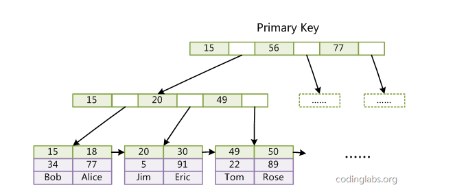
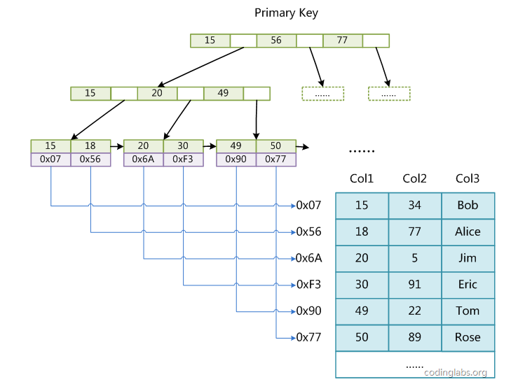

# 1. `InnoDB`存储引擎

InnoDB是事务型数据库的首选引擎，支持事务安全表（ACID），支持行锁定和外键，InnoDB是默认的MySQL引擎。

如果需要对事务的完整性要求比较高（比如银行），要求实现并发控制（比如售票），那选择InnoDB有很大的优势。如果需要频繁的更新、删除操作的数据库，也可以选择InnoDB，因为支持事务的提交（commit）和回滚（rollback）。

## 主要特性

- 为MySQL提供了具有提交、回滚和崩溃恢复能力的事物安全（ACID兼容）存储引擎。
- **InnoDB支持外键完整性约束**，存储表中的数据时，每张表的存储都按主键顺序存放，如果没有显示在表定义时指定主键，InnoDB会为每一行生成一个6字节的ROWID，并以此作为主键。
- InnoDB存储引擎完全与MySQL服务器整合，InnoDB存储引擎为在主内存中缓存数据和索引而维持它自己的缓冲池。**InnoDB将它的表和索引在一个逻辑表空间中**，表空间可以包含数个文件（或原始磁盘文件）。这与MyISAM表不同，比如在**MyISAM表中每个表被存放在分离的文件中**。InnoDB表可以是任何尺寸，即使在文件尺寸被限制为2GB的操作系统上。
- InnoDB是为**处理巨大数据量**的最大性能设计。它的CPU效率可能是任何其他基于磁盘的关系型数据库引擎锁不能匹敌的。

## 数据结构

InnoDB也使用`B+Tree`作为索引结构，但具体实现方式却与MyISAM截然不同。

- **InnoDB的数据文件本身就是索引文件，叶节点包含了完整的数据记录。这种索引叫做**聚集索引**。MyISAM索引文件和数据文件是分离的**，索引文件仅保存数据记录的地址。而在InnoDB中，表数据文件本身就是按B+Tree组织的一个索引结构，**这棵树的叶节点data域保存了完整的数据记录**。这个索引的key是数据表的主键，因此InnoDB表数据文件本身就是主索引。

- **InnoDB的辅助索引data域存储相应记录主键的值而不是地址**。

> 聚集索引这种实现方式使得按主键的搜索十分高效，但是辅助索引搜索需要检索两遍索引：首先检索辅助索引获得主键，然后用主键到主索引中检索获得记录。
> 了解不同存储引擎的索引实现方式对于正确使用和优化索引都非常有帮助，例如知道了InnoDB的索引实现后，就很容易明白**为什么不建议使用过长的字段作为主键**，因为所有辅助索引都引用主索引，过长的主索引会令辅助索引变得过大。再例如，**用非单调的字段作为主键在InnoDB中不是个好主意**，因为InnoDB数据文件本身是一颗B+Tree，非单调的主键会造成在插入新记录时数据文件为了维持B+Tree的特性而频繁的分裂调整，十分低效，而使用自增字段作为主键则是一个很好的选择。

# 2. `MYISAM`引擎

MyISAM拥有较高的插入、查询速度，但**不支持事务**。

如果表主要是用于插入新记录和读出记录，那么选择MyISAM能实现处理高效率。如果应用的完整性、并发性要求比 较低，也可以使用。

## 主要特性

- 被大文件系统和操作系统支持
- 当把删除和更新及插入操作混合使用的时候，动态尺寸的行产生更少碎片。这要通过合并相邻被删除的块，若下一个块被删除，就扩展到下一块自动完成。
- 每个MyISAM表最大索引数是64，这可以通过重新编译来改变。每个索引最大的列数是16。
- 最大的键长度是1000字节，这也可以通过编译来改变，对于键长度超过250字节的情况，一个超过1024字节的键将被用上
- BLOB和TEXT列可以被索引
- NULL被允许在索引的列中，这个值占每个键的0~1个字节
- 所有数字键值以高字节优先被存储以允许一个更高的索引压缩
- 每个`MyISAM`类型的表都有一个`AUTO_INCREMENT`的内部列，当`INSERT`和`UPDATE`操作的时候该列被更新，同时`AUTO_INCREMENT`列将被刷新。所以说，`MyISAM`类型表的`AUTO_INCREMENT`列更新比`InnoDB`类型的`AUTO_INCREMENT`更快
- 可以把数据文件和索引文件放在不同目录

## 数据结构

使用**B+Tree**作为索引结构，**叶节点的data域存放的是数据记录的地址**。

**MyISAM中索引检索的算法为首先按照B+Tree搜索算法搜索索引，如果指定的Key存在，则取出其data域的值，然后以data域的值为地址，读取相应数据记录。**
MyISAM的索引方式也叫做“非聚集”的，之所以这么称呼是为了与InnoDB的聚集索引区分。

# 3. `MEMORY`引擎

所有的数据都在内存中，数据的处理速度快，但是安全性不高。如果需要很快的读写速度，对数据的安全性要求较低，可以选择MEMOEY。它对表的大小有要求，不能建立太大的表。所以，这类数据库只使用在相对较小的数据库表。

一般在以下几种情况下使用Memory存储引擎：

- 目标数据较小，而且被非常频繁地访问。 在内存中存放数据，所以会造成内存的使用，可以通过参数max_heap_table_size控制Memory表的大小，设置此参数，就可以限制Memory表的最大大小。
- 如果数据是临时的，而且要求必须立即可用，那么就可以存放在内存表中。
- 存储在Memory表中的数据如果突然丢失，不会对应用服务产生实质的负面影响。
- Memory同时支持散列索引和B树索引。

B树索引优于散列索引的是，可以使用部分查询和通配查询，也可以使用<、>和>=等操作符方便数据挖掘。

散列索引进行“相等比较”非常快，但是对“范围比较”的速度就慢多了，因此散列索引值适合使用在=和<>的操作符中，不适合在<或>操作符中，也同样不适合用在order by子句中。

# 4. `CSV`引擎

CSV 存储引擎是基于 CSV 格式文件存储数据。

- CSV 存储引擎因为自身文件格式的原因，所有列必须强制指定 NOT NULL 。
- CSV 引擎也**不支持索引**，**不支持分区**。
- CSV 存储引擎也会包含一个存储表结构的 .frm 文件，还会创建一个 .csv 存储数据的文件，还会创建一个同名的元信息文件，该文件的扩展名为 .CSM ，用来保存表的状态及表中保存的数据量。
- 每个数据行占用一个文本行。

因为 csv 文件本身就可以被Office等软件直接编辑，保不齐就有不按规则出牌的情况，如果出现csv 文件中的内容损坏了的情况，也可以使用 CHECK TABLE 或者 REPAIR TABLE 命令检查和修复

# 参考资料

- https://segmentfault.com/a/1190000012588602
- https://juejin.cn/post/6844903795281887245
- https://blog.csdn.net/zgrgfr/article/details/74455547