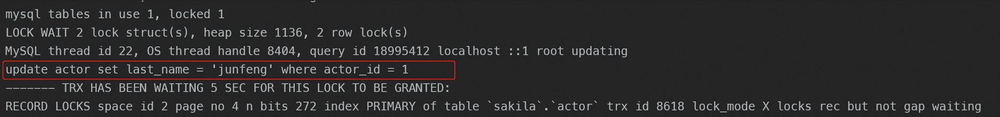

## MySQL的`explain`

#### `id`：查询编号

**id值越大，代表优先级越高，越先执行。如果id一致，则按table的顺序由上向下执行。id为null则最后执行**

如果没有子查询或者关联查询的话，就只有一条。


如果是子查询，可能包含多个`select`关键字，每个关键字都会对应一个唯一的`id`值。

但需要注意的是：**查询优化器可能对涉及子查询的语句进行重写，从而转换为连接查询。**此时执行计划的id值就是唯一的了。


如果是联合查询，那么就会出现一条id为NULL的记录，因为`union`结果会放到临时表中，临时表并不在原SQL中出现，所以这里的`table`是`<union1,2>`这种格式，表示将id为1和2的查询关联。


#### `select_type`：查询类型

| `select_type` **Value** |       **JSON Name**        |                           Meaning                            |                             解释                             |
| :---------------------: | :------------------------: | :----------------------------------------------------------: | :----------------------------------------------------------: |
|         SIMPLE          |            None            |       Simple `SELECT` or (not using `UNION`subqueries)       |               简单查询，不包含子查询和`UNION`                |
|         PRIMARY         |            None            |                       Outermost SELECT                       | 查询若包含任何复杂的子部份，最外层查询就会被标记成`PRIMARY`  |
|          UNION          |            None            |       Second or later `SELECT` statement in a `UNION`        |      在`UNION`中的第二个和后面的select会被标记为`UNION`      |
|     DEPENDENT UNION     |    `dependent` (`true`)    | Second or later `SELECT` statement in a `UNION`, dependent on outer query |     UNION中的第二个或后面的SELECT语句，取决于外面的查询      |
|      UNION RESULT       |        union_result        |                     Result of a `UNION`                      |                         UNION的结果                          |
|        SUBQUERY         |            None            |                  First `SELECT` in subquery                  |                    子查询中的第一个SELECT                    |
|   DEPENDENT SUBQUERY    |    `dependent` (`true`)    |     First `SELECT` in subquery, dependent on outer query     |           子查询中的第一个SELECT，取决于外面的查询           |
|         DERIVED         |            None            |                        Derived table                         | 标记出现在from里的子查询，数字代表是子查询的`id`，这个结果会放进临时表中，也叫派生表。 |
|    DEPENDENT DERIVED    |    `dependent` (`true`)    |           Derived table dependent on another table           |                  依赖其他表的派生表的SELECT                  |
|      MATERIALIZED       | materialized_from_subquery |                    Materialized subquery                     |                         具体化子查询                         |
|  UNCACHEABLE SUBQUERY   |   `cacheable` (`false`)    | A subquery for which the result cannot be cached and must be re-evaluated for each row of the outer query |                      不能被缓存的子查询                      |
|    UNCACHEABLE UNION    |   `cacheable` (`false`)    | The second or later select in a `UNION` that belongs to an uncacheable subquery (see `UNCACHEABLE SUBQUERY`) |           UNION中第二个或后面的不能被缓存的子查询            |

#### `table`：正在访问哪个表

将`id`和`table`结合可以看出SQL的执行顺序。

- `<unionM,N>`：当有 union 时，UNION RESULT 的 table 列的值为 `<union1,2>`，1和2表示参与 union 的 select 行 id。

- `<derivedN>`：id值为N的派生表的结果
- `<subqueryN>`：id值为N的具体化子查询结果

#### `partitions`：匹配的分区

查询时匹配到的分区信息，对于非分区表值为`NULL`，当查询的是分区表时，`partitions`显示分区表命中的分区情况。

#### `type`：查询使用的类型

查询效率由高到低：

**`system > const > eq_ref > ref > fulltext > ref_or_null > index_merge > unique_subquery > index_subquery > range > index > all`**

- **system**：当表仅有一行记录时(系统表)，数据量很少，往往不需要进行磁盘IO，速度非常快。

- **const**：表示查询时命中 `primary key` 主键或者 `unique` 唯一索引，或者被连接的部分是一个常量(`const`)值。这类扫描效率极高，返回数据量少，速度非常快，因为只读一次。

  下面例子就使用了主键索引查询，所以`type`就是`const`：

  ```mysql
  mysql> explain select * from city where id = 5\G;
  *************************** 1. row ***************************
             id: 1
    select_type: SIMPLE
          table: city
     partitions: NULL
           type: const
  possible_keys: PRIMARY
            key: PRIMARY
        key_len: 4
            ref: const
           rows: 1
       filtered: 100.00
          Extra: NULL
  1 row in set, 1 warning (0.00 sec)
  ```

- **eq_ref**：表连接查询，主键索引或者唯一索引全部被命中，是除system和const之外，最好的连接类型，和索引列比较只能使用=号。表示对于前表的每一个结果, 都只能匹配到后表的一行结果

  下面示例中，`country_id`是country的主键`id`。根据`country`表的每一个结果，都只能匹配到`city`表的一行结果，所以`type`是`eq_ref`。

  ```mysql
  mysql> explain select * from city, country where country.country_id  = city.city_id\G;
  *************************** 1. row ***************************
             id: 1
    select_type: SIMPLE
          table: country
     partitions: NULL
           type: ALL
  possible_keys: PRIMARY
            key: NULL
        key_len: NULL
            ref: NULL
           rows: 109
       filtered: 100.00
          Extra: NULL
  *************************** 2. row ***************************
             id: 1
    select_type: SIMPLE
          table: city
     partitions: NULL
           type: eq_ref
  possible_keys: PRIMARY
            key: PRIMARY
        key_len: 2
            ref: sakila.country.country_id
           rows: 1
       filtered: 100.00
          Extra: NULL
  2 rows in set, 1 warning (0.00 sec)
  ```

- **ref**：使用最左前缀匹配索引（索引不是主键，也不是唯一索引），和索引列比较可以使用 = 或 <=> 。

  下面示例中，`actor_id`是`actor`表的主键索引，但对应到`film_actor`表中有多个结果，所以查询类型不是`eq_ref`，而是`ref`。

  ```mysql
  mysql> explain select * from actor, film_actor where actor.actor_id = film_actor.actor_id\G;
  *************************** 1. row ***************************
             id: 1
    select_type: SIMPLE
          table: actor
     partitions: NULL
           type: ALL
  possible_keys: PRIMARY
            key: NULL
        key_len: NULL
            ref: NULL
           rows: 200
       filtered: 100.00
          Extra: NULL
  *************************** 2. row ***************************
             id: 1
    select_type: SIMPLE
          table: film_actor
     partitions: NULL
           type: ref
  possible_keys: PRIMARY
            key: PRIMARY
        key_len: 2
            ref: sakila.actor.actor_id
           rows: 27
       filtered: 100.00
          Extra: NULL
  2 rows in set, 1 warning (0.00 sec)
  ```

- **fulltext**：使用全文索引的时候才会出现。

- **ref_or_null**：这个查询类型和ref很像，但是 MySQL 会做一个额外的查询，来看哪些行包含了NULL。

- **index_merge**：在一个查询里面很有多索引用被用到，可能会触发index_merge的优化机制。

- **unique_subquery**：unique_subquery和eq_ref不一样的地方是使用了in的子查询：

- **index_subquery**：index_subquery和unique_subquery很像，区别是它在子查询里使用的是非唯一索引。

- **range**：通过索引范围查找多行数据，可以使用`=, <>, >, >=, <, <=, IS NULL, <=>, BETWEEN, LIKE, 或 IN() `操作符。

  ```mysql
  mysql> explain select * from country where country_id > 5\G;
  *************************** 1. row ***************************
             id: 1
    select_type: SIMPLE
          table: country
     partitions: NULL
           type: range
  possible_keys: PRIMARY
            key: PRIMARY
        key_len: 2
            ref: NULL
           rows: 104
       filtered: 100.00
          Extra: Using where
  1 row in set, 1 warning (0.00 sec)
  ```

- **index**：index类型和ALL类型一样，区别就是index类型是扫描的索引树。以下两种情况会触发：

  -  如果索引是查询的覆盖索引，就是说查询的数据在索引中都能找到，只需扫描索引树，不需要回表查询。 在这种情况下，explain 的 Extra 列的结果是 Using index。仅索引扫描通常比ALL快，因为索引的大小通常小于表数据。

  - 全表扫描会按索引的顺序来查找数据行。使用索引不会出现在Extra列中。

  下面查询的`last_name`是索引列，使用到了覆盖索引，不需要回表查询。`type`是`index`，并且`extra`是`using index`。

  ```mysql
  mysql> explain select last_name from actor\G;
  *************************** 1. row ***************************
             id: 1
    select_type: SIMPLE
          table: actor
     partitions: NULL
           type: index
  possible_keys: NULL
            key: idx_actor_last_name
        key_len: 137
            ref: NULL
           rows: 200
       filtered: 100.00
          Extra: Using index
  1 row in set, 1 warning (0.00 sec)
  ```

- **all**：全表扫描，效率最低的查询，一般可以通过添加索引避免。

  ```mysql
  mysql> explain select first_name from actor\G;
  *************************** 1. row ***************************
             id: 1
    select_type: SIMPLE
          table: actor
     partitions: NULL
           type: ALL
  possible_keys: NULL
            key: NULL
        key_len: NULL
            ref: NULL
           rows: 200
       filtered: 100.00
          Extra: NULL
  1 row in set, 1 warning (0.00 sec)
  ```

#### `possible_keys`：显示查询可以使用哪些索引，不一定是最终使用的索引

#### `key`：实际使用的索引

#### `key_len`：在索引里使用的字节数，也可以查看联合索引实际使用了哪些索引

计算规则如下：

**字符串**：

- `char(n)`：如果n字节长度（utf8字符集占用3个字节）

- `varchar(n)`：如果是`uft8`编码，则是`3n + 2`个字节；如果是`utf8mb4`，则是`4n + 2`字节；

**数值类型**：

- `tinyint`：1字节
- `smallint`：2字节
- `mediumint`：3字节
- `int`：4字节
- `bigint`：8字节

**时间属性**：

- `date`：3字节
- `timestamp`：4字节
- `datetime`：8字节

**字段属性**：NULL 属性，占用一个字节. 如果一个字段是 NOT NULL 的, 则没有此属性

创建下面示例表：

```mysql
CREATE TABLE `test_key_len` (
  `id` int unsigned NOT NULL AUTO_INCREMENT,
  `name` char(20) NOT NULL DEFAULT '',
  `name1` char(20) DEFAULT NULL,
  `name2` varchar(20) NOT NULL DEFAULT '',
  PRIMARY KEY (`id`),
  KEY `name` (`name`)
) ENGINE=InnoDB DEFAULT CHARSET=utf8

mysql> select * from test_key_len;
+----+---------+---------+---------+
| id | name    | name1   | name2   |
+----+---------+---------+---------+
|  1 | xiaogou | xiaomao | xiaoniu |
|  2 | a       | b       | c       |
|  3 | xiaomi  | ali     | baidu   |
+----+---------+---------+---------+
3 rows in set (0.00 sec)
```

1. 执行下面语句：

```mysql
mysql> explain select * from test_key_len where name = 'a'\G;
*************************** 1. row ***************************
           id: 1
  select_type: SIMPLE
        table: test_key_len
   partitions: NULL
         type: ref
possible_keys: name
          key: name
      key_len: 60
          ref: const
         rows: 1
     filtered: 100.00
        Extra: NULL
1 row in set, 1 warning (0.00 sec)
```

这里只使用了`name`索引，`name`是`char(20)`且非空，又因为使用的是`utf8`字符集，所以`key_len = 20 * 3 = 60`

2. 下面添加`idx_name_name1(name,name1) `索引，执行下面SQL：

```mysql
mysql> explain select * from test_key_len where name = 'a' and name1 = 'b'\G;
*************************** 1. row ***************************
           id: 1
  select_type: SIMPLE
        table: test_key_len
   partitions: NULL
         type: ref
possible_keys: idx_name_name1
          key: idx_name_name1
      key_len: 121
          ref: const,const
         rows: 1
     filtered: 100.00
        Extra: NULL
1 row in set, 1 warning (0.00 sec)
```

由于`name1`是`NULL`，所以要多加1字节，`key_len = 20 * 3 + (20 * 3 + 1) = 121`

3. 添加`idx_name1_name2 (name1, name2)`索引

```mysql
mysql> explain select * from test_key_len where name1 = 'b' and name2 = 'c'\G;
*************************** 1. row ***************************
           id: 1
  select_type: SIMPLE
        table: test_key_len
   partitions: NULL
         type: ref
possible_keys: idx_name1_name2
          key: idx_name1_name2
      key_len: 123
          ref: const,const
         rows: 1
     filtered: 100.00
        Extra: NULL
1 row in set, 1 warning (0.00 sec)
```

由于`name1`是`NULL`并且为`char`，`name2`是`NOT NULL`并且为`varchar`，所以`key_len = (20 * 3 + 1) + (20 * 3 + 2) = 123 `

#### `ref`：在key索引中查找值所用的列或常量

- 当使用常量等值查询，显示`const`
- 当关联查询时，会显示相应关联表的**关联字段**
- 如果查询条件使用了`表达式`、`函数`，或者条件列发生内部隐式转换，可能显示为`func`
- 其它为**null**

#### `rows`：估计为找到所需的行而要读取的行数

#### `filtered`：返回的数据在经过过滤后，剩下满足条件的记录数量的比例。

#### `Extra`：不适合展示在其他列的额外信息

- `Using index`：使用了覆盖索引
- `Using where`：查询时未找到可用的索引，进而通过`where`条件过滤获取所需数据
- `Using temporary`：表示查询后结果需要使用临时表来存储，一般在排序或者分组查询时用到。
- `Using filesort`：表示无法利用索引完成的排序操作，也就是`ORDER BY`的字段没有索引，通常这样的SQL都是需要优化的。
- `Using join buffer`：联表查询的时候，如果表的连接条件没有用到索引，需要有一个连接缓冲区来存储中间结果。
- `Impossible where`：用不太正确的`where`语句，导致没有符合条件的行。
- `No tables used`：查询语句中没有`FROM`子句，或者有 `FROM DUAL`子句。

> 还有其它字段：[官方文档](https://dev.mysql.com/doc/refman/8.0/en/explain-output.html#explain_ref)

## 索引优化

#### `ORDER BY`优化

> select (几乎全部字段) from puri_video where user_id = ? order by id desc 后缀的order by id  想变更为 order by create_time
>
> sql 是 where user_id = ? order by  create_time,  那索引  (user_id,create_time)是最优的


在`rental_duration和length`不是组合索引的情况下，执行下面SQL：

```mysql
explain select * from film where rental_duration = 6 order by length;
```


Extra中出现`Using filesort`，说明需要进行优化。

添加组合索引：`(rental_duration,length)`


再执行上述SQL：


#### `UNION/UNION ALL/IN/OR`

**UNION和UNION ALL效率？**

除非需要消除重复的行使用`UNION`，否则推荐使用`UNION ALL`。因为如果没有`ALL`关键字，MySQL会给临时表加上`DISTINCT`选项，这会导致对整个临时表的数据进行唯一性检查。

> 从下面查询可以看出，`UNION ALL`比`IN/OR`多执行一步。但是IN和OR开不出来，数据量太小。

```mysql
mysql> explain select * from actor where actor_id = 1 union all select * from actor where actor_id = 2;

mysql> explain select * from actor where actor_id in (1, 2);

mysql> explain select * from actor where actor_id = 1 or actor_id = 2;
```


**`IN`和`OR`哪个效率高?**

> :bulb:结论：IN比OR快，IN里面的列不要超过1000个
>
> IN在查询时会将list变为一个二叉搜索树，通过二叉搜索树进行查找，时间复杂度是O(logN)，N是检索的列数
>
> OR会一个个的匹配，所以时间复杂度是O(N)，N是检索的列数

当要检索的列为**主键索引**或**普通索引**时，IN 的执行速度和 OR 差别不大

当要检索的列没有索引时，IN的执行速度要远大于 OR。建议将IN查询转化为`INNER JOIN`，这样就可以走索引。

> 这篇文章有测试用例可以来验证：https://blog.csdn.net/nimeijian/article/details/50516336

**用or分割开的条件，如果or前的条件中列有索引，而后面的列中没有索引，那么涉及到的索引都不会被用到，将导致全表扫描**

下面查询，`countrycode`有索引，`name`没有索引，但是执行时都没有使用到索引

```mysql
mysql> explain select * from city where countrycode = 'AFG' or name = 'Kabul'\G;
*************************** 1. row ***************************
           id: 1
  select_type: SIMPLE
        table: city
   partitions: NULL
         type: ALL
possible_keys: CountryCode
          key: NULL
      key_len: NULL
          ref: NULL
         rows: 4188
     filtered: 10.39
        Extra: Using where
1 row in set, 1 warning (0.00 sec)
```

#### 索引和锁

下面sql基于表`actor`，其中`last_name`上有索引，`actor_id`是主键索引

```mysql
# 事务1
mysql> set autocommit=0;
mysql> begin;
mysql> update actor set first_name = 'zhang' where last_name = 'GUINESS';
Query OK, 3 rows affected (0.00 sec)
Rows matched: 3  Changed: 3  Warnings: 0

# 事务2
mysql> begin;
mysql> update actor set last_name = 'junfeng' where actor_id = 1;
ERROR 1205 (HY000): Lock wait timeout exceeded; try restarting transaction
```

使用`show engine innodb status\G;`查看日志可以得到



事务1的`update`语句正常执行如下：

1. 由于使用到了非聚簇索引，首先获取`last_name`上的行级锁。
2. 然后根据主键`actor_id`进行更新，所以要获取`primary`上的行级锁
3. 更新完毕，提交

事务2的`update`执行如下：

1. 先锁住聚簇索引`actor_id`
2. 然后再更新字段`last_name`

假设事务2在事务1的第一步和第二步之间执行，则事务2先获锁住聚簇索引，然后去请求`last_name`索引上的锁；而事务1获取了`last_name`上的锁，正在等待`primary`上的锁。这样就出现了死锁。

**解决方法**

可以根据`last_name`先获取到要更新记录的主键，然后再逐条更新。

## 扩展：`show profile`

用来分析当前会话中SQL语句执行的资源消耗情况。

#### 常用命令：

- `show variables like '%profil%';`  查看 profiling 设置

- `set profiling=1;`  开启 profiling 功能。0 或 OFF 表示关闭，1 或 ON 表示开启

- `show profiles;` 查看当前session所有已经产生的profiles

- `show profile;` 查看上一条SQL语句开销，具体命令如下：

  ```bash
  SHOW PROFILE [type [, type] ... ]
      [FOR QUERY n]	// 如果不指定，则默认显示最近执行的语句；如果指定则显示语句n，n是query_id的值，可通过show profiles查看
      [LIMIT row_count [OFFSET offset]]
  
  type: {
      ALL		// 显示所有性能开销信息
    | BLOCK IO	// 显示 I/O 相关开销信息
    | CONTEXT SWITCHES	// 上下文切换开销
    | CPU		// 显示CPU相关信息
    | IPC		// 显示发送和接收消息的数量
    | MEMORY		// 显示内存相关的开销信息
    | PAGE FAULTS		// 显示页面错误相关的开销信息
    | SOURCE		// 显示源代码中函数名称以及该函数所在文件的名称和行号
    | SWAPS		// 显示交换次数的相关信息
  }
  ```

  > :bulb: `show profile`和``show profiles`将会在后续版本删除，使用 [performance_schema ](https://dev.mysql.com/doc/refman/8.0/en/performance-schema-query-profiling.html)来代替，后者没用过，看官方示例感觉使用上没有前者方便

#### 使用示例及解释

```mysql
mysql> show variables like '%profil%';
+------------------------+-------+
| Variable_name          | Value |
+------------------------+-------+
| have_profiling         | YES   |		// 标记是否存在语句分析功能
| profiling              | OFF   |		// 开启SQL语句剖析功能。 0或OFF表示关闭(默认)，1或ON表示开启
| profiling_history_size | 15    |		// 设置保留profiling的数目(即使用show profiles;命令展示的默认是最近执行
+------------------------+-------+		// 的15条sql的记录), 范围是[0, 100]，设置为0时将禁用profiling.
3 rows in set, 1 warning (0.00 sec)
```


```mysql
# 开启session级别的profiling
mysql> set profiling=1;

# 验证修改后的结果
mysql> show variables like '%profil%';
+------------------------+-------+
| Variable_name          | Value |
+------------------------+-------+
| have_profiling         | YES   |
| profiling              | ON    |
| profiling_history_size | 15    |
+------------------------+-------+
3 rows in set, 1 warning (0.00 sec)
```

下面运行几个查询语句示例：

```mysql
mysql> select * from test;
+----+------+
| id | name |
+----+------+
|  1 | a    |
|  2 | b    |
|  3 | c    |
+----+------+
3 rows in set (0.00 sec)

mysql> select name from test;
+------+
| name |
+------+
| a    |
| b    |
| c    |
+------+
3 rows in set (0.00 sec)

# 查看当前session所有已经产生的profiles
mysql> show profiles;
+----------+------------+-----------------------+
| Query_ID | Duration   | Query                 |
+----------+------------+-----------------------+
|        1 | 0.00065825 | select * from test    |
|        2 | 0.00030100 | select name from test |
+----------+------------+-----------------------+
2 rows in set, 1 warning (0.00 sec)

# 可以使用show profile来查看上一条SQL语句开销
# 注：show profile之类的语句不会被profiling
# 查看全部信息
mysql> show profile all;
*************************** 17. row ***************************
             Status: cleaning up	// 状态
           Duration: 0.000023		// 持续时间，单位:s
           CPU_user: 0.000000		// 用户态CPU时间，单位:s
         CPU_system: 0.000000		// 系统态CPU时间，单位:s
  Context_voluntary: NULL			// 自愿上下文切换次数
Context_involuntary: NULL			// 非自愿上下文切换次数
       Block_ops_in: NULL			// 块输入次数
      Block_ops_out: NULL			// 块输出次数
      Messages_sent: NULL			// 发送的消息数量
  Messages_received: NULL			// 接收的消息数量
  Page_faults_major: NULL			// 主要页面错误数量
  Page_faults_minor: NULL			// 次要页面错误数量
              Swaps: NULL			// 交换次数
    Source_function: dispatch_command		// 源代码函数
        Source_file: sql_parse.cc			// 源代码文件
        Source_line: 2252					// 源代码行数
17 rows in set, 1 warning (0.00 sec)

# 查看基本执行过程时间信息
mysql> show profile;
+--------------------------------+----------+
| Status                         | Duration |
+--------------------------------+----------+
| starting                       | 0.000188 |
| Executing hook on transaction  | 0.000060 |
| starting                       | 0.000022 |
| checking permissions           | 0.000011 |	// 检查是否又执行该sql的权限
| Opening tables                 | 0.000292 |
| init                           | 0.000004 |
| System lock                    | 0.000034 |
| optimizing                     | 0.000003 |
| statistics                     | 0.000090 |
| preparing                      | 0.000015 |
| executing                      | 0.000160 |
| end                            | 0.000002 |
| query end                      | 0.000003 |
| waiting for handler commit     | 0.000025 |
| closing tables                 | 0.000008 |	// 将变更的表中的数据刷新到磁盘上并正在关闭使用过的表
| freeing items                  | 0.000064 |	
| cleaning up                    | 0.000023 |	// 释放内存和重置某些状态变量
+--------------------------------+----------+
17 rows in set, 1 warning (0.00 sec)

# 查询某一条记录的执行信息
mysql> show profile for query 2; 
+--------------------------------+----------+ 
| Status                         | Duration | 
+--------------------------------+----------+ 
| starting                       | 0.000076 | 
| Executing hook on transaction  | 0.000004 | 
| starting                       | 0.000009 | 
| checking permissions           | 0.000007 | 
| Opening tables                 | 0.000057 | 
| init                           | 0.000006 | 
| System lock                    | 0.000010 | 
| optimizing                     | 0.000004 | 
| statistics                     | 0.000024 | 
| preparing                      | 0.000020 | 
| executing                      | 0.003638 | 
| end                            | 0.000014 | 
| query end                      | 0.000003 | 
| waiting for handler commit     | 0.000008 | 
| closing tables                 | 0.000009 | 
| freeing items                  | 0.000063 | 
| cleaning up                    | 0.000018 | 
+--------------------------------+----------+ 
17 rows in set, 1 warning (0.00 sec)
```

## 参考文献：

- [为什么数据库字段要使用NOT NULL](https://www.cnblogs.com/ilovejaney/p/14619604.html)
- [索引优化导致死锁案例解析](https://www.cnblogs.com/vivotech/p/14313671.html)

- [官方文档](https://dev.mysql.com/doc/refman/8.0/en/explain-output.html)

