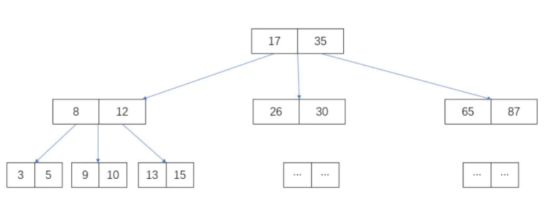
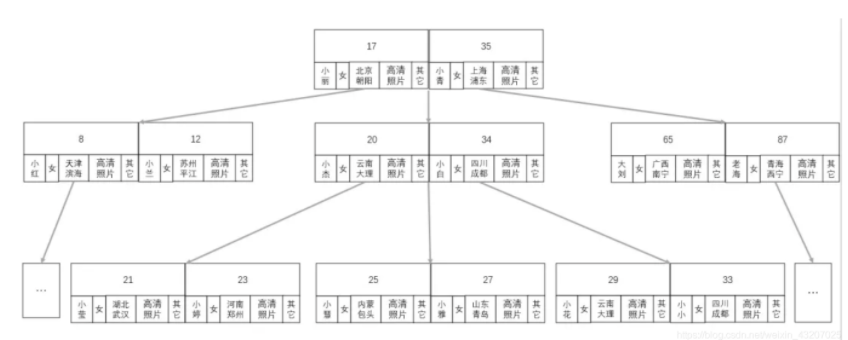
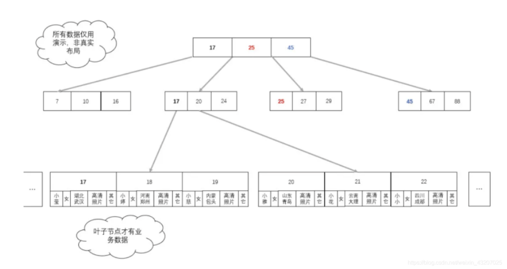
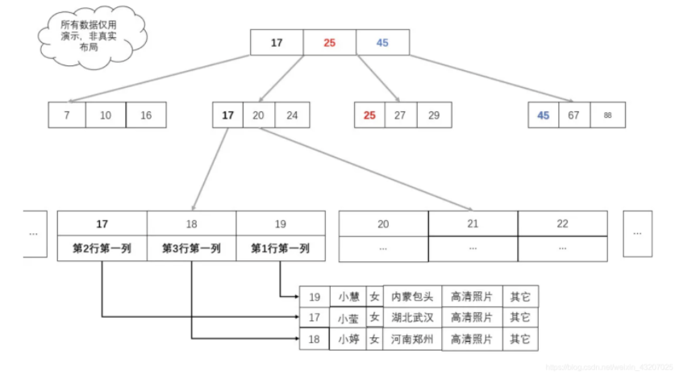

# 1. 索引的类型

索引分为两大类：聚簇索引和非聚簇索引。

- **聚簇索引**：按照数据存放的物理位置为顺序的，聚簇索引能够提高多行检索的速度。
- **非聚簇索引**：索引的逻辑顺序与磁盘上行的物理存储顺序不同，一个表中可以拥有多个非聚集索引。对单行的检索速度很快。
- **组合索引**：在表的多个字段组合上创建的索引，只有在查询条件中使用了这些字段的左边字段时，索引才会被使用。使用组合索引时**遵循最左前缀集合**
- **UNIQUE（唯一索引）**：索引列的值必须唯一，但允许有空值。若是组合索引，则列值的组合必须唯一。
- **PRIMARY（主键索引）**：一种特殊的唯一索引，不允许有空值。
- **Key（普通索引）**：是MySQL中的基本索引类型，允许在定义索引的列中插入重复值和空值.

- **FULLTEXT（全文索引）**：全文索引类型为FULLTEXT，在定义索引的列上支持值的全文查找，允许在这些索引列中插入重复值和空值。全文索引可以在**CHAR**、**VARCHAR**或者**TEXT**类型的列上创建.
- **SPATIAL（空间索引）**：空间索引是对空间数据类型的字段建立的索引，MySQL中的空间数据类型有4种，分别是**GEOMETRY**、**POINT**、**LINESTRING**和**POLYGON**。MySQL使用**SPATIAL**关键字进行扩展，使得能够用于创建正规索引类似的语法创建空间索引。创建空间索引的列必须声明为**NOT NULL**.

## 1.1 最左前缀原则

在mysql建立联合索引时会遵循最左前缀匹配的原则，即最左优先，在检索数据时从联合索引的最左边开始匹配，示例：

对列col1、列col2和列col3建一个联合索引：

```mysql
KEY test_col1_col2_col3 on test(col1,col2,col3);
```

联合索引 `test_col1_col2_col3 `实际建立了`(col1)、(col1,col2)、(col,col2,col3)`三个索引。

```mysql
SELECT * FROM test WHERE col1=“1” AND clo2=“2” AND clo4=“4”
```

上面这个查询语句执行时会依照最左前缀匹配原则，检索时会使用索引`(col1,col2)`进行数据匹配。

**注意**：索引的字段可以是任意顺序的，如：

```mysql
SELECT * FROM test WHERE col1=“1” AND clo2=“2”
SELECT * FROM test WHERE col2=“2” AND clo1=“1”
```

这两个查询语句都会用到索引`(col1,col2)`.

mysql创建联合索引的规则是首先会对联合合索引的最左边的，也就是第一个字段`col1`的数据进行排序，在第一个字段的排序基础上，然后再对后面第二个字段`col2`进行排序。其实就相当于实现了类似 `order by col1 col2`这样一种排序规则。

# 2. 建立索引的原则

1. **最左前缀匹配原则**，非常重要的原则，`mysql`会一直向右匹配直到遇到范围查询`(>、<、between、like)`就停止匹配，比如`a = 1 and b = 2 and c > 3 and d = 4 `如果建立`(a,b,c,d)`顺序的索引，`d`是用不到索引的，如果建立`(a,b,d,c)`的索引则都可以用到，`a,b,d`的顺序可以任意调整。

2. **等于`（=）`和`in` 可以乱序**。比如，`a = 1 AND b = 2 AND c = 3 `建立（a,b,c）索引可以任意顺序，MySQL的查询优化器会帮你优化成索引可以识别的模式。

3. **尽量选择区分度高的列作为索引**，区分度的公式是 `COUNT(DISTINCT col) / COUNT(*)`。表示字段不重复的比率，比率越大我们扫描的记录数就越少，唯一键的区分度是1，而一些状态、性别字段可能在大数据面前区分度是0。

4. **索引列不能参与计算**，尽量保持列“干净”。比如，`FROM_UNIXTIME(create_time) = '2016-06-06'` 就不能使用索引，原因很简单，B+树中存储的都是数据表中的字段值，但是进行检索时，需要把所有元素都应用函数才能比较，显然这样的代价太大。所以语句要写成 ： `create_time = UNIX_TIMESTAMP('2016-06-06')`。

5. 尽量的扩展索引，不要新建索引。比如表中已经有`a`的索引，现在要加`(a,b)`的索引，那么只需要修改原来的索引即可。

   

# 3. 索引的数据结构

## 3.1 B-Tree（B树）



每个节点维护两个数据，并指向最多 3 个子节点。如图 3 个子节点的数据分别为：小于 17， 17 ~ 35 ，大于 35。

假设，从上图中查找 10 这个数，步骤如下：

1. 找到根节点，对比 10 与 17 和 35 的大小，发现 10 < 17 在左子节点，也就是第 2 层节点；
2. 从根节点的指针，找到左子节点，对比 10 与 8 和 12 的大小，发现`8 < 10 < 12`，数据在当前节点的中间子节点，也就是第 3 层节点；
3. 通过上步节点的指针，找到中间子节点（第 3 层节点），对比 10 与 9 和 10 的大小，发现 `9 < 10 == 10`，因此找到当前节点的第二数即为结果。

加上忽略的 12 个数据，从 26 个数据中查找一个数字 10，仅仅用了 `log3(26)≈ 3`次，而如果用平衡二叉树,则需要`log2(26)≈ 5` 次，事实证明，多叉树确实可以再次提高查找性能。

**优点**：二叉平衡树的基础上，使加载一次节点，可以加载更多路径数据，同时把查询范围缩减到更小。

**缺点**：业务数据的大小可能远远超过了索引数据的大小，每次为了查找对比计算，需要把数据加载到内存以及 CPU 高速缓存中时，都要把索引数据和无关的业务数据全部查出来。本来一次就可以把所有索引数据加载进来，现在却要多次才能加载完。如果所对比的节点不是所查的数据，那么这些加载进内存的业务数据就毫无用处，全部抛弃。



## 3.2 B+Tree (B+树)

鉴于磁盘 I/O 的性能问题，以及每次 I/O 获取数据量上限所限，提高索引本身 I/O 的方法最好是，减少 I/O 次数和每次获取有用的数据。

B-tree 已经大大改进了树家族的性能，它把多个数据集中存储在一个节点中，本身就可能减少了 I/O 次数或者寻道次数。

但是仍然有一个致命的缺陷，那就是它的**索引数据与业务绑定在一块**，而业务数据的大小很有可能远远超过了索引数据，这会大大减小一次 I/O 有用数据的获取，间接的增加 I/O 次数去获取有用的索引数据。

因为**业务数据才是我们查询最终的目的**，**但是它又是在「二分」查找中途过程无用的数据**，因此，如果只把业务数据存储在最终查询到的那个节点是不是就可以了？

B+tree 横空出世，**B+ 树就是为了拆分索引数据与业务数据的平衡多叉树**。



**B+ 树中，非叶子节点只保存索引数据，叶子节点保存索引数据与业务数据**。这样即保证了叶子节点的简约干净，数据量大大减小，又保证了最终能查到对应的业务数。既提高了单次 I/O 数据的有效性，又减少了 I/O 次数，还实现了业务。

但是，在数据中索引与数据是分离的，不像示例那样的？

如图：我们只需要把真实的业务数据，换成数据所在地址就可以了，此时，业务数据所在的地址在 B+ 树中充当业务数据。



# 4. 索引的优化方法

1. **索引不会包含有NULL值的列**：只要列中包含有NULL值，都将不会被包含在索引中，组合索引中只要有一列有NULL值，那么这一列对于此条组合索引就是无效的。所以我们在数据库设计时，不要让索引字段的默认值为NULL。
2. **使用短索引**：假设，如果有一个数据类型为CHAR(255)的列，在前10个或20个字符内，绝大部分数据的值是唯一的，那么就不要对整个列进行索引。短索引不仅可以提高查询速度而且可以节省I/O操作。
3. **索引列排序**：MySQL查询只使用一个索引，因此如果WHERE子句中已经使用了索引的话，那么ORDER BY中的列是不会使用索引的。因此数据库默认排序可以符合要求的情况下，不要使用排序操作；尽量不要包含多个列的排序，如果需要，最好给这些列也创建组合索引。
4. **LIKE语句操作**：一般情况下，不建议使用LIKE操作；如果非使用不可，如何使用也是一个研究的课题。LIKE "%aaaaa%"不会使用索引，但是LIKE "aaa%"却可以使用索引。
5. **不要在索引列上进行运算**：在建立索引的原则中，提到了索引列不能进行运算，这里就不再赘述了。

# 5. 慢查询优化

以下面慢查询为例：

```mysql
select
   count(*) 
from
   task 
where
   status=2 
   and operator_id=20839 
   and operate_time>1371169729 
   and operate_time<1371174603 
   and type=2;
```

根据最左匹配原则，最开始的sql语句的索引应该是`status、operator_id、type、operate_time`的联合索引；其中`status、operator_id、type`的顺序可以颠倒.

如果还有以下查询：

```mysql
select * from task where status = 0 and type = 12 limit 10;
select count(*) from task where status = 0 ;
```

么索引建立成`(status,type,operator_id,operate_time)`就是非常正确的，因为可以覆盖到所有情况。这个就是利用了索引的最左匹配的原则。

## 5.1 慢查询优化基本步骤

1. 先运行看看是否真的很慢，注意设置SQL_NO_CACHE
2. `where`条件单表查，锁定最小返回记录表。这句话的意思是把查询语句的where都应用到表中返回的记录数最小的表开始查起，单表每个字段分别查询，看哪个字段的区分度最高
3. `explain`查看执行计划，是否与1预期一致（从锁定记录较少的表开始查询）
4. `order by limit `形式的sql语句让排序的表优先查
5. 了解业务方使用场景
6. 加索引时参照建索引的几大原则
7. 观察结果，不符合预期继续从1分析

# 6. 参考资料

-  [MySQL索引原理及慢查询优化](https://tech.meituan.com/2014/06/30/mysql-index.html)

- https://blog.csdn.net/mysteryhaohao/article/details/51719871
- https://segmentfault.com/a/1190000015416513