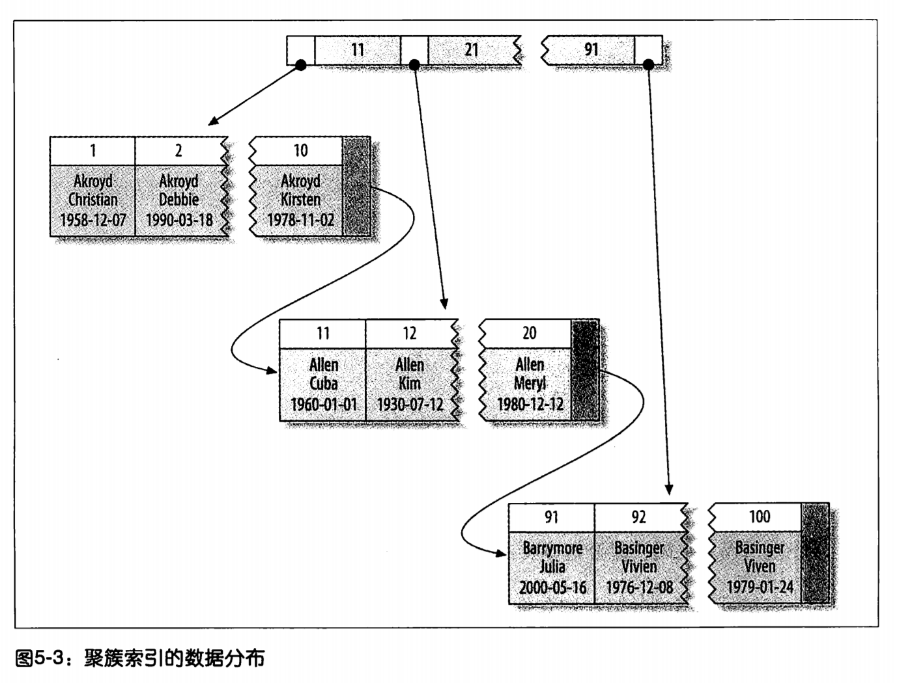

# 1. 独立的列

独立的列是指**索引列不能是表达式的一部分，也不能是函数的参数**。

下面SQL查询都无法使用索引：

```mysql
SELECT id FROM user WHERE id + 1 = 5;
SELECT ... WHERE DAYS(date) - DAYS(col) <= 10;
```

# 2. 前缀索引和索引选择性

> 有时候需要索引很长的字符列，这会让索引变得大且慢。一个策略是使用模拟哈希索引。

可以索引开始的部分字符，提高查询效率，节约索引空间。但会降低索引的选择性。

> **索引的选择性：**
>
> 不重复的索引值(也称基数)和数据表的记录总数(T)的比值。范围在$1/T$到$1$​之间。
>
> 索引的选择行越高则查询的效率越高，因为选择性高的索引可以让MySQL在查找时过滤掉更多的行。
>
> 唯一索引的选择性是1，这是最好的索引选择性，性能也是最好的。

对于`BLOB, TEXT, 或很长的VARCHAR`类型列，必须使用前缀索引。

前缀索引使索引更小、更快的有效方法，但也有缺点：**MySQL无法使用前缀索引做`ORDER BY和GROUP BY`，也无法使用前缀索引做覆盖扫描**。

## 如何寻找最合适的前缀长度？

假设生成下面表：

```mysql
CREATE TABLE sakila.city_demo(city VARCHAR(50) NOT NULL);
INSERT INTO sakila.city_demo(city) SELECT city FROM sakila.city;
-- Repeat the next statement five times:
INSERT INTO sakila.city_demo(city) SELECT city FROM sakila.city_demo;
-- Now randomize the distribution (inefficiently but conveniently):
UPDATE sakila.city_demo
 SET city = (SELECT city FROM sakila.city ORDER BY RAND() LIMIT 1);
```

寻找最常见的城市如下：

```mysql
mysql> SELECT COUNT(*) AS cnt, city
 -> FROM sakila.city_demo GROUP BY city ORDER BY cnt DESC LIMIT 10;
+-----+----------------+
| cnt | city |
+-----+----------------+
| 65 | London |
| 49 | Hiroshima |
| 48 | Teboksary |
| 48 | Pak Kret |
| 48 | Yaound |
| 47 | Tel Aviv-Jaffa |
| 47 | Shimoga |
| 45 | Cabuyao |
| 45 | Callao |
| 45 | Bislig |
+-----+----------------+
```

上面每个city都出现了45~65次。下面查找最频繁出现的城市前缀，先从3个字母开始：

```mysql
mysql> SELECT COUNT(*) AS cnt, LEFT(city, 3) AS pref
 -> FROM sakila.city_demo GROUP BY pref ORDER BY cnt DESC LIMIT 10;
+-----+------+
| cnt | pref |
+-----+------+
| 483 | San |
| 195 | Cha |
| 177 | Tan |
| 167 | Sou |
| 163 | al- |
| 163 | Sal |
| 146 | Shi |
| 136 | Hal |
| 130 | Val |
| 129 | Bat |
+-----+------+
```

每个前缀都比原来城市出现的次数要多，因此唯一前缀比唯一city要少的多。所以要增加前缀长度，直到这个前缀的选择性接近完整列的选择性。下面是长度为7的前缀：

```mysql
mysql> SELECT COUNT(*) AS cnt, LEFT(city, 7) AS pref
 -> FROM sakila.city_demo GROUP BY pref ORDER BY cnt DESC LIMIT 10;
+-----+---------+
| cnt | pref |
+-----+---------+
| 70 | Santiag |
| 68 | San Fel |
| 65 | London |
| 61 | Valle d |
| 49 | Hiroshi |
| 48 | Teboksa |
| 48 | Pak Kre |
| 48 | Yaound |
| 47 | Tel Avi |
| 47 | Shimoga |
+-----+---------+
```

另一种方法：**计算完整列的选择性，并使前缀的选择性接近于完整列的选择性**。

```mysql
mysql> SELECT COUNT(DISTINCT city)/COUNT(*) FROM sakila.city_demo;
+-------------------------------+
| COUNT(DISTINCT city)/COUNT(*) |
+-------------------------------+
| 0.0312 |
+-------------------------------+
```

所以，如果前缀选择性能够接近0.0312，就基本上够用了。

```mysql
mysql> SELECT COUNT(DISTINCT LEFT(city, 3))/COUNT(*) AS sel3,
 -> COUNT(DISTINCT LEFT(city, 4))/COUNT(*) AS sel4,
 -> COUNT(DISTINCT LEFT(city, 5))/COUNT(*) AS sel5,
 -> COUNT(DISTINCT LEFT(city, 6))/COUNT(*) AS sel6,
 -> COUNT(DISTINCT LEFT(city, 7))/COUNT(*) AS sel7
 -> FROM sakila.city_demo;
+--------+--------+--------+--------+--------+
| sel3 | sel4 | sel5 | sel6 | sel7 |
+--------+--------+--------+--------+--------+
| 0.0239 | 0.0293 | 0.0305 | 0.0309 | 0.0310 |
+--------+--------+--------+--------+--------+
```

# 3. 多列索引

选择合适的索引列顺序：**将选择性最高的列放到索引最前列**。

# 4. 聚簇索引

聚簇索引不是单独的索引类型，而是一种数据存储方式。不同引擎的实现细节不同。InnoDB的聚簇索引实际上在同一个结构中保存了B-Tree索引和数据行。

当表有聚簇索引时，它的数据行实际上存放在索引的叶子页中。术语**聚簇**表示数据行和相邻的键值紧凑地存储在一起。因为无法同时把数据行存放在两个不同的地方。

下图叶子页包含了行的全部数据，节点页只包含了索引列。



InnoDB通过主键聚集数据，被索引的列是主键列。

如果没有定义主键，InnoDB会选择一个唯一的非空索引代替。如果没有这样的索引，InnoDB会隐式定义一个主键来作为聚簇索引。InnoDB只聚集在同一个页面中的记录，包含相邻键值的页面可能会相距较远。

## 聚簇索引的优点

- **可以把相关数据保存在一起**。例如实现电子邮箱时，可以根据用户ID来聚集数据，这样只用从磁盘读取少数的数据就能获取某个用户的全部邮件。如果没有使用聚簇索引，每封邮件都可能导致一次磁盘I/O。
- **数据访问更快**。聚簇索引将索引和数据保存在同一个B-Tree中，因此从聚簇索引中获取数据通常比在非聚簇索引中查找更快。

- **使用覆盖索引扫描的查询可以直接使用页结点中的主键值**。

## 聚簇索引的缺点

- 聚簇索引最大限度地提高了I/O密集型应用的性能，但是如果数据全部都放在内存中，则访问的顺序就没有那么重要了，聚簇索引也就没有什么优势。

- 插入速度严重依赖于插入顺序。按照主键的顺序插入是加载数据到InnoDB表中速度最快的方式。但是如果不是按照主键的顺序插入数据，那么在插入完成后最好使用`OPTIMIZE TABLE`命令重新组织一下表。

- 更新聚簇索引列的代价很高，因为会强制InnoDB将每一个被更新的行移动到新的位置。

- 基于聚簇索引的表在插入新行，或者主键被更新导致需要移动时，可能面临**页分裂**的问题。当行的主键值要求必须将这一行插入一个已满的页中时，存储引擎会将该页分裂成两个页面来容纳改行，这就是一次页分裂操作，页分裂会导致表占用更多的磁盘空间。

- 聚簇索引可能导致全表扫描变慢，尤其是行比较稀疏，或者由于页分裂导致数据存储不连续的时候。

- 二级索引(非聚簇索引)可能比较大，因为在二级索引的叶子节点包含了引用行的主键列。

- 二级索引访问需要两次索引查找，而不是一次。
 > 二级索引叶子节点保存的不是指向行的物理位置的指针，而是行的主键值。
    >
    > 这意味着通过二级索引去查找行，存储引擎需要先找到二级索引的叶子节点获得对应的主键值，然后再根据这个值去聚簇索引中查找对应的行。这就进行了两次查找。


# 5. 覆盖索引

不是所有的索引都可以成为覆盖索引。**覆盖索引必须要存储索引列的值，而哈希索引、空间索引和全文索引都不存储索引列的值**，所以MySQL只能使用B-Tree索引做覆盖索引。

# 6. 使用索引扫描来排序

只有当索引的列顺序和ORDER BY子句的顺序完全一致，并且所有列的排序方向（倒叙或正序）都一样时，MySQL才能够使用索引来对结果做排序。如果查询需要关联多张表，则只有当ORDER BY子句引用的字段全部为第一个表时，才能使用索引做排序。ORDER BY子句和查找型查询的限制是一样的：需要满足索引的最左前缀的要求；否则，MySQL都需要执行排序操作，而无法利用索引排序。

有一种情况ORDER BY子句可以不满足索引的最左前缀的要求，就是前导列为常量的时候。如果WHERE子句或者JOIN子句中对这些列指定了常量。

