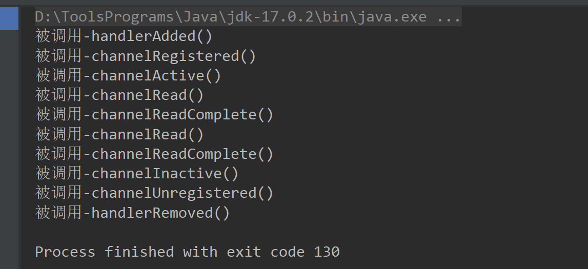

运行以下程序，可以看到ChannelHandler的方法回调顺序：

```java
public class InHandlerDemo extends ChannelInboundHandlerAdapter {
    
    @Override
    public void handlerAdded(ChannelHandlerContext ctx) throws Exception {
        System.out.println("被调用-handlerAdded()");
        super.handlerAdded(ctx);
    }

    @Override
    public void handlerRemoved(ChannelHandlerContext ctx) throws Exception {
        System.out.println("被调用-handlerRemoved()");
        super.handlerRemoved(ctx);
    }

    @Override
    public void channelRegistered(ChannelHandlerContext ctx) throws Exception {
        System.out.println("被调用-channelRegistered()");
        super.channelRegistered(ctx);
    }

    @Override
    public void channelUnregistered(ChannelHandlerContext ctx) throws Exception {
        System.out.println("被调用-channelUnregistered()");
        super.channelUnregistered(ctx);
    }

    @Override
    public void channelActive(ChannelHandlerContext ctx) throws Exception {
        System.out.println("被调用-channelActive()");
        super.channelActive(ctx);
    }

    @Override
    public void channelInactive(ChannelHandlerContext ctx) throws Exception {
        System.out.println("被调用-channelInactive()");
        super.channelInactive(ctx);
    }

    @Override
    public void channelRead(ChannelHandlerContext ctx, Object msg) throws Exception {
        System.out.println("被调用-channelRead()");
        super.channelRead(ctx, msg);
    }

    @Override
    public void channelReadComplete(ChannelHandlerContext ctx) throws Exception {
        System.out.println("被调用-channelReadComplete()");
        super.channelReadComplete(ctx);
    }
}

public class NettyTest {
    @Test
    public void inHandlerDemoTest() {
        final InHandlerDemo inHandlerDemo = new InHandlerDemo();

        ChannelInitializer initializer = new ChannelInitializer() {
            @Override
            protected void initChannel(Channel ch) throws Exception {
                ch.pipeline().addLast(inHandlerDemo);
            }
        };

        EmbeddedChannel channel = new EmbeddedChannel(initializer);
        ByteBuf buf = Unpooled.buffer();
        buf.writeInt(11);
        channel.writeInbound(buf);
        channel.flush();
        channel.writeInbound(buf);
        channel.flush();
        
        channel.close();
        
        try {
            Thread.sleep(Integer.MAX_VALUE);
        } catch(Exception e) {
            e.printStackTrace();
        }
    }
}
```



除了`channelRead()`和`channelReadComplete()`两个入站回调方法外，其余六个方法介绍如下：

- `handlerAdded()`：当业务处理器被加入到流水线后，此方法被回调。即在完成`socketChannel.pipeline().addLast(new NettyDiscardHandler());`语句后回调该方法。
- `channelRegistered()`：当通道成功绑定一个`NioEventLoop`线程后，会通过流水线回调所有业务处理器的`channelRegistered()`方法。
- `channelActive()`：当通道激活后，会通过流水线回调所有业务处理器的`channelActive()`方法。通道激活成功指的是，所有业务处理器添加、注册的异步任务完成，并且`NioEventLoop`线程绑定的异步任务完成。
- `channelInactive()`：当通道的底层连接已经不是ESTABLISH状态，或者底层连接已经关闭时，会首先回调所有业务处理器的`channelInactive()`方法。
- `channelUnregistered()`：通道和`NioEventLoop`线程接触绑定，移除掉对这条通道的事件处理后，回调所有业务处理器的`channelUnregistered()`方法；
- `channelRemoved()`方法：最后，netty会移除通道上所有的业务处理器，并且回调所有的业务处理器的`handlerRemoved()`方法。

