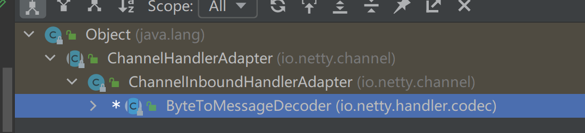
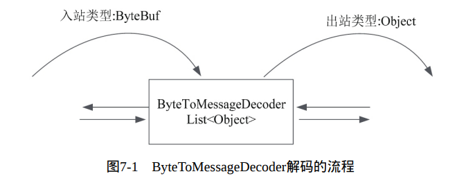

## 1. ByteToMessageDecoder解码器

是一个抽象类，仅提供了一个框架，继承关系如下：



解码流程：



**实现一个自己的ByteBuf解码器：**

1. 继承ByteToMessageDecoder抽象类
2. 实现基类的decode抽象方法。将ByteBuf到POJO解码的逻辑写入此方法。将ByteBuf二进制数据，解码成一个个的Java对象。
3. 在子类的decode方法中，需要将解码后的Java POJO对象，放入decode的List< Object >实参中，一个个的传递到下一站的Inbound入站处理器。

```java
public class Byte2IntegerDecoder extends ByteToMessageDecoder {
    @Override
    protected void decode(ChannelHandlerContext ctx, ByteBuf in, List<Object> out) throws Exception {
        while (in.readableBytes() >= 4) {
            int i = in.readInt();
            System.out.println("解码出一个整数: " + i);
            out.add(i);
        }
    }
}

public class IntegerProcessHandler extends ChannelInboundHandlerAdapter {
    @Override
    public void channelRead(ChannelHandlerContext context, Object msg) throws Exception {
        Integer integer = (Integer) msg;
        System.out.println("打印出一个整数: " + integer);
    }
}

@Test
public void byteDecoderTest() {
    ChannelInitializer initializer = new ChannelInitializer() {
        @Override
        protected void initChannel(Channel ch) throws Exception {
            // 入站处理器，从前向后的顺序执行
            ch.pipeline().addLast(new Byte2IntegerDecoder());
            ch.pipeline().addLast(new IntegerProcessHandler());
        }
    };

    EmbeddedChannel channel = new EmbeddedChannel(initializer);
    for (int i = 0; i < 100; i++) {
        ByteBuf buf = Unpooled.buffer();
        buf.writeInt(i);
        channel.writeInbound(buf);
    }

    try {
        Thread.sleep(Integer.MAX_VALUE);
    } catch (Exception e) {
        e.printStackTrace();
    }
}
```

## 2. ReplayingDecoder解码器

上面使用Byte2IntegerDecoder解码器会有一个问题：需要对ByteBuf长度进行检查，如果有足够的字节，才进行整数的读取。

使用ReplayingDecoder解码器可以省去长度的判断。

ReplayingDecoder类是ByteToMessageDecoder的子类。作用如下：

- 在读取ByteBuf缓冲区的数据之前，需要检查缓冲区是否有足够的字节。
- 若BytrBuf中有足够的字节，则会正常读取。否则，会停止解码。

原理如下：

在其内部，定义了一个新的二进制缓冲区类，对ByteBuf缓冲区进行了装饰，类名为ReplayingDecoderByteBuf。特点是：在缓冲区真正读取数据之前，首先进行长度的判断，如果长度合格，则读取数据；否则，抛出ReplayError。ReplayingDecoder捕获到ReplayError后，会留着数据，等待下一次IO事件到来时再获取。

**ReplayingDecoderByteBuf继承了ByteBuf，所以该解码器实际上是把ByteBuf里面的数据转换成了ReplayingDecoderByteBuf，增强了对二进制数据的判断，长度不足就抛出异常**

可以通过ReplayingDecoder分包ByteBuf，但也有缺点：

当ByteBuf中长度不够时，ReplayingDecoder会捕获异常，这时会把ByteBuf中的读指针还原到之前的读断点指针，然后结束这次解析操作，这需要消耗CPU。

### 2.1 整数的分包传输

```java
public class IntegerAddDecoder extends ReplayingDecoder<IntegerAddDecoder.Status> {
    
    enum Status {
        PARSE_1, PARSE_2
    }
    
    private Integer first;
    private Integer second;
    
    public IntegerAddDecoder() {
        //构造函数中，需要初始化父类的state 属性，表示当前阶段
        super(Status.PARSE_1);
    }

    @Override
    protected void decode(ChannelHandlerContext ctx, ByteBuf in, List<Object> out) throws Exception {
        switch (state()) {
            case PARSE_1:
                // 从ByteBuf中读取数据
                first = in.readInt();
                System.out.println("first = " + first);
                // 进入第二步，设置读指针断点为当前读取位置
                checkpoint(Status.PARSE_2);
                break;
            case PARSE_2:
                second = in.readInt();
                System.out.println("second = " + second);
                Integer sum = first + second;
                System.out.println("sum = " + sum);
                out.add(sum);
                checkpoint(Status.PARSE_1);
                break;
        }
    }

}


@Test
public void testIntegerAddDecoder() {
    ChannelInitializer i = new ChannelInitializer<EmbeddedChannel>() {
        protected void initChannel(EmbeddedChannel ch) {
            // 先解码
            ch.pipeline().addLast(new IntegerAddDecoder());
            // 再输出
            ch.pipeline().addLast(new IntegerProcessHandler());
        }
    };
    EmbeddedChannel channel = new EmbeddedChannel(i);

    for (int j = 0; j < 100; j++) {
        ByteBuf buf = Unpooled.buffer();
        buf.writeInt(j);
        channel.writeInbound(buf);
    }

    try {
        Thread.sleep(Integer.MAX_VALUE);
    } catch (InterruptedException e) {
        e.printStackTrace();
    }
}
// 可以看到，最终输出的只有sum值，输入的数字只有经历一个完整Status才会输出
```

`checkpoint(status)`方法的作用：

- 设置state属性的值，更新当前的状态
- 设置读断点指针

读断点指针保存着装饰器内部ReplayingDecoderBuffer成员的起始读指针。当读数据时，如果可读数据不够，ReplayingDecoderBuffer在抛出ReplayError异常之前，还会把读指针的值还原到之前的checkpoint方法设置的读断点指针。所以，在ReplayingDecoder下一次读取时，还会从之前设置的断点位置开始。

所以ReplayingDecoder类型和所有子类都需要保存状态信息，都有状态的，都不适合在不同的通道之间共享。

### 2.2 字符串的分包传输

```java
public class StringReplayDecoder extends ReplayingDecoder<StringReplayDecoder.Status> {
    enum Status {
        PARSE_1, PARSE_2
    }

    private int length;
    private byte[] inBytes;

    public StringReplayDecoder() {
        //构造函数中，需要初始化父类的state 属性，表示当前阶段
        super(Status.PARSE_1);
    }

    @Override
    protected void decode(ChannelHandlerContext ctx, ByteBuf in,
                          List<Object> out) throws Exception {


        switch (state()) {
            case PARSE_1:
                //第一步，从装饰器ByteBuf 中读取长度
                length = in.readInt();
                inBytes = new byte[length];
                // 进入第二步，读取内容
                // 并且设置“读指针断点”为当前的读取位置
                checkpoint(Status.PARSE_2);
                break;
            case PARSE_2:
                //第二步，从装饰器ByteBuf 中读取内容数组
                in.readBytes(inBytes, 0, length);
                out.add(new String(inBytes, StandardCharsets.UTF_8));
                // 第二步解析成功，
                // 进入第一步，读取下一个字符串的长度
                // 并且设置“读指针断点”为当前的读取位置
                checkpoint(Status.PARSE_1);
                break;
            default:
                break;
        }

    }
}

public class StringProcessHandler extends ChannelInboundHandlerAdapter {
    @Override
    public void channelRead(ChannelHandlerContext ctx, Object msg) throws Exception {
        String s = (String) msg;
        System.out.println("打印: " + s);
    }
}

@Test
public void testStringReplayDecoder() {
    ChannelInitializer i = new ChannelInitializer<EmbeddedChannel>() {
        protected void initChannel(EmbeddedChannel ch) {
            ch.pipeline().addLast(new StringReplayDecoder());
            ch.pipeline().addLast(new StringProcessHandler());
        }
    };
    EmbeddedChannel channel = new EmbeddedChannel(i);
    byte[] bytes = content.getBytes(StandardCharsets.UTF_8);
    for (int j = 0; j < 100; j++) {
        //1-3之间的随机数
        Random randoms = new Random();
        // 复制几次
        int random = Math.abs(randoms.nextInt(3)) + 1;
        ByteBuf buf = Unpooled.buffer();
        // 总长度
        buf.writeInt(bytes.length * random);
        for (int k = 0; k < random; k++) {
            buf.writeBytes(bytes);
        }
        channel.writeInbound(buf);
    }
    try {
        Thread.sleep(Integer.MAX_VALUE);
    } catch (InterruptedException e) {
        e.printStackTrace();
    }
}
```

## 3. MessageToMessageDecoder解码器

作用：可以将一种POJO对象解码成另一种POJO对象。

需要继承MessageToMessageDecoder< T >，明确泛型T，这个实参的作用就是指定**入站消息**的Java POJO类型。

```java
// 一个简单的实例
public class Integer2StringDecoder extends MessageToMessageDecoder<Integer> {

    @Override
    protected void decode(ChannelHandlerContext ctx, Integer msg, List<Object> out) throws Exception {
        // 实参为Integer，明确了入站类型为Integer，然后在解码时将Integer转为字符串，发送给下一个入站处理器
        out.add(String.valueOf(msg));
    }
}

@Test
public void testIntegerToStringDecoder() {
    ChannelInitializer i = new ChannelInitializer<EmbeddedChannel>() {
        protected void initChannel(EmbeddedChannel ch) {
            // 二进制到Integer处理器
            ch.pipeline().addLast(new Byte2IntegerDecoder());
            // Integer到String处理器
            ch.pipeline().addLast(new Integer2StringDecoder());
            ch.pipeline().addLast(new StringProcessHandler());
        }
    };
    EmbeddedChannel channel = new EmbeddedChannel(i);

    for (int j = 0; j < 100; j++) {
        ByteBuf buf = Unpooled.buffer();
        buf.writeInt(j);
        channel.writeInbound(buf);
    }

    try {
        Thread.sleep(Integer.MAX_VALUE);
    } catch (InterruptedException e) {
        e.printStackTrace();
    }
}
```

