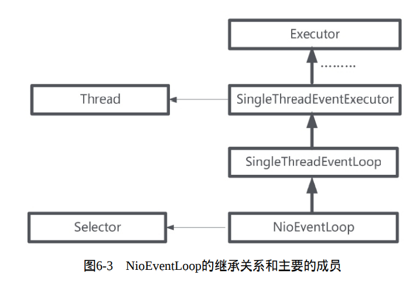
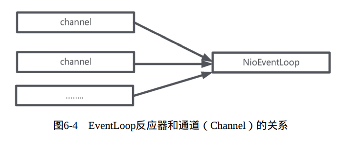
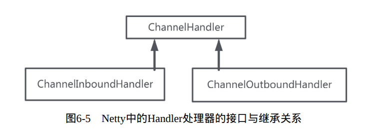
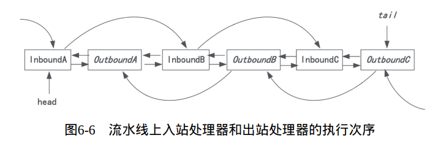

## 一、Netty中的Channel通道组件

- NioSocketChannel：异步非阻塞TCP Socket传输通道
- NioServerSocketChannel：异步非阻塞TCP Socket服务器监听通道
- NioDatagramChannel：异步非阻塞的UDP传输通道
- NioSctpChannel：异步非阻塞Sctp传输通道
- NioSctpServerChannel：异步非阻塞Sctp服务器监听通道
- OioSocketChannel：同步阻塞式TCP Socket传输通道
- OioServerSocketChannel：同步阻塞式TCP Socket服务器端监听通道

- OioDatagramChannel：同步阻塞式UDP传输通道
- OioSctpChannel：同步阻塞式Sctp传输通道
- OioSctpServerChannel：同步阻塞式Sctp服务器端监听通道

## 二、Netty中的Reactor反应器模式

Netty的反应器类为：NioEventLoop。该类绑定了两个重要的Java成员属性：一个是Thread线程类的成员；一个是Java NIO选择器的成员属性。

一个NioEventLoop拥有一个Thread线程，负责一个Java NIO Selector选择器的IO事件轮询。

在Netty中，一个EventLoopNetty反应器和NettyChannel通道是一对多的关系：一个反应器可以注册成千上万的通道。

## 三、Netty中Handler处理器

在Netty中，EventLoop反应器内部有一个Java NIO选择器成员执行以上事件的查询，然后进行对应的事件分发。

Netty自己的Handler处理器分为两大类：

- `ChannelInboundHandler`通道入站处理器
- `ChannelOutboundHandler`通道出站处理器

二者都继承了ChannelHandler处理器接口。

#### 3.1 入站处理

Netty中 入站处理，是从底层触发，由Netty通过层层传递，调用`ChannelInboundHandler`通道入站处理器进行的某个处理。

以底层Java NIO中的OP_READ输入事件为例：在通道中发生了OP_READ事件后，会被EventLoop查询到，然后分发给ChannelInboundHandler通道入站处理器，调用它的入站处理的方法read。在ChannelInboundHandler通道入站处理器内部的read方法可以从通道中读取数据。

Netty入站处理：从通道到ChannelInboundHandler通道入站处理器。

#### 3.2 出站处理

Netty出站处理，是从ChannelOutboundHandler通道出站处理器到通道的某次IO操作。例如，在应用程序完成业务处理后，可以通过ChannelOutboundHandler通道出站处理器将处理的结果写入底层通道。

上面两个处理器都有自己的默认实现接口：

- ChannelInboundHandler的默认实现为ChannelInboundHandlerAdapter，叫做通道入站处理适配器。
- ChannelOutboundHandler的默认实现为ChannelOutboundHandlerAdapter，叫做通道出站处理适配器。

​	

## 四、Netty的流水线 Pipeline

Netty反应器中各个组件的关系：

- 反应器(或者子反应器)和通道之间是一对多的关系；一个反应器可以查询到很多个通道的IO事件。
- 通道和Handler处理器实例之间，是多对多的关系：一个通道的IO事件被多个Handler实例处理；一个Handler处理器实例也能绑定到很多的通道，处理多个通道的IO事件

Netty设计了一个特殊组件ChannelPipeline(通道流水线)，将绑定到一个通道的多个Handler处理器实例串在一起，形成一条流水线。其数据结构是一个双向链表，所有的Handler处理器实例被包装成了双向链表的节点，被加入到ChannelPipeline中。

**一个Netty通道拥有一条Handler处理器流水线，成员的名字叫做pipeline**

以入站为例：

每一个来自通道的IO事件，都会进入一次ChannelPipeline通道流水线。在进入第一个Handler处理器后，这个IO事件将按照既定的从前往后的次序，在流水线上不断地向后流动，流向下一个Handler处理器。

在向后流动的过程中，会出现3中情况：

- 如果后面还有其他Handler入站处理器，那么IO事件可以交给下一个Handler处理器，向后流动
- 如果后面没有其他Handler入站处理器，这就意味这这个IO事件在此流水线中的处理要结束了
- 如果在流水线中间需要终止流动，可以选择不将IO事件交给下一个Handler处理器，流水线的执行也被终止了

Netty规定：入站处理器的Handler执行次序，是从前到后；出站处理器Handler的执行次序，是从后向前。

入站的IO操作只会且只能从Inbound入站处理器类型的Handler流过；出站的IO操作只会且只能从Outbound出站处理器类型的Handler流过。

