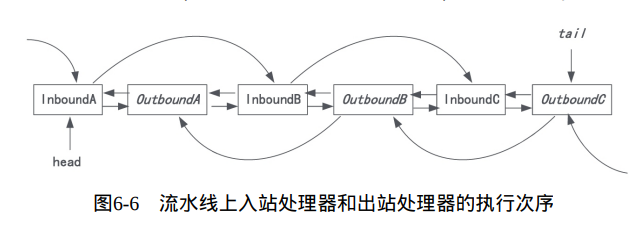

## 一.. I/O网络模型

#### 1. 同步阻塞I/O (BIO)

在阻塞IO模型中，Java应用程序从IO系统调用开始，直到系统调用返回，在这段时间内，Java进程是阻塞的，返回成功后，应用程序才开始处理用户空间的缓存区数据。


**特点**：

- 一个线程维护一个IO连接
- 在并发量高的情况下，内存、线程切换开销非常大
- 连接建立后，如果当前线程暂时没有数据可读，则线程就阻塞在 Read 操作上，造成线程资源浪费。

#### 2. 同步非阻塞I/O (NIO)

> Netty是对java的NIO进行了封装，解决了一系列Java NIO的问题

在非阻塞IO模型中，会出现下面两种情况：

- 在内核缓冲区中没有数据的情况下，系统调用会立即返回一个调用失败的信息。
- 在内核缓冲区有数据的情况下，是阻塞的，直到数据从内核缓冲区复制到用户进程缓冲。复制完成后，系统调用返回成功，应用进程开始处理用户空间的缓存数据


应用程序需要不断进行IO系统调用，轮询数据是否已经准备好，如果没有准备好，就继续轮询，直到完成IO系统调用为止。

优点：每次发起IO调用，在内核等待数据过程中可以立即返回，用户线程不会阻塞，实时性好

缺点：不但轮询内核，会占用大量CPU时间

#### 3. I/O多路复用模型

使用一个进程监视多个文件描述符（阻塞在select操作上），一旦某个描述符就绪，内核就将就绪的状态返回给应用程序。随后，应用程序根据就绪的状态，进行相应的IO系统调用。


优点：一个选择器查询线程可以同时处理成千上万个连接，系统不必要创建大量线程，也不必要维护这些线程，减小系统开销

缺点：本质上，select/epoll调用是阻塞的，属于同步IO，都需要在读写时间就绪后，由系统调用本身负责进行读写，这个过程是阻塞的

#### 4. 信号驱动I/O模型

通过系统执行一个信号处理函数（调用就立即返回，进程继续工作，是非阻塞的）。当数据准备就绪时，为该进程生成一个信号，通过信号回调通知应用程序来读取数据，并通知主函数处理数据。


#### 5. 异步IO模型 (AIO)

用户线程通过系统调用，向内核注册某个IO操作。内核在整个IO操作完成后（包含将数据从内核复制到用户空间），通知用户程序，用户执行后续业务操作。


特点：在内核等待数据和复制数据这两个阶段，用户线程都不是阻塞的，用户线程需要接收内核的IO操作完成的事件，或者用户线程需要注册一个IO操作完成的回调函数。

**异步IO模型AIO和信号驱动I/O的区别：**

> 信号驱动I/O右内核通知我们何时可以开始一个I/O操作；异步I/O由内核通知我们I/O操作何时完成。

## 二.. Reactor反应器模式

> Nginx、Redis、Netty都是基于反应器模式。

反应器模式两大角色：

- **反应器线程**：负责响应I/O事件，并且分发到Handlers处理器

- **Handlers处理器**： 非阻塞执行处理业务逻辑

> Doug Lea著名的文章：http://gee.cs.oswego.edu/dl/cpjslides/nio.pdf

#### 1. 多线程OIO致命缺陷

最开始网络程序调用都是使用一个while循环，不停的检测端口是否有新的链接：

```java
while (true) {
    socket = accept();  // 阻塞，接收链接
    handle(socket);     // 读取数据、业务处理、写入结果
}
```

**产生的严重问题**：如果前一个网络连接的handle没有处理完，后面的连接请求就没办法接收，就被阻塞，那么服务器吞吐量就会很低。

****

为了解决上面问题，产生了一个经典模式：**一个线程处理一个连接**。每个线程都独自负责自己的输入和输出。

**优点**：解决了while循环的新连接被阻塞的问题，提高服务吞吐量。

**缺点**：对于大量连接，会耗费大量线程资源，在高并发场景下很致命。因为线程本来就是比较昂贵的系统资源，并且线程创建、销毁、切换都要代价。

> **一个线程同时处理多个socket连接行不行？**
>
> 可以但是没有用。因为传统IO是阻塞的，同一时刻，一个线程只能处理一个socket。

****

#### 2. 单线程Reactor反应器模式

> 为了解决多线程IOI产生的问题，可以使用反应器模式对线程的数量进行控制。


**概念**： Reactor反应器和Handlers处理器处于同一个线程中执行， 这是最简单的反应器模式。

**缺点**：一旦某个Handler被阻塞，会导致其他所有的Handler都不能执行（可能包含acceptor处理器），这样就会导致服务不可用

#### 3. 多线程Reactor反应器模式


一个专门的NIO线程acceptor监听服务端，接收TCP请求。网络I/O操作读写由一个线程池负责，一个线程负责处理一个IO操作。

**缺点**：高并发下单独一个accept线程性能不足。

#### 4. Netty线程模型（主从Reactor线程模型）

基于主从 Reactors 多线程模型（如下图）做了一定的修改，其中主从 Reactor 多线程模型有多个 Reactor：


- MainReactor 负责客户端的连接请求（是个线程池，而不是单独一个线程），建立一个链路，成功后将请求转交给 SubReactor。
- SubReactor 负责相应通道的 IO 读写请求。
- 非 IO 请求（具体逻辑处理）的任务则会直接写入队列，等待 worker threads 进行处理

#### 5. 反应器模式中IO事件处理流程


**第一步**：通道注册。一个IO事件，一定属于某个通道。如果要查询事件，首先要讲通道注册到选择器，这样IO事件就可以通过选择器向下分发。

**第二步**：查询选择。一个反应器会负责一个线程，不断轮询查询选择器中的IO事件。

**第三步**：事件分发。查询到IO事件后，分发给IO事件绑定的Handler业务处理器。

**第四步**：完成IO操作和业务处理，有Handler处理器完成。


## 三.. Netty中的Channel通道组件

Netty对Channel进行了自己的封装，对每种通信连接协议，都实现了自己的通道。


## 四.. Netty中的Reactor反应器

NioEventLoop类下面有两个java成员属性(如下图)，可以看出和前面思想一致：一个反应器拥有一个线程，负责一个Java NIO选择器的IO事件轮询。


## 五.. Netty中的Handler处理器


Netty入站处理（以OP_READ事件为例）：在通道发生OP_READ事件后，会被反应器EventLoop查询到，然后分发给通道入站处理器，调用read()方法读取通道里面的数据。


## 六.. Netty中的Pipeline流水线


**通道和Handler处理器是怎么绑定的？**

组件ChannelPipeline将绑定到一个通道的多个Handler处理器串在一起，形成一条流水线。**一个Netty通道有一条Handler处理器流水线**

入站处理器Handler执行次序：从前到后。出站处理器Handler执行次序：从后向前。出站入站的IO操作只会执行对应类型的Handler，



**入站流水线示例：**

```java
/**
 * 入站流水线
 **/
public class InPipeline {
    public static class SimpleInHandlerA extends ChannelInboundHandlerAdapter {
        @Override
        public void channelRead(ChannelHandlerContext ctx, Object msg) throws Exception {
            System.out.println("入站处理器 A: 被回调 ");
            super.channelRead(ctx, msg);
            // 移除该处理器
            ctx.pipeline().remove(this);
        }
    }
    public static class SimpleInHandlerB extends ChannelInboundHandlerAdapter {
        @Override
        public void channelRead(ChannelHandlerContext ctx, Object msg) throws Exception {
            System.out.println("入站处理器 B: 被回调 ");
            super.channelRead(ctx, msg);
        }
    }
    public static class SimpleInHandlerC extends ChannelInboundHandlerAdapter {
        @Override
        public void channelRead(ChannelHandlerContext ctx, Object msg) throws Exception {
            System.out.println("入站处理器 C: 被回调 ");
            super.channelRead(ctx, msg);
        }
    }
    
}

public void testPipelineInBound() {
    ChannelInitializer i = new ChannelInitializer<EmbeddedChannel>() {
        protected void initChannel(EmbeddedChannel ch) {
            ch.pipeline().addLast(new InPipeline.SimpleInHandlerA());
            ch.pipeline().addLast(new InPipeline.SimpleInHandlerB());
            ch.pipeline().addLast(new InPipeline.SimpleInHandlerC());

        }
    };
    EmbeddedChannel channel = new EmbeddedChannel(i);
    ByteBuf buf = Unpooled.buffer();
    buf.writeInt(1);
    //向通道写一个入站报文
    channel.writeInbound(buf);
    try {
        Thread.sleep(Integer.MAX_VALUE);
    } catch (InterruptedException e) {
        e.printStackTrace();
    }
}

/** 输出：
 * 入站处理器 A: 被回调 
 * 入站处理器 B: 被回调 
 * 入站处理器 C: 被回调 
 */
```

**出站流水线示例：**

```java
public class OutPipeline {

    public static class SimpleOutHandlerA extends ChannelOutboundHandlerAdapter {
        @Override
        public void write(ChannelHandlerContext ctx, Object msg, ChannelPromise promise) throws Exception {
            System.out.println("出站处理器 A: 被回调" );
            super.write(ctx, msg, promise);
        }
    }
    public static class SimpleOutHandlerB extends ChannelOutboundHandlerAdapter {
        @Override
        public void write(ChannelHandlerContext ctx, Object msg, ChannelPromise promise) throws Exception {
            System.out.println("出站处理器 B: 被回调" );
            super.write(ctx, msg, promise);
        }
    }
    public static class SimpleOutHandlerC extends ChannelOutboundHandlerAdapter {
        @Override
        public void write(ChannelHandlerContext ctx, Object msg, ChannelPromise promise) throws Exception {
            System.out.println("出站处理器 C: 被回调" );
            super.write(ctx, msg, promise);
        }
    }
}

public void testPipelineOutBound() {
    ChannelInitializer i = new ChannelInitializer<EmbeddedChannel>() {
        protected void initChannel(EmbeddedChannel ch) {
            ch.pipeline().addLast(new OutPipeline.SimpleOutHandlerA());
            ch.pipeline().addLast(new OutPipeline.SimpleOutHandlerB());
            ch.pipeline().addLast(new OutPipeline.SimpleOutHandlerC());
        }
    };
    EmbeddedChannel channel = new EmbeddedChannel(i);
    ByteBuf buf = Unpooled.buffer();
    buf.writeInt(1);
    //向通道写一个出站报文
    channel.writeOutbound(buf);
    try {
        Thread.sleep(Integer.MAX_VALUE);
    } catch (InterruptedException e) {
        e.printStackTrace();
    }
}

/** 输出：
 * 出站处理器 C: 被回调
 * 出站处理器 B: 被回调
 * 出站处理器 A: 被回调
 */
```

## 七.. Netty的高性能

### 7.1 零拷贝

#### 1. 堆外直接内存：

> Netty接收和发送ByteBuffer采用DIRECT BUFFERS，使用堆外直接内存进行Socket读写，不需要进行字节缓冲区的二次拷贝。如果使用传统堆内存（HEAP BUFFERS）进行Socket读写，JVM会将堆内存Buffer拷贝一份到直接内存中，然后再写入Socket中。相对于堆外直接内存，消息在发送过程中多了一次缓冲区的内存拷贝。

在 JVM 内部执行 I/O 操作时，必须将数据拷贝到堆外内存，才能执行系统调用。主要有两点原因：

1. 操作系统并不感知 JVM 的堆内存，而且 JVM 的内存布局与操作系统所分配的是不一样的，操作系统并不会按照 JVM 的行为来读写数据。

2. 同一个对象的内存地址随着 JVM GC 的执行可能会随时发生变化，例如 JVM GC 的过程中会通过压缩来减少内存碎片

Netty 在进行 I/O 操作时都是使用的堆外内存，可以避免数据从 JVM 堆内存到堆外内存的拷贝。

#### 2. CompositeByteBuf 类


CompositeByteBuf 可以理解为一个虚拟的 Buffer 对象，它是由多个 ByteBuf 组合而成，但是在 CompositeByteBuf 内部**保存着每个 ByteBuf 的引用关系，从逻辑上构成一个整体**。

**示例**：像 HTTP 协议数据可以分为**头部信息 header**和**消息体数据 body**，分别存在两个不同的 ByteBuf 中，通常我们需要将两个 ByteBuf 合并成一个完整的协议数据进行发送，可以使用如下方式完成：

```java
// 初始化
ByteBuf httpBuf = Unpooled.buffer(header.readableBytes() + body.readableBytes());

// 拷贝一次
httpBuf.writeBytes(header);

// 拷贝第二次
httpBuf.writeBytes(body);
```

按照上面代码，想实现 header 和 body 这两个 ByteBuf 的合并，需要先初始化一个新的 httpBuf，然后再将 header 和 body 分别拷贝到新的 httpBuf。合并过程中涉及两次 CPU 拷贝，这非常浪费性能。如果使用 CompositeByteBuf 如何实现类似的需求呢？如下所示：

```java
CompositeByteBuf httpBuf = Unpooled.compositeBuffer();

httpBuf.addComponents(true, header, body);
```

****

CompositeByteBuf 通过调用 addComponents() 方法来添加多个 ByteBuf，但是底层的 byte 数组是复用的，不会发生内存拷贝。但对于用户来说，它可以当作一个整体进行操作。下面是CompositeByteBuf 内部结构：


```java
private static final class Component {

    final ByteBuf srcBuf; // 原始的 ByteBuf

    final ByteBuf buf; // srcBuf 去除包装之后的 ByteBuf

    int srcAdjustment; // CompositeByteBuf 的起始索引相对于 srcBuf 读索引的偏移

    int adjustment; // CompositeByteBuf 的起始索引相对于 buf 的读索引的偏移

    int offset; // Component 相对于 CompositeByteBuf 的起始索引位置

    int endOffset; // Component 相对于 CompositeByteBuf 的结束索引位置

    // 省略其他代码
}
```

CompositeByteBuf 内部维护了一个 Components 数组。在每个 Component 中存放着不同的 ByteBuf，各个 ByteBuf 独立维护自己的读写索引，而 CompositeByteBuf 自身也会单独维护一个读写索引。

****

以 HTTP 协议中 header 和 body 为示例，通过一张图来描述 CompositeByteBuf 组合后其中 Component 的布局情况，如下所示：


从图中可以看出，header 和 body 分别对应两个 ByteBuf，假设 ByteBuf 的内容分别为 "header" 和 "body"，那么 header ByteBuf 中 offset~endOffset 为 0~6，body ByteBuf 对应的 offset~endOffset 为 6~10。由此可见，Component 中的 offset 和 endOffset 可以表示当前 ByteBuf 可以读取的范围，通过 offset 和 endOffset 可以将每一个 Component 所对应的 ByteBuf 连接起来，形成一个逻辑整体。

此外 Component 中 srcAdjustment 和 adjustment 表示 CompositeByteBuf 起始索引相对于 ByteBuf 读索引的偏移。初始 adjustment = readIndex - offset，这样通过 CompositeByteBuf 的起始索引就可以直接定位到 Component 中 ByteBuf 的读索引位置。

当 header ByteBuf 读取 1 个字节，body ByteBuf 读取 2 个字节，此时每个 Component 的属性又会发生什么变化呢？如下图所示：


#### 3. Unpooled.wrappedBuffer 操作

Unpooled.wrappedBuffer 是创建 CompositeByteBuf 对象的一种推荐做法。

Unpooled.wrappedBuffer 方法可以将不同的数据源的一个或者多个数据包装成一个大的 ByteBuf 对象，其中数据源的类型包括 byte[]、ByteBuf、ByteBuffer。包装的过程中不会发生数据拷贝操作，包装后生成的 ByteBuf 对象和原始 ByteBuf 对象是共享底层的 byte 数组。

#### 4. ByteBuf.slice 操作

ByteBuf.slice 和 Unpooled.wrappedBuffer 的逻辑正好相反，ByteBuf.slice 是将一个 ByteBuf 对象切分成多个共享同一个底层存储的 ByteBuf 对象。

ByteBuf 提供了两个 slice 切分方法：

```java
public ByteBuf slice();

public ByteBuf slice(int index, int length);
```

通过 slice 切分后都会返回一个新的 ByteBuf 对象，而且新的对象有自己独立的 readerIndex、writerIndex 索引，如下图所示。由于新的 ByteBuf 对象与原始的 ByteBuf 对象数据是共享的，所以通过新的 ByteBuf 对象进行数据操作也会对原始 ByteBuf 对象生效。


#### 5. 文件传输 FileRegion

FileRegion 的默认实现类是 `DefaultFileRegion`，通过 `DefaultFileRegion `将文件内容写入到 NioSocketChannel.

```java
public class DefaultFileRegion extends AbstractReferenceCounted implements FileRegion {
    private final File f; // 传输的文件
    private final long position; // 文件的起始位置
    private final long count; // 传输的字节数
    private long transferred; // 已经写入的字节数
    private FileChannel file; // 文件对应的 FileChannel, java的nio
    
    @Override
    public long transferTo(WritableByteChannel target, long position) throws IOException {
        long count = this.count - position;
        if (count < 0 || position < 0) {
            throw new IllegalArgumentException(
                    "position out of range: " + position +
                   " (expected: 0 - " + (this.count - 1) + ')');
        }
        if (count == 0) {
            return 0L;
        }
        if (refCnt() == 0) {
           throw new IllegalReferenceCountException(0);
        }
        open();
        long written = file.transferTo(this.position + position, count, target);
        if (written > 0) {
            transferred += written;
        } else if (written == 0) {
            validate(this, position);
        }
        return written;
    }
    // 省略其他代码

}
```

从源码可以看出，**FileRegion 其实就是对 FileChannel 的包装**，并没有什么特殊操作，底层使用的是 JDK NIO 中的 FileChannel#transferTo() 方法实现文件传输，所以 FileRegion 是操作系统级别的零拷贝，对于传输大文件会很有帮助。

### 7.2 Netty的FastThreadLocal比ThreadLocal快在哪？

#### 1. ThreadLocal原理简单介绍

> ThreadLocal 可以实现变量在多线程之间隔离，或者在同线程内的类和方法中共享。

```java
package concurent;

/**
 * @author Floweryu
 * @date 2022/11/20 23:53
 */
public class ThreadLocalTest {
    private static final ThreadLocal<String> THREAD_NAME_LOCAL = ThreadLocal.withInitial(() -> Thread.currentThread().getName()); // 存放线程名
    private static final ThreadLocal<TradeOrder> TRADE_THREAD_LOCAL = new ThreadLocal<>();	// 存放数据
    public static void main(String[] args) {
        for (int i = 0; i < 2; i++) {  
            int tradeId = i;
            new Thread(() -> {
                TradeOrder tradeOrder = new TradeOrder(tradeId, tradeId % 2 == 0 ? "已支付" : "未支付");
                TRADE_THREAD_LOCAL.set(tradeOrder);
                System.out.println("threadName: " + THREAD_NAME_LOCAL.get());
                System.out.println("tradeOrder info：" + TRADE_THREAD_LOCAL.get());
            }, "thread-" + i).start(); 
        }
    }
    
    static class TradeOrder {  
        long id; 
        String status;
        public TradeOrder(int id, String status) {     
            this.id = id;
            this.status = status; 
        }   
        @Override
        public String toString() {      
            return "id=" + id + ", status=" + status;
        }
    }
}
// 输出：
// threadName: thread-0
// threadName: thread-1
// tradeOrder info：id=0, status=已支付
// tradeOrder info：id=1, status=未支付
```


##### **如果让你设计，怎么设计ThreadLocal?**

既然多线程访问 ThreadLocal 变量时都会有自己独立的实例副本，那么很容易想到的方案就是在 ThreadLocal 中维护一个 Map，记录线程与实例之间的映射关系。当新增线程和销毁线程时都需要更新 Map 中的映射关系，因为会存在多线程并发修改，所以需要保证 Map 是线程安全的。

**但是， JDK 的 ThreadLocal 不是这么实现的**

因为在高并发的场景并发修改 Map 需要加锁，势必会降低性能。

JDK 为了避免加锁，以 Thread 入手，在 Thread 中维护一个 Map，记录 ThreadLocal 与实例之间的映射关系，这样在同一个线程内，Map 就不需要加锁了。线程 Thread 和 ThreadLocal 的关系可以用以下这幅图表示。


```java
public void set(T value) {
    // 获取当前线程
    Thread t = Thread.currentThread();
    // 获取当前线程对应的ThreadLocalMap
    ThreadLocalMap map = getMap(t);
    // 将值存储到该线程对应的ThreadLocalMap中
    if (map != null) {
        map.set(this, value);
    } else {
        createMap(t, value);
    }
}
```

从源码中可以发现 Thread 使用的是 ThreadLocal 的内部类 ThreadLocalMap，所以 Thread、ThreadLocal 和 ThreadLocalMap 之间的关系可以用下图表示：


ThreadLocalMap 是一种使用**线性探测法**实现的哈希表，底层采用数组存储数据。如下图所示，ThreadLocalMap 会初始化一个长度为 16 的 Entry 数组，每个 Entry 对象用于保存 key-value 键值对。与 HashMap 不同的是，Entry 的 key 就是 ThreadLocal 对象本身，value 就是用户具体需要存储的值。


当调用 ThreadLocal.set() 添加 Entry 对象时，**是如何解决 Hash 冲突的呢**？

线性探测法的实现原理：每个 ThreadLocal 在初始化时都会有一个 Hash 值为 threadLocalHashCode，每增加一个 ThreadLocal， Hash 值就会固定增加一个魔数 HASH_INCREMENT = 0x61c88647。

**为什么取 0x61c88647 这个魔数呢**？实验证明，通过 0x61c88647 累加生成的 threadLocalHashCode 与 2 的幂取模，得到的结果可以较为均匀地分布在长度为 2 的幂大小的数组中。

```java
private final int threadLocalHashCode = nextHashCode();
private static final int HASH_INCREMENT = 0x61c88647;
private static int nextHashCode() {
    return nextHashCode.getAndAdd(HASH_INCREMENT);
}
```

采用一组简单的数据模拟 ThreadLocal.set() 的过程是如何解决 Hash 冲突的


1. threadLocalHashCode = 4，threadLocalHashCode & 15 = 4；此时数据应该放在数组下标为 4 的位置。下标 4 的位置正好没有数据，可以存放。
2. threadLocalHashCode = 19，threadLocalHashCode & 15 = 4；但是下标 4 的位置已经有数据了，如果当前需要添加的 Entry 与下标 4 位置已存在的 Entry 两者的 key 相同，那么该位置 Entry 的 value 将被覆盖为新的值。假设 key 都是不相同的，所以此时需要向后移动一位，下标 5 的位置没有冲突，可以存放。
3. threadLocalHashCode = 35，threadLocalHashCode & 15 = 3；下标 3 的位置已经有数据，向后移一位，下标 4 位置还是有数据，继续向后查找，发现下标 6 没有数据，可以存放。

**为什么&15？因为源码的set方法是&（len-1)**

```java
private void set(ThreadLocal<?> key, Object value) {
    Entry[] tab = table;
    int len = tab.length;
    int i = key.threadLocalHashCode & (len-1);

    for (Entry e = tab[i];
         e != null;
         e = tab[i = nextIndex(i, len)]) {
        if (e.refersTo(key)) {
            e.value = value;
            return;
        }

        if (e.refersTo(null)) {
            replaceStaleEntry(key, value, i);
            return;
        }
    }

    tab[i] = new Entry(key, value);
    int sz = ++size;
    if (!cleanSomeSlots(i, sz) && sz >= threshold)
        rehash();
}

```

ThreadLocal.get() 的过程也是类似的，也是根据 threadLocalHashCode 的值定位到数组下标，然后判断当前位置 Entry 对象与待查询 Entry 对象的 key 是否相同，如果不同，继续向下查找。由此可见，ThreadLocal.set()/get() 方法在数据密集时很容易出现 Hash 冲突，需要 O(n) 时间复杂度解决冲突问题，效率较低。

```java
private Entry getEntry(ThreadLocal<?> key) {
    int i = key.threadLocalHashCode & (table.length - 1);
    Entry e = table[i];
    if (e != null && e.refersTo(key))
        return e;
    else
        return getEntryAfterMiss(key, i, e);
}
```


##### **ThreadLocalMap 中 Entry 的设计原理**

Entry 继承自弱引用类 WeakReference，Entry 的 key 是弱引用，value 是强引用。在 JVM 垃圾回收时，只要发现了弱引用的对象，不管内存是否充足，都会被回收。

**那么为什么 Entry 的 key 要设计成弱引用呢**？如果 key 都是强引用，当 ThreadLocal 不再使用时，然而 ThreadLocalMap 中还是存在对 ThreadLocal 的强引用，那么 GC 是无法回收的，从而造成内存泄漏。

虽然 Entry 的 key 设计成了弱引用，但是当 ThreadLocal 不再使用被 GC 回收后，ThreadLocalMap 中可能出现 Entry 的 key 为 NULL，那么 Entry 的 value 一直会强引用数据而得不到释放，只能等待线程销毁。

**那么应该如何避免 ThreadLocalMap 内存泄漏呢**？在执行 ThreadLocal.set()/get() 方法时，ThreadLocal 会清除 ThreadLocalMap 中 key 为 NULL 的 Entry 对象，让它还能够被 GC 回收。**除此之外，当线程中某个 ThreadLocal 对象不再使用时，立即调用 remove() 方法删除 Entry 对象**。如果是在异常的场景中，记得在 finally 代码块中进行清理。

> 在get和set方法中会调用e.refersTo(null)

#### 2. FastThreadLocal 为什么快

Netty 为 FastThreadLocal 量身打造了 FastThreadLocalThread 和 InternalThreadLocalMap 两个重要的类

FastThreadLocalThread 是对 Thread 类的一层包装，每个线程对应一个 InternalThreadLocalMap 实例，类似于ThreadLocalMap相对于ThreadLocal。

```java
public class FastThreadLocalThread extends Thread {
    private InternalThreadLocalMap threadLocalMap;
    // 省略其他代码
}
```

ThreadLocal 的一个重要缺点，就是 **ThreadLocalMap 采用线性探测法解决 Hash 冲突性能较慢O(n)**，那么 InternalThreadLocalMap 又是如何优化的呢？首先一起看下 InternalThreadLocalMap 的内部构造。

```java
public final class InternalThreadLocalMap extends UnpaddedInternalThreadLocalMap {
    private Object[] indexedVariables;

    private InternalThreadLocalMap() {
        indexedVariables = newIndexedVariableTable();
    }

    private static Object[] newIndexedVariableTable() {
        // 默认的数组大小为32，且使用UNSET对象填充数组
        Object[] array = new Object[INDEXED_VARIABLE_TABLE_INITIAL_SIZE];
        // 如果下标处数据为UNSET，则表示没有数据
        Arrays.fill(array, UNSET);
        return array;
    }
    // ......
}
```

从 InternalThreadLocalMap 内部实现来看，与 ThreadLocalMap 一样都是采用数组的存储方式。但是 InternalThreadLocalMap 并没有使用线性探测法来解决 Hash 冲突，而是在 FastThreadLocal 初始化的时候分配一个数组索引 index，index 的值采用原子类 AtomicInteger 保证顺序递增，通过调用 InternalThreadLocalMap.nextVariableIndex() 方法获得