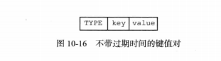
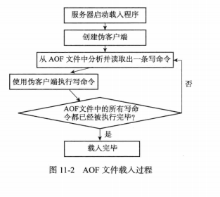

Redis支持RDB和AOF两种持久化机制，持久化功能有效地避免因进程退出造成的数据丢失问题，当下次重启时利用之前持久化文件即可实现数据恢复。

# 1. RDB持久化

RDB持久化是**把当前进程数据生成快照保存到硬盘的过程**，触发RDB持久化过程分为手动触发和自动触发。

RDB持久化功能所生成的RDB文件是一个经过压缩的二进制文件，通过该文件可以还原生成RDB文件时的数据库状态。

## 1.1 RDB文件的创建与载入

有两个Redis命令可以用于生成RDB文件，一个是`SAVE`，另一个是`BGSAVE`.

`SAVE`命令会阻塞Redis服务器进程，直到RDB文件创建完毕为止，在服务器进程阻塞期间，服务器不能处理任何命令请求。

`BGSAVE`命令会派生出一个子进程，然后由子进程负责创建RDB文件，服务器进程（父进程）继续处理命令请求。

RDB文件的载入工作是在服务器启动时自动执行的，Redis没有专门用于载入RDB文件的命令，只要Redis服务器在启动时检测到RDB文件存在，它就会自动载入RDB文件。

> 💡因为AFO文件的更新频率通常比RDB文件更新频率更高，所以：
>
> - 如果服务器开启了AFO持久化功能，那么服务器会优先使用AFO文件来还原数据库状态。
> - 只有在AFO持久化功能处于关闭状态时，服务器才会使用RDB文件来还原数据库状态。


## 1.2 `SAVE`命令执行时服务器状态

当`SAVE`命令执行时，Redis服务器会被阻塞，这时服务器不能处理任何命令请求。

## 1.3 `BGSAVE`命令执行时服务器状态

`BGSAVE`命令执行期间，服务器仍可以处理客户端的命令请求。但是，对`SAVE`、`BGSAVE`、`BGREWRITEAOF`这三个命令方式和平时有所不同。

在`BGSAVE`命令执行期间，`SAVE`命令会被服务器拒绝，这是为了避免父进程和子进程同时执行两个`rdbSave`调用，防止产生竞争条件。

在`BGSAVE`命令执行期间，`BGSAVE`命令也会被服务器拒绝，因为通知执行两个`BGSAVE`命令也会产生竞争条件。

最后，`BGREWRITEAOF`和`BGSAVE`两个命令不能同时运行：

- 如果`BGSAVE`命令正在执行，那么客户端发送的`BGREWRITEAOF`命令会被延迟到`BGSAVE`命令执行完毕之后执行。
- 如果`BGREWRITEAOF`命令正在执行，那么客户端发送的`BGSAVE`命令会被服务器拒绝。

## 1.4 RDB文件载入时服务器状态

服务器在载入RDB文件期间，会一直处于阻塞状态，直到载入工作完毕为止。

## 1.5 自动间隔性保存

因为`BGSAVE`可以在不阻塞服务器进程下执行，所以允许设置`save`选项，让服务器每隔一段时间自动执行一次`BGSAVE`命令。

可以通过`save`选项设置多个保存条件，但只要其中一个条件被满足，服务器就会执行`BGSAVE`命令。

> 比如下面例子：
>
> - `save 900 1` ：服务器在900秒内，对数据库进行了至少1次修改

### `saveparams`属性

`saveparams`属性是一个数组，数组中的每个元素都是一个`saveparam`结构，每个`saveparam`结构都保存了一个`save`选项设置的保存条件：

```c++
struct saveparam {
    time_t seconds;	// 秒数
    int changes;	// 修改数
}
```

### `dirty`计数器和`lastsave`属性

- `dirty`计数器记录距离上一次成功执行`SAVE`命令或者`BGSAVE`命令后，服务器对数据库状态（所有数据库）进行了多少次修改（删除，更新，写入等）
- `lastsave`属性是一个`UNIX`时间戳，记录了服务器上一次成功执行`SAVE`或者`BGSAVE`命令的时间。

```c++
struct redisServer {
    long long dirty;	// 修改计数器
    time_t lastsave;	// 上一次执行保存的时间
}
```

### 检查保存条件是否满足

Redis周期性操作函数`serverCron`默认每隔100毫秒就会执行一次，该函数用于对正在允许的服务器进行维护，它的一项工作就是检查`save`选项所设置的保存条件是否已经满足，如果满足，就会执行`BGSAVE`命令。

## 1.6 RDB文件结构


- `REDIS`部分长度为5个字节，保存着`REDIS`五个字符。通过这五个字符，程序在载入文件时，快速检查所载入的文件是否RDB文件。
- `db_version`长度为4个字节，它的值是一个字符串表示的整数，这个整数记录了RDB文件的版本号。比如`0006`代表RDB文件版本为第六版。
- `database`部分包含零个或任意多个数据库，以及各个数据库中的键值对数据。
  - 如果服务器数据库状态为空，这个部分也为空，长度为0字节。
  - 如果服务器数据库状态为非空（有至少一个数据库非空），那么这个部分也为非空。根据数据库保存的键值对的数量、类型和内容的不同，这个部分长度也会有所不同。
- `EOF`常量的长度为1字节，标志着RDB文件正文内容的结束，当读入程序遇到这个值的时候，表明所有数据库的所有键值对都已经载入完毕了。
- `check_sum`是一个8字节长的无符号整数、保存着一个校验和，这个校验和是程序通过对`REDIS`、`db_version`、`databases`、`EOF`四个部分的内容进行计算得出的。服务器在载入RDB文件时，会将载入数据所计算出的校验和与`check_sum`所记录的校验和进行对比，以此来检查RDB文件是否有出错或者损坏的情况出现。

### `databases`部分

一个RDB文件的`databases`部分可以保存任意多个非空数据库。

例如，如果服务器的0号和3号数据库非空，则将创建以下结构RDB文件：


每个`database`都包含数据库所有键值对。

每个非空数据库在RDB文件中都可以保存为`SELECTDB`、`db_number`、`key_value_pairs`三个部分。


- `SELECTDB`常量的长度为1字节，标示将要读入的数据库号码。
- `db_number`保存着一个数据库号码，根据号码大小不同，这个部分长度可以是1字节、2字节、5字节等。当程序读入`db_number`部分后，服务器会调用`SELECT`命令，根据读入的数据库号码进行数据库的切换，使得读入的键值对可以正确载入到数据库中。
- `key_value_pairs`部分保存了数据库中所有键值对数据，如果键值对带有过期时间，则过期时间也会和键值对保存在一起。根据键值对的数量、类型、内容以及是否有过期时间等条件的不同，`key_value_pairs`部分的长度也会有所不同。

### `key_value_pairs`部分

RDB文件中的每个`key_value_pairs`部分都保存了一个或以上数量的键值对，如果键值对带有过期时间的话，那么键值对的过期时间也会被保存在内。

不带过期时间的键值对如下：



- `TYPE`记录了`value`类型，长度为1字节。
- `KEY`总是一个字符串对象。
- 根据`TYPE`类型不同，以及保存内容长度的不同，保存`value`的结构和长度也会有所不同

带有过期时间的键值对如下：


- `EXPIRETIME_MS`常量的长度为1字节，它告知读入程序，接下来要读入的是一个以毫秒为单位的过期时间。
- `ms`是一个8字节长的带符号整数，记录着一个以毫秒为单位的UNIX时间戳，这个时间戳就是键值对的过期时间。

# 2. AOF持久化

AOF持久化是通过保存Redis服务器所执行的写命令来记录数据库状态的。

> 优点：
>
> 1. 每一次修改都同步，文件完成性更好
> 2. 每秒同步一次，可能会丢失一秒数据
>
> 缺点：
>
> 1. 相对于文件大小，aof远远大于rdb，修复速度也比rdb慢
> 2. aof运行效率比rdb慢

## 2.1 AOF持久化的实现

### 命令追加

AOF打开后，服务器在写完一个命令之后，会以协议格式将被执行的写命令追加到服务器状态的aof_buf缓冲区末尾。

### AOF持久化的效率和安全性

通过配置`appendfsync`选项的值直接决定AOF持久化功能的效率和安全性。

- 值为`always`时，服务器每个事件循环都要将`aof_buf`缓冲区中的内容写入到AOF文件，并且同步AOF文件。`always`的效率最低，但是安全性最高。
- 值为`everysec`时，服务器在每个事件循环都将`aof_buf`缓冲区中所有内容写入到AOF文件，并且每隔一秒就要在子线程中对AOF文件进行一次同步。效率上足够快，就算故障，也只是丢失一秒中的命令。
- 值为`no`时，服务器在每个事件循环都将`aof_buf`缓冲区中所有内容写入到AOF文件，至于何时同步，就有操作系统控制。

## 2.2 AOF文件的载入与数据还原

AOF文件如果出现错误，则redis不会正常启动，可以使用`redis-check-aof --fix`修复`appendonly.aof` 。




## 2.3 AOF文件重写

AOF中的内容会随着时间越来越大，所以要对AOF文件进行重写整理。用新的AOF文件来替代现有的AOF文件。

**实现原理**：首先从数据库中读取键现在的值，然后用一条命令去记录键值对，代替之前记录这个键值对的多条命令。

```bash
auto-aof-rewrite-percentage 100
auto-aof-rewrite-min-size 64mb	# aof文件大于64mb会重写
```

AOF文件重写程序是在子进程中执行的：

- 子进程重写期间，服务器进程可以继续处理命令请求
- 子进程带有服务器进程的数据副本，使用子进程而不是线程，可以避免使用锁的情况下，保证数据的安全性。

# 3. 参考资料

- 《Redis设计与实现》