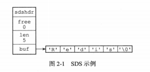
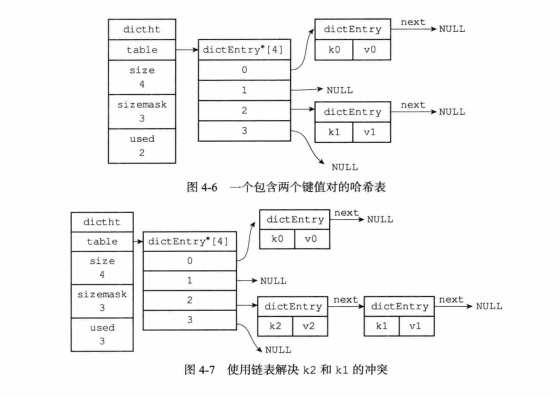
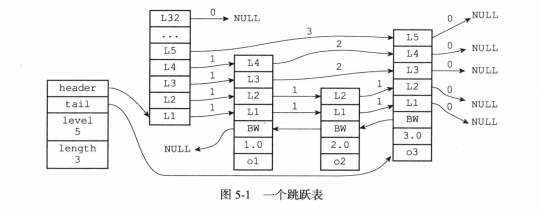
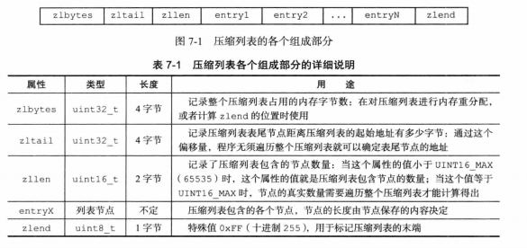

# 1. 简单动态字符串（SDS）

## 1.1 SDS的定义

```c++
struct sdshdr {
    int len; // 记录buf数组中已使用的字节两，等于SDS所保存的字符串长度
    int free;	// 记录buf数组中未使用的字节数量
    char buf[]; // 字节数组，用于保存字符串
}
```



## 1.2 SDS与C字符串的区别

- **常数复杂度获取字符串长度**
- **杜绝缓存区溢出**：当SDS进行修改时，会先检查SDS的空间是否满足修改所需的要求，若不满足，会自动扩容，然后再执行修改。
- **减少修改字符串时带来的内存重分配次数**：每次修改字符串都会重新分配空间，会对性能造成影响。
  - 空间预分配：用于优化SDS字符串增长操作。
  - 惰性空间释放：用于优化SDS字符串缩短操作。

# 2. LinkedList链表

## 2.1 链表和链表节点的实现

`adlist.h/listNode`结构如下：

```c
typedef struct listNode {
    struct listNode *prev;
    struct listNode *next;
    void *value;
} listNode;
```

`adlist.h/list`结构如下：

```c
typedef struct list {
    listNode *head;	// 表头节点
    listNode *tail;	// 表尾节点
    unsigned long len;	// 链表所包含的节点数量
    void *(*dup) (void *ptr);	// 节点值复制函数
    void (*free) (void *ptr);	// 节点释放函数
    int (*match) (void *ptr, void *key);	// 节点值对比函数
} list;
```

Redis实现的链表特性如下：

- 双端：获取某个节点的前置节点和后置节点的复杂度都是O(1)。
- 无环：表头指针和表尾指针都指向NULL，对链表的访问以NULL为终点。
- 带表头指针和表尾指针
- 带链表长度计数器
- 多态：链表节点使用`void*`指针来保存节点值，并且可以通过`list`结构的`dup、free、match`三个属性为节点值设置类型特定函数，链表可以用于保存不同类型的值。

# 3. 字典(Dict)

## 3.1 字典的实现

Redis底层字典使用哈希表作为底层实现，一个哈希表里面可以有多个哈希表节点，而每个哈希表节点就保存了字典中的一个键值对。

```c
typedef struct dictht {
    dictRntry **table;	// 哈希表数组
    unsigned long size;	// 哈希表大小
    unsigned long sizemask; //哈希表大小掩码，用于计算索引值，总是等于size=1
    unsigned long used;	//哈希表已有节点的数量
}
```

### 哈希表节点

使用`dictEntry`结构表示：

```c
typedef struct dictEntry {
    void *key;
    union {
        void *val;
        uint64_tu64;
        int64_ts64;
    } v;
    struct dictEntry *next;
} dictEntry;
```

`key`保存键，`v`保存值，`next`指针指向下一个节点.

### 字典

```c
typedef struct dict {
    dictType *type;	// 类型特定函数
    void *privdata;	// 私有数据
    dictht ht[2];	// 哈希表
    int trehashidx; // rehash索引，当rehash值不在，值为1
} dict;
```

### 哈希算法

```c
// 使用字典设置的哈希函数，计算键key的哈希值
hash = dict->type->hashFunction(key);
// 使用哈希表的sizemask属性和哈希值，计算出索引值
index = hash & dict->ht[x].sizemask;
```

### 解决键冲突

链地址法：总是将新节点添加到链表表头的位置。



# 4. 跳跃表(Skip List)



图片最左侧是跳跃表结构：

- `header`：跳跃表头节点
- `tail`：指向跳跃表的表头节点
- `level`：记录目前跳跃表内，层数最大的那个节点的层数（表头节点层数不计算再内）
- `length`：记录跳跃表的长度，即跳跃表目前包含节点的数量（表头节点不计算在内）
- 后退指针`BW`：指向位于当前节点的前一个节点
- 分值`score`：节点按照各自保存的分支从小到大排列

## 4.1 跳跃表节点

```c
typedef struct zskiplistNode {
    robj *obj;
    double score;
    struct zskiplistNode *backward; //后向指针
    struct zskiplistLevel {
        struct zskiplistNode *forward;//每一层中的前向指针
        unsigned int span;//x.level[i].span 表示节点x在第i层到其下一个节点需跳过的节点数。注：两个相邻节点span为1
    } level[];
} zskiplistNode;
```

`level`数组可以包含多个元素，每个元素都包含一个指向其它节点的指针。

每次创建一个新的跳跃表节点的时候，程序根据幂次定律(越大的数出现的而概率越小)随机生成一个介于1和32之间的值作为`level`数组的z小。

在同一个跳跃表中，各个节点保存的成员对象必须是唯一的，但多个节点保存的分值可以是相同的：分值相同的节点将按照成员对象在字典序中的大小来进行排序。

# 5. 整数集合(intset)

```c
typedef struct intset {
    uint32_t encoding;	// 编码方式
    uint32_t length;	// 包含元素数量
    int8_t contents[];	// 保存元素的数组
} intset;
```

- `contents`中的数据是从小到大排列，并且数组中不包含重复项
- `length`记录包含元素数量，也是`contents`数组的长度

**升级**

当新元素类型比现在集合中元素类型要长时，需要对集合进行升级。

1. 根据新元素类型，扩展整数集合底层数组的空间大小，并为新元素分配空间。
2. 将底层数组现有的所有元素都转换成与新元素相同的类型，并将类型转换后的元素放到正确的位置上，需要维持有序性不变。

# 6. 压缩列表(ziplist)

