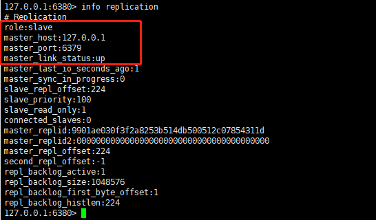
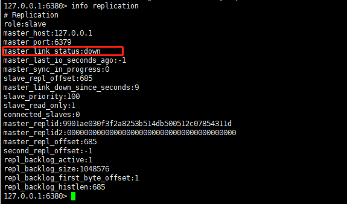
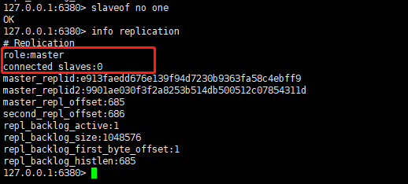
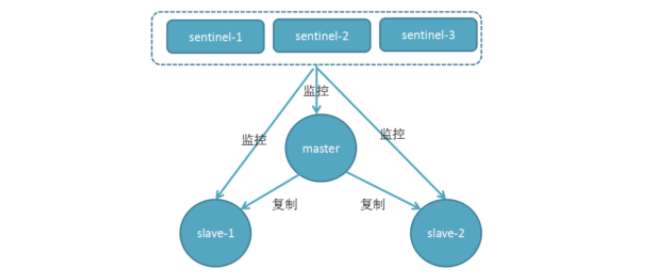
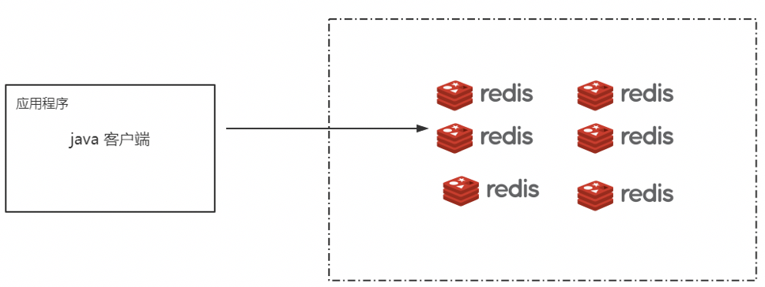
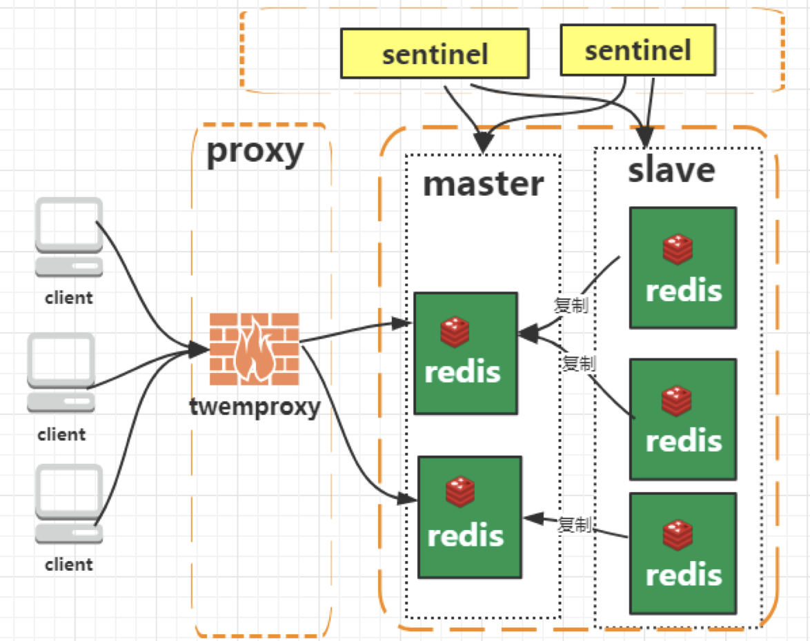
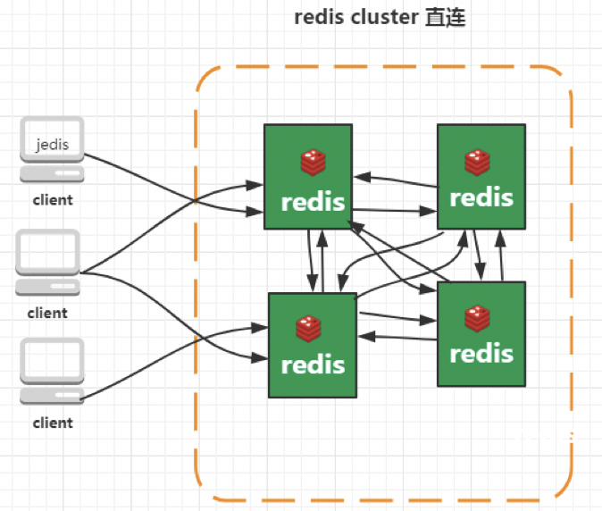
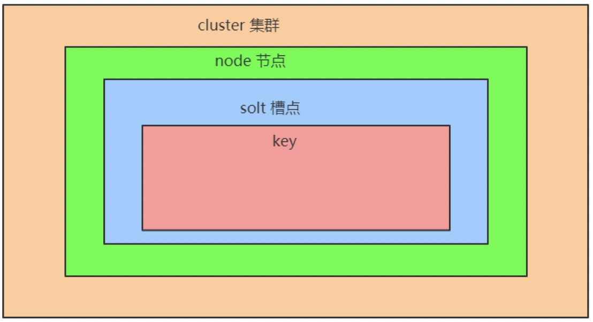
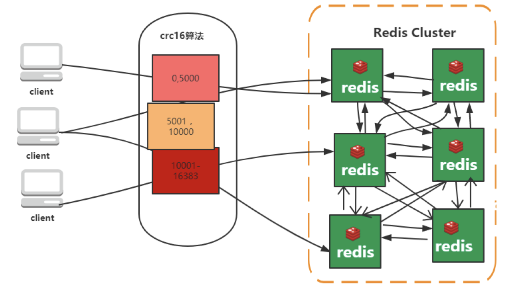

Redis四种运行模式分别为：**单机部署**、**主从模式**、**哨兵模式**、**集群模式**。

# 1. 单机部署

单机模式是指在单台服务器中运行的Redis程序，是最原始最基本的模式。

优点：

- 架构简单，部署方便
- 性价比高

缺点：

- 不能保证数据可靠性

# 2. 主从模式

## 2.1 主从结构

主节点负责写数据，从节点负责读数据，主节点定期把数据同步到从节点保证数据的一致性。

## 2.2 主从部署

- 首先进入redis安装目录下，复制一份`redis.conf`文件并重命名为`redis6380.conf`，然后修改配置文件`port为6380`，其它的不用修改。不过要注意：如果`master`启动了密码，则`redis6380.conf`需要配置`masterauth <master-password>`这个参数。
- 使用命令`redis-server redis.conf`启动`master`服务器
- 使用命令`redis-server redis6380.conf --saveof 127.0.0.1 6379`启动`slave`服务器
- 分别运行`redis-cli -p 6379`和`redis-cli -p 6380`
- 然后在各自客户端下运行`info replication`就可以查看到下面信息：




## 2.3 主从验证

```
127.0.0.1:6379> get test
(nil)
127.0.0.1:6379> set test 123
OK
127.0.0.1:6379> get test
"123"
----------------------------------
----------------------------------
127.0.0.1:6380> get test
(nil)
127.0.0.1:6380> get test
"123"
127.0.0.1:6380> set aaa 1
(error) READONLY You can't write against a read only replica.
```

可以看到从节点只能读，不能写。

## 2.4 主节点关机，从节点顶替




此时想要从节点顶替主节点，在从节点上执行`slaveof no one`即可：



## 2.5 宕机节点恢复

可以先把原来主节点恢复，再执行`redis-server redis6380.conf --saveof 127.0.0.1 6379`命令重新部署从节点

## 2.6 主从工作机制

全量复制（初始化）+ 增量复制

- `slave`启动后，向`master`发送`SYNC`命令，`master`接收到`SYNC`命令后通过`bgsave`保存快照，并使用缓冲区记录保存快照这段时间内执行的写命令;
- `master`将保存的快照文件发送给`slave`，并继续记录执行的写命令；
- `slave`接收到快照文件后，加载快照文件，载入数据；
- `master`快照发送完后开始向`slave`发送缓冲区的写命令，`slave`接收命令并执行，完成复制初始化；
- 此后`master`每次执行一个写命令都会同步发送给`slave`，保持`master`与`slave`之间数据的一致性。

## 2.7 主从配置优缺点

**优点：**

- master能自动将数据同步到slave，可以进行读写分离，分担master的读压力；
- master、slave之间的同步是以非阻塞的方式进行的，同步期间，客户端仍然可以提交查询或更新请求。

**缺点：**

- **不具备自动容错与恢复功能**，master或slave的宕机都可能导致客户端请求失败，需要等待机器重启或手动切换客户端IP才能恢复；
- master宕机，如果宕机前数据没有同步完，则切换IP后会存在数据不一致的问题；
- 难以支持在线扩容，Redis的容量受限于单机配置。

# 3. 哨兵模式

## 3.1 哨兵结构

由于无法进行主动恢复，因此主从模式衍生出了哨兵模式。哨兵模式基于主从复制模式，只是引入了哨兵来监控与自动处理故障。如图：



哨兵顾名思义，就是来为Redis集群站哨的，一旦发现问题能做出相应的应对处理。其功能包括：

- 监控master、slave是否正常运行；
- 当master出现故障时，能自动将一个slave转换为master；
- 多个哨兵可以监控同一个Redis，哨兵之间也会自动监控。

## 3.2 哨兵部署

哨兵模式基于前面的主从复制模式。哨兵的配置文件为Redis安装目录下的sentinel.conf文件，在文件中配置如下配置文件：

```
port 26379      # 哨兵端口

# mymaster定义一个master数据库的名称，后面是master的ip， port，1表示至少需要一个Sentinel进程同意才能将master判断为失效，如果不满足这个条件，则自动故障转移（failover）不会执行
sentinel monitor mymaster 127.0.0.1 6379 1 
sentinel auth-pass mymaster 123456      # master的密码

sentinel down-after-milliseconds mymaster 5000      #5s未回复PING，则认为master主观下线，默认为30s
# 指定在执行故障转移时，最多可以有多少个slave实例在同步新的master实例，在slave实例较多的情况下这个数字越小，同步的时间越长，完成故障转移所需的时间就越长
sentinel parallel-syncs mymaster 2  
# 如果在该时间（ms）内未能完成故障转移操作，则认为故障转移失败，生产环境需要根据数据量设置该值
sentinel failover-timeout mymaster 300000 

daemonize yes   #用来指定redis是否要用守护线程的方式启动,默认为no
#保护模式如果开启只接受回环地址的ipv4和ipv6地址链接，拒绝外部链接，而且正常应该配置多个哨兵，避免一个哨兵出现独裁情况
#如果配置多个哨兵那如果开启也会拒绝其他sentinel的连接。导致哨兵配置无法生效
protected-mode no 　　
logfile "/data/redis/logs/sentinel.log"  　　  #指明日志文件
```

　其中`daemonize`的值`yes`和`no`的区别为：

- `daemonize:yes`: redis采用的是单进程多线程的模式。当`redis.conf`中选项`daemonize`设置成`yes`时，代表开启守护进程模式。**在该模式下，redis会在后台运行**，并将进程pid号写入至`redis.conf`选项`pidfile`设置的文件中，此时`redis`将一直运行，除非手动`kill`该进程。
- `daemonize:no`: 当`daemonize`选项设置成`no`时，当前界面将进入`redis`的命令行界面，`exit`强制退出或者关闭连接工具都会导致`redis`进程退出。

然后就是启动哨兵，启动方式有两种，先进入Redis安装根目录下的bin目录，然后执行：

```
/server-sentinel ../sentinel.conf
# 或者
redis-server sentinel.conf --sentinel
```

> 💡可以多个哨兵监控一个master数据库，只需按上述配置添加多套sentinel.conf配置文件，比如分别为sentinel1.conf、sentinel2.conf、sentinel3.conf，分别以26379, 36379, 46379端口启动三个sentinel，此时就成功配置多个哨兵，成功部署了一套3个哨兵、一个master、2个slave的Redis集群。

## 3.4 哨兵工作机制

在配置文件中通过  `sentinel monitor <master-name> <ip> <redis-port> <quorum>` 来定位master的IP、端口，一个哨兵可以监控多个master数据库，只需要提供多个该配置项即可。

哨兵启动后，会与要监控的master建立两条连接：

- 一条连接用来订阅master的`_sentinel_:hello`频道与获取其他监控该master的哨兵节点信息。
- 另一条连接定期向master发送INFO等命令获取master本身的信息。

与master建立连接后，哨兵会执行三个操作：

- 定期（一般10s一次，当master被标记为主观下线时，改为1s一次）向master和slave发送INFO命令。
- 定期向master和slave的`_sentinel_:hello`频道发送自己的信息。
- 定期（1s一次）向master、slave和其他哨兵发送PING命令。

发送INFO命令可以获取当前数据库的相关信息从而实现新节点的自动发现。通过INFO命令，哨兵可以获取主从数据库的最新信息，并进行相应的操作，比如角色变更等。

所以说**哨兵只需要配置master数据库信息就可以自动发现其slave信息**。获取到slave信息后，哨兵也会与slave建立两条连接执行监控。

哨兵向主从数据库的_sentinel_:hello频道发送信息与同样监控这些数据库的哨兵共享自己的信息，发送内容为哨兵的ip端口、运行id、配置版本、master名字、master的ip端口还有master的配置版本。这些信息有以下用处：

- 其他哨兵可以通过该信息判断发送者是否是新发现的哨兵，如果是的话会创建一个到该哨兵的连接用于发送PING命令。
- 其他哨兵通过该信息可以判断master的版本，如果该版本高于直接记录的版本，将会更新。
- 当实现了自动发现slave和其他哨兵节点后，哨兵就可以通过定期发送PING命令定时监控这些数据库和节点有没有停止服务。

如果被PING的数据库或者节点超时未回复，哨兵认为其主观下线。

如果下线的是master，哨兵会向其它哨兵发送命令询问它们是否也认为该master主观下线。

如果达到一定数目（即配置文件中的quorum）投票，哨兵会认为该master已经客观下线（odown，o就是Objectively —— 客观地），并选举领头的哨兵节点对主从系统发起故障恢复。

若没有足够的sentinel进程同意master下线，master的客观下线状态会被移除，若master重新向sentinel进程发送的PING命令返回有效回复，master的主观下线状态就会被移除。

哨兵认为master客观下线后，故障恢复的操作需要由选举的**领头哨兵**来执行，**选举采用Raft算法**：

- 发现master下线的哨兵节点（我们称他为A）向每个哨兵发送命令，要求对方选自己为领头哨兵。
- 如果目标哨兵节点没有选过其他人，则会同意选举A为领头哨兵。
- 如果有超过一半的哨兵同意选举A为领头，则A当选。
- 如果有多个哨兵节点同时参选领头，此时有可能存在一轮投票无竞选者胜出，此时每个参选的节点等待一个随机时间后再次发起参选请求，进行下一轮投票竞选，直至选举出领头哨兵。

选出领头哨兵后，领头者开始对系统进行故障恢复，从出现故障的master的从数据库中挑选一个来当选新的master,选择规则如下：

- 所有在线的slave中选择优先级最高的，优先级可以通过slave-priority配置。
- 如果有多个最高优先级的slave，则选取复制偏移量最大（即复制越完整）的当选。
- 如果以上条件都一样，选取id最小的slave。
- 挑选出需要继任的slave后，领头哨兵向该数据库发送命令使其升格为master，然后再向其他slave发送命令接受新的master，最后更新数据。将已经停止的旧的master更新为新的master的从数据库，使其恢复服务后以slave的身份继续运行。

## 3.5  哨兵模式的优缺点

**优点：**

- 哨兵模式基于主从复制模式，所以主从复制模式有的优点，哨兵模式也有。
- 哨兵模式下，master挂掉可以自动进行切换，系统可用性更高。

**缺点：**

- 同样也继承了主从模式难以在线扩容的缺点，Redis的容量受限于单机配置。
- 需要额外的资源来启动sentinel进程，实现相对复杂一点，同时slave节点作为备份节点不提供服务。

# 4. 集群模式

哨兵模式解决了主从复制不能自动故障转移，达不到高可用的问题，但还是存在难以在线扩容，Redis容量受限于单机配置的问题，因此就诞生了集群模式。

我们一般要实现一个Redis集群，可以有三种方式：客户端实现、Proxy代理层、服务端实现。

## 4.1 客户端实现

通过代码的实现方式，实现集群访问，如下图所示：



这样的访问方式都通过代码来维护集群以及访问路径，可是这样的方式 维护难度大，也不支持动态扩容，因为一切都以代码实现访问规划。

## 4.2 Proxy代理层



Redis和我们的客户端之间新加了一层Proxy，我们通过Proxy去规划访问，这样我们在代码层面以及Redis部署层面就无需处理。

**优缺点：**

- 原先可以直接访问Redis，现在由于多了一层Proxy，所有访问要经过Proxy中转，性能下降。
- 我们需要依赖以及配置额外的插件(中间件)，增加了系统复杂度。

## 4.3 服务端实现

服务端的实现方式就是标准的集群(分区分片)模式，RedisCluster是Redis在3.0版本后推出的分布式解决方案。

### 集群结构

Cluster模式实现了Redis的分布式存储，即每台节点存储不同的内容，来解决在线扩容的问题。如图：



RedisCluster采用无中心结构,它的特点如下：

- 所有的redis节点彼此互联(PING-PONG机制),内部使用二进制协议优化传输速度和带宽。
- 节点的fail是通过集群中超过半数的节点检测失效时才生效。
- 客户端与redis节点直连,不需要中间代理层.客户端不需要连接集群所有节点,连接集群中任何一个可用节点即可。

### Redis集群工作机制

Cluster模式的具体工作机制：

- 在Redis的每个节点上，都有一个插槽（slot），总共16384个哈希槽，取值范围为0-16383。如下图所示，跟前三种模式不同，Redis不再是默认有16(0-15)个库，也没有默认的0库说法，而是采用Slot的设计(一个集群有多个主从节点，一个主从节点上会分配多个Slot槽，每个槽点上存的是Key-Value数据):



- 当我们存取key的时候，Redis会根据CRC16的算法得出一个结果，然后把结果对16384求余数，这样每个key都会对应一个编号在0-16383之间的哈希槽，通过这个值，去找到对应的插槽所对应的节点，然后直接自动跳转到这个对应的节点上进行存取操作。如图所示：



- 为了保证高可用，Cluster模式也引入主从复制模式，一个主节点对应一个或者多个从节点，当主节点宕机的时候，就会启用从节点。

- 当其它主节点ping一个主节点A时，如果半数以上的主节点与A通信超时，那么认为主节点A宕机了。如果主节点A和它的从节点都宕机了，那么该集群就无法再提供服务了

Cluster模式集群节点最小配置6个节点(3主3从，因为需要半数以上)，其中主节点提供读写操作，从节点作为备用节点，不提供请求，只作为故障转移使用。

### 集群部署

首先我们复制6份`redis.conf`配置文件，分别命名为`redis7001.conf`、`redis7002.conf`、`redis7003.conf`、`redis7004.conf`、`redis7005.conf`、`redis7006conf`，存放在自己想要放的地方。

并按照下列配置信息修改配置文件：

```
#修改成自己对应的端口号
port 
#指定了记录日志的文件。
logfile 
#数据目录，数据库的写入会在这个目录。rdb、aof文件也会写在这个目录
dir 
#是否开启集群
cluster-enabled
#集群配置文件的名称，每个节点都有一个集群相关的配置文件，持久化保存集群的信息。
#这个文件并不需要手动配置，这个配置文件由Redis生成并更新，每个Redis集群节点需要一个单独的配置文件，请确保与实例运行的系统中配置文件名称不冲突(建议配对应端口号)
cluster-config-file nodes-6379.conf
#节点互连超时的阀值。集群节点超时毫秒数
cluster-node-timeout 5000
#默认redis使用的是rdb方式持久化，这种方式在许多应用中已经足够用了。
#但是redis如果中途宕机，会导致可能有几分钟的数据丢失，根据save来策略进行持久化，Append Only File是另一种持久化方式，可以提供更好的持久化特性。
#Redis会把每次写入的数据在接收后都写入 appendonly.aof 文件，每次启动时Redis都会先把这个文件的数据读入内存里，先忽略RDB文件。
appendonly 
appendonly yes
protected-mode no #保护模式 yes改为no
#bind 127.0.0.1 #注释或者去掉这个
daemonize yes   #用来指定redis是否要用守护线程的方式启动,yes表示后台启动
```

执行命令分别启动所有节点.

详细参考原文：https://www.cnblogs.com/jing99/p/12651186.html

### 集群模式优缺点

**优点：**

- 无中心架构；
- 数据按照slot存储分布在多个节点，节点间数据共享，可动态调整数据分布；
- **可扩展性**：可线性扩展到1000多个节点，节点可动态添加或删除；
- **高可用性**：部分节点不可用时，集群仍可用。通过增加Slave做standby数据副本，能够实现故障自动failover，节点之间通过gossip协议交换状态信息，用投票机制完成Slave到Master的角色提升；
- **降低运维成本**，提高系统的扩展性和可用性。

**缺点：**

- Client实现复杂，驱动要求实现Smart Client，缓存slots mapping信息并及时更新，提高了开发难度，客户端的不成熟影响业务的稳定性。目前仅JedisCluster相对成熟，异常处理部分还不完善，比如常见的“max redirect exception”。
- 节点会因为某些原因发生阻塞（阻塞时间大于clutser-node-timeout），被判断下线，这种failover是没有必要的。
- 数据通过异步复制，不保证数据的强一致性。
- 多个业务使用同一套集群时，无法根据统计区分冷热数据，资源隔离性较差，容易出现相互影响的情况。
- Slave在集群中充当“冷备”，不能缓解读压力，当然可以通过SDK的合理设计来提高Slave资源的利用率。
- Key批量操作限制，如使用mset、mget目前只支持具有相同slot值的Key执行批量操作。对于映射为不同slot值的Key由于Keys不支持跨slot查询，所以执行mset、mget、sunion等操作支持不友好。
- Key事务操作支持有限，只支持多key在同一节点上的事务操作，当多个Key分布于不同的节点上时无法使用事务功能。
- Key作为数据分区的最小粒度，不能将一个很大的键值对象如hash、list等映射到不同的节点。
- 不支持多数据库空间，单机下的redis可以支持到16个数据库，集群模式下只能使用1个数据库空间，即db 0。
- 复制结构只支持一层，从节点只能复制主节点，不支持嵌套树状复制结构。
- 避免产生hot-key，导致主库节点成为系统的短板。
- 避免产生big-key，导致网卡撑爆、慢查询等。
- 重试时间应该大于cluster-node-time时间。
- Redis Cluster不建议使用pipeline和multi-keys操作，减少max redirect产生的场景。

### Slot槽

RedisCluster采用分区规则是键根据哈希函数(`CRC16[key]&16383`)映射到0－16383槽内，共16384个槽位，每个节点维护部分槽及槽所映射的键值数据。哈希函数: `Hash()=CRC16[key]&16383`

### Gossip通信

节点之间采用Gossip协议进行通信，**Gossip协议就是指节点彼此之间不断通信交换信息**，当主从角色变化或新增节点，彼此通过`ping/pong`进行通信知道全部节点的最新状态并达到集群同步。

Gossip协议的主要职责就是信息交换，信息交换的载体就是节点之间彼此发送的Gossip消息，常用的Gossip消息有ping消息、pong消息、meet消息、fail消息：

- **meet消息**：用于通知新节点加入，消息发送者通知接收者加入到当前集群，meet消息通信完后，接收节点会加入到集群中，并进行周期性ping pong交换
- **ping消息**：集群内交换最频繁的消息，集群内每个节点每秒向其它节点发ping消息，用于检测节点是在在线和状态信息，ping消息发送封装自身节点和其他节点的状态数据；
- **pong消息**：当接收到ping meet消息时，作为响应消息返回给发送方，用来确认正常通信，pong消息也封闭了自身状态数据；
- **fail消息**：当节点判定集群内的另一节点下线时，会向集群内广播一个fail消息