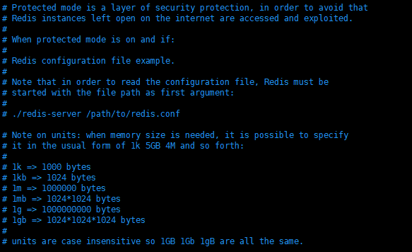

1. 配置文件对大小写不敏感

   

2. 可以包含其它配置文件

   

```bash
###网络相关###
# bind 127.0.0.1  # 绑定监听的网卡IP，注释掉或配置成0.0.0.0可使任意IP均可访问

protected-mode yes # 关闭保护模式，使用密码访问

port 6379  # 设置监听端口，建议生产环境均使用自定义端口

timeout 30 # 客户端连接空闲多久后断开连接，单位秒，0表示禁用

###通用配置###
daemonize yes # 默认是no, 以守护进程在后台运行

pidfile /var/run/redis_6379.pid  # 如果以后台方式运行，就要指定pid进程文件名

###日志###
# Specify the server verbosity level.
# This can be one of:
# debug (a lot of information, useful for development/testing)
# verbose (many rarely useful info, but not a mess like the debug level)
# notice (moderately verbose, what you want in production probably)
# warning (only very important / critical messages are logged)
loglevel notice

logfile ""	# 日志的文件名

databases 16	# 数据库数量  默认是16个数据库

always-show-logo yes  # 是否显示logo, 默认是no

###RDB持久化配置###
### redis基于内存，没有持久化，断电就数据消失了
save 900 1 # 900s内至少一次写操作则执行bgsave进行RDB持久化
save 300 10
save 60 10000 

stop-writes-on-bgsave-error yes  # 持久化出错了是否继续工作

rdbcompression yes	# 是否压缩rdb文件  需要消耗CPU  建议设置为no，以（磁盘）空间换（CPU）时间

rdbchecksum yes		# 保存rdb文件是否进行检查

dbfilename dump.rdb		# rdb文件名

dir ./			# rdb文件保存目录

###AOF配置###
appendonly yes # 默认值是no，表示不使用AOF增量持久化的方式，使用RDB全量持久化的方式
appendfsync everysec # 可选值 always， everysec，no，建议设置为everysec

###设置密码###
requirepass 123456 # 设置复杂一点的密码

###客户端###
maxclients 10000	# 最大客户端连接数

maxmemory <bytes>	# redis设置最大内存容量

maxmemory-policy noeviction # 内存到达上限后的处理策略
1、volatile-lru：只对设置了过期时间的key进行LRU（默认值）
2、allkeys-lru ： 删除lru算法的key
3、volatile-random：随机删除即将过期key
4、allkeys-random：随机删除
5、volatile-ttl ： 删除即将过期的
6、noeviction ： 永不过期，返回错误

###APPEND ONLY MODE aof配置###
appendonly no	# 默认不开启aof模式，默认是使用rdb方式持久化

appendfilename "appendonly.aof"		# 持久化文件名字

# appendfsync always	# 每次修改都会执行sync，消耗性能
appendfsync everysec	# 每秒执行一次sync，但可能会丢失这1s数据
# appendfsync no		# 不执行sync, 操作系统自己同步数据，速度最快

```

