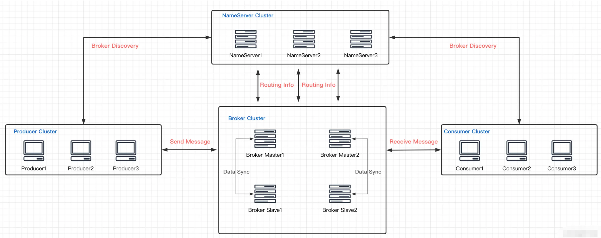
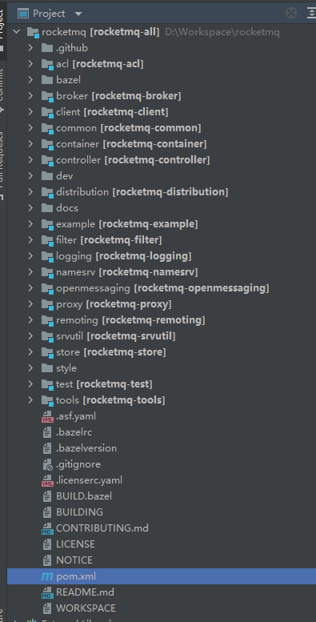
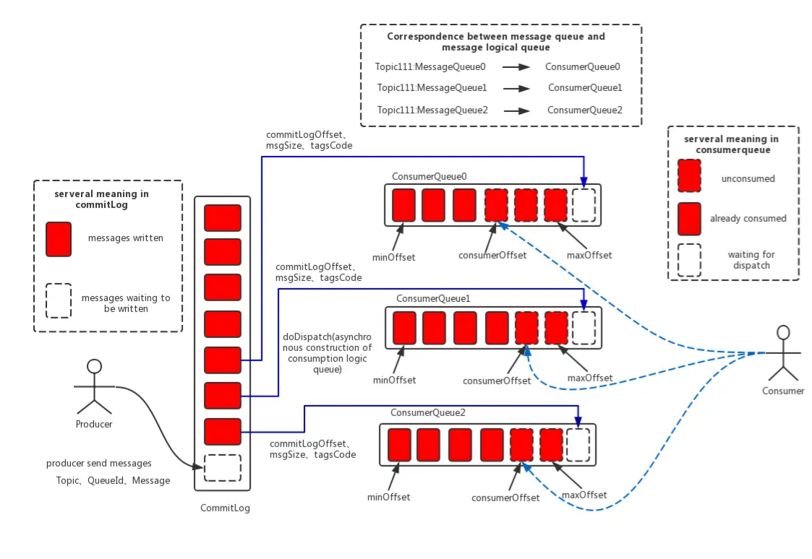

## 简介

RocketMQ整体架构设计

**Producer**：消息生产者

**Consumer**：消息消费者

**NameServer**：查询各个Topic对应的Broker IP列表

**BrokerServer**：存储消息，转发消息

**Message**：消息载体，最小单位

**Topic**：一类消息的集合，每条消息只属于一个主题

**Tag**：用于区分同一个Topic下不同类型的消息

## 项目大概

- **namesrv**：命名发现服务，broker 服务的管理与路由
- **broker**：核心组件，接收 `producer`发送的消息和消息的存储与`consumer` 的消息消费
- **client**：客户端实现，`producer`和 `consumer`的实现模块
- **store**：存储层实现，消息持久化、索引服务、高可用 HA 服务实现
- **remoting**：通信层实现，基于 Netty 的底层封装，服务间的交互通讯都依赖此模块
- **filter**：消息过滤服务，相当于在`broker`和`consumer`中间加入了一个 filter 代理
- **common**：模块间通用的功能类、方法、配置文件、常量等
- **tools**：命令管理工具，提供了消息查询、topic 管理等功能
- **example**：官方提供的例子，对典型的功能比如 order message，push consumer，pull consumer 的用法进行了示范

### 整体设计：

#### 消息存储整体架构

1. **CommitLog**：**消息存储的主体结构**，简单来说就是存储`Producer`发送的消息。存储Producer端写入的消息主体内容,消息内容不是定长的。单个文件大小默认1G, 文件名长度为20位，左边补零，剩余为起始偏移量，比如00000000000000000000代表了第一个文件，起始偏移量为0，文件大小为1G=1073741824；当第一个文件写满了，第二个文件为00000000001073741824，起始偏移量为1073741824，以此类推。消息主要是顺序写入日志文件，当文件满了，写入下一个文件；
2. **ConsumeQueue**：消息消费队列，引入的目的主要是提高消息消费的性能，由于RocketMQ是基于主题topic的订阅模式，消息消费是针对主题进行的，如果要遍历commitlog文件中根据topic检索消息是非常低效的。Consumer即可根据ConsumeQueue来查找待消费的消息。其中，ConsumeQueue（逻辑消费队列）作为消费消息的索引，**保存了指定Topic下的队列消息在CommitLog中的起始物理偏移量offset，消息大小size和消息Tag的HashCode值**。consumequeue文件可以看成是基于topic的commitlog索引文件，故consumequeue文件夹的组织方式如下：topic/queue/file三层组织结构，具体存储路径为：$HOME/store/consumequeue/{topic}/{queueId}/{fileName}。同样consumequeue文件采取定长设计，每一个条目共20个字节，分别为8字节的commitlog物理偏移量、4字节的消息长度、8字节tag hashcode，单个文件由30W个条目组成，可以像数组一样随机访问每一个条目，每个ConsumeQueue文件大小约5.72M。
3. **IndexFile**：IndexFile（索引文件）提供了一种可以通过key或时间区间来查询消息的方法。Index文件的存储位置是：$HOME/store/index/{fileName}，文件名fileName是以创建时的时间戳命名的，固定的单个IndexFile文件大小约为400M，一个IndexFile可以保存 2000W个索引，IndexFile的底层存储设计为在文件系统中实现HashMap结构，故RocketMQ的索引文件其底层实现为hash索引。

RocketMQ采用的是混合型的存储结构。Broker单个实例下所有的队列共用一个日志数据文件（即为CommitLog）来存储。

RocketMQ的混合型存储结构(多个Topic的消息实体内容都存储于一个CommitLog中)针对Producer和Consumer分别采用了数据和索引部分相分离的存储结构，Producer发送消息至Broker端，然后Broker端使用同步或者异步的方式对消息刷盘持久化，保存至CommitLog中。只要消息被刷盘持久化至磁盘文件CommitLog中，那么Producer发送的消息就不会丢失。正因为如此，Consumer也就肯定有机会去消费这条消息。当无法拉取到消息后，可以等下一次消息拉取，同时服务端也支持长轮询模式，如果一个消息拉取请求未拉取到消息，Broker允许等待30s的时间，只要这段时间内有新消息到达，将直接返回给消费端。这里，RocketMQ的具体做法是，使用Broker端的后台服务线程—ReputMessageService不停地分发请求并异步构建ConsumeQueue（逻辑消费队列）和IndexFile（索引文件）数据。

#### 页缓存PageCache

> 读取ConsumeQueue文件

页缓存（PageCache)是OS对文件的缓存，用于加速对文件的读写。一般来说，程序对文件进行顺序读写的速度几乎接近于内存的读写速度，主要原因就是由于OS使用PageCache机制对读写访问操作进行了性能优化，将一部分的内存用作PageCache。对于数据的写入，OS会先写入至Cache内，随后通过异步的方式由pdflush内核线程将Cache内的数据刷盘至物理磁盘上。对于数据的读取，如果一次读取文件时出现未命中PageCache的情况，OS从物理磁盘上访问读取文件的同时，会顺序对其他相邻块的数据文件进行预读取。

#### 内存映射MMAP 

> 将对文件的操作转化为直接对内存地址进行操作，读取commitLog文件

将一个文件映射到进程的地址空间，实现**文件磁盘地址**和**进程虚拟池地**址空间一一对应关系。实现**磁盘文件**到**虚拟内存**的直接传输，减少了内核态到用户态的数据拷贝。利用了NIO中的FileChannel模型将磁盘上的物理文件直接映射到用户态的内存地址中（这种Mmap的方式减少了传统IO将磁盘文件数据在操作系统内核地址空间的缓冲区和用户应用程序地址空间的缓冲区之间来回进行拷贝的性能开销）

> 上面提到的commitLog的大小默认为1G？
>
> 因为MMAP在进行文件映射时，有大小限制，在1.5G~2G之间。所以RocketMQ的commitLog单个文件在1GB，consumeQueue文件在5.72MB

#### 消息刷盘

(1) 同步刷盘：如上图所示，只有在消息真正持久化至磁盘后RocketMQ的Broker端才会真正返回给Producer端一个成功的ACK响应。同步刷盘对MQ消息可靠性来说是一种不错的保障，但是性能上会有较大影响，一般适用于金融业务应用该模式较多。

(2) 异步刷盘：能够充分利用OS的PageCache的优势，只要消息写入PageCache即可将成功的ACK返回给Producer端。消息刷盘采用后台异步线程提交的方式进行，降低了读写延迟，提高了MQ的性能和吞吐量。
