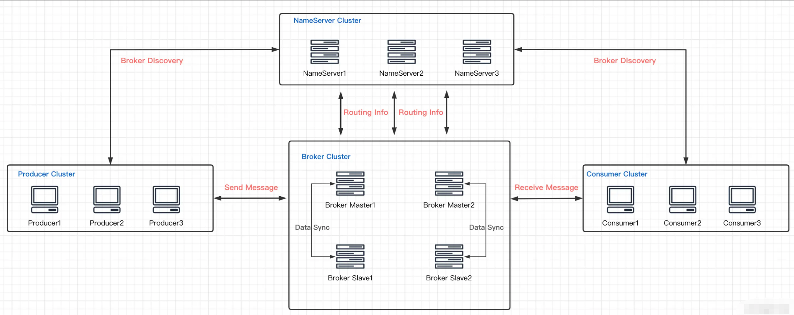
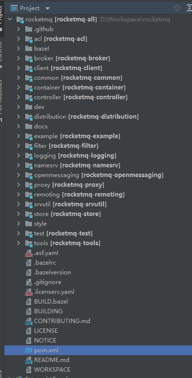
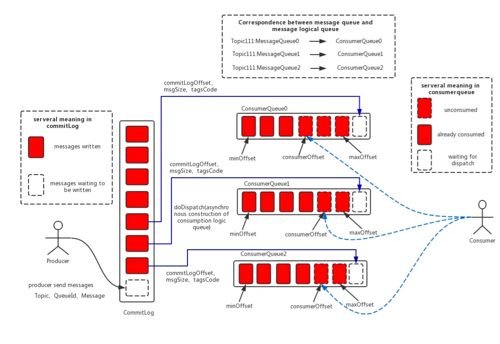

## 简介

RocketMQ整体架构设计

**Producer**：消息生产者

**Consumer**：消息消费者

**NameServer**：查询各个Topic对应的Broker IP列表

**BrokerServer**：存储消息，转发消息

**Message**：消息载体，最小单位

**Topic**：一类消息的集合，每条消息只属于一个主题

**Tag**：用于区分同一个Topic下不同类型的消息

## 项目大概

- **namesrv**：命名发现服务，broker 服务的管理与路由
- **broker**：核心组件，接收 `producer`发送的消息和消息的存储与`consumer` 的消息消费
- **client**：客户端实现，`producer`和 `consumer`的实现模块
- **store**：存储层实现，消息持久化、索引服务、高可用 HA 服务实现
- **remoting**：通信层实现，基于 Netty 的底层封装，服务间的交互通讯都依赖此模块
- **filter**：消息过滤服务，相当于在`broker`和`consumer`中间加入了一个 filter 代理
- **common**：模块间通用的功能类、方法、配置文件、常量等
- **tools**：命令管理工具，提供了消息查询、topic 管理等功能
- **example**：官方提供的例子，对典型的功能比如 order message，push consumer，pull consumer 的用法进行了示范

**整体交互流程**：

1. **CommitLog**：**消息存储的主体结构**，简单来说就是存储`Producer`发送的消息。要知道所有的消息都是需要落盘的，所以这些消息都是要写入文件。每个文件默认1G（为什么默认为1G，大家可以想一下） ，文件满了写入下一个文件。

2. **ConsumeQueue**：**消息消费队列**，可以理解为基于 Topic 的 `commitlog` 索引文件。Topic 上的 `Queue` 与 消费者的 `ConsumeQueue` 一一对应，比如 Topic 有 1，2，3，4个队列，消费者A分配到1，2两个队列（此处涉及消费者负载均衡）,那么消费者A的`ConsumerQueue`就是对应 Topic1，2 的两个`queue`。引入`ConsumeQueue` 主要是为了提高消息消费的性能，它存储了**起始物理偏移量 offset**，**消息大小 size** 和**消息 Tag 的 HashCode 值**。

3. **IndexFile**：**索引文件**，简单说就是 commitLog 的索引集合文件。固定的单个 `IndexFile` 文件大小约为400M，一个`IndexFile` 可以保存 2000W个索引，`IndexFile`的底层存储设计为在文件系统中实现 HashMap 结构，故rocketmq 的索引文件其底层实现为 hash 索引。

   