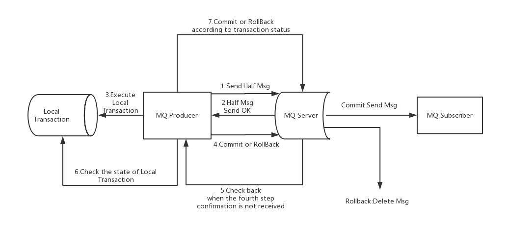

## 一、概要

RocketMQ采用了**2PC**的思想来实现了提交事务消息，同时增加**一个补偿逻辑**来处理二阶段超时或者失败的消息

所以，事务消息大致分两个流程：**正常事务消息的发送及提交**、**事务消息的补偿流程**

####  1.1 事务消息发送及提交（序号对照上图）

1. 生产者发送消息（half消息）到服务端
2. 服务端响应消息写入结果给生产者
3. 根据第1步的发送结果执行本地事务（如果第1步写入失败，**half消息对消费者不可见**，本地逻辑也就不执行）
4. 根据本地事务状态执行commit或者rollback操作（commit操作生成消息索引，**消息此时对消费者可见**）

#### 2.2 补偿流程（序号对照上图）

5. 对没有commit/rollback的事务消息（等待状态的消息），从服务端发起一次回查
6. 生产者收到回查的消息，检查该消息对应的本地事务的执行状态
7. 根据本地事务的状态，重新commit或者rollback

**补偿阶段主要用户解决消息commit或rollback发生超时或失败的情况**

#### 2.3 2PC(两阶段提交)

顾名思义就是两阶段提交：第一阶段：提交请求阶段（投票阶段）；第二阶段：提交阶段

