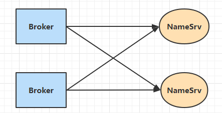
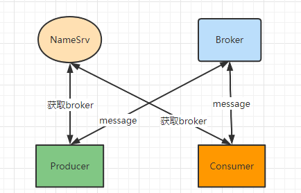
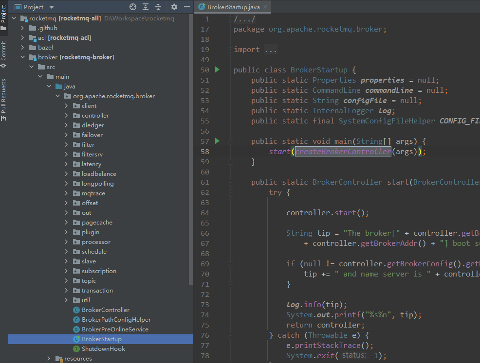
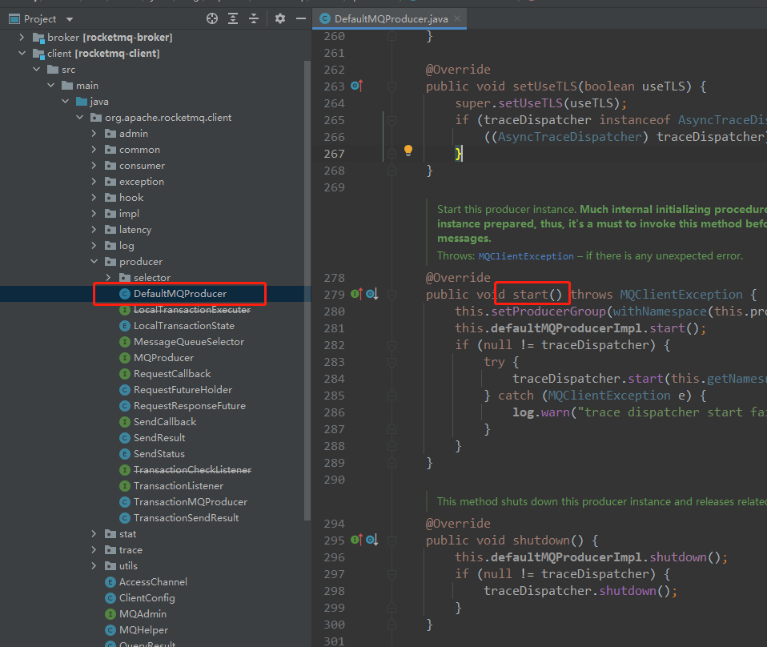

## 一、服务发现

RocketMQ有下面几个角色

**NameSrv: 注册中心**

**Broker: 消息服务器**

**Producer: 消息生产者**

**Consumer: 消息消费者**

RocketMQ没有使用Zookeeper作为服务的注册中心，而是自研的NameSrv，每个NameSrv都是无关联的节点。

当消息服务器启动后，会将自己的地址信息等，注册到所有的NameSrv。



当Producer和Consumer启动后，会主动连接NameServer，获取可用的Broker列表，并选取Broker进行连接，进行消息发送与拉取。




## 二、源码分析

### 2.1 服务注册

在源码的broker包根目录下，有一个`BrokerStartup`启动类。



入口代码如下：

```java
public static void main(String[] args) {
    start(createBrokerController(args));
}
```

主要进行了两件事：

1. 创建BrokerController，用来管理Broker节点
2. 启动BrokerController

第一步：创建BrokerController过程，主要是分析配置信息，比如：NameSrv集群的地址表、Broker信的角色信息(Master/Salve)等，并对其进行初始化。

```java
final BrokerController controller = new BrokerController(
    brokerConfig,
    nettyServerConfig,
    nettyClientConfig,
    messageStoreConfig);
```

第二步是主要的，启动各种服务。

```java
public void start() throws Exception {
    if (this.messageStore != null) {
        // 这里的messageStore是在创建controller时初始化的，controller.initialize(); 是DefaultMessageStore类
        // 启动消息存储服务，包括启动Broker的高可用机制；启动以下任务：
        // 1. 启动把内存当中的消息刷到磁盘中的任务
        // 2. 把 commitLog 中的消息分发到 consumerQueue 文件中任务
        // 3. cleanFilesPeriodically(): 清除过期的 commitLog/ consumerQueue 日志文件, 10s
        // 4. checkSelf(): 检查 commitLog/ consumerQueue 的 映射文件，10min
        // 5. 如果 commitLog 锁时间超过了阈值，持久化它的锁信息, 1s
        // 6. isSpaceFull(): 检测磁盘空间是否足够, 10s
        // 需要掌握的java的知识点：scheduleAtFixedRate, RandomAccessFile
        this.messageStore.start();
    }

    if (this.remotingServer != null) {
        // 使用Netty暴露Socket服务处理外部请求的调用
        this.remotingServer.start();
    }

    if (this.fastRemotingServer != null) {
        // 使用Netty暴露Socket服务处理外部请求的调用
        this.fastRemotingServer.start();
    }

    if (this.fileWatchService != null) {
        // 启动文件监听服务
        this.fileWatchService.start();
    }

    if (this.brokerOuterAPI != null) {
        // 启动 brokerOuterAPI 也就是 RemotingClient，使得 Broker 可以调用其它方
        this.brokerOuterAPI.start();
    }

    if (this.pullRequestHoldService != null) {
        // 启动 pullRequestHoldService 服务用于处理 Consumer 拉取消息
        this.pullRequestHoldService.start();
    }

    if (this.clientHousekeepingService != null) {
        // 启动 clientHousekeepingService 服务用于处理 Producer、Consumer、FilterServer 的存活
        this.clientHousekeepingService.start();
    }

    if (this.filterServerManager != null) {
        // 启动 filterServerManager 服务用于定时更新 FilterServer
        this.filterServerManager.start();
    }

    if (!messageStoreConfig.isEnableDLegerCommitLog()) {
        startProcessorByHa(messageStoreConfig.getBrokerRole());
        handleSlaveSynchronize(messageStoreConfig.getBrokerRole());
        // 注册 Broker 信息到 NameServer
        this.registerBrokerAll(true, false, true);
    }

    // 在注册完后，会创建定时任务发送心跳包
    this.scheduledExecutorService.scheduleAtFixedRate(new Runnable() {

        @Override
        public void run() {
            try {
                // 每10s向NameSrv发送心跳包，NameSrv会定时扫描broker列表，去掉长时间没发送心跳包的broker
                BrokerController.this.registerBrokerAll(true, false, brokerConfig.isForceRegister());
            } catch (Throwable e) {
                log.error("registerBrokerAll Exception", e);
            }
        }
    }, 1000 * 10, Math.max(10000, Math.min(brokerConfig.getRegisterNameServerPeriod(), 60000)), TimeUnit.MILLISECONDS);

    if (this.brokerStatsManager != null) {
        // 启动 Broker 中的指标统计
        this.brokerStatsManager.start();
    }

    if (this.brokerFastFailure != null) {
        // 启动 Broker 请求列表的过期请求清除任务
        this.brokerFastFailure.start();
    }
}
```

调用**this.registerBrokerAll**方法注册broker到NameSrv上，在其内部调用**doRegisterBrokerAll**方法。**doRegisterBrokerAll**方法内部调用**this.brokerOuterAPI.registerBrokerAll**方法封装请求头，然后遍历NameSrv列表，向每个NameSrv发起注册请求。

```java
public synchronized void registerBrokerAll(final boolean checkOrderConfig, boolean oneway, boolean forceRegister) {
    TopicConfigSerializeWrapper topicConfigWrapper = this.getTopicConfigManager().buildTopicConfigSerializeWrapper();

    if (!PermName.isWriteable(this.getBrokerConfig().getBrokerPermission())
        || !PermName.isReadable(this.getBrokerConfig().getBrokerPermission())) {
        ConcurrentHashMap<String, TopicConfig> topicConfigTable = new ConcurrentHashMap<>();
        for (TopicConfig topicConfig : topicConfigWrapper.getTopicConfigTable().values()) {
            TopicConfig tmp =
                new TopicConfig(topicConfig.getTopicName(), topicConfig.getReadQueueNums(), topicConfig.getWriteQueueNums(),
                                this.brokerConfig.getBrokerPermission());
            topicConfigTable.put(topicConfig.getTopicName(), tmp);
        }
        topicConfigWrapper.setTopicConfigTable(topicConfigTable);
    }

    if (forceRegister || needRegister(this.brokerConfig.getBrokerClusterName(),
                                      this.getBrokerAddr(),
                                      this.brokerConfig.getBrokerName(),
                                      this.brokerConfig.getBrokerId(),
                                      this.brokerConfig.getRegisterBrokerTimeoutMills())) {
        doRegisterBrokerAll(checkOrderConfig, oneway, topicConfigWrapper);
    }
}

private void doRegisterBrokerAll(boolean checkOrderConfig, boolean oneway,
                                 TopicConfigSerializeWrapper topicConfigWrapper) {
    // 注册broker的信息到NameSrv上
    List<RegisterBrokerResult> registerBrokerResultList = this.brokerOuterAPI.registerBrokerAll(
        this.brokerConfig.getBrokerClusterName(),
        this.getBrokerAddr(),
        this.brokerConfig.getBrokerName(),
        this.brokerConfig.getBrokerId(),
        this.getHAServerAddr(),
        topicConfigWrapper,
        this.filterServerManager.buildNewFilterServerList(),
        oneway,
        this.brokerConfig.getRegisterBrokerTimeoutMills(),
        this.brokerConfig.isCompressedRegister());

    if (registerBrokerResultList.size() > 0) {
        RegisterBrokerResult registerBrokerResult = registerBrokerResultList.get(0);
        if (registerBrokerResult != null) {
            if (this.updateMasterHAServerAddrPeriodically && registerBrokerResult.getHaServerAddr() != null) {
                this.messageStore.updateHaMasterAddress(registerBrokerResult.getHaServerAddr());
            }

            this.slaveSynchronize.setMasterAddr(registerBrokerResult.getMasterAddr());

            if (checkOrderConfig) {
                this.getTopicConfigManager().updateOrderTopicConfig(registerBrokerResult.getKvTable());
            }
        }
    }
}
```

进入**this.brokerOuterAPI.registerBrokerAll**方法：

```java
public List<RegisterBrokerResult> registerBrokerAll(
    final String clusterName,
    final String brokerAddr,
    final String brokerName,
    final long brokerId,
    final String haServerAddr,
    final TopicConfigSerializeWrapper topicConfigWrapper,
    final List<String> filterServerList,
    final boolean oneway,
    final int timeoutMills,
    final boolean compressed) {

    // 线程安全的List 适用于写操作少的场景，因为每次都要复制副本
    final List<RegisterBrokerResult> registerBrokerResultList = new CopyOnWriteArrayList<>();
    // 获取NameServerAddress列表
    List<String> nameServerAddressList = this.remotingClient.getNameServerAddressList();
    if (nameServerAddressList != null && nameServerAddressList.size() > 0) {

        final RegisterBrokerRequestHeader requestHeader = new RegisterBrokerRequestHeader();
        requestHeader.setBrokerAddr(brokerAddr);
        requestHeader.setBrokerId(brokerId);
        requestHeader.setBrokerName(brokerName);
        requestHeader.setClusterName(clusterName);
        requestHeader.setHaServerAddr(haServerAddr);
        requestHeader.setCompressed(compressed);

        RegisterBrokerBody requestBody = new RegisterBrokerBody();
        requestBody.setTopicConfigSerializeWrapper(topicConfigWrapper);
        requestBody.setFilterServerList(filterServerList);
        final byte[] body = requestBody.encode(compressed);
        final int bodyCrc32 = UtilAll.crc32(body);
        requestHeader.setBodyCrc32(bodyCrc32);
        // 多线程批量发送请求，使用CountDownLatch同步返回
        final CountDownLatch countDownLatch = new CountDownLatch(nameServerAddressList.size());
        for (final String namesrvAddr : nameServerAddressList) {
            brokerOuterExecutor.execute(() -> {
                try {
                    RegisterBrokerResult result = registerBroker(namesrvAddr, oneway, timeoutMills, requestHeader, body);
                    if (result != null) {
                        registerBrokerResultList.add(result);
                    }

                    log.info("register broker[{}]to name server {} OK", brokerId, namesrvAddr);
                } catch (Exception e) {
                    log.warn("registerBroker Exception, {}", namesrvAddr, e);
                } finally {
                    countDownLatch.countDown();
                }
            });
        }

        try {
            // 如果等待一定时间后不再等待，主线程继续执行
            countDownLatch.await(timeoutMills, TimeUnit.MILLISECONDS);
        } catch (InterruptedException e) {
        }
    }

    return registerBrokerResultList;
}
```

接下来就是发送网络请求的**registerBroker**方法，主要用到基于Netty封装的**NettyRemotingClient**，该方法设置请求的Code为**REGISTER_BROKER(103)**。

然后NameSrv会接收到该注册消息，根据Code是**REGISTER_BROKER(103)**调用`org.apache.rocketmq.namesrv.routeinfo.RouteInfoManager#registerBroker`方法将Broker信息保存起来，使用了读写锁。

### 2.2 服务发现

启动一个生产者很简单，代码如下：

```java
DefaultMQProducer producer = new DefaultMQProducer("Producer");
producer.setNamesrvAddr("127.0.0.1:9876");
producer.start();
```

上面先告知Producer NameSrv 的地址，紧接着调用了**start**启动生产者。



下面会执行到**org.apache.rocketmq.client.impl.factory.MQClientInstance#startScheduledTask**方法，该方法也启动了一些任务：

```java
private void startScheduledTask() {
	......

    // 这里主要看这个方法
    this.scheduledExecutorService.scheduleAtFixedRate(new Runnable() {

        @Override
        public void run() {
            try {
                // 更新Topic的路由信息
                MQClientInstance.this.updateTopicRouteInfoFromNameServer();
            } catch (Exception e) {
                log.error("ScheduledTask updateTopicRouteInfoFromNameServer exception", e);
            }
        }
    }, 10, this.clientConfig.getPollNameServerInterval(), TimeUnit.MILLISECONDS);

	......
}
```

主要看**updateTopicRouteInfoFromNameServer**这个任务：

```java
    public void updateTopicRouteInfoFromNameServer() {
        Set<String> topicList = new HashSet<String>();

        // Consumer
        {
            Iterator<Entry<String, MQConsumerInner>> it = this.consumerTable.entrySet().iterator();
            while (it.hasNext()) {
                Entry<String, MQConsumerInner> entry = it.next();
                MQConsumerInner impl = entry.getValue();
                if (impl != null) {
                    Set<SubscriptionData> subList = impl.subscriptions();
                    if (subList != null) {
                        for (SubscriptionData subData : subList) {
                            topicList.add(subData.getTopic());
                        }
                    }
                }
            }
        }

        // Producer
        {
            Iterator<Entry<String, MQProducerInner>> it = this.producerTable.entrySet().iterator();
            while (it.hasNext()) {
                Entry<String, MQProducerInner> entry = it.next();
                MQProducerInner impl = entry.getValue();
                if (impl != null) {
                    Set<String> lst = impl.getPublishTopicList();
                    topicList.addAll(lst);
                }
            }
        }

        for (String topic : topicList) {
            this.updateTopicRouteInfoFromNameServer(topic);
        }
    }
```

从生产者和消费者收集Topic信息，然后遍历Topic列表，调用**this.updateTopicRouteInfoFromNameServer(topic)**方法获取每个Topic的路由信息，保存到**TopicRouteData**中，包含Topic对应的Broker和Queue。然后将Brooker信息保存到**brokerAddrTable**表中。

```java
public class TopicRouteData extends RemotingSerializable {
    private String orderTopicConf;
    private List<QueueData> queueDatas;
    private List<BrokerData> brokerDatas;
    private HashMap<String/* brokerAddr */, List<String>/* Filter Server */> filterServerTable;
    ......
}
```

到这里，**生产者就成功从NameSrv获取到了Broker信息**。 

## 知识点

- ReentrantReadWriteLock
- CopyOnWriteArrayList
- CountDownLatch
- HashMap的computeIfAbsent方法
- scheduleAtFixedRate
- RandomAccessFile
- Netty用法