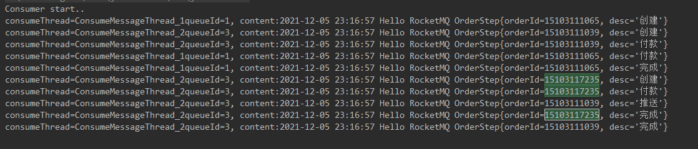
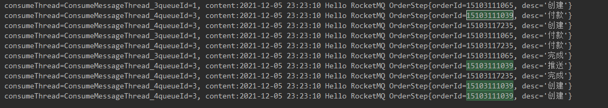

### 概要

消息有序指的是可以按照消息的发送顺序来消费(FIFO)。RocketMQ可以严格的保证消息有序，可以分为分区有序或者全局有序。

顺序消费的原理解析，在默认的情况下消息发送会采取Round Robin轮询方式把消息发送到不同的queue(分区队列)；而消费消息的时候从多个queue上拉取消息，这种情况发送和消费是不能保证顺序。但是如果控制发送的顺序消息只依次发送到同一个queue中，消费的时候只从这个queue上依次拉取，则就保证了顺序。当发送和消费参与的queue只有一个，则是全局有序；如果多个queue参与，则为分区有序，即相对每个queue，消息都是有序的。

下面用订单进行分区有序的示例。一个订单的顺序流程是：创建、付款、推送、完成。订单号相同的消息会被先后发送到同一个队列中，消费时，同一个OrderId获取到的肯定是同一个队列。

### 顺序消息生产

```java
package com.floweryu.rocketmq.order;

import org.apache.rocketmq.client.producer.DefaultMQProducer;
import org.apache.rocketmq.client.producer.MessageQueueSelector;
import org.apache.rocketmq.client.producer.SendResult;
import org.apache.rocketmq.common.message.Message;
import org.apache.rocketmq.common.message.MessageQueue;

import java.nio.charset.StandardCharsets;
import java.text.SimpleDateFormat;
import java.util.ArrayList;
import java.util.Date;
import java.util.List;

/**
 * @author Floweryu
 * @date 2021/12/5 22:17
 * 发送顺序消息
 */
public class Producer {
    public static void main(String[] args) throws Exception {
        DefaultMQProducer producer = new DefaultMQProducer("order_producer_group");
        producer.setNamesrvAddr("106.15.42.148:9876");
        producer.start();
        
        String[] tags = new String[]{"TagA", "TagB", "TagC"};
        
        // 订单列表
        List<OrderStep> orderList = new Producer().buildOrders();

        Date date = new Date();
        SimpleDateFormat sdf = new SimpleDateFormat("yyyy-MM-dd HH:mm:ss");
        String dateStr = sdf.format(date);
        for (int i = 0; i < 10; i++) {
            // 添加时间前缀
            String body = dateStr + " Hello RocketMQ " + orderList.get(i);
            Message msg = new Message("TopicTestInorder", tags[i % tags.length], "KEY" + i, body.getBytes(StandardCharsets.UTF_8));

            SendResult sendResult = producer.send(msg, new MessageQueueSelector() {
                @Override
                public MessageQueue select(List<MessageQueue> mqs, Message msg, Object arg) {
                    // 根据订单id选择发送的queue
                    Long id = (Long) arg;
                    long index = id % mqs.size();
                    return mqs.get((int) index);
                }
            }, orderList.get(i).getOrderId());

            System.out.printf("SendResult status:%s, queueId:%d, body:%s%n",
                    sendResult.getSendStatus(),
                    sendResult.getMessageQueue().getQueueId(),
                    body);
        }
        producer.shutdown();
    }
    
    private static class OrderStep {
        private long orderId;
        private String desc;

        public long getOrderId() {
            return orderId;
        }

        public void setOrderId(long orderId) {
            this.orderId = orderId;
        }

        public String getDesc() {
            return desc;
        }

        public void setDesc(String desc) {
            this.desc = desc;
        }

        @Override
        public String toString() {
            return "OrderStep{" +
                    "orderId=" + orderId +
                    ", desc='" + desc + '\'' +
                    '}';
        }
    }

    /**
     * 生成模拟订单的数据
     */
    private List<OrderStep> buildOrders() {
        List<OrderStep> orderList = new ArrayList<>();
        OrderStep orderDemo = new OrderStep();
        orderDemo.setOrderId(15103111039L);
        orderDemo.setDesc("创建");
        orderList.add(orderDemo);

        orderDemo = new OrderStep();
        orderDemo.setOrderId(15103111065L);
        orderDemo.setDesc("创建");
        orderList.add(orderDemo);

        orderDemo = new OrderStep();
        orderDemo.setOrderId(15103111039L);
        orderDemo.setDesc("付款");
        orderList.add(orderDemo);

        orderDemo = new OrderStep();
        orderDemo.setOrderId(15103117235L);
        orderDemo.setDesc("创建");
        orderList.add(orderDemo);

        orderDemo = new OrderStep();
        orderDemo.setOrderId(15103111065L);
        orderDemo.setDesc("付款");
        orderList.add(orderDemo);

        orderDemo = new OrderStep();
        orderDemo.setOrderId(15103117235L);
        orderDemo.setDesc("付款");
        orderList.add(orderDemo);

        orderDemo = new OrderStep();
        orderDemo.setOrderId(15103111065L);
        orderDemo.setDesc("完成");
        orderList.add(orderDemo);

        orderDemo = new OrderStep();
        orderDemo.setOrderId(15103111039L);
        orderDemo.setDesc("推送");
        orderList.add(orderDemo);

        orderDemo = new OrderStep();
        orderDemo.setOrderId(15103117235L);
        orderDemo.setDesc("完成");
        orderList.add(orderDemo);

        orderDemo = new OrderStep();
        orderDemo.setOrderId(15103111039L);
        orderDemo.setDesc("完成");
        orderList.add(orderDemo);

        return orderList;
    }
}

```

### 顺序消息消费

```java
package com.floweryu.rocketmq.order;

import org.apache.rocketmq.client.consumer.DefaultMQPushConsumer;
import org.apache.rocketmq.client.consumer.listener.ConsumeOrderlyContext;
import org.apache.rocketmq.client.consumer.listener.ConsumeOrderlyStatus;
import org.apache.rocketmq.client.consumer.listener.MessageListenerOrderly;
import org.apache.rocketmq.common.consumer.ConsumeFromWhere;
import org.apache.rocketmq.common.message.MessageExt;

import java.util.List;
import java.util.Random;
import java.util.concurrent.TimeUnit;

/**
 * @author Floweryu
 * @date 2021/12/5 23:03
 */
public class ConsumerInOrder {
    public static void main(String[] args) throws Exception {
        DefaultMQPushConsumer consumer = new DefaultMQPushConsumer("inorder_consumer_group");
        consumer.setNamesrvAddr("106.15.42.148:9876");

        /**
         * 设置Consumer第一次启动是从队列头部开始消费还是队列尾部开始消费
         * 如果非第一次启动，那么按照上次消费的位置继续消费
         */
        consumer.setConsumeFromWhere(ConsumeFromWhere.CONSUME_FROM_FIRST_OFFSET);
        
        consumer.subscribe("TopicTestInorder", "TagA || TagB || TagC");
        
        consumer.registerMessageListener(new MessageListenerOrderly() {
            final Random random = new Random();
            
            @Override
            public ConsumeOrderlyStatus consumeMessage(List<MessageExt> msgs, ConsumeOrderlyContext context) {
                context.setAutoCommit(true);
                for (MessageExt msg : msgs) {
                    // 可以看到每个queue有唯一的consume线程来消费, 订单对每个queue(分区)有序
                    System.out.println("consumeThread=" + Thread.currentThread().getName() + "queueId=" + msg.getQueueId() + ", content:" + new String(msg.getBody()));
                }
                
                try {
                    TimeUnit.SECONDS.sleep(random.nextInt(10));
                } catch (Exception e) {
                    e.printStackTrace();
                }
                return ConsumeOrderlyStatus.SUCCESS;
            }
        });
        
        consumer.start();

        System.out.println("Consumer start..");
    }
}

```

消费输出：



### 注意

消费的消息顺序，在本例中和消息在List中顺序一致，即遵循先进先出的原则，谁先进队列，谁就先消费。

下图是将尾号为39的订单的付款动作，放在消息列表的最后，消费者输出消息如下：



