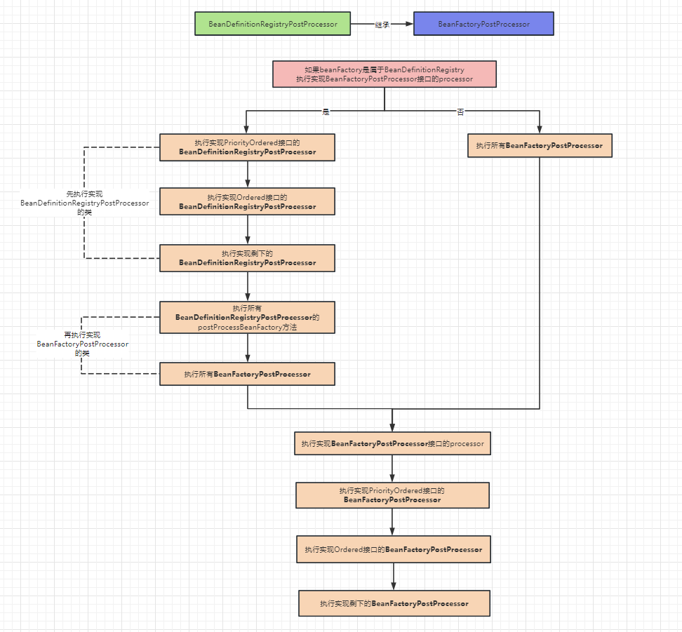
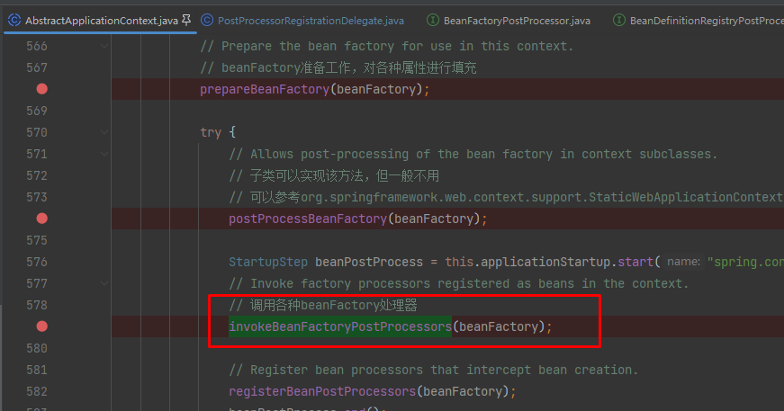

## 整体流程



## 源码理解

源码位于`PostProcessorRegistrationDelegate#invokeBeanFactoryPostProcessors`方法，这里省略了上下文，需要知道该方法是在`BeanFactory`准备完成后调用，位置如下图所示：



关于代码的理解都写在注释中：

```java
public static void invokeBeanFactoryPostProcessors(
			ConfigurableListableBeanFactory beanFactory, List<BeanFactoryPostProcessor> beanFactoryPostProcessors) {

		// WARNING: Although it may appear that the body of this method can be easily
		// refactored to avoid the use of multiple loops and multiple lists, the use
		// of multiple lists and multiple passes over the names of processors is
		// intentional. We must ensure that we honor the contracts for PriorityOrdered
		// and Ordered processors. Specifically, we must NOT cause processors to be
		// instantiated (via getBean() invocations) or registered in the ApplicationContext
		// in the wrong order.
		//
		// Before submitting a pull request (PR) to change this method, please review the
		// list of all declined PRs involving changes to PostProcessorRegistrationDelegate
		// to ensure that your proposal does not result in a breaking change:
		// https://github.com/spring-projects/spring-framework/issues?q=PostProcessorRegistrationDelegate+is%3Aclosed+label%3A%22status%3A+declined%22

		// Invoke BeanDefinitionRegistryPostProcessors first, if any.
		// 无论什么情况，优先执行BeanDefinitionRegistryPostProcessors
		// 将已经执行过的BFPP存储在processedBeans中，防止重复执行
		Set<String> processedBeans = new HashSet<>();

		// 判断beanFactory是否是BeanDefinitionRegistry类型，此处是DefaultListableBeanFactory，实现了BeanDefinitionRegistry接口，所以是true
		if (beanFactory instanceof BeanDefinitionRegistry registry) {
			// BeanDefinitionRegistryPostProcessor是BeanFactoryPostProcessor的子集
			// BeanDefinitionRegistryPostProcessor主要针对对象是BeanDefinition，BeanFactoryPostProcessor主要针对对象是BeanFactory

			// 存放BeanFactoryPostProcessor的集合
			List<BeanFactoryPostProcessor> regularPostProcessors = new ArrayList<>();

			// 存放BeanDefinitionRegistryPostProcessor的集合
			List<BeanDefinitionRegistryPostProcessor> registryProcessors = new ArrayList<>();

			// 1. 先处理外部集合传入的beanFactoryPostProcessors
			// 将BeanFactoryPostProcessor和BeanDefinitionRegistryPostProcessor区分开
			for (BeanFactoryPostProcessor postProcessor : beanFactoryPostProcessors) {
				if (postProcessor instanceof BeanDefinitionRegistryPostProcessor registryProcessor) {
					// 直接执行下面方法
					registryProcessor.postProcessBeanDefinitionRegistry(registry);
					// 添加到registryProcessors集合中，后续会执行postProcessBeanFactory方法
					registryProcessors.add(registryProcessor);
				}
				else {
					// 添加到regularPostProcessors集合中，后续会执行postProcessBeanFactory方法
					regularPostProcessors.add(postProcessor);
				}
			}

			// Do not initialize FactoryBeans here: We need to leave all regular beans
			// uninitialized to let the bean factory post-processors apply to them!
			// Separate between BeanDefinitionRegistryPostProcessors that implement
			// PriorityOrdered, Ordered, and the rest.
			// 保存本次要执行的BeanDefinitionRegistryPostProcessors
			List<BeanDefinitionRegistryPostProcessor> currentRegistryProcessors = new ArrayList<>();

			// First, invoke the BeanDefinitionRegistryPostProcessors that implement PriorityOrdered.
			// 2. 调用所有实现PriorityOrdered接口的BeanDefinitionRegistryPostProcessor实现类
			// 找到所有实现BeanDefinitionRegistryPostProcessor接口的bean的name
			String[] postProcessorNames =
					beanFactory.getBeanNamesForType(BeanDefinitionRegistryPostProcessor.class, true, false);
			// 遍历处理所有符合规则的postProcessorNames
			for (String ppName : postProcessorNames) {
				// 检查是否实现了PriorityOrdered接口
				if (beanFactory.isTypeMatch(ppName, PriorityOrdered.class)) {
					// 获取名字对应的bean实例，添加到currentRegistryProcessors中
					currentRegistryProcessors.add(beanFactory.getBean(ppName, BeanDefinitionRegistryPostProcessor.class));
					// 将要被执行的BFPP名称添加到processedBeans中，避免后续重复执行
					processedBeans.add(ppName);
				}
			}
			// 按照优先级进行排序操作
			sortPostProcessors(currentRegistryProcessors, beanFactory);
			// 添加到registryProcessors中，用于最后执行postProcessBeanFactory方法
			// 前面第一步添加的是外部定义的BeanDefinitionRegistryPostProcessor，这一步将有排序的添加进去
			registryProcessors.addAll(currentRegistryProcessors);
			// 遍历currentRegistryProcessors，执行postProcessBeanDefinitionRegistry方法
			invokeBeanDefinitionRegistryPostProcessors(currentRegistryProcessors, registry, beanFactory.getApplicationStartup());
			// 执行完毕后清空currentRegistryProcessors
			currentRegistryProcessors.clear();

			// Next, invoke the BeanDefinitionRegistryPostProcessors that implement Ordered.
			// 3. 调用所有实现Ordered接口的BeanDefinitionRegistryPostProcessors实现类
			// 找到所有实现BeanDefinitionRegistryPostProcessor接口的bean的name
			// 为什么和第2步重复？因为在上面执行过程中可能会新增其他的BeanDefinitionRegistryPostProcessor
			postProcessorNames = beanFactory.getBeanNamesForType(BeanDefinitionRegistryPostProcessor.class, true, false);
			for (String ppName : postProcessorNames) {
				// 检查是否实现了Ordered接口，并且还未执行过
				if (!processedBeans.contains(ppName) && beanFactory.isTypeMatch(ppName, Ordered.class)) {
					// 获取名字对应的bean实例，添加到currentRegistryProcessors中
					currentRegistryProcessors.add(beanFactory.getBean(ppName, BeanDefinitionRegistryPostProcessor.class));
					// 将要被执行的BFPP名称添加到processedBeans中，避免后续重复执行
					processedBeans.add(ppName);
				}
			}
			// 按照优先级进行排序操作
			sortPostProcessors(currentRegistryProcessors, beanFactory);
			// 添加到registryProcessors中，用于最后执行postProcessBeanFactory方法
			registryProcessors.addAll(currentRegistryProcessors);
			// 遍历currentRegistryProcessors，执行postProcessBeanDefinitionRegistry方法
			invokeBeanDefinitionRegistryPostProcessors(currentRegistryProcessors, registry, beanFactory.getApplicationStartup());
			// 执行完毕后清空currentRegistryProcessors
			currentRegistryProcessors.clear();

			// Finally, invoke all other BeanDefinitionRegistryPostProcessors until no further ones appear.
			// 最后，调用剩下的BeanDefinitionRegistryPostProcessor
			boolean reiterate = true;
			while (reiterate) {
				reiterate = false;
				// 找到所有实现BeanDefinitionRegistryPostProcessor接口的bean的name
				postProcessorNames = beanFactory.getBeanNamesForType(BeanDefinitionRegistryPostProcessor.class, true, false);
				for (String ppName : postProcessorNames) {
					// 跳过已经执行过的
					if (!processedBeans.contains(ppName)) {
						// 获取名字对应的bean实例，添加到currentRegistryProcessors中
						currentRegistryProcessors.add(beanFactory.getBean(ppName, BeanDefinitionRegistryPostProcessor.class));
						// 将要被执行的BFPP名称添加到processedBeans中，避免后续重复执行
						processedBeans.add(ppName);
						// 这里为true的原因是：
						// 如果还有未处理的，下面会进行处理逻辑，在执行过程中很可能会再产生BeanDefinitionRegistryPostProcessor
						reiterate = true;
					}
				}
				// 按照优先级进行排序操作
				sortPostProcessors(currentRegistryProcessors, beanFactory);
				// 添加到registryProcessors中，用于最后执行postProcessBeanFactory方法
				registryProcessors.addAll(currentRegistryProcessors);
				// 遍历currentRegistryProcessors，执行postProcessBeanDefinitionRegistry方法
				invokeBeanDefinitionRegistryPostProcessors(currentRegistryProcessors, registry, beanFactory.getApplicationStartup());
				// 执行完毕后清空currentRegistryProcessors
				currentRegistryProcessors.clear();
			}

			// Now, invoke the postProcessBeanFactory callback of all processors handled so far.
			// 调用所有BeanDefinitionRegistryPostProcessor的postProcessBeanFactory方法
			// 因为实现了BeanDefinitionRegistryPostProcessor接口一定也实现了BeanFactoryPostProcessor接口
			invokeBeanFactoryPostProcessors(registryProcessors, beanFactory);
			// 调用入参beanFactoryPostProcessors中所有普通BeanFactoryPostProcessor的postProcessBeanFactory方法
			invokeBeanFactoryPostProcessors(regularPostProcessors, beanFactory);
		}

		else {
			// Invoke factory processors registered with the context instance.
			// 如果beanFactory不属于BeanDefinitionRegistry类型，直接执行postProcessBeanFactory方法
			invokeBeanFactoryPostProcessors(beanFactoryPostProcessors, beanFactory);
		}

		// 到此为止，入参beanFactoryPostProcessors和容器中所有的BeanDefinitionRegistryPostProcessors已经全部处理完毕，
		// 下面开始处理容器中通过@Component注解提供的BeanFactoryPostProcessor，而不是ac.addBeanFactoryPostProcessor提供的
		// 上面执行的，仅仅是程序员通过add到spring容器中的beanFactoryPostProcessor

		// Do not initialize FactoryBeans here: We need to leave all regular beans
		// uninitialized to let the bean factory post-processors apply to them!
		// 找到所有实现BeanFactoryPostProcessor的类
		String[] postProcessorNames =
				beanFactory.getBeanNamesForType(BeanFactoryPostProcessor.class, true, false);

		// Separate between BeanFactoryPostProcessors that implement PriorityOrdered,
		// Ordered, and the rest.
		// 用于存放实现了PriorityOrdered接口BeanFactoryPostProcessor
		List<BeanFactoryPostProcessor> priorityOrderedPostProcessors = new ArrayList<>();
		// 用于存放实现了Ordered接口BeanFactoryPostProcessor的name
		List<String> orderedPostProcessorNames = new ArrayList<>();
		// 用于存放普通BeanFactoryPostProcessor的name
		List<String> nonOrderedPostProcessorNames = new ArrayList<>();
		// 遍历postProcessorNames，将实现的PriorityOrdered接口、rdered接口、普通三种区别开
		for (String ppName : postProcessorNames) {
			if (processedBeans.contains(ppName)) {
				// skip - already processed in first phase above
			}
			else if (beanFactory.isTypeMatch(ppName, PriorityOrdered.class)) {
				priorityOrderedPostProcessors.add(beanFactory.getBean(ppName, BeanFactoryPostProcessor.class));
			}
			else if (beanFactory.isTypeMatch(ppName, Ordered.class)) {
				orderedPostProcessorNames.add(ppName);
			}
			else {
				nonOrderedPostProcessorNames.add(ppName);
			}
		}

		// First, invoke the BeanFactoryPostProcessors that implement PriorityOrdered.
		// 对实现PriorityOrdered接口的BeanFactoryPostProcessor进行排序
		sortPostProcessors(priorityOrderedPostProcessors, beanFactory);
		// 遍历实现PriorityOrdered接口的BeanFactoryPostProcessor，执行postProcessBeanFactory方法
		invokeBeanFactoryPostProcessors(priorityOrderedPostProcessors, beanFactory);

		// Next, invoke the BeanFactoryPostProcessors that implement Ordered.
		// 创建存放Ordered接口的集合
		List<BeanFactoryPostProcessor> orderedPostProcessors = new ArrayList<>(orderedPostProcessorNames.size());
		for (String postProcessorName : orderedPostProcessorNames) {
			// 将实现Ordered接口的BeanFactoryPostProcessor添加到集合中
			orderedPostProcessors.add(beanFactory.getBean(postProcessorName, BeanFactoryPostProcessor.class));
		}
		// 对实现Ordered接口的BeanFactoryPostProcessor进行排序
		sortPostProcessors(orderedPostProcessors, beanFactory);
		// 遍历实现Ordered接口的BeanFactoryPostProcessor，执行postProcessBeanFactory方法
		invokeBeanFactoryPostProcessors(orderedPostProcessors, beanFactory);

		// Finally, invoke all other BeanFactoryPostProcessors.
		// 创建存放普通对象的集合
		List<BeanFactoryPostProcessor> nonOrderedPostProcessors = new ArrayList<>(nonOrderedPostProcessorNames.size());
		for (String postProcessorName : nonOrderedPostProcessorNames) {
			// 将普通的BeanFactoryPostProcessor添加到集合中
			nonOrderedPostProcessors.add(beanFactory.getBean(postProcessorName, BeanFactoryPostProcessor.class));
		}
		// 遍历普通的BeanFactoryPostProcessor，执行postProcessBeanFactory方法
		invokeBeanFactoryPostProcessors(nonOrderedPostProcessors, beanFactory);

		// Clear cached merged bean definitions since the post-processors might have
		// modified the original metadata, e.g. replacing placeholders in values...
		// 清除元数据缓存（mergeBeanDefinitions、allBeanNamesByType、singletonBeanNameByType）
		// 因为后置处理器可能已经修改了原始数据，比如：替换值中的占位符
		beanFactory.clearMetadataCache();
	}
```

