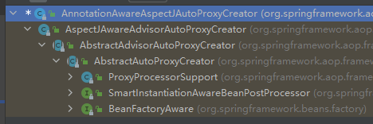

## 一.. 引入

### 1.1 概念


### 1.2 注解方式使用AOP

```java
@Aspect
public class LogAspects {

/**
     * 1. 本类引用，只需要写方法名
     * 2. 其他类引用，需要写路径
     */
    @Pointcut("execution(public int com.floweryu.aop.MathCalculator.*(..))")
    public void pointCut() {}

    /**
     * 前置通知：在目标方法被调用之前调用通知功能
     */
    @Before("pointCut()")
    public void logStart(JoinPoint joinPoint) {
        Object[] args = joinPoint.getArgs();
        System.out.println("@Before执行..." + joinPoint.getSignature().getName() + " 运行开始.......参数列表是: {" + Arrays.toString(args) + "}");
    }

    /**
     * 后置通知：在目标方法调用之后调用通知，此时不关心方法的输出结果
     */
    @After("pointCut()")
    public void logEnd() {
        System.out.println("@After执行...   方法执行结束.......");
    }

    /**
     * 返回通知：在目标方法执行成功后调用通知
     */
    @AfterReturning(value = "pointCut()", returning = "returning")
    public void logReturn(Object returning) {
        System.out.println("@AfterReturning执行...   除法正常返回.......返回值: {" + returning + "}");
    }

    /**
     * 异常通知：在目标方法抛出异常后调用通知
     */
    @AfterThrowing(value = "pointCut()", throwing = "ex")
    public void logException(Exception ex) {
        System.out.println("@AfterThrowing执行...   除法异常.......异常: {" + ex +"}");
    }
    
    @Around("pointCut()")
    public Object logAround(ProceedingJoinPoint joinPoint) throws Throwable {
        System.out.println("@Around执行...   方法执行前调用========");
		// 通过反射调用div方法
		// 又回到此处CglibAopProxy.CglibMethodInvocation.proceed, 相当于mi.proceed()
        Object result = joinPoint.proceed();
        System.out.println("@Around执行...   方法执行后调用========");
        return result;
    }
}


public class MathCalculator {
    
    public int div(int i, int j) {
        System.out.println("MathCalculator is running...");
        return i / j;
    }
}

```

### 1.3 xml方式使用AOP

```java
<?xml version="1.0" encoding="UTF-8"?>
<beans xmlns="http://www.springframework.org/schema/beans"
	   xmlns:xsi="http://www.w3.org/2001/XMLSchema-instance" xmlns:aop="http://www.springframework.org/schema/aop"
	   xsi:schemaLocation="http://www.springframework.org/schema/beans http://www.springframework.org/schema/beans/spring-beans.xsd http://www.springframework.org/schema/aop https://www.springframework.org/schema/aop/spring-aop.xsd">
	
	<bean id="logAspects" class="com.floweryu.aop.LogAspects" />
	<bean id="mathCalculator" class="com.floweryu.aop.MathCalculator" />
	
	<aop:config>
		<aop:aspect ref="logAspects">
			<aop:pointcut id="pointCut" expression="execution(public int com.floweryu.aop.MathCalculator.*(..))"/>
			<aop:after method="logEnd" pointcut-ref="pointCut" />
			<aop:before method="logStart" pointcut-ref="pointCut" />
			<aop:after-returning method="logReturn" pointcut-ref="pointCut" returning="returning" />
			<aop:after-throwing method="logException" pointcut-ref="pointCut" throwing="ex" />
			<aop:around method="logAround" pointcut-ref="pointCut" />
		</aop:aspect>
	</aop:config>
	<aop:aspectj-autoproxy />
</beans>
```

### 1.4 抛出问题？

#### a. Advice的执行顺序？


<center>xml执行后输出</center>


<center>注解方式执行后输出</center>

对比上面两张图片，可以看到**@Around、@After、@Before**这三个执行顺序有变化。

在Spring5.x或6.x，省略@Around的时候，执行顺序为：

- 正常情况：@Before —-> 目标方法 —-> @AfterReturning —-> @After
- 异常情况：@Before —-> 目标方法 —-> @AfterThrowing —-> @After


## 二.. @EnableAspectJAutoProxy注解

> 以注解方式为例开始源码阅读。

关键在于**@EnableAspectJAutoProxy**注解，开启了AspectJ的代理功能，顺着该注解点下去，可以在**AopConfigUtils类**中找到下面这一段代码：

```java
public static BeanDefinition registerAspectJAnnotationAutoProxyCreatorIfNecessary(
    BeanDefinitionRegistry registry, @Nullable Object source) {
	// 该方法会自动注册AnnotationAwareAspectJAutoProxyCreator类, 并且如果有其他代理，会根据代理优先级注入
    return registerOrEscalateApcAsRequired(AnnotationAwareAspectJAutoProxyCreator.class, registry, source);
}

	private static BeanDefinition registerOrEscalateApcAsRequired(
			Class<?> cls, BeanDefinitionRegistry registry, @Nullable Object source) {

		Assert.notNull(registry, "BeanDefinitionRegistry must not be null");

        // 如果有org.springframework.aop.config.internalAutoProxyCreator代理，则根据优先级注入代理
		if (registry.containsBeanDefinition(AUTO_PROXY_CREATOR_BEAN_NAME)) {
			BeanDefinition apcDefinition = registry.getBeanDefinition(AUTO_PROXY_CREATOR_BEAN_NAME);
			if (!cls.getName().equals(apcDefinition.getBeanClassName())) {
				int currentPriority = findPriorityForClass(apcDefinition.getBeanClassName());
				int requiredPriority = findPriorityForClass(cls);
				if (currentPriority < requiredPriority) {
					apcDefinition.setBeanClassName(cls.getName());
				}
			}
			return null;
		}
		// ......
		return beanDefinition;
	}
```

上面就将**AnnotationAwareAspectJAutoProxyCreator**类注入到容器中。

## 三.. AOP代理创建过程

### 3.1 获取增强方法

看一下核心类：**AnnotationAwareAspectJAutoProxyCreator**做了哪些事情？



`AnnotationAwareAspectJAutoProxyCreator`实现了`BeanFactoryAware`接口，这样当Spring加载到这个Bean时会调用其`postProcessAfterInitialization`方法：

> 代码：org.springframework.aop.framework.autoproxy.AbstractAutoProxyCreator#postProcessAfterInitialization

```java
/**
	 * 此处是真正创建aop代理的地方, 在实例化之后, 初始化之后就进行处理
	 * 首先查看是否在earlyProxyReferences里是否存在, 如果有就说明处理过了, 不存在就考虑是否进行代理
	 * @see #getAdvicesAndAdvisorsForBean
	 * 在解决循环依赖时也用到earlyProxyReferences和wrapIfNecessary
	 * @see #getEarlyBeanReference(java.lang.Object, java.lang.String)
	 */
@Override
public Object postProcessAfterInitialization(@Nullable Object bean, String beanName) {
    if (bean != null) {
        // 获取当前bean的key: 如果beanName不为空, 则以beanName为Key
        // 如果为FactoryBean类型, 前面会添加&符号
        // 如果beanName为空, 则以当前bean对应的class为key
        Object cacheKey = getCacheKey(bean.getClass(), beanName);
        // 判断当前bean是否正在被代理, 如果正在被代理则不进行封装
        if (this.earlyProxyReferences.remove(cacheKey) != bean) {
            // 如果bean需要被代理, 则需要封装指定的bean
            return wrapIfNecessary(bean, beanName, cacheKey);
        }
    }
    return bean;
}

protected Object wrapIfNecessary(Object bean, String beanName, Object cacheKey) {
    // 如果已经被处理过, 直接返回
    if (StringUtils.hasLength(beanName) && this.targetSourcedBeans.contains(beanName)) {
        return bean;
    }

    // 这里的advisedBeans缓存了已经进行了代理的bean，如果缓存中存在, 则可以直接返回
    if (Boolean.FALSE.equals(this.advisedBeans.get(cacheKey))) {
        return bean;
    }

    // isInfrastructureClass(cls)用户判断当前cls是否为spring自带的bean, 自带的bean是不用代理的, 见下
    // Advice/Pointcut/Advisor/AopInfrastructureBean的类或子类
    // shouldSkip()用于判断当前bean是否应该被略过(bean的名称是否以.ORIGINAL结尾)
    if (isInfrastructureClass(bean.getClass()) || shouldSkip(bean.getClass(), beanName)) {
        // 对当前bean进行缓存
        this.advisedBeans.put(cacheKey, Boolean.FALSE);
        return bean;
    }

    // 图(1) && 核心代码		获取当前bean的Advices和Advisors, Interceptors
    Object[] specificInterceptors = getAdvicesAndAdvisorsForBean(bean.getClass(), beanName, null);
    if (specificInterceptors != DO_NOT_PROXY) {
        // 对当前bean的代理状态进行缓存
        this.advisedBeans.put(cacheKey, Boolean.TRUE);
        // 根据获取到的Advices和Advisors为当前bean生成代理对象(见创建代理一节)
        Object proxy = createProxy(
            bean.getClass(), beanName, specificInterceptors, new SingletonTargetSource(bean));
        // 缓存生成的代理bean的类型, 并且返回生成的代理bean 
        this.proxyTypes.put(cacheKey, proxy.getClass());
        return proxy;
    }

    this.advisedBeans.put(cacheKey, Boolean.FALSE);
    return bean;
}
```


<center>图(1)</center>

> 核心代码：AbstractAdvisorAutoProxyCreator#**getAdvicesAndAdvisorsForBean**

先总结一下该方法做了哪些事情：

- 获取所有增强方法（即LogAspects切面定义的各个方法）。
- 通过切点表达式pointCut判断这些增强方法是否可为当前Bean所用。
- 如果有符合的通知方法，则对它们进行排序（排序规则不同版本Spring有所不同，这里就可以解释xml和注解方式使用aop为什么顺序不同）。

```java
protected Object[] getAdvicesAndAdvisorsForBean(
    Class<?> beanClass, String beanName, @Nullable TargetSource targetSource) {
	// 核心方法: 找到合适的增强对象
    List<Advisor> advisors = findEligibleAdvisors(beanClass, beanName);
    if (advisors.isEmpty()) {
        return DO_NOT_PROXY;
    }
    return advisors.toArray();
}	

//核心方法
protected List<Advisor> findEligibleAdvisors(Class<?> beanClass, String beanName) {
    // 图(1). 对所有的切面逻辑进行封装, 从而得到目标Advisor.  	
    List<Advisor> candidateAdvisors = findCandidateAdvisors();
    // 图(2). 对所有的Advisor进行判断, 看其切面定义是否可以应用到当前bean, 从而得到最终需要应用的Advisor(这里不详细介绍)
    List<Advisor> eligibleAdvisors = findAdvisorsThatCanApply(candidateAdvisors, beanClass, beanName);
    // 图(3). 提供hook方法, 用于对目标Advisor进行扩展, 可以看到比图(2)多了一个Advisor
    extendAdvisors(eligibleAdvisors);
    if (!eligibleAdvisors.isEmpty()) {
        // 对需要代理的Advisor按照一定规则进行排序. 
        // 在有多个切面的情况下, 多个切点使用了同一个连接点, 这样就需要有一定的顺序, 可以配置@Order来决定顺序
		// 里面大概是一个拓扑排序，所以会xml方式和注解方式的执行顺序会有一些不同(在使用@Around、@Before、@After情况下)
        // 核心代码
        eligibleAdvisors = sortAdvisors(eligibleAdvisors);
    }
    return eligibleAdvisors;
}
```


<center>图(1)</center>


<center>图(2)</center>


<center>图(3)</center>

> 核心代码: AbstractAdvisorAutoProxyCreator#**sortAdvisors**
>
> **拓扑排序**：在有向无环图下，每次排序选取无前驱的节点
>
> 
>
> **增强器执行顺序**：
>
> 官方文档对此有说明：https://docs.spring.io/spring-framework/docs/current/reference/html/core.html#aop-ataspectj-advice-ordering
>
> - 在同一个Aspect 切面中，针对同一个 pointCut，定义了两个相同的 Advice（比如：定义了两个 @Before)，那么这两个 advice 的执行顺序是无法确定的，哪怕你给这两个 advice 添加了 @Order 这个注解，也不行。
> - 针对不同的Aspect切面中，需要实现**org.springframework.core.Ordered**接口，实现它的**getOrder()**方法，值越小的 aspect 越先执行。否则执行顺序不固定


### 3.2 创建代理

> createProxy方法点进去在6.x版本会直接进去buildProxy方法，该方法在经过一系列的判断后执行proxyFactory.getProxy(classLoader)创建代理对象

```java
private Object buildProxy(Class<?> beanClass, @Nullable String beanName,
                          @Nullable Object[] specificInterceptors, TargetSource targetSource, boolean classOnly) {

    // 给bean定义设置一个属性originalTargetClass(不重要)
    if (this.beanFactory instanceof ConfigurableListableBeanFactory) {
        AutoProxyUtils.exposeTargetClass((ConfigurableListableBeanFactory) this.beanFactory, beanName, beanClass);
    }

    // 创建一个代理工厂
    ProxyFactory proxyFactory = new ProxyFactory();
    // 获取当前类相关属性
    proxyFactory.copyFrom(this);

    // 判断对于给定的bean是否应该使用targetClass代理而不是它的接口代理
    if (proxyFactory.isProxyTargetClass()) {
        // Explicit handling of JDK proxy targets and lambdas (for introduction advice scenarios)
        if (Proxy.isProxyClass(beanClass) || ClassUtils.isLambdaClass(beanClass)) {
            // Must allow for introductions; can't just set interfaces to the proxy's interfaces only.
            for (Class<?> ifc : beanClass.getInterfaces()) {
                proxyFactory.addInterface(ifc);
            }
        }
    }
    else {
        // 检查preserveTargetClass, 判断是使用JDK代理还是 CGLIB代理
        if (shouldProxyTargetClass(beanClass, beanName)) {
            // 如果是使用CGLIB代理
            proxyFactory.setProxyTargetClass(true);
        }
        else {
            // 添加代理接口
            evaluateProxyInterfaces(beanClass, proxyFactory);
        }
    }

    // 构建增强器
    Advisor[] advisors = buildAdvisors(beanName, specificInterceptors);
    // 设置增强器
    proxyFactory.addAdvisors(advisors);
    // 设置要代理的类(MathCalculator)
    proxyFactory.setTargetSource(targetSource);
    // 定制代理
    customizeProxyFactory(proxyFactory);
    // 代理工厂配置之后, 是否还允许被修改, 默认值是false
    proxyFactory.setFrozen(this.freezeProxy);
    if (advisorsPreFiltered()) {
        proxyFactory.setPreFiltered(true);
    }

    // 新版本新增
    // Use original ClassLoader if bean class not locally loaded in overriding class loader
    ClassLoader classLoader = getProxyClassLoader();
    if (classLoader instanceof SmartClassLoader && classLoader != beanClass.getClassLoader()) {
        classLoader = ((SmartClassLoader) classLoader).getOriginalClassLoader();
    }
    // 图(1)   classOnly是false, 所以走getProxy
    return (classOnly ? proxyFactory.getProxyClass(classLoader) : proxyFactory.getProxy(classLoader));
}
```


<center>图(1)-代理后的对象详情</center>

后续从IOC容器中获得的TargetClass就是被代理后的对象，执行代理对象的目标方法的时候，代理对象会执行相应的通知方法链。

> 核心代码：org.springframework.aop.framework.DefaultAopProxyFactory#createAopProxy，由proxyFactory.getProxy进入

```java
public AopProxy createAopProxy(AdvisedSupport config) throws AopConfigException {
    // 判断选择哪种创建代理对象的方式
    // config.isOptimize(): 是否对代理类的生成使用策略优化, 作用和isProxyTargetClass(使用aop时可配置)是一样的, 默认为false
    // config.isProxyTargetClass(): 是否使用CGLIB的方式创建代理对象, 默认为false
    // hasNoUserSuppliedProxyInterfaces: 目标类是否有接口存在 并且 只有一个接口时接口类型是否为SpringProxy类型
    if (config.isOptimize() || config.isProxyTargetClass() || hasNoUserSuppliedProxyInterfaces(config)) {
        // 上面三个方法有一个为true就进入这里
        // 从AdvisordSupport中获取目标类, 对象
        Class<?> targetClass = config.getTargetClass();
        if (targetClass == null) {
            throw new AopConfigException("TargetSource cannot determine target class: " +
                                         "Either an interface or a target is required for proxy creation.");
        }

        // 如果目标类是接口 Proxy类型 lambad表达式(新增), 则还是使用JDK方式生成代理
        if (targetClass.isInterface() || Proxy.isProxyClass(targetClass) || ClassUtils.isLambdaClass(targetClass)) {
            return new JdkDynamicAopProxy(config);
        }
        // 目标类没有接口配置了使用CGLIB进行动态代理, 使用CGLIB创建代理对象
        return new ObjenesisCglibAopProxy(config);
    }
    else {
        // 使用JDK方式创建代理对象
        return new JdkDynamicAopProxy(config);
    }
}
```

****

#### JDK和CGLIB代理方式

- 如果目标对象实现了接口，默认情况下会采用JDK的动态代理实现AOP
- 如果目标对象实现了接口，可以强制使用CGLIB实现AOP，方法见下。
- 如果目标对象没有实现接口，必须采用CGLIB库，Spring会自动在JDK和CGLIB中转换。

**如何强制使用CGLIB代理？**

- 添加CGLIB库
- 设置`proxyTargetClass = true`

****

**JDK代理和CGLIB代理区别：**

- JDK动态代理只能针对实现了接口的类生成代理，不能针对类。
- CGLIB代理是针对类实现的代理，主要是针对指定的类生成一个子类，覆盖其中的方法，**因为是继承，所以该类或方法最好不要声明为final**。

## 四.. 生成拦截器链MethodInterceptor

AOP代理对象生成后，接着关注代理对象的目标方法执行时，增强方法是怎么被执行的。


在目标方法执行这里打上断点，开始debug。


可以看到获取到的bean就是前面CGLIB代理后的Bean（**MathCalculator$$SpringCGLIB**）。

Step Into进入内部，程序跳转到下面方法中，说明目标对象的目标方法被拦截了，主要逻辑如下：

> 拦截器起点：CglibAopProxy.DynamicAdvisedInterceptor#intercept

```java
public Object intercept(Object proxy, Method method, Object[] args, MethodProxy methodProxy) throws Throwable {
    Object oldProxy = null;
    boolean setProxyContext = false;
    Object target = null;
    // 存放的是要代理的对象(例如: MathCalculator)
    TargetSource targetSource = this.advised.getTargetSource();
    try {
        // 不重要
        if (this.advised.exposeProxy) {
            // Make invocation available if necessary.
            oldProxy = AopContext.setCurrentProxy(proxy);
            setProxyContext = true;
        }
        // Get as late as possible to minimize the time we "own" the target, in case it comes from a pool...
        // 获取应用的class类
        target = targetSource.getTarget();
        Class<?> targetClass = (target != null ? target.getClass() : null);
        // 核心方法: 从advised中获取配置好的AOP拦截器链
        List<Object> chain = this.advised.getInterceptorsAndDynamicInterceptionAdvice(method, targetClass);
        Object retVal;
        // Check whether we only have one InvokerInterceptor: that is,
        // no real advice, but just reflective invocation of the target.
        // 如果拦截器链为空
        if (chain.isEmpty()) {
            // We can skip creating a MethodInvocation: just invoke the target directly.
            // Note that the final invoker must be an InvokerInterceptor, so we know
            // it does nothing but a reflective operation on the target, and no hot
            // swapping or fancy proxying.
            Object[] argsToUse = AopProxyUtils.adaptArgumentsIfNecessary(method, args);
            // 直接激活原方法
            retVal = AopUtils.invokeJoinpointUsingReflection(target, method, argsToUse);
        }
        else {
            // We need to create a method invocation...
            // 核心方法：通过CglibMethodInvocation来启动advice通知, 相当于一个纽带
            retVal = new CglibMethodInvocation(proxy, target, method, args, targetClass, chain, methodProxy).proceed();
        }
        retVal = processReturnType(proxy, target, method, retVal);
        return retVal;
    }
    finally {
        if (target != null && !targetSource.isStatic()) {
            targetSource.releaseTarget(target);
        }
        if (setProxyContext) {
            // Restore old proxy.
            AopContext.setCurrentProxy(oldProxy);
        }
    }
}
```

这里先重点关注下**getInterceptorsAndDynamicInterceptionAdvice**方法，其源码如下所示：

> 核心方法： AdvisedSupport#getInterceptorsAndDynamicInterceptionAdvice 获取拦截器链
>
> 所谓的拦截器链，就是在代理对象的某个方法被执行时，从通知方法集合（创建代理对象的时候就已经将可用通知集合保存在代理对象中了）中筛选出适用于该方法的通知，然后封装为拦截器对象集合（类型为MethodInteceptor，下面会介绍到）。

```java
public List<Object> getInterceptorsAndDynamicInterceptionAdvice(Method method, @Nullable Class<?> targetClass) {
    // 创建一个method对象, 在MethodCacheKey中实现了equals和hashcode, 还实现了compareTo方法
    MethodCacheKey cacheKey = new MethodCacheKey(method);
    List<Object> cached = this.methodCache.get(cacheKey);
    // 先从缓存中获取, 缓存中获取不到再调用方法获取, 然后再放到缓存中
    if (cached == null) {
        // 核心方法: 获取MethodInterceptor
        cached = this.advisorChainFactory.getInterceptorsAndDynamicInterceptionAdvice(
            this, method, targetClass);
        this.methodCache.put(cacheKey, cached);
    }
    return cached;
}
```

继续查看**this.advisorChainFactory.getInterceptorsAndDynamicInterceptionAdvice**源码

> 核心方法：DefaultAdvisorChainFactory#getInterceptorsAndDynamicInterceptionAdvice 主要逻辑：
>
> 遍历代理对象的增强器集合，然后判断是否可以应用于当前调用的目标方法，如果可以，则将增强器（Advisor）转换为MethodInterceptor（直接转换，或者通过适配器转换），最终添加到interceptorList列表中。

```java
public List<Object> getInterceptorsAndDynamicInterceptionAdvice(
    Advised config, Method method, @Nullable Class<?> targetClass) {

    // This is somewhat tricky... We have to process introductions first,
    // but we need to preserve order in the ultimate list.
    // 这里使用了单例模式, 获取DefaultAdvisorAdapterRegistry实例
    // spring符合单一职责的原则有很多, 每个功能都会有响应的类去处理
    // 主要作用是将Advice适配为Advisor, 将Advisor适配为对应的MethodInterceptor
    AdvisorAdapterRegistry registry = GlobalAdvisorAdapterRegistry.getInstance();
    // 创建一个之前获取到的通知个数集合
    Advisor[] advisors = config.getAdvisors();
    List<Object> interceptorList = new ArrayList<>(advisors.length);
    // 如果目标类为null的话, 则从方法签名中获取目标类
    Class<?> actualClass = (targetClass != null ? targetClass : method.getDeclaringClass());
    // 判断是否有引介增强
    Boolean hasIntroductions = null;

    // 循环目标方法匹配的通知
    for (Advisor advisor : advisors) {
        if (advisor instanceof PointcutAdvisor pointcutAdvisor) {
            // Add it conditionally.
            // 提前进行前置过滤或者当前的Advisor适用于目标类(MathCalculator)
            if (config.isPreFiltered() || pointcutAdvisor.getPointcut().getClassFilter().matches(actualClass)) {
                MethodMatcher mm = pointcutAdvisor.getPointcut().getMethodMatcher();
                boolean match;
                // 检查Advisor是否适用于此目标方法
                if (mm instanceof IntroductionAwareMethodMatcher) {
                    if (hasIntroductions == null) {
                        hasIntroductions = hasMatchingIntroductions(advisors, actualClass);
                    }
                    match = ((IntroductionAwareMethodMatcher) mm).matches(method, actualClass, hasIntroductions);
                }
                else {
                    // 匹配当前method是否属于目标类
                    match = mm.matches(method, actualClass);
                }
                if (match) {
                    // 核心方法：通过advisor获取拦截器链
                    MethodInterceptor[] interceptors = registry.getInterceptors(advisor);
                    if (mm.isRuntime()) {
                        // Creating a new object instance in the getInterceptors() method
                        // isn't a problem as we normally cache created chains.
                        // 动态切入点会创建一个InterceptorAndDynamicMethodMatcher对象
                        // 这个对象包含MethodInterceptor和MethodMatcher实例
                        for (MethodInterceptor interceptor : interceptors) {
                            interceptorList.add(new InterceptorAndDynamicMethodMatcher(interceptor, mm));
                        }
                    }
                    else {
                        interceptorList.addAll(Arrays.asList(interceptors));
                    }
                }
            }
        }
        else if (advisor instanceof IntroductionAdvisor ia) {
            if (config.isPreFiltered() || ia.getClassFilter().matches(actualClass)) {
                Interceptor[] interceptors = registry.getInterceptors(advisor);
                interceptorList.addAll(Arrays.asList(interceptors));
            }
        }
        else {
            Interceptor[] interceptors = registry.getInterceptors(advisor);
            interceptorList.addAll(Arrays.asList(interceptors));
        }
    }

    return interceptorList;
}
```

在上面代码中，重点关注一下**registry.getInterceptors(advisor)**这个核心代码：

> 核心代码: DefaultAdvisorAdapterRegistry#getInterceptors

```java
public MethodInterceptor[] getInterceptors(Advisor advisor) throws UnknownAdviceTypeException {
    List<MethodInterceptor> interceptors = new ArrayList<>(3);
    // 从advisor中获取advice
    Advice advice = advisor.getAdvice();
    if (advice instanceof MethodInterceptor) {
        interceptors.add((MethodInterceptor) advice);
    }
    
    for (AdvisorAdapter adapter : this.adapters) {
        // 判断当前advice是否为下面三种
        // MethodBeforeAdviceAdapter  AfterReturningAdviceAdapter  ThrowsAdviceAdapter
        // 上面三种都没有实现MethodInterceptor接口
        // 如果匹配到, 就添加对应的MethodInterceptor
        // 为什么要这样设计? 便于扩展
        if (adapter.supportsAdvice(advice)) {
            interceptors.add(adapter.getInterceptor(advisor));
        }
    }
    if (interceptors.isEmpty()) {
        throw new UnknownAdviceTypeException(advisor.getAdvice());
    }
    return interceptors.toArray(new MethodInterceptor[0]);
}
```

其中，**this.adapters**里面成员如下：


> 为什么这三个增强器是通过适配器转换？
>
> 这里整理一下所有增强器实现的接口：
>
> 
>
> 原本所有的advice都可以实现MethodInterceptor接口，但是这样的话再组装MethodInterceptor的时候，就需要添加额外的逻辑才能添加两次MethodInterceptor。
>
> 为了提高扩展性，这里提供了适配器模式，MethodInterceptor接口的某些advice直接通过适配器来实现，而不需要通过原来的方式，这样就可以更好更方便的扩展添加advice。

## 五.. 链式调用增强方法

> 在获取到拦截器链后，会调用核心方法：retVal = new CglibMethodInvocation(proxy, target, method, args, targetClass, chain, methodProxy).proceed();


> 进入CglibAopProxy.CglibMethodInvocation#proceed方法，该方法在后面会多次调用

```java
public Object proceed() throws Throwable {
    try {
        // 只需要关注这个方法即可
        return super.proceed();
    }
    catch (RuntimeException ex) {
        throw ex;
    }
    catch (Exception ex) {
        if (ReflectionUtils.declaresException(getMethod(), ex.getClass()) ||
            KotlinDetector.isKotlinType(getMethod().getDeclaringClass())) {
            // Propagate original exception if declared on the target method
            // (with callers expecting it). Always propagate it for Kotlin code
            // since checked exceptions do not have to be explicitly declared there.
            throw ex;
        }
        else {
            // Checked exception thrown in the interceptor but not declared on the
            // target method signature -> apply an UndeclaredThrowableException,
            // aligned with standard JDK dynamic proxy behavior.
            throw new UndeclaredThrowableException(ex);
        }
    }
}
```

### 5.1 拦截器调用具体过程

#### 调用链路图


> 核心方法：ReflectiveMethodInvocation#proceed

```java
public Object proceed() throws Throwable {
    // We start with an index of -1 and increment early.
    // 从索引为-1的拦截器开始调用, 并按序递增
    // 如果拦截器链中的拦截器迭代调用完毕, 开始调用target函数, 这个函数是通过反射完成的
    if (this.currentInterceptorIndex == this.interceptorsAndDynamicMethodMatchers.size() - 1) {
        // 开始调用目标函数
        return invokeJoinpoint();
    }

    // 获取下一个要执行的拦截器
    Object interceptorOrInterceptionAdvice =
        this.interceptorsAndDynamicMethodMatchers.get(++this.currentInterceptorIndex);
    if (interceptorOrInterceptionAdvice instanceof InterceptorAndDynamicMethodMatcher dm) {
        // Evaluate dynamic method matcher here: static part will already have
        // been evaluated and found to match.
        Class<?> targetClass = (this.targetClass != null ? this.targetClass : this.method.getDeclaringClass());
        if (dm.methodMatcher.matches(this.method, targetClass, this.arguments)) {
            return dm.interceptor.invoke(this);
        }
        else {
            // Dynamic matching failed.
            // Skip this interceptor and invoke the next in the chain.
            return proceed();
        }
    }
    else {
        // It's an interceptor, so we just invoke it: The pointcut will have
        // been evaluated statically before this object was constructed.
        // 因为前面获取到的拦截器对象里面都是拦截器, 所以直接调用这里, 将this作为参数传递以保证当前实例中调用链的执行
        return ((MethodInterceptor) interceptorOrInterceptionAdvice).invoke(this);
    }
}
```

#### 第一次调用

程序第一次进该方法时**currentInterceptorIndex值为0**，**this.interceptorsAndDynamicMethodMatchers.get(++this.currentInterceptorIndex)**取出拦截器链第一个拦截器**ExposeInvocationInterceptor**，方法最后调用该拦截器的invoke方法，Step Into进入该方法：


**mi**就是我们传入的**ReflectiveMethodInvocation**对象，程序执行到**mi.proceed**方法时，Step Into进入该方法：

#### 第二次调用

可以看到，此时程序第二次执行**ReflectiveMethodInvocation**的**poceed**方法，**currentInterceptorIndex值为1**，取出拦截器链第二个拦截器**AspectJAroundAdvice**，方法最后调用该拦截器的invoke方法，Step Into进入该方法：


> AspectJAroundAdvice#invoke

```java
public Object invoke(MethodInvocation mi) throws Throwable {
    if (!(mi instanceof ProxyMethodInvocation pmi)) {
        throw new IllegalStateException("MethodInvocation is not a Spring ProxyMethodInvocation: " + mi);
    }
    // 创建MethodInvocationProceedingJoinPoint对象包装, 这个对象实现了ProceedingJoinPoint接口
    // 而在@Around注解下, 入参参数正是 ProceedingJoinPoint
    ProceedingJoinPoint pjp = lazyGetProceedingJoinPoint(pmi);
    JoinPointMatch jpm = getJoinPointMatch(pmi);
    // 调用通知的方法
    return invokeAdviceMethod(pjp, jpm, null, null);
}
```

> 核心方法：AbstractAspectJAdvice#invokeAdviceMethodWithGivenArgs
>
> 该方法会调用增强器方法，如果通过debug模式，可以看到每次执行增强器方法时，都会经过该方法。

```java
protected Object invokeAdviceMethodWithGivenArgs(Object[] args) throws Throwable {
    Object[] actualArgs = args;
    // 判断通知的方法是否有参数
    if (this.aspectJAdviceMethod.getParameterCount() == 0) {
        actualArgs = null;
    }
    try {
        ReflectionUtils.makeAccessible(this.aspectJAdviceMethod);
        // 执行方法, 这时会执行增强器里面逻辑
        // 比如@Around增强, 会执行com.floweryu.aop.LogAspects.logAround里面逻辑
        return this.aspectJAdviceMethod.invoke(this.aspectInstanceFactory.getAspectInstance(), actualArgs);
    }
    catch (IllegalArgumentException ex) {
        throw new AopInvocationException("Mismatch on arguments to advice method [" +
                                         this.aspectJAdviceMethod + "]; pointcut expression [" +
                                         this.pointcut.getPointcutExpression() + "]", ex);
    }
    catch (InvocationTargetException ex) {
        throw ex.getTargetException();
    }
}
```

跳转到**logAround**方法执行：


可以看到，代码会跳转到**logAround**方法中，在输出方法执行前逻辑后，会继续执行**proceed**方法回到拦截器链中。此时控制台打印：


#### 第三次调用

程序并没有完全执行**logAround**，而是回到拦截器链中进行第三次调用，此时程序第三次执行**ReflectiveMethodInvocation**的**poceed**方法，**currentInterceptorIndex值为2**，取出拦截器链第三个拦截器**MethodBeforeAdviceInterceptor**，Step Into进入invoke方法。


> Before拦截器：MethodBeforeAdviceInterceptor#invoke

```java
public Object invoke(MethodInvocation mi) throws Throwable {
    // 执行前置通知方法
    this.advice.before(mi.getMethod(), mi.getArguments(), mi.getThis());
    // 执行下一个拦截器, 但是该拦截器是方法前执行的最后一个了, 所以会调用目标方法
    return mi.proceed();
}
```

执行完**before**方法后，控制台输出如下：


执行**mi.proceed()**，进入第四次调用

#### 第四次调用

此时程序第四次执行**ReflectiveMethodInvocation**的**poceed**方法，**currentInterceptorIndex值为3**，取出拦截器链第四个拦截器**AspectJAfterAdvice**，Step Into进入invoke方法。


> After拦截器：AspectJAfterAdvice#invoke

```java
public Object invoke(MethodInvocation mi) throws Throwable {
    try {
        return mi.proceed();
    }
    finally {
        // 后置执行方法总会被执行, 因为在finally中
        invokeAdviceMethod(getJoinPointMatch(), null, null);
    }
}
```

这里很特殊，看到After拦截器先继续调用拦截器链，然后再finally中执行具体的增强器逻辑。

#### 第五次调用

此时程序第五次执行**ReflectiveMethodInvocation**的**poceed**方法，**currentInterceptorIndex值为4**，取出拦截器链第五个拦截器**AfterReturningAdviceInterceptor**，Step Into进入invoke方法。


> 返回拦截器：AfterReturningAdviceInterceptor#invoke

```java
public Object invoke(MethodInvocation mi) throws Throwable {
    // 执行下一个拦截器
    Object retVal = mi.proceed();
    // 返回目标方法
    this.advice.afterReturning(retVal, mi.getMethod(), mi.getArguments(), mi.getThis());
    return retVal;
}
```

这里也是先执行下一个拦截器

#### 第六次调用

此时程序第六次执行**ReflectiveMethodInvocation**的**poceed**方法，**currentInterceptorIndex值为5**，取出拦截器链第六个拦截器**AspectJAfterThrowingAdvice**，Step Into进入invoke方法。


> 抛出异常拦截器：AspectJAfterThrowingAdvice#invoke

```java
public Object invoke(MethodInvocation mi) throws Throwable {
    try {
        // 执行下一个拦截器
        return mi.proceed();
    }
    catch (Throwable ex) {
        // 抛出异常
        if (shouldInvokeOnThrowing(ex)) {
            // 执行异常通知
            invokeAdviceMethod(getJoinPointMatch(), null, ex);
        }
        throw ex;
    }
}
```

这里也是先执行下一个拦截器

#### 第七次调用

此时程序第七次执行**ReflectiveMethodInvocation**的**poceed**方法，**currentInterceptorIndex值为5**，开始调用目标函数。

> ```
> Object interceptorOrInterceptionAdvice = this.interceptorsAndDynamicMethodMatchers.get(++this.currentInterceptorIndex);
> 因为上面是++currentInterceptorIndex，currentInterceptorIndex会先加一，再获取拦截器，所以第7次调用的时候，还没有走到这里来，currentInterceptorIndex还是上次调用的5.
> ```


此时，控制台输出如下：


#### 退栈调用

随着**invokeJoinpoint**目标方法执行的成功，程序会返回到**AspectJAfterThrowingAdvice**的**invoke**方法：

```java
public Object invoke(MethodInvocation mi) throws Throwable {
    try {
        // 这里没问题的话，方法执行结束，出栈，有问题的话跳转到catch
        return mi.proceed();
    }
    catch (Throwable ex) {
        // 抛出异常
        if (shouldInvokeOnThrowing(ex)) {
            // 执行异常通知
            invokeAdviceMethod(getJoinPointMatch(), null, ex);
        }
        throw ex;
    }
}
```

就这个例子来说，**div**方法没有抛出异常，所以**AspectJAfterThrowingAdvice**的**invoke**方法执行结束后出栈，程序回到**AfterReturningAdviceInteceptor**的**invoke**方法：


**this.advice.afterReturning**执行**afterReturning**增强方法，控制台打印如下：


**AfterReturningAdviceInteceptor**的**invoke**方法执行结束出栈，程序回到**AspectJAfterAdvice**的**invoke**方法：


**AspectJAfterAdvice**的**invoke**方法最终执行**finally 的 after 逻辑**，控制台打印内容如下：


**AspectJAfterAdvice**的**invoke**方法执行结束出栈，程序回到**MethodBeforeAdviceInterceptor**的**invoke**方法：


**MethodBeforeAdviceInterceptor**的**invoke**方法正常执行结束，程序回到**MethodInvocationProceedingJoinPoint**的**process**，**MethodInvocationProceedingJoinPoint**类实现了**ProceedingJoinPoint**接口，所以这里就开始执行**@Around**增强方法里面的目标方法了。


开始执行**logAround**里面的方法，此时可以看到是从**joinPoint.proceed()**方法处返回的：


控制台打印：


**@Around**增强方法执行完成后，会退出堆栈，程序回到**ExposeInvocationInterceptor**的**invoke**方法：


**ExposeInvocationInterceptor**的**invoke**方法执行结束出栈，程序回到**CglibAopProxy**的**intercept**方法：


**CglibAopProxy**的**intercept**方法执行结束出栈后，整个AOP的拦截器链调用也随之结束了：


