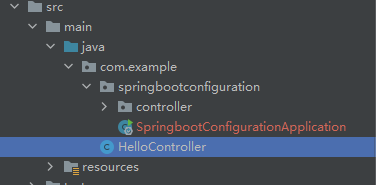

SpringBoot会自动扫描**主程序所在包**及其下面的所有子包里面的组件。

下图中，controller包中的组件会被扫描，但是HelloController不会被扫描到。



如果想扫描到HelloController，可以设置启动类的`@SpringBootApplication(scanBasePackages="com.example")`

或者将`@SpringBootApplication`替换为下面三个注解：

```java
@SpringBootConfiguration
@EnableAutoConfiguration
@ComponentScan("com.example")
```

 

