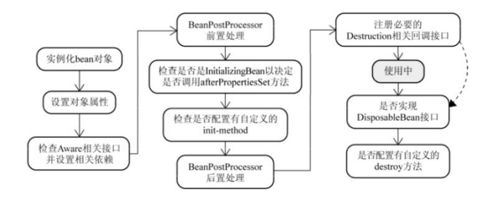

- Bean 容器找到配置⽂件中 Spring Bean 的定义。
- Bean 容器利⽤ Java Reflection API 创建⼀个Bean的实例。
- 如果涉及到⼀些属性值 利⽤ set() ⽅法设置⼀些属性值。
- 如果 Bean 实现了 BeanNameAware 接⼝，调⽤ setBeanName() ⽅法，传⼊Bean的名字。
- 如果 Bean 实现了 BeanClassLoaderAware 接⼝，调⽤ setBeanClassLoader() ⽅法，传⼊ ClassLoader 对象的实例。
- 与上⾯的类似，如果实现了其他 *.Aware 接⼝，就调⽤相应的⽅法。
- 如果有和加载这个 Bean 的 Spring 容器相关的 BeanPostProcessor 对象，执 ⾏ postProcessBeforeInitialization() ⽅法
- 如果Bean实现了 InitializingBean 接⼝，执⾏ afterPropertiesSet() ⽅法。
- 如果 Bean 在配置⽂件中的定义包含 init-method 属性，执⾏指定的⽅法。
- 如果有和加载这个 Bean的 Spring 容器相关的 BeanPostProcessor 对象，执 ⾏ postProcessAfterInitialization() ⽅法
- 当要销毁 Bean 的时候，如果 Bean 实现了 DisposableBean 接⼝，执⾏ destroy() ⽅法。
- 当要销毁 Bean 的时候，如果 Bean 在配置⽂件中的定义包含 destroy-method 属性，执⾏指 定的⽅法。

# 资料来自

- https://www.cnblogs.com/zrtqsk/p/3735273.html