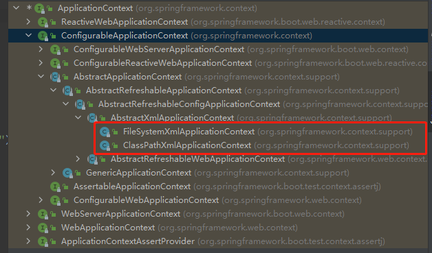

### 1. IOC过程

1. xml配置文件，配置创建的对象

```xml
<bean id="myTestBean" class="com.floweryu.example.bean.MyTestBean" />
```

2. 有service类和dao类，创建工厂类

```java
class Factory {
    public static MyTestBean getBean() {
        String classValue = class属性值;	// 1. xml解析
        Class clazz = Class.forName(classValue);	// 2. 通过反射创建对象
        return (MyTestBean)clazz.newInstance();		// 3. 返回bean对象
    }
}
```

### 2. Spring提供IOC容器实现两种方式（两个接口）

a. `BeanFactory`：IOC容器基本实现，是Spring内部使用接口，不提供给开发人员使用

> 加载文件时不会去创建对象，再获取对象（使用时）才会去创建对象


b. `ApplicationContext`：`BeanFactory`接口的子接口，提供更多更强大的功能，一般由开发人员使用

> 加载配置文件时就会把配置文件中的对象创建


`ApplicationContext`接口有实现类，主要看下面两个实现类：



```java
public void testBeanLoad() {
    ApplicationContext bf = new ClassPathXmlApplicationContext("beanFactoryTest.xml");
    MyTestBean bean = (MyTestBean) bf.getBean("myTestBean");
    System.out.println(bean.getTestStr());
}
```

### 3. IOC操作Bean管理

#### 3.1 基于xml方式创建对象

**一、在spring配置文件中，使用bean标签，标签里面添加对应属性，就可以实现对象创造**

**二、在bean标签有很多属性**

- id属性：创建对象的名字 
- class属性：创建对象的类的全路径

**三、创建对象时，默认执行无参数构造方法，如果没有无参构造方法，将会报错**

```java
@Data
public class MyTestBean {
    private String testStr;

    public MyTestBean(String testStr) {
        this.testStr = testStr;
    }
}

public class BeanFactoryTest {
    @Test
    public void testBeanLoad() {
        ApplicationContext bf = new ClassPathXmlApplicationContext("beanFactoryTest.xml");
        MyTestBean bean = (MyTestBean) bf.getBean("myTestBean");
        System.out.println(bean.getTestStr());
    }
}

// 会报下面错误
No default constructor found; nested exception is java.lang.NoSuchMethodException: com.floweryu.example.bean.MyTestBean.<init>()
```

#### 3.2 基于xml方式注入属性

**一、DI：依赖注入，就是注入属性**

**a.  使用set方法进行注入**

1. 创建类，定义属性和对应的set方法

```java
/**
 * set方式注入
 */
public class Book {
    private String bname;
    
    private String bauthor;

    public void setBauthor(String bauthor) {
        this.bauthor = bauthor;
    }

    public void setBname(String bname) {
        this.bname = bname;
    }
}
```

2. 在spring配置文件配置对象创建，配置属性注入

```xml
<bean id="book" class="com.floweryu.example.bean.Book">
    <!--使用property完成属性注入
            name: 类里面属性的名称
            value: 向属性注入的值
         -->
    <property name="bname" value="spring实战" />
    <property name="bauthor" value="鸭梨山大" />
</bean>
```


**b. 使用有参构造注入**


