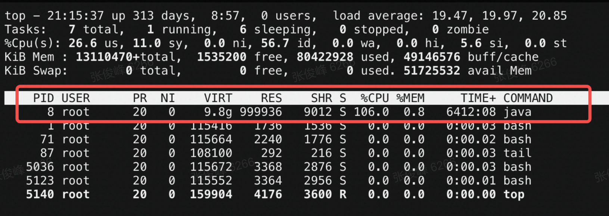
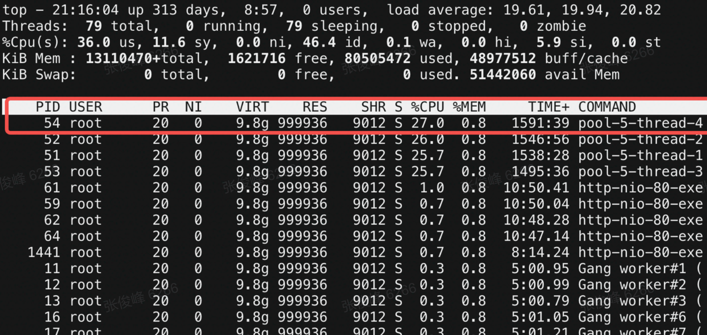
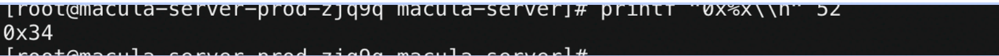
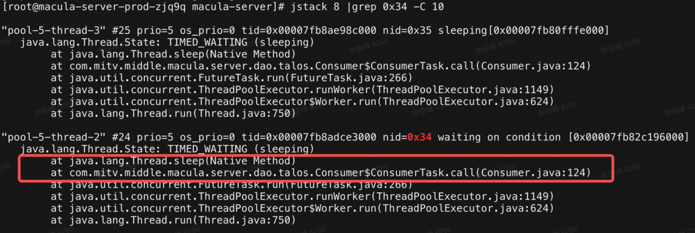

### 从服务器下载文件

```python
# 在服务器上开启一个服务
python -m SimpleHTTPServer 8999
# 安装一个浏览器插件
插件名：SwitchyOmega  配置代理：proxy.xxx.com
# 获取服务器ip+8999进入
```

### 输出堆栈信息

```bash
# 141是进程号
jmap -dump:format=b,file=/home/work/log/heap.hprof {pid}
```

### 常用Linux命令

```bash
# 查看内存占用端口
ss -lnt 
# 查看端口占用pid
lsof -i:7301 
# 找到对应服务
ps -ef | grep {pid} 
# 查看磁盘存储空间
du -sh *
# 查看job列表
dpa list
# 查看详细Job信息
dpa status {job}
# 查看进程线程数
top -Hp {pid}
# 查看当前Java进行堆栈状态
jstack {pid}
```


`top`命令按照cpu排序，找到cpu占用最多的进程进程id



`top -Hp 进程ID` 找到相关负载线程pid



`printf "0x%x\\n" 线程pid` 将线程pid转换成16进制




jstack 进程pid | grep -C 10 线程pid十六进制


