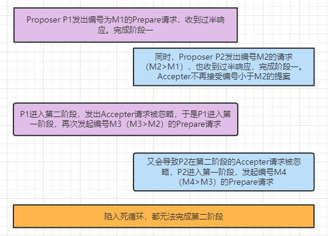

## 1. Paxos算法描述

Paxox算法分为两个阶段：

#### 阶段一：

a. Proposer选择一个**提案编号N**，然后向**半数以上**的Acceptor发送编号为N的**Prepare请求**

b. 如果一个Acceptor收到一个**编号为N**的Prepare请求，且N**大于**该Acceptor**已经响应**过的所有**Prepare请求**的编号，那么它就会将它已经**接受过的编号最大的提案（如果有的话）**作为响应反馈给Proposer，同时该Acceptor承诺**不再接受**任何**编号小于N的提案**

#### 阶段二：

a. 如果Proposer收到**半数以上**Acceptor对其发出的编号为N的**Prepare请求的响应**，那么它就会发送一个针对**[N, V]提案**的**Accept请求**给**半数以上**的Acceptor。注意：V就是收到的**响应**中**编号最大的提案的value**，如果响应中**不包含任何提案**，那么V就由Proposer**自己决定**

b. 如果Acceptor收到一个针对编号为N的提案的Accept请求，只要该Acceptor**没有**对编号**大于N**的**Prepare请求**做出过**响应**，它就**接受该提案**

#### 算法演示

#### Learner学习被选定的value

方案一：Accepter接受了一个提案，就将该提案发送给所有Learner。

方案二：Accepter接受了一个提案，就将该提案发送给主Learner，主Learner再通知其他Learner。

方案三：Accepter接受了一个提案，就将该提案发送给一个Learner集合，Learner集合再通知其它Learner。

#### 如何保证Paxos算法活性

> 假设有两个Proposer依次提出编号递增的提案，最终会陷入死循环，没有value被选定。

**选取一个主Proposer，只有主Proposer才能提出提案。**
