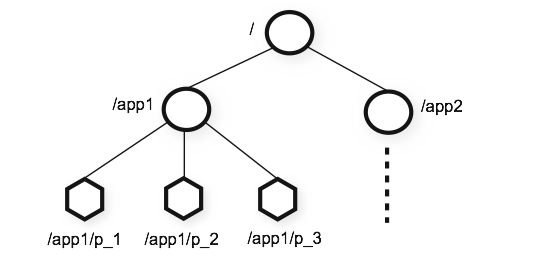
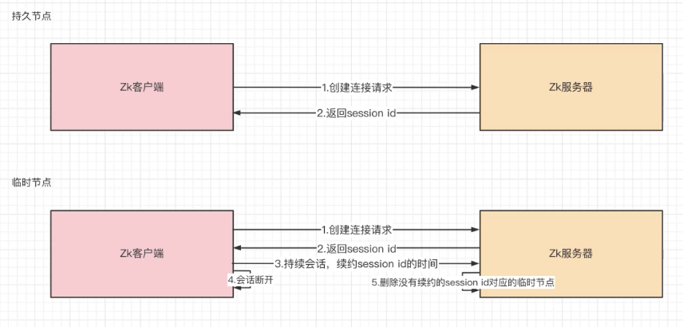
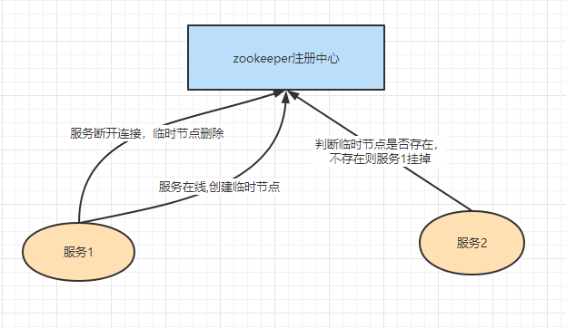

### 1. Zk的数据模型



zk数据模型类似于数据结构的树，但是不同于树的结点，zNode的引用方式是路径引用：

```bash
# 查看/下所有结点
ls /
# 查看子节点
/app1/p_1
```


### 2. Zk的zNode结构

包含了4个部分：

- data：保存数据
- acl：权限
  - c：create 创建权限，允许在该结点下创建子节点
  - w：write 更新权限，允许更新该节点的数据
  - r：read 读取权限，允许读取该节点的数据
  - d：delete 删除权限，允许删除该节点的子节点
  - a：admin 管理者权限，允许对该节点进行acl权限设置
- stat：描述当前节点的元数据
- child：当前节点的子节点

#### 2.1 查询节点详细信息

```bash
get -s /node
stat /node
```

- cZxid：创建节点的事务id
- ctime：节点创建时间
- mZxid：修改节点的事务id
- mtime：修改节点的时间
- pZxid：添加和删除子节点的食物id
- cversion：此节点的子节点进行的更新次数
- dataVersion：节点内数据版本，每更新一次，版本会+1
- aclVersion：此节点权限的版本
- ephemeralOwner：如果当前节点是临时节点，该值是当前节点所有者的seesion id，如果节点不是临时节点，则该值为0
- dataLength：节点内数据的长度
- numChildren：该节点的子节点个数

### 3. zNode的类型

#### 3.1 持久序号节点

```bash
[zk: localhost:2181(CONNECTED) 16] create -s /test2
Created /test20000000004
[zk: localhost:2181(CONNECTED) 17] create -s /test2
Created /test20000000005
[zk: localhost:2181(CONNECTED) 18] create -s /test2
Created /test20000000006
[zk: localhost:2181(CONNECTED) 19] ls /
[floweryu, master, test1, test2, test20000000004, test20000000005, test20000000006, zookeeper]

```

创建出的节点，根据先后顺序，会在节点之后带上一个数值，越后执行数值越大，适用于分布式锁的应用场景-单调递增

#### 3.2 持久节点

创建出的节点，在会话结束后依然存在。保存数据

#### 3.3 临时节点

临时节点在会话后，自动被删除，通过这个特性，zk可以实现服务注册与发现效果



zk做注册中心原理：



#### 3.4 临时序号节点

```bash
create -e -s /test3
```

跟持久序号节点相同，适用于临时的分布式锁

#### 3.5 Container节点

```bash
create -c /mycontainer
```

容器节点，当容器中没有任何子节点，该容器节点会被zk定期删除(60s)

#### 3.6 TTL节点

可以指定节点的到期时间，到期后被zk定时删除

### 4. zk数据持久化

zk的数据运行在内存中，zk提供两种持久化机制：

- 事务日志：zk把执行的命令以日志形式保存在dataLogDir指定的路径中(如果没有指定dataLogDir，则按dataDir指定的路径)
- 数据快照：zk会一定时间的间隔做一次内存数据快照，把该时刻的内存数据保存在快照文件中

zk通过两种形式的持久化，在恢复时先恢复快照文件中的数据到内存中，再用日志文件中的数据做增量恢复，这样恢复速度更快。


