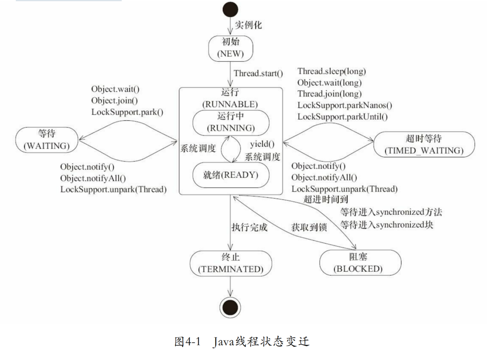

## jstack用法

```bash
# 输出进程堆栈信息
jstack {pid}
```

- -F：正常输出不被响应时，强制输出线程堆栈
- -m：如果调用本地方法，可以显示C/C++堆栈
- -l：除堆栈外，显示关于锁的附加信息，发生死锁时可使用该选项观察锁的持有情况


## 线程状态简介



## dump文件分析重点

- runnable：线程处于执行中
- waiting for monitor entry：等待获取监视器（重点关注）
- deadlock：死锁（重点关注）
- blocked：线程被阻塞 （重点关注）
- parked：停止
- locked：对象加锁
- waiting：线程正在等待
- waiting to lock：等待上锁
- Object.wait()：对象等待中
- Waiting on condition：等待资源（重点关注），最常见的情况是线程在等待网络的读写

## 排查问题使用的命令

```bash
# 查看cpu资源占用
top
# 查看某个进程的资源使用情况
top -Hp {pid}
# 查看进程堆栈信息
jstack {pid}
# 查看进程堆栈信息，带锁的信息
jstack -l {pid}
```

