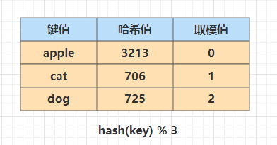
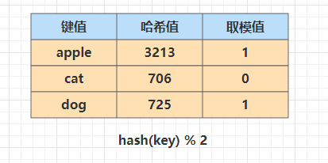
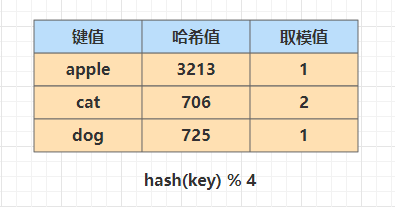
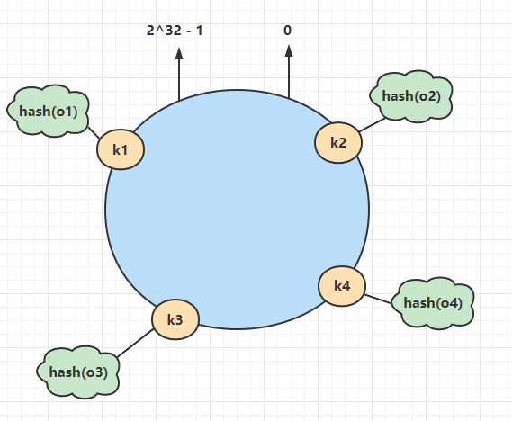
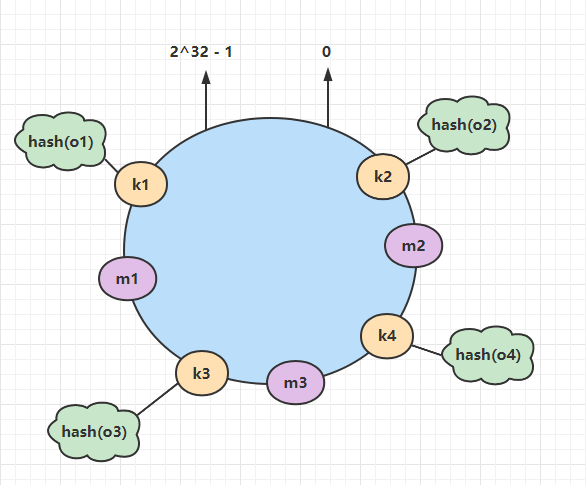
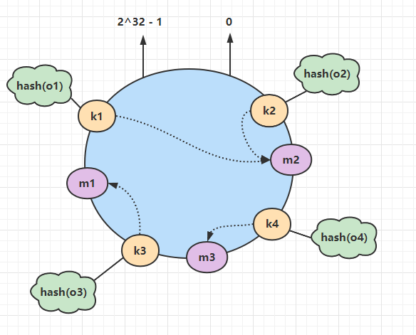
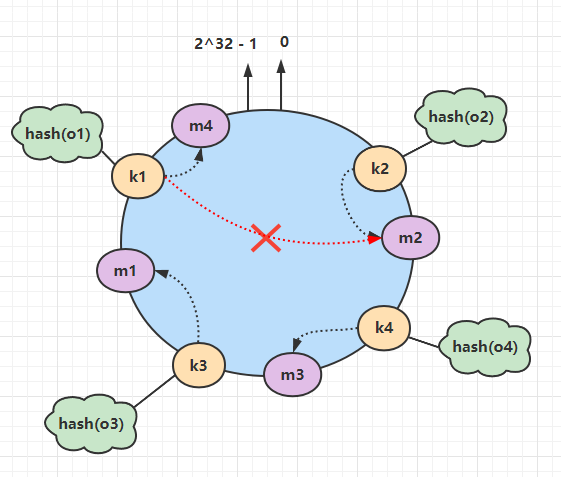
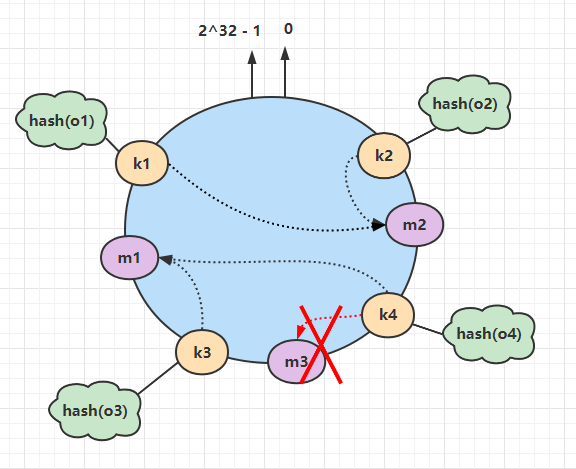
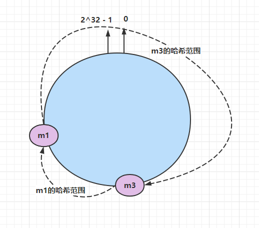
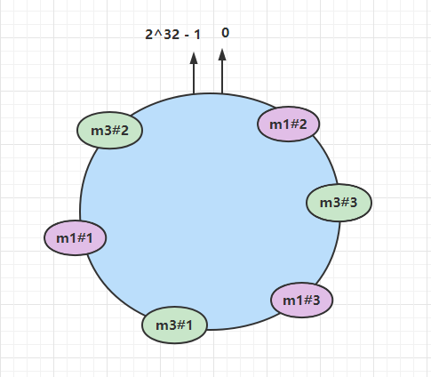

## 一. 传统哈希取模算法的局限性

这里随便写一个哈希工具类（这里不纠结哈希算法的实现）：

```java
public class HashUtils {
    public static int rsHash(String value) {
        int one = 1;
        int two = 2;
        int hash = 0;
        for (int i = 0; i < value.length(); i++) {
            hash = hash * two + value.charAt(i);
            two = two * one;
        }
        return (hash & 0x7FFFFFFF);
    }
}

```



### 1.1 当节点减少时

在分布式系统中，假设有节点挂掉，节点的数量发生改变，从3个变成了2个，表格会发生变化：



该变化对系你的键不会产生影响，但是对于已有的键来说，将导致节点映射出错。

### 1.2 当节点增加时

当对服务器节点进行扩容或者数据表再进行分表时，假设节点现在变成了4个，表格变化如下：



之前的映射规则也会发生改变。对于有些服务器有缓存来说，可能会造成缓存雪崩。对于数据库分表来说，取值时有可能找不到之前的映射关系。

## 二. 一致性哈希算法

## 2.1 优缺点：

- 容易扩展。在增加或减少节点时，数据存储的该变量最少。
- 更好适应数据快速增长。采用一致性哈希算法分布数据，当数据不断增长时，部分虚拟节点中可能包含很多数据、造成数据在虚拟节点上分布不均衡，此时可以将包含数据多的**虚拟节点**分裂，这种分裂仅仅是将原有的虚拟节点一分为二、不需要对全部的数据进行重新哈希和划分。虚拟节点分裂后，如果物理服务器的负载仍然不均衡，只需在服务器之间调整部分虚拟节点的存储分布。这样可以随数据的增长而动态的扩展物理服务器的数量，且代价远比传统哈希算法重新分布所有数据要小很多

### 2.2 原理

通过一致性哈希环的数据结构实现。环的起点是0，终点是$2^{32}-1$，并且起点与终点连接，所以整个环的范围是$[0, 2^{32}-1]$。


#### a. 将对象放到哈希环上

假设有o1, o2, o3, o4这四个对象，使用哈希函数计算对象的哈希值，范围就是哈希环的范围。



#### b. 将服务器节点放到哈希环上

同样使用哈希函数，将服务器节点放到哈希环上，这里假设有三台节点m1, m2, m3.



#### c. 为对象选择服务器

**在哈希环上顺时针查找距离这个对象的哈希值最近的节点，即是这个对象的所属节点**。



#### d. 服务器增加的情况

新增一个m4节点，位于k1，k2之间，所以只有k1, k2两个对象需要重新分配。在下面示例中只有k1需要重新分配节点到m4。

**前面提到过，如果使用简单的取模方法，当新添加节点时，会导致大部分节点上的数据都会失效（按原哈希取不到数据）。而使用一致性哈希算法后，只有少部分对象需要重新分配。**



#### e. 服务器减少的情况

假设m3节点下线，k4将会链接到m1节点上，其他对象所连节点仍不会改变。



#### f. 虚拟节点机制

节点较少容易出现节点分布不均匀的情况，造成数据倾斜的问题。

例如，只有两个redis节点，分布情况如下，导致大部分数据都会存储到m3中：



为了解决这种数据存储不平衡的问题，一致性哈希算法引入了虚拟节点机制，即**对每个节点计算多个哈希值，每个计算结果位置都放置在对应节点中**，这些节点称为**虚拟节点**。

具体做法如下：可以在服务器IP或主机后面增加编号来实现，例如上面情况，每个节点增加三个虚拟节点，分为：m1#1，m1#2，m1#3，m3#1，m3#2，m3#3。

具体位置如下图：



对于数据定位的hash算法仍然不变，只是增加了虚拟节点到实际节点的映射。例如，数据A保存到**m1#3**虚拟节点上，但实际还是在**m1**中，这样解决了数据不平均的问题。
