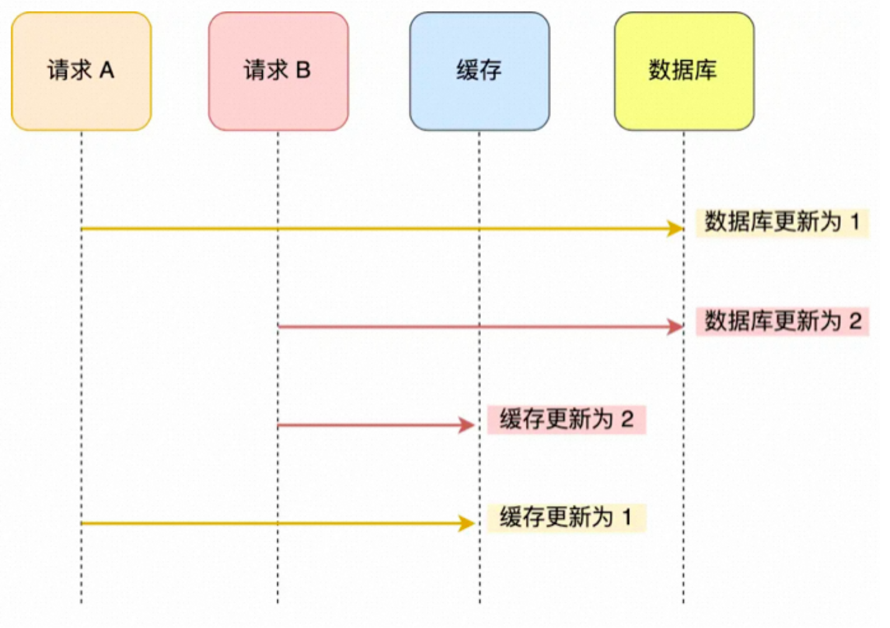
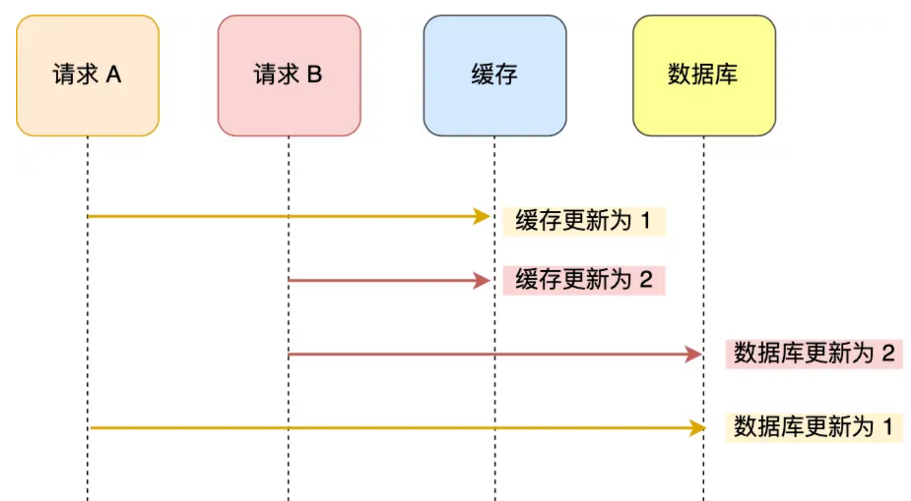
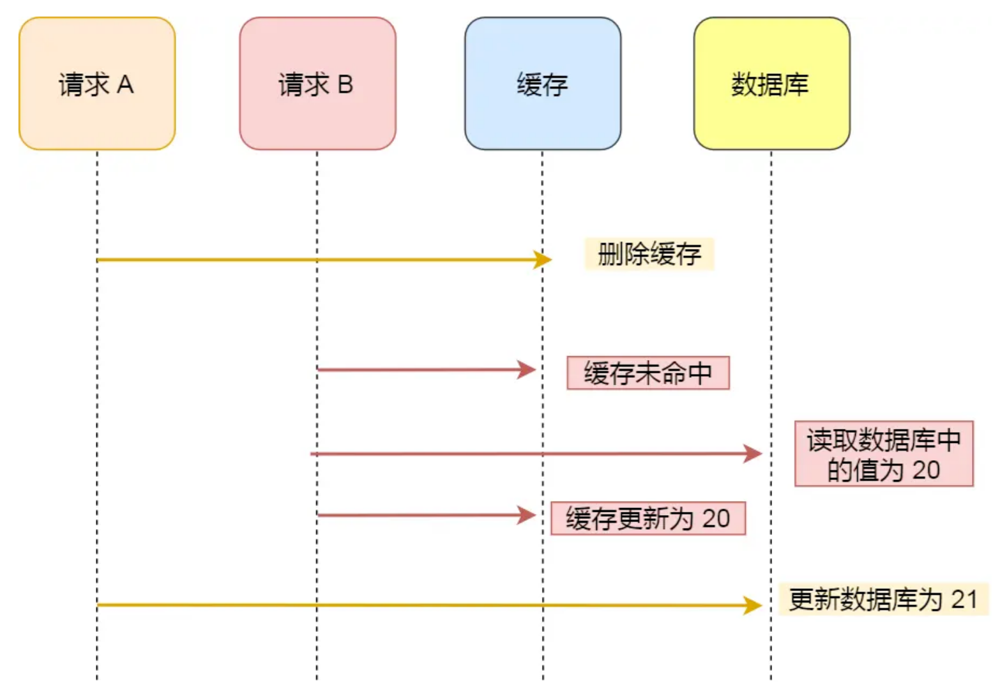
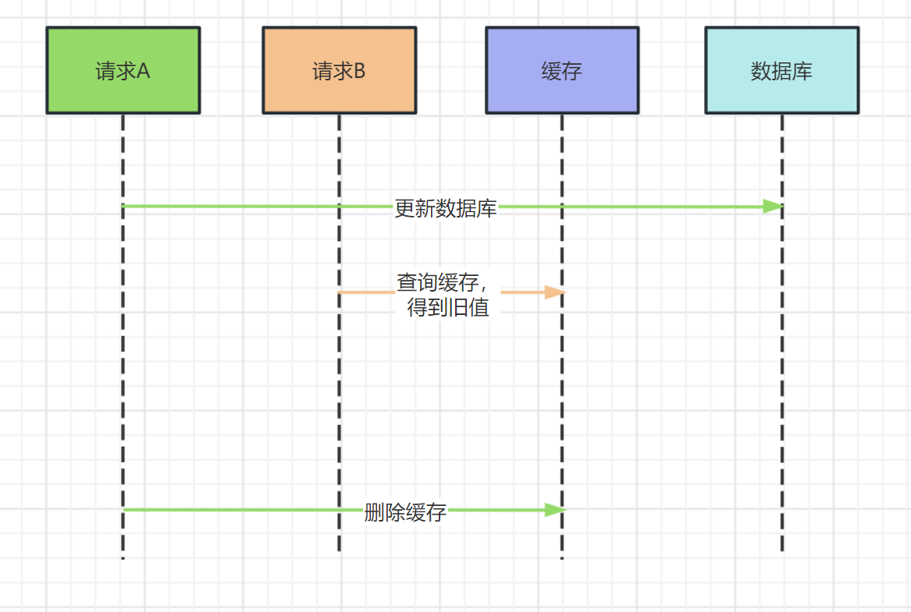
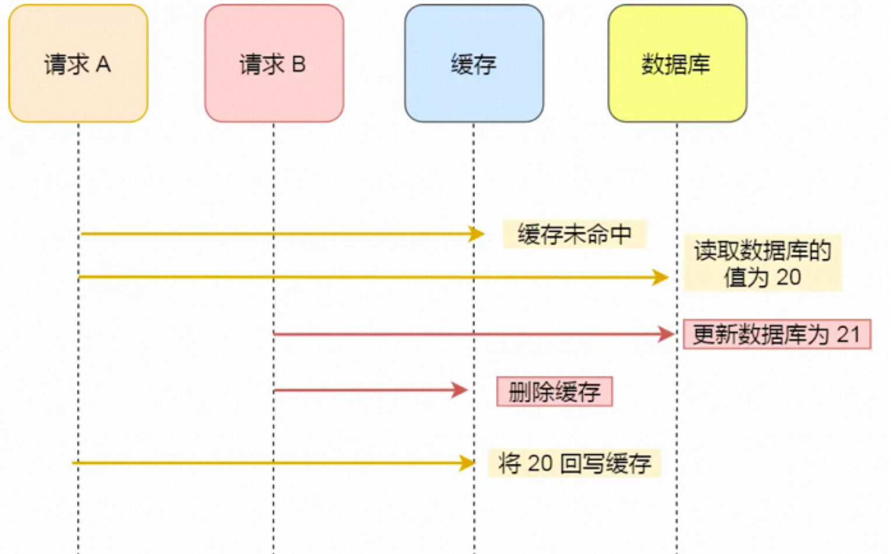
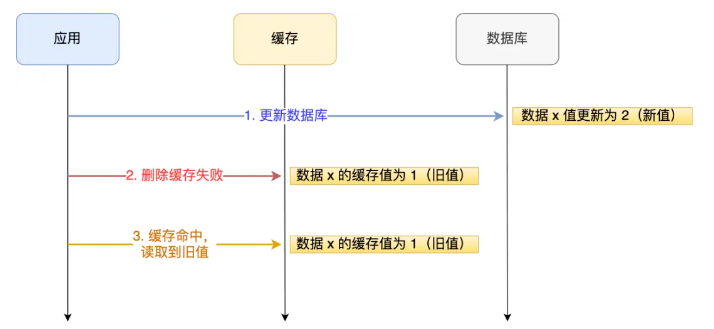
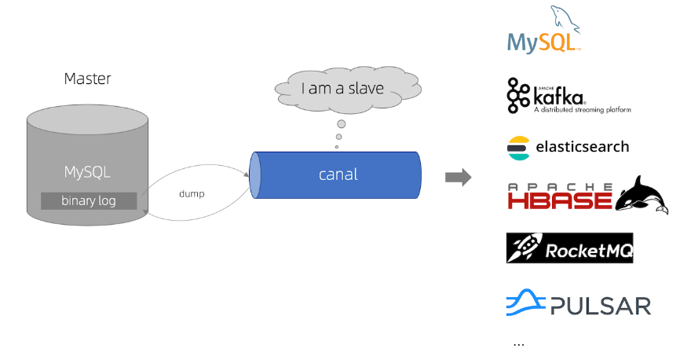

## 一、缓存的查询

先查询缓存，如果缓存查询失败，就去查询数据库，然后重新生成缓存。

## 二、缓存的更新

在高并发的情况下，需要考虑下面两个问题：

- 是先更新数据库还是先更新缓存？
- 是更新缓存还是删除缓存？

#### 1. 先更新数据库再更新缓存

线程A：更新数据库（第1s）——>  更新缓存（第10s）

线程B：更新数据库 （第3s）——> 更新缓存（第5s）

上面情况，就会导致线程B的缓存值被线程A覆盖，**缓存中存的是线程A的旧值**，产生脏数据并且直到缓存失效（如果有过期时间）。

#### 2. 先更新缓存再更新数据库

线程A：更新缓存（第1s）——> 更新数据库（第10s）

线程B： 更新缓存（第3s）——>  更新数据库（第5s）

和前面一种情况相反，**缓存中是线程B的新值，而数据库中是线程A的旧值。**

前两种方式之所以会在并发场景下出现异常，**本质上是因为更新缓存和更新数据库是两个操作**。

如果把它化简，更新时只更新数据库，同时删除缓存。等待下一次查询时命中不到缓存，再去重建缓存，是不是就解决了这个问题？

#### 3. 先删除缓存再更新数据库

通过这种方式，两个线程都值修改数据库，不管谁先，数据库以后修改的数据为准。

但这时另一个**并发场景**：两个并发操作，一个是更新操作，另一个是查询操作，更新操作删除缓存后，查询操作没有命中缓存，先把老数据读出来后放到缓存中，然后更新操作更新了数据库。于是，在缓存中的数据还是老的数据，导致缓存中的数据是脏的。很显然，这种状况也不是我们想要的。

**解决方案**：

##### 延时双删

对于**请求**A，做一下操作：

1. 删除缓存

2. 更新数据库

3. **睡眠一段时间**

4. **再次删除缓存**

添加一个睡眠时间，主要是为了确保请求A在睡眠的时候，请求B能在这段时间内完成**从数据库读取数据，再把缺失的数据写入缓存**的操作，然后请求A睡眠完，再删除缓存。

所以请求A的睡眠时间就需要大于请求B**从数据库读取数据+写入数据**的时间。**但是这个时间不好评估**。

**所以不建议这种方案**。

#### 4. 先更新数据库再删除缓存（cache aside）

**场景**：一个是查询操作，一个是更新操作的并发，我们先更新了数据库中的数据，此时，缓存依然有效，所以，并发的查询操作拿的是没有更新的数据，但是，删除操作马上让缓存的失效了，后续的查询操作再把数据从数据库中拉出来。而不会方案3一样，后续的查询操作一直在取老的数据。如下图：

但是，这种策略也不是一定完美。看下面这个场景：

一个读操作没有命中缓存，然后就去数据库中获取数据。此时有一个写操作，写完数据库后，让缓存失效。然后之前的读操作再把老的数据写回缓存，这样就造成脏数据。

上面的例子理论上会出现，但是出现概率比较低。因为条件需要读缓存时缓存正好失效，并且此时并发一个写操作。而数据库写操作比读操作慢的多，而读操作读操作必须在写操作之前，又要晚于写操作更新缓存。所有条件在一起的可能性并不大。

## 三、操作失败如何

在实际生产中，由于网络抖动、服务下线等原因，对数据库和缓存的操作可能失败。

举例说明：应用要把数据 X 的值从 1 更新为 2，先成功更新了数据库，然后在 Redis 缓存中删除 X 的缓存，但是这个操作却失败了，这个时候数据库中 X 的新值为 2，Redis 中的 X 的缓存值为 1，出现了数据库和缓存数据不一致的问题。

那么，后续有访问数据 X 的请求，会先在 Redis 中查询，因为缓存并没有删除，所以会缓存命中，但是读到的却是旧值 1。

其实**不管是先操作数据库，还是先操作缓存，只要第二个操作失败都会出现数据一致的问题**。

问题原因知道了，该怎么解决呢？有两种方法：

- 重试机制
- 订阅MySQL binlog，再操作缓存

#### 重试机制

可以引入**消息队列**，将第二个操作（删除缓存）要操作的数据加入到消息队列，由消费者来操作数据。

- 如果应用**删除缓存失败**，可以从消息队列中重新读取数据，然后再次删除缓存，这个就是**重试机制**。当然，如果重试超过一定次数，还是没有成功，我们就需要向业务层发送报错信息了。
- 如果**删除缓存成功**，就要把数据从消息队列中移除，避免重复操作，否则就继续重试。

举个例子，来说明重试机制的过程：

#### 订阅 MySQL binlog，再操作缓存

**先更新数据库，再删缓存**的策略的第一步是更新数据库，那么更新数据库成功，就会产生一条变更日志，记录在 binlog 里。

于是我们就可以通过订阅 binlog 日志，拿到具体要操作的数据，然后再执行缓存删除，阿里巴巴开源的 Canal 中间件就是基于这个实现的。

Canal 模拟 MySQL 主从复制的交互协议，把自己伪装成一个 MySQL 的从节点，向 MySQL 主节点发送 dump 请求，MySQL 收到请求后，就会开始推送 Binlog 给 Canal，Canal 解析 Binlog 字节流之后，转换为便于读取的结构化数据，供下游程序订阅使用。

下图是 Canal 的工作原理：

综上，**如果要想保证「先更新数据库，再删缓存」策略第二个操作能执行成功，可以使用「消息队列来重试缓存的删除」，或者「订阅 MySQL binlog 再操作缓存」，这两种方法有一个共同的特点，都是采用异步操作缓存。**

## 四、总结

### 1. cache aside并非万能

虽然说cache aside可以被称之为缓存使用的最佳实践，但与此同时，它引入了缓存的命中率降低的问题，（每次都删除缓存自然导致更不容易命中了），因此它更适用于对缓存命中率要求并不是特别高的场景。**如果要求较高的缓存命中率，依然需要采用更新数据库后同时更新缓存的方案**。

### 2. 缓存数据不一致的解决方案

在更新数据库后同时更新缓存，会在并发的场景下出现数据不一致，有下面方案：

#### 引入分布式锁

在更新缓存之前尝试获取锁，如果已经被占用就先阻塞住线程，等待其他线程释放锁后再尝试更新。但这会影响并发操作的性能。

#### 设置较短缓存时间

设置较短的缓存过期时间能够使得数据不一致问题存在的时间也比较短，对业务的影响相对较小。但是与此同时，其实这也使得缓存命中率降低，又回到了前面的问题里...

## 参考文章：

- https://developer.aliyun.com/article/1240257?spm=a2c6h.14164896.0.0.619748aaOkV6SY