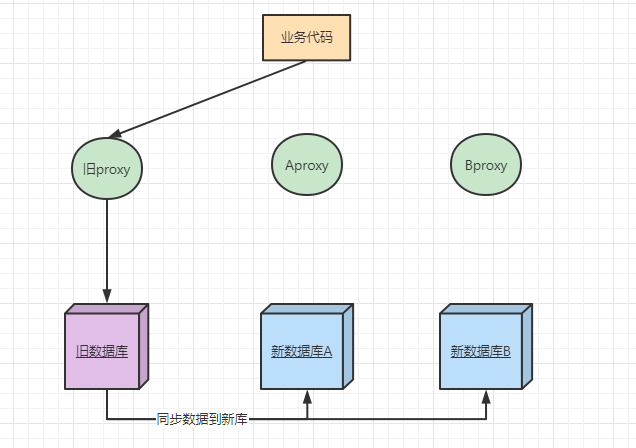
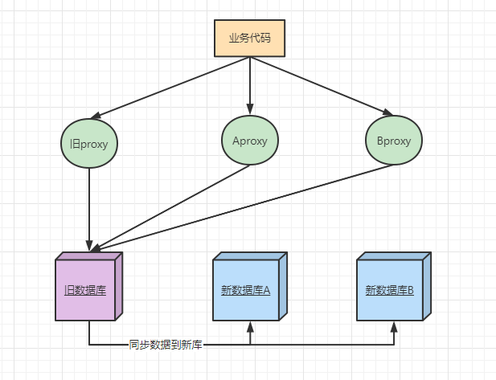
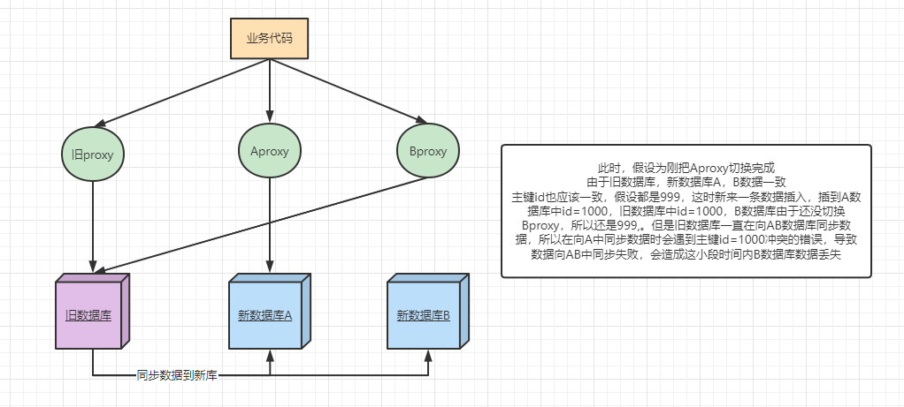

## 背景

> 业务中有一张表user_like，该表记录的是短视频中用户互相关注的数据，比如A关注B，则插一条记录，B关注A，则插一条记录。所以在1500w日活的大背景下，该表所在的库已经扛不住了（也有历史原因），目前是128张表。

## 目标

将该表所在库扩展为两个库，每个库还是128张表，但是每个表的数据会减半。

## 迁移方案

1. 新建两个新数据库集群，每个新库都是128张表(0~127)，同时同步老数据库数据到两个新集群。两个新集群的数据要做到实时同步，老库添加修改哪条数据，两个新库也要跟着变化。

2. 上线代码，分库分表映射方案在后面。使用两个新集群的数据库地址，进行查询和插入。这时两个新数据库的proxy还是指向旧数据库。同时验证数据是否写到旧数据库。如果直接将proxy链接到新库A和B，会造成主键冲突。

3. DBA将两个新数据库的proxyA和proxyB同时指向两个新集群（30s内）

这一步会有一个问题，当Aproxy切换完成后，Bproxy还没来得及切换时，Bproxy还是指向的旧数据库。此时Aproxy切换成功了，Aproxy已经开始向新数据库A中写入数据了，后面旧数据库在向新数据库中同步数据时，会造成主键冲突的异常。所以会丢失一小段时间数据（大概是Aproxy切换完成到Bproxy切换完成这段时间），参考下图：

丢失的这段时间的数据，后续可以让DBA修复。

最后按照分库分表方案删除AB数据库中无用的数据，因为之前两个库数据一致，冗余了。

## 分库分表方案

有两个常量：数据库数量，每个库的表数量，总表数=数据库数x每个库表数目

虚拟表id = 用户id % 总表数

库号 = 虚拟表id / 每个库表数目

表号 = 用户id % 每个库表数目

举例：假设是1个库，4个表。打算把库扩展为2个库，每个库还是4张表（每张表数据量减半）

| 表号   | 0    | 1    | 2    | 3    |
| ------ | ---- | ---- | ---- | ---- |
| 用户id | 0    | 1    | 2    | 3    |
|        | 4    | 5    | 6    | 7    |
|        | 8    | 9    | 10   | 11   |
|        | 12   | 13   | 14   | 15   |
|        | 16   | 17   | 18   | 19   |
|        | 20   | 21   | 22   | 23   |

将上面数据，拆分成两个数据库，数据如下：

**0号库**：

| 表号   | 0    | 1    | 2    | 3    |
| ------ | ---- | ---- | ---- | ---- |
| 用户id | 0    | 1    | 2    | 3    |
|        | 8    | 9    | 10   | 11   |
|        | 16   | 17   | 18   | 19   |

**1号库**：

| 表号   | 0    | 1    | 2    | 3    |
| ------ | ---- | ---- | ---- | ---- |
| 用户id | 4    | 5    | 6    | 7    |
|        | 12   | 13   | 14   | 15   |
|        | 20   | 21   | 22   | 23   |

