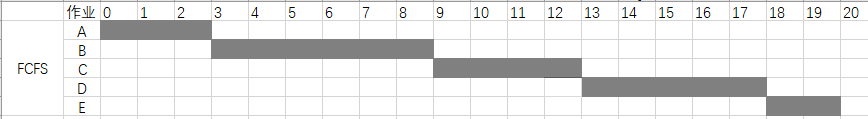
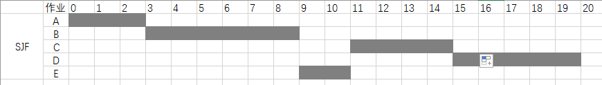
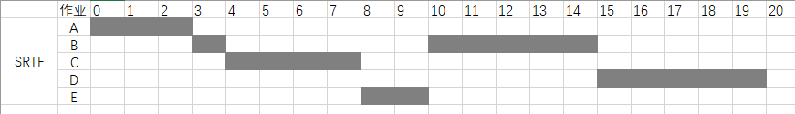
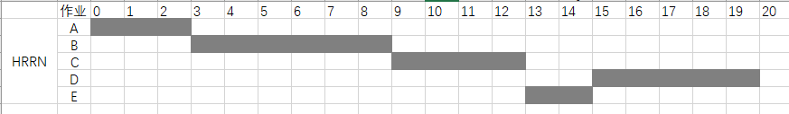
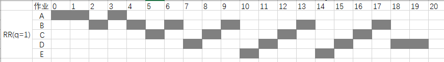
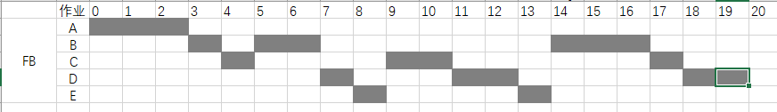
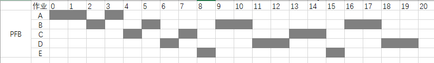

#### 一、FCFS (First-Come First-Served)——先来先服务算法
###### 算法思想：
**根据作业到达的先后次序来进行调度，先来的先执行**。
###### 特点：
 - 有利于长作业，不利于短作业。
 - 既可以用于作业调度，也可以用于进程调度。

|进程名|A  | B|C  | D|E  | 
|--|--|--|--|--|--|
| 到达时间 |0  |2  |4  |6 | 8 |
| 服务时间 |3  |6  |4  |5 | 2 |

**解释**：作业到达的顺序为A,B,C,D,E。因此，执行的顺序也是A,B,C,D,E.

#### 二、SJF (Short Job First)——短作业优先算法

###### 算法思想：

 - 以作业运行时间的长短来计算优先级，作业越短，优先级越高。
 - **注意**：在运行短时间算法之前，要判断它是否已经到达。
###### 特点：
 - 既可以用于作业调度，也可以用于进程调度。
###### 缺点：
 - 必须预知作业的运行时间。
 - 对长作业非常不利，长作业的周转时间会明显增长。
 - 无法进行人机交互。
 - 不能保证紧迫性作业能及时得到处理。

|进程名|A  | B|C  | D|E  | 
|--|--|--|--|--|--|
| 到达时间 |0  |2  |4  |6 | 8 |
| 服务时间 |3  |6  |4  |5 | 2 |

**解释**：A到达后首先运行，之后，因为在第 3 秒时，只有 B 到达，所以只能运行 B。等到 B 运行完以后，C, D, E 都已经到达，这时就先运行作业时间最短的 E ，然后是 C,  最后是 D。

#### 三、SRTF ——最短剩余时间优先算法
###### 算法思想：

 - 当一个作业正在执行时，到达一个新作业，**如果新作业所需要的运行时间比正在执行的作业剩余下来所需要的执行**时间短，就赶走正在执行的作业，执行新作业。
 - 如果遇到新来作业的执行时间和前面未完成作业的剩余时间相等，则执行先到达的作业。

|进程名|A  | B|C  | D|E  | 
|--|--|--|--|--|--|
| 到达时间 |0  |2  |4  |6 | 8 |
| 服务时间 |3  |6  |4  |5 | 2 |

**解释**：A首先运行，然后B到达，运行一个时间片后，C到达。此时 B 的剩余执行时间为 5，而 C 只需要 4 个时间片，所以先执行 C。在 第 6 个时间片时， D 到达，但 D需要的时间为 5，此时rest(B) = 5，rest( C) = 2，还是C的剩余执行时间最小，故继续执行 C。到第 8 个时间片，C执行完毕退出队列。此时 E 到达，E只需要 2 个时间片，剩余执行时间最小，先执行 E，这样 A, C, E 都执行完毕，剩余的 B 的D 的剩余时间一样，都为 5，但由于B先到达，所以先执行 B， 最后执行 D。

#### 四、HRRN(Highest Response Ratio Next)——高响应比优先算法
FCFS算法考虑的只是作业的等待时间，忽视了作业的运行时间。而SJF算法只考虑用户估计的作业计算时间而忽略了作业等待时间。高响应比优先调度算法(HRRN)则即考虑了作业等待时间，有考虑了作业运行时间。
###### 算法思想：

 - 每次进行调度之前，都要计算未调度作业的响应比，响应比高的作业优先调度。
 - **响应比**：（等待时间  + 要求服务时间）/ 要求服务时间 
 - **注意**：计算响应比等待时间不要错。

|进程名|A  | B|C  | D|E  | 
|--|--|--|--|--|--|
| 到达时间 |0  |2  |4  |6 | 8 |
| 服务时间 |3  |6  |4  |5 | 2 |

**解释**：A首先执行，然后只有B到达，所以执行B。B执行完毕后，C , D , E都已经到达。这时要分别计算C ，D，E 的相应比。C ：(5 + 4 ) / 4 = 2.25；D：(3 + 5) / 5 = 1.6；E：(1 + 2 ) / 2 = 1.5。所以响应比：C > D > E，C最大，就先调度C。C运行完毕后，再计算 D, E 的相应比。 D：( 7 + 5) / 5 = 2.4；E：(5 + 2) / 2 = 3.5；所以 E > D，先调度E，最后调度 D。

#### 五、RR(Round Robin)——轮转调度算法（设时间片为1）
###### 算法思想：让就绪队列上的每个进程每次仅运行一个。

 - 进程运行完一个时间片，就把它送往队列的队尾。运行完毕的从队列中删除。
 - 若在前面进程送进队尾时有新进程到达，则刚到达的新进程优先排队

|进程名|A  | B|C  | D|E  | 
|--|--|--|--|--|--|
| 到达时间 |0  |2  |4  |6 | 8 |
| 服务时间 |3  |6  |4  |5 | 2 |

**解释**：设置一个队列，首先运行的是A，下面给出了1 ~ 20 和时间片中队列情况：
0：A——执行A。a = 1
1：A   —— 此时B进程还没有到达。执行A。a = 2
2：BA——B进程到达，排在A前面，执行B。b = 1
3：AB——B执行一个时间片后排在队尾，执行A。a = 3  此时A执行完毕，从队列中删除。
4：BC——C进程到达，排在队尾，先执行B。b = 2
5：CB——执行C。c = 1。
6：BDC——此时D进程到达，先排在队尾，遵循到达优先，C则排在D后面。执行B。b = 3
7：DCB——执行D。d = 1
8：CBED——此时E到达，先排在队尾，遵循到达优先，D则排在E的后面。执行C。c = 2
9：BEDC——执行B。b = 4
10：EDCB——执行E. e = 1
11：DCBE——执行D。d = 2
12：CBED——执行C。 c = 3
13：BEDC——执行B。b = 5
14：EDCB——执行E。e = 2。E执行完毕，从队列中删除。
15：DCB——执行D。d = 3
16：CBD——执行C。c = 4。C执行完毕，从队列中删除。
17：BD——执行B。b = 6。B执行完毕，从队列删除。
18：D——执行D。d = 4。
19：D——执行D。d = 5。
20：D执行完毕。删除D.

#### 六、FB——多级反馈队列调度算法 ( 时间片q~i~ = 2^i-1^)
###### 算法思想：设置多个就绪队列，每个队列有不同的时间片；每个队列都采用FCFS算法，先来先服务；调度按照队列优先级调度。
 - 每次调度运行都从优先级队列高的开始。
 - 刚到的任务放到第一级队列的队尾。
 - 在该级队列中，运行了对应级数时间片的任务，放到下一级队列的队尾。
 - 运行完的任务从队列中删除。
###### 优点：
 - 资源利用率高
 - 响应速度快
 - 系统开销小
###### 缺点：
 - 当不断有新进程到来，时间长的进程可能会饥饿。

|进程名|A  | B|C  | D|E  | 
|--|--|--|--|--|--|
| 到达时间 |0  |2  |4  |6 | 8 |
| 服务时间 |3  |6  |4  |5 | 2 |

**解释**：设置三个就绪队列，具体就不阐述了，按照上面算法执行步骤即可。

#### 七、Preemption FB——抢占FB算法
###### 算法思想：新来的进程立即运行。只有完整的执行一个时间片，才向下一个队列转移。否则，排在所在队列的队尾。
**与FB相同点**：
 - 每次调度从优先级队列高的开始。
 - 刚到达的任务放到第一级队列的队尾。
 -  在该级队列中，运行了对应级数时间片的任务，放到下一级队列的队尾。
 - 运行完的任务从队列中删除。

**与FB不同点**：

 - 有新进程到达时，立即执行新进程。（因为新来的进程在第一级队列中。）
 - 当某一队列中的进程（设为A）正在执行时，若还没运行完该队列的时间片（也就是执行到一半），就有新进程（设为B）到达，则当前进程A停止。新进程B先运行对应队列的时间片（其实也就是第一级队列的），**但是A进程不向下一级队列转移（因为它没有运行完当前所属队列的时间片），而是排在队尾（此时类似于RR）。只有当进程A运行完一个完整的时间片后，才向下一队列转移。**

|进程名|A  | B|C  | D|E  | 
|--|--|--|--|--|--|
| 到达时间 |0  |2  |4  |6 | 8 |
| 服务时间 |3  |6  |4  |5 | 2 |

