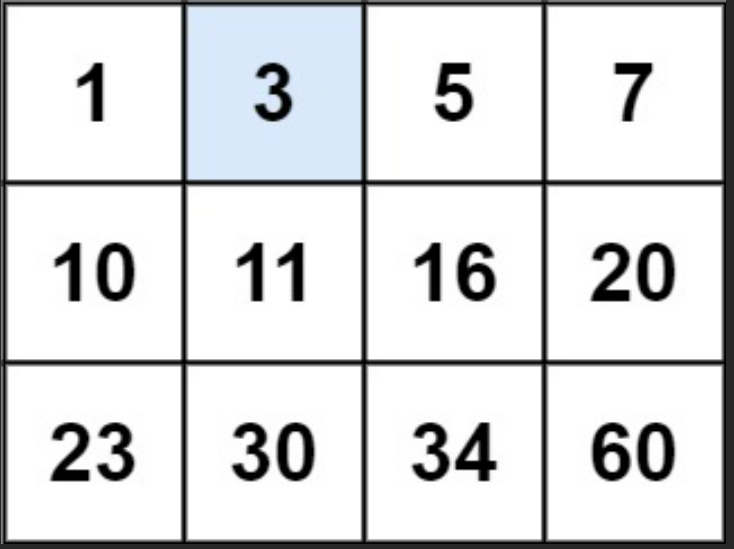

## 二分4. 寻找两个正序数组的中位数

> https://leetcode.cn/problems/median-of-two-sorted-arrays/description/
>
> 给定两个大小分别为 `m` 和 `n` 的正序（从小到大）数组 `nums1` 和 `nums2`。请你找出并返回这两个正序数组的 **中位数** 。
>
> 算法的时间复杂度应该为 `O(log (m+n))` 。
>
> ```
> 输入：nums1 = [1,2], nums2 = [3,4]
> 输出：2.50000
> 解释：合并数组 = [1,2,3,4] ，中位数 (2 + 3) / 2 = 2.5
> ```

### 题解一：递归+二分查找排序第k值

**时间复杂度**：`O(log(m+n))`

**思路**：

1. 迭代核心是找排序为第k的数（剩余总序列里），然后剪掉前`k/2`个数。 （剔除前`k/2`个较小的后，在剩下的里面找第`k-(k/2)`个，即最开始想要的第`k`个，然后继续迭代这个过程）
2. 终结的条件为找第`k=1`个**or**剪到边剪得啥都不剩了。 （k=1说明找第一小的数，返回最小值即可。剪的啥都不剩了说明一个数组完全大于另一个，直接返回中位数即可）

```java
/**
     * 1. 迭代核心是找排序为第k的数（剩余总序列里），然后剪掉前`k/2`个数。 （剔除前`k/2`个较小的后，在剩下的里面找第`k-(k/2)`个，即最开始想要的第`k`个，然后继续迭代这个过程）
     * 2. 终结的条件为找第`k=1`个**or**剪到边剪得啥都不剩了。 （k=1说明找第一小的数，返回最小值即可。剪的啥都不剩了说明一个数组完全大于另一个，直接返回中位数即可）
     */
public double findMedianSortedArrays(int[] nums1, int[] nums2) {
    int m = nums1.length;
    int n = nums2.length;
    // 按照下面思路: left + right 可以满足奇数和偶数所有情况
    int left = (m + n + 1) / 2;
    int right = (m + n + 2) / 2;
    return (fingKth(nums1, 0, nums2, 0, left) + fingKth(nums1, 0, nums2, 0, right)) / 2.0;
}

public int fingKth(int[] nums1, int i, int[] nums2, int j, int k) {
    // nums1为空数组
    if (nums1.length <= i) return nums2[j + k - 1];
    // nums2为空数组
    if (nums2.length <= j) return nums1[i + k - 1];
    // k==1说明找第一小的数(剩余序列)
    if (k == 1) {
        return Math.min(nums1[i], nums2[j]);
    }
    // k: 本次两个数组的中间下标
    // i + k/2 - 1: k/2是因为现在在单个数组中, 该步骤表示nums1中有没有第k/2个数
    // 为什么赋最大值？
    // 假如nums1长度为2, nums2长度为12, 则k为(2+12)/2=7, k/2=3
    // 因为nums1长度小于3, 则无法判断中位数是否在nums1中; 而nums2中前3个肯定不是中位数
    // 所以当k/2不存在时,将其设置为最大值,这样可以保留继续下一次循环
    int midVal1 = (i + k / 2 - 1 < nums1.length) ? nums1[i + k / 2 - 1] : Integer.MAX_VALUE;
    int midVal2 = (j + k / 2 - 1 < nums2.length) ? nums2[j + k / 2 - 1] : Integer.MAX_VALUE;
    if (midVal1 < midVal2) {
        // 说明nums1的前i+k/2个数都被舍弃, 因为在整体数组前半部分比midVal2小, 说明中位数可能在nums2中
        // 下一轮的中位数下标要在舍弃的基础上计算: k/2是舍弃部分, 所以是: k - k / 2
        return fingKth(nums1, i + k / 2, nums2, j, k - k / 2);
    } else {
        return fingKth(nums1, i, nums2, j + k / 2, k - k / 2);
    }
}
```

### 题解二：归并排序

**思路**：因为两个数组都是有序数组，所以直接使用归并排序一次即可合并成整个有序数组，然后再取中位数。

```java
public double findMedianSortedArrays1(int[] nums1, int[] nums2) {
    // 先归并排序, 因为两个都是有序数组
    int[] res = mergeSort(nums1, nums2);
    // 这里使用一个小trick, 不用判断奇偶长度
    return (res[(res.length + 1) / 2 - 1] + res[(res.length + 2) / 2 - 1]) / 2.0;
}

// 归并排序底层实现: 合并两个有序数组
public int[] mergeSort(int[] nums1, int[] nums2) {
    int len1 = nums1.length, len2 = nums2.length;
    if (len1 < 1) return nums2;
    if (len2 < 1) return nums1;
    int[] res = new int[len1 + len2];
    int i = 0, j = 0, index = 0;
    while (i < len1 && j < len2) {
        res[index++] = nums1[i] < nums2[j] ? nums1[i++] : nums2[j++];
    }
    while (i < len1) {
        res[index++] = nums1[i++];
    }
    while (j < len2) {
        res[index++] = nums2[j++];
    }
    return res;
}
```

## 二分34. 在排序数组中查找元素的第一个和最后一个位置

> https://leetcode.cn/problems/find-first-and-last-position-of-element-in-sorted-array/description/
>
> 给你一个按照非递减顺序排列的整数数组 `nums`，和一个目标值 `target`。请你找出给定目标值在数组中的开始位置和结束位置。
>
> 如果数组中不存在目标值 `target`，返回 `[-1, -1]`。
>
> 你必须设计并实现时间复杂度为 `O(log n)` 的算法解决此问题。
>
> ```
> 输入：nums = [5,7,7,8,8,10], target = 8
> 输出：[3,4]
> ```
>
> ```
> 输入：nums = [5,7,7,8,8,10], target = 6
> 输出：[-1,-1]
> ```

### 题解：二分查找分别寻找最左边界和最右边界

**思路**：

1. 二分查找可以寻找最左边界和最右边界
2. 找到边界后需要判断边界是否合法

**普通代码结构**

```java
public int[] searchRange(int[] nums, int target) {
    int[] res = new int[]{-1, -1};
    // 寻找最左边界
    int left = 0;
    int right = nums.length;
    while (left < right) {
        int mid = (left + right) / 2;
        if (nums[mid] < target) {
            left = mid + 1;
        } else if (nums[mid] >= target) {
            // 这时不需要mid-1, 因为右区间本来就不存在数字
            right = mid;
        }
    }
    // 判断一下边界和是否等于target
    if (left < nums.length && nums[left] == target) res[0] = left;

    // 寻找最右边界
    left = 0;
    right = nums.length;
    while (left < right) {
        int mid = (left + right) / 2;
        if (nums[mid] <= target) {
            // 因为是寻找右边界, 所以left相等也先舍弃
            left = mid + 1;
        } else if (nums[mid] > target) {
            // 这时不需要mid-1, 因为右区间本来就不存在数字
            right = mid;
        }
    }
    // 判断一下边界和是否等于target
    if (right > 0 && nums[right - 1] == target) res[1] = right - 1;

    return res;
}
```

**优化代码结构**：

```java
class Solution {
    public int[] searchRange(int[] nums, int target) {
        // 寻找左边界
        int left = binarySearch(nums, target, true);
        // 寻找右边界，由于返回的是第一个>=target 但是索引+1的值, 所以要减1（参考left=mid+1后才返回，这时多加了个1）
        int right = binarySearch(nums, target, false) - 1;
        if (left < nums.length && right >= 0 && nums[left] == target && nums[right] == target) {
            return new int[]{left, right};
        }
        return new int[]{-1, -1};
    }
    
    // flag=true表示寻找最左边界
    // 左右边界都可以返回left. 原因: 因为结束条件是left < right, 所以跳出循环时一定是left=right, 所以返回left和right都行
    public int binarySearch(int[] nums, int target, boolean flag) {
        int left = 0, right = nums.length;
        while (left < right) {
            int mid = (left + right) / 2;
            if (nums[mid] > target || (flag && nums[mid] >= target)) {
                right = mid;
            } else {
                left = mid + 1;
            }
        }
        return left;
    }
}

```

### 参考文章：

- 二分查找算法的几种情况：https://floweryu.blog.csdn.net/article/details/112378419

## 二分35. 搜索插入位置

> https://leetcode.cn/problems/search-insert-position/description/
>
> 给定一个排序数组和一个目标值，在数组中找到目标值，并返回其索引。如果目标值不存在于数组中，返回它将会被按顺序插入的位置。
>
> 请必须使用时间复杂度为 `O(log n)` 的算法。
>
> ```
> 输入: nums = [1,3,5,6], target = 2
> 输出: 1
> ```
>
> ```
> 输入: nums = [1,3,5,6], target = 5
> 输出: 2
> ```

### 题解：二分寻找目标值最左边界

**思路**：

返回将要被插入的位置，其实就是寻找到target的最左边界, 找到最接近小于target的值的位置

```java
public int searchInsert(int[] nums, int target) {
    int left = 0;
    int right = nums.length;
    while (left < right) {
        int mid = (left + right) / 2;
        if (nums[mid] >= target) {
            right = mid;
        } else {
            left = mid + 1;
        }
    }
    return left;
}
```

## 二分74. 搜索二维矩阵

> https://leetcode.cn/problems/search-a-2d-matrix/
>
> 编写一个高效的算法来判断 `m x n` 矩阵中，是否存在一个目标值。该矩阵具有如下特性：
>
> - 每行中的整数从左到右按升序排列。
> - 每行的第一个整数大于前一行的最后一个整数。
>
> 
>
> ```
> 输入：matrix = [[1,3,5,7],[10,11,16,20],[23,30,34,60]], target = 3
> 输出：true
> ```

### 题解： 二叉搜索树思想（消去行列）

详情可见：[剑指Offer.04 二维数组中的查找](https://leetcode.cn/problems/er-wei-shu-zu-zhong-de-cha-zhao-lcof/?favorite=xb9nqhhg)

**思路**：

* 以矩阵左下角位置`tmp`为观察点: 小于`tmp`的元素都在`tmp`所在行之上, 大于`tmp`的元素都在`tmp`所在列向右
* 所以, 每次比较`tmp`和`target`的值, 然后舍弃行列即可, 规则如下：
  * 若`target > tmp`, 则说明`tmp`该列向左的元素都小于`target`, 所以舍弃该列，即`j++`
  * 若`target < tmp`, 则说明`target`在`tmp`所在行之上，所以舍弃该行，即`i--`


```java
public boolean searchMatrix(int[][] matrix, int target) {
    int i = matrix.length - 1;
    int j = 0;
    while (i >= 0 && j <= matrix[0].length - 1) {
        if (target > matrix[i][j]) {
            j++;
        } else if (target < matrix[i][j]) {
            i--;
        } else {
            return true;
        }
    }
    return false;
}
```

## 二分162. 寻找峰值

> https://leetcode.cn/problems/find-peak-element/description/
>
> 峰值元素是指其值严格大于左右相邻值的元素。
>
> 给你一个整数数组 `nums`，找到峰值元素并返回其索引。数组可能包含多个峰值，在这种情况下，返回 **任何一个峰值** 所在位置即可。
>
> 你可以假设 `nums[-1] = nums[n] = -∞` 。
>
> 你必须实现时间复杂度为 `O(log n)` 的算法来解决此问题。
>
> ```
> 输入：nums = [1,2,3,1]
> 输出：2
> 解释：3 是峰值元素，你的函数应该返回其索引 2。
> ```
>
> ```
> 输入：nums = [1,2,1,3,5,6,4]
> 输出：1 或 5 
> 解释：你的函数可以返回索引 1，其峰值元素为 2；
>      或者返回索引 5， 其峰值元素为 6。
> ```

**思路**

1. 由于是严格递增的，所以二分时只需要判断`nums[mid] > nums[mid + 1]`即可。
2. 由于需要将`mid`和`mid + 1`进行比较，所以`while`条件必须是`left < right`，如果是`left <= right`，则在一个元素时，会数组越界。
3. `right`的初始化条件不能用`nums.lenght`，当只有一个元素时，是需要结束`while`循环的，所以当只有一个元素时，`left`和`right`必须相等。
4. 由于`nums[nums.length]=负无穷`，所以二分查找大的那一半一定存在峰值。

```java
public int findPeakElement(int[] nums) {
    int left = 0;
    // 这里必须使用nums.length - 1, 因为只有一个元素时, left等于right直接返回
    int right = nums.length - 1;
    // 这里必须是 < , 如果是<=, 则下面mid会越界
    while (left < right) {
        int mid = (left + right) / 2;
        if (nums[mid] > nums[mid + 1]) {
            right = mid;
        } else {
            left = mid + 1;
        }
    }
    return right;
}
```

