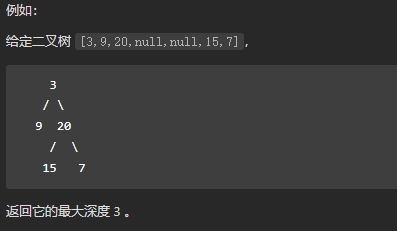

## 二叉树的遍历

> https://leetcode.cn/problems/binary-tree-preorder-traversal/description/
>
> 给你二叉树的根节点 `root` ，返回它节点值的 **前序** 遍历。

#### 二叉树前序遍历：

```java
private List<Integer> res = new ArrayList<>();

public List<Integer> preorderTraversal(TreeNode root) {
    if (root == null) {
        return res;
    }
    res.add(root.val);
    preorderTraversal(root.left);
    preorderTraversal(root.right);
    return res;
}
```

#### 二叉树中序遍历

```java
private List<Integer> res = new ArrayList<>();

public List<Integer> inorderTraversal(TreeNode root) {
    if (root == null) {
        return res;
    }
    inorderTraversal(root.left);
    res.add(root.val);
    inorderTraversal(root.right);
    return res;
}
```

#### 二叉树后序遍历

```java
private List<Integer> res = new ArrayList<>();

public List<Integer> postorderTraversal(TreeNode root) {
    if (root == null) {
        return res;
    }
    postorderTraversal(root.left);
    postorderTraversal(root.right);
    res.add(root.val);
    return res;
}
```

#### 二叉树层序遍历

> https://leetcode.cn/problems/binary-tree-level-order-traversal/
>
> 给你二叉树的根节点 `root` ，返回其节点值的 **层序遍历** 。 （即逐层地，从左到右访问所有节点）。
>
> 
>
> ```
> 输入：root = [3,9,20,null,null,15,7]
> 输出：[[3],[9,20],[15,7]]
> ```

```java
public List<List<Integer>> levelOrder(TreeNode root) {
    List<List<Integer>> res = new ArrayList<>();
    if (root == null) return res;
    Queue<TreeNode> queue = new LinkedList<>();
    queue.offer(root);
    while (!queue.isEmpty()) {
        List<Integer> tmp = new ArrayList<>();
        // 记录每次层个数
        int size = queue.size();
        // 每一层放入一个列表
        for (int i = 0; i < size; i++) {
            TreeNode poll = queue.poll();
            tmp.add(poll.val);
            if (poll.left != null) {
                queue.offer(poll.left);
            }
            if (poll.right != null) {
                queue.offer(poll.right);
            }
        }
        res.add(tmp);
    }
    return res;
}
```

## 剑指 Offer 32 - III. 从上到下打印二叉树 III

> https://leetcode.cn/problems/cong-shang-dao-xia-da-yin-er-cha-shu-iii-lcof/description/
>
> 请实现一个函数按照之字形顺序打印二叉树，即第一行按照从左到右的顺序打印，第二层按照从右到左的顺序打印，第三行再按照从左到右的顺序打印，其他行以此类推。
>
> 

#### 题解：层序遍历对每层进行奇偶判断

层序遍历二叉树，初始化一个下标`index`用来判断是奇数层还是偶数层

- 如果是奇数层则正常添加元素
- 如果是偶数层则向结果集倒着添加元素

```java
    public List<List<Integer>> levelOrder(TreeNode root) {
        List<List<Integer>> res = new LinkedList<>();
        if (root == null) return res;
        Deque<TreeNode> queue = new LinkedList<>();
        queue.offer(root);
        int index = 1;
        while (!queue.isEmpty()) {
            int size = queue.size();
            LinkedList<Integer> tmp = new LinkedList<>();
            for (int i = 0; i < size; i++) {
                TreeNode poll = queue.poll();
                if (index % 2 == 1) {
                    tmp.addLast(poll.val);
                } else {
                    tmp.addFirst(poll.val);
                }
                if (poll.left != null) {
                    queue.offer(poll.left);
                }
                if (poll.right != null) {
                    queue.offer(poll.right);
                }
            }
            res.add(tmp);
            index++;
        }
        return res;
    }
```

## 剑指 Offer 55 - I. 二叉树的深度

> https://leetcode.cn/problems/er-cha-shu-de-shen-du-lcof/
>
> 输入一棵二叉树的根节点，求该树的深度。从根节点到叶节点依次经过的节点（含根、叶节点）形成树的一条路径，最长路径的长度为树的深度。
>
> 

### 题解：递归

- 递归左子树和右子树，每次递归深度+1
- 每次递归都比较左右子树深度，取深度大的返回

【可以背一下】

```java
public int maxDepth(TreeNode root) {
    if (root == null) {
        return 0;
    }
    return Math.max(maxDepth(root.left), maxDepth(root.right)) + 1;
}
```

## 剑指 Offer 34. 二叉树中和为某一值的路径

> https://leetcode.cn/problems/er-cha-shu-zhong-he-wei-mou-yi-zhi-de-lu-jing-lcof/
>
> 给你二叉树的根节点 root 和一个整数目标和 targetSum ，找出所有 从根节点到叶子节点 路径总和等于给定目标和的路径。
>
> 叶子节点 是指没有子节点的节点。
>
> 

#### 题解一：递归

**思路**：深度优先搜索枚举每条从根节点到叶子节点，当遍历到叶节点时并且此时路径和恰好是目标和时，就找到一条满足条件的路径。

> 需要注意的是添加路径时要拷贝一份数组，

```java
List<List<Integer>> res = new ArrayList<>();
public List<List<Integer>> pathSum(TreeNode root, int target) {
    dfs(root, target, new ArrayList<>());
    return res;
}

public void dfs(TreeNode root, int target, List<Integer> arr) {
    if (root == null) {
        return;
    }
    arr.add(root.val);
    dfs(root.left, target - root.val, arr);
    dfs(root.right, target - root.val, arr);

    if (target == root.val && root.left == null && root.right == null) {
        // 这里不能直接加入arr, 而是要复制一份
        // 因为直接加入是引用, arr后面还会变
        res.add(new ArrayList<>(arr));
        // 这里也不能return, 因为该节点不能影响其他节点, 还需要将它移除
    }
    // 如果当前叶子节点不满足target, 需要把他移除, 该节点不影响其他节点
    arr.remove(arr.size() - 1);
}
```

**时间复杂度**：O(N^2)，其中N是树的节点数。最坏情况每条路径都符合要求，路径数目是N，节点数目也是N（这里是拷贝数组时的复杂度）。

**空间复杂度**：O(N)，其中 N 是树的节点数。空间复杂度主要取决于栈空间的开销，栈中的元素个数不会超过树的节点数。

#### 题解二：广度优先搜索

遍历这棵树。当我们遍历到叶子节点，且此时路径和恰为目标和时，就找到了一条满足条件的路径。

为了节省空间，使用哈希表`map`记录树中的每一个节点的父节点。每次找到一个满足条件的节点，就从该节点出发不断向父节点迭代，即可还原出从根节点到当前节点的路径。

```java
public List<List<Integer>> pathSum(TreeNode root, int target) {
    // 存储最终结果
    List<List<Integer>> res = new ArrayList<>();
    if (root == null) {
        return res;
    }
    // 存储节点的父结点, 便于寻找完成路径 key: 节点 value: 父结点
    Map<TreeNode, TreeNode> map = new HashMap<>();
    // 层序遍历队列存储节点
    Queue<TreeNode> queueNode = new LinkedList<>();
    // 存储层序遍历到当前节点时，前面已经累加的sum
    Queue<Integer> sumQueue = new LinkedList<>();
    queueNode.offer(root);
    sumQueue.offer(0);
    while (!queueNode.isEmpty()) {
        TreeNode poll = queueNode.poll();
        int rec = sumQueue.poll() + poll.val;

        if (poll.left == null && poll.right == null && rec == target) {
            getPath(poll, res, map);
        } else {
            if (poll.left != null) {
                // 记录left的父结点
                map.put(poll.left, poll);
                queueNode.offer(poll.left);
                // 说明还有叶节点，还需要继续遍历
                sumQueue.offer(rec);
            }
            if (poll.right != null) {
                map.put(poll.right, poll);
                queueNode.offer(poll.right);
                sumQueue.offer(rec);
            }
        }
    }
    return res;
}

/**
     * 根据叶节点获取完整路径
     */
public void getPath(TreeNode node, List<List<Integer>> res, Map<TreeNode, TreeNode> map) {
    LinkedList<Integer> tmp = new LinkedList<>();
    while (node != null) {
        tmp.addFirst(node.val);
        node = map.get(node);
    }
    res.add(tmp);
}
```

**时间复杂度**：O(N^2)，其中 N 是树的节点数。

**空间复杂度**：O(N)，其中 N是树的节点数。空间复杂度主要取决于哈希表和队列空间的开销，哈希表需要存储除根节点外的每个节点的父节点，队列中的元素个数不会超过树的节点数。

## 剑指 Offer 36. 二叉搜索树与双向链表

> https://leetcode.cn/problems/er-cha-sou-suo-shu-yu-shuang-xiang-lian-biao-lcof/description/
>
> 输入一棵二叉搜索树，将该二叉搜索树转换成一个排序的循环双向链表。要求不能创建任何新的节点，只能调整树中节点指针的指向。
>
> 为了让您更好地理解问题，以下面的二叉搜索树为例：
>
> 
>
> 我们希望将这个二叉搜索树转化为双向循环链表。链表中的每个节点都有一个前驱和后继指针。对于双向循环链表，第一个节点的前驱是最后一个节点，最后一个节点的后继是第一个节点。
>
> 下图展示了上面的二叉搜索树转化成的链表。“head” 表示指向链表中有最小元素的节点。
>
> 
>
> 特别地，我们希望可以就地完成转换操作。当转化完成以后，树中节点的左指针需要指向前驱，树中节点的右指针需要指向后继。还需要返回链表中的第一个节点的指针。

#### 题解：递归中序遍历+链表构造

算法流程：
* 1. 中序遍历：二叉搜索树中序遍历结果是一个有序集

* 2. 递归左子树，即midDfs(root.left)

* 3. 构造链表：

  -  当pre不为空时，修改双向节点引用，即：pre.right = node, node.left = pre
  - 当pre为空时，表示正在访问头结点，即为head
  - 保存node节点，作为下一个pre节点

* 4. 递归右子树，即midDfs(root.right)
* 5. 递归完成后，需要将头尾节点相连，此时pre就是尾结点。即：pre.right = head, head.left = pre

```java
Node head, pre;

public Node treeToDoublyList(Node root) {
    if (root == null) {
        return null;
    }
    midDfs(root);
    pre.right = head;
    head.left = pre;
    return head;
}

public void midDfs(Node node) {
    if (node == null) {
        return;
    }
    midDfs(node.left);
    if (pre != null) {
        pre.right = node;
    } else {
        // 说明是第一个节点
        head = node;
    }
    node.left = pre;
    pre = node;
    midDfs(node.right);
}
```

## 剑指 Offer 28. 对称的二叉树

> https://leetcode.cn/problems/dui-cheng-de-er-cha-shu-lcof/
>
> 请实现一个函数，用来判断一棵二叉树是不是对称的。如果一棵二叉树和它的镜像一样，那么它是对称的。
>
> 例如，二叉树 [1,2,2,3,4,4,3] 是对称的。
>
> 

#### 题解：递归

- 遇到不相等的节点返回`false`
- 如果两个节点都为`null`，返回`true`
- 如果只有一个节点为`null`，那肯定不是对称二叉树，返回`false`
- 递归时判断的两个节点也有要求，怎么判断对称呢？
  - 左子树左节点跟右子树右节点比较
  - 左子树右节点跟右子树左节点比较

```java
public boolean isSymmetric(TreeNode root) {
    // 根节点为null, 返回true
    if (root == null) return true;
    // 递归遍历左右子树
    return dfs(root.left, root.right);
}

public boolean dfs(TreeNode left, TreeNode right) {
    // 左节点和右节点都为空, 返回true
    if (left == null && right == null) return true;
    // 左节点和右节点有一个为空, 返回false
    if (left == null || right == null) return false;
    // 节点值不相等 返回false
    if (left.val != right.val) return false;
    // 判断 left节点的左节点和right的右节点 并且 left的右节点和right的左节点 是否对称
    return dfs(left.left, right.right) && dfs(left.right, right.left);
}
```

## 617. 合并二叉树

> https://leetcode.cn/problems/merge-two-binary-trees/description/
>
> 给你两棵二叉树： `root1` 和 `root2` 。
>
> 想象一下，当你将其中一棵覆盖到另一棵之上时，两棵树上的一些节点将会重叠（而另一些不会）。你需要将这两棵树合并成一棵新二叉树。合并的规则是：如果两个节点重叠，那么将这两个节点的值相加作为合并后节点的新值；否则，**不为** null 的节点将直接作为新二叉树的节点。
>
> 返回合并后的二叉树。
>
> **注意:** 合并过程必须从两个树的根节点开始。
>
> 

#### 题解：递归+树的构建

【建议背着】：递归构建树的方式

```java
public TreeNode mergeTrees(TreeNode root1, TreeNode root2) {
    // 遇到null，直接赋值另一个节点
    if (root1 == null) {
        return root2;
    }
    if (root2 == null) {
        return root1;
    }
    // 都不是null相加构建一个新节点
    TreeNode merge = new TreeNode(root1.val + root2.val);
    // 构建新节点的左子树，对应的root1和root2的左子树
    merge.left = mergeTrees(root1.left, root2.left);
    // 构建新节点的右子树，对应的root1和root2的右子树
    merge.right = mergeTrees(root1.right, root2.right);
    return merge;
}
```

## 剑指 Offer 27. 二叉树的镜像

> https://leetcode.cn/problems/er-cha-shu-de-jing-xiang-lcof/description/
>
> 请完成一个函数，输入一个二叉树，该函数输出它的镜像。
>
> 

#### 题解一：递归

深度优先搜索：递归交换左右子树节点

```java
public TreeNode mirrorTree(TreeNode root) {
    if (root == null) return null;

    TreeNode tmp = root.left;
    // 左右子树节点交换
    root.left = mirrorTree(root.right);
    root.right = mirrorTree(tmp);
    return root;
}
```

#### 题解二：广度优先搜索

层序遍历交换左右节点，每次交换后，子树节点都被交换

```java
public TreeNode mirrorTree2(TreeNode root) {
    if (root == null) return null;

    Queue<TreeNode> queue = new LinkedList<>();
    queue.offer(root);
    while (!queue.isEmpty()) {
        TreeNode node = queue.poll();
        if (node.left != null) queue.offer(node.left);
        if (node.right != null) queue.offer(node.right);
        // 这里交换完node后，node的子树都被交换位置了
        TreeNode tmp = node.left;
        node.left = node.right;
        node.right = tmp;
    }
    return root;
}
```

## 98. 验证二叉搜索树

> https://leetcode.cn/problems/validate-binary-search-tree/
>
> 给你一个二叉树的根节点 `root` ，判断其是否是一个有效的二叉搜索树。
>
> **有效** 二叉搜索树定义如下：
>
> - 节点的左子树只包含 **小于** 当前节点的数。
>
> - 节点的右子树只包含 **大于** 当前节点的数。
>
> - 所有左子树和右子树自身必须也是二叉搜索树。
>
>   

#### 题解：中序遍历

**二叉搜索树中序遍历是个有序数组**

```java
// 定义一个最小值
long tmp = Long.MIN_VALUE;
// 默认是二叉搜索树
boolean res = true;
public boolean isValidBST(TreeNode root) {
    if (root == null) {
        return true;
    }
    isValidBST(root.left);
    // 根据二叉搜索树中序遍历是个有序数组的性质，可以在遍历过程中比较是否有序来判断
    if (tmp >= root.val) {
        res = false;
    }
    // 将当前值保留与下一次比较
    tmp = root.val;
    isValidBST(root.right);
    return res;
}
```

## 剑指 Offer 55 - II. 平衡二叉树

> https://leetcode.cn/problems/ping-heng-er-cha-shu-lcof/description/
>
> 输入一棵二叉树的根节点，判断该树是不是平衡二叉树。如果某二叉树中任意节点的左右子树的深度相差不超过1，那么它就是一棵平衡二叉树。
>
> 


#### 题解：递归

**思路**：主要思路就是判断左右子树深度相差值是否大于1，遍历每个节点，获取该节点左右子树的深度比较，如果小于等于1，则继续遍历该节点子树判断是否左右子树节点都满足

```java
public boolean isBalanced(TreeNode root) {
    if (root == null) return true;
    // 如果当前节点左右子树深度相差小于等于1，则说明是平衡二叉树
    if (Math.abs(getHeight(root.left) - getHeight(root.right)) <= 1) {
        // 接着递归遍历子节点, 并且左右子节点都要满足条件
        return isBalanced(root.left) && isBalanced(root.right);
    }
    return false;
}

/**
     * 获取左右子树中最大深度
     * 跳出递归条件: root=null, 深度返回0
     */
public int getHeight(TreeNode root) {
    if (root == null) {
        return 0;
    }
    // 获取当前节点左右子树深度最大值
    return Math.max(getHeight(root.left) + 1, getHeight(root.right) + 1);
}
```

## 剑指 Offer 68 - I. 二叉搜索树的最近公共祖先

> https://leetcode.cn/problems/er-cha-sou-suo-shu-de-zui-jin-gong-gong-zu-xian-lcof/
>
> 给定一个二叉搜索树, 找到该树中两个指定节点的最近公共祖先。
>
> [百度百科](https://baike.baidu.com/item/最近公共祖先/8918834?fr=aladdin)中最近公共祖先的定义为：“对于有根树 T 的两个结点 p、q，最近公共祖先表示为一个结点 x，满足 x 是 p、q 的祖先且 x 的深度尽可能大（**一个节点也可以是它自己的祖先**）。”
>
> 

#### 题解：递归

**思路**：

* 二叉搜索树性质: 左子树都小于root, 右子树都大于root
* 根据上面性质，如果要找最近公共祖先节点，则该节点一定大于左子树，小于右子树
  * 如果两个节点都大于root节点，则说明公共祖先在右子树，递归右子树即可
  * 如果两个节点都小于root节点，则说明公共祖先在左子树，递归左子树即可

```java
public TreeNode lowestCommonAncestor(TreeNode root, TreeNode p, TreeNode q) {
    if (root == null) return null;

    // 当前节点值大于p、q，说明公共节点在左子树
    if (root.val > p.val && root.val > q.val) {
        return lowestCommonAncestor(root.left, p, q);
    }

    // // 当前节点值小于p、q，说明公共节点在右子树
    if (root.val < p.val && root.val < q.val) {
        return lowestCommonAncestor(root.right, p, q);
    }
    return root;
}
```

## 剑指 Offer 37. 序列化二叉树

> https://leetcode.cn/problems/xu-lie-hua-er-cha-shu-lcof/description/
>
> 请实现两个函数，分别用来序列化和反序列化二叉树。
>
> 你需要设计一个算法来实现二叉树的序列化与反序列化。这里不限定你的序列 / 反序列化算法执行逻辑，你只需要保证一个二叉树可以被序列化为一个字符串并且将这个字符串反序列化为原始的树结构。
>
> **提示：**输入输出格式与 LeetCode 目前使用的方式一致，详情请参阅 [LeetCode 序列化二叉树的格式](https://support.leetcode-cn.com/hc/kb/article/1567641/)。你并非必须采取这种方式，你也可以采用其他的方法解决这个问题。
>
>  

#### 题解：构建二叉树

**思路**：这道题挺开放的，序列化方法可以自定义一个，感觉**主要考点是如何构造树**

```java
// Encodes a tree to a single string. 递归将数节点转为string
public String serialize(TreeNode root) {
    // 遇到空节点存为"null"
    if (root == null) {
        return "null,";
    }
    String res = root.val + ",";
    // 递归前序遍历
    res += serialize(root.left);
    res += serialize(root.right);
    return res;
}

// Decodes your encoded data to tree.
public TreeNode deserialize(String data) {
    // 先将节点解析出来存到队列中
    String[] split = data.split(",");
    Queue<String> queue = new LinkedList<>();
    for (String str : split) {
        queue.offer(str);
    }
    return deserialize(queue);
}


// 主要方法在这里，如何构造树
public TreeNode deserialize(Queue<String> queue) {
    String val = queue.poll();
    // "null"节点对应数的空节点，所以返回null
    if ("null".equals(val)) {
        return null;
    }
    // 先序构造一颗树
    TreeNode treeNode = new TreeNode(Integer.parseInt(val));
    treeNode.left = deserialize(queue);
    treeNode.right = deserialize(queue);
    return treeNode;
}
```

## 剑指 Offer 07. 重建二叉树

> https://leetcode.cn/problems/zhong-jian-er-cha-shu-lcof/
>
> 输入某二叉树的前序遍历和中序遍历的结果，请构建该二叉树并返回其根节点。
>
> 假设输入的前序遍历和中序遍历的结果中都不含重复的数字。
>
> 

#### 题解：根据先序和中序构建二叉树

**思路**：

preorder = [3,9,20,15,7], inorder = [9,3,15,20,7]

1. 先从前序遍历获取树的根节点，在中序遍历中根据根节点可以判断该根节点的左右子树节点以及个数

2. 根据上一步获得的左右子树个数，可以获取前序遍历中该根节点的左右子树个数

```java
public TreeNode buildTree(int[] preorder, int[] inorder) {
    Map<Integer, Integer> map = new HashMap<>();
    int length = preorder.length;
    for (int i = 0; i < length; i++) {
        map.put(inorder[i], i);
    }
    return buildTree(preorder, 0, length - 1, inorder, 0, length - 1, map);
}

/**
     *
     * @param preorder 前序遍历数组
     * @param startPreOrder 当前根节点对应的子树节点在前序数组中的起始下标
     * @param endPreOrder 当前根节点对应的子树节点在前序数组中的终止下标
     * @param inorder 中序遍历数组
     * @param startInOrder 当前根节点对应的子树节点在中序数组中的起始下标
     * @param endInOrder 当前根节点对应的子树节点在中序数组中的终止下标
     * @param map 中序数组节点和下标映射关系，方便获取节点在中序中的位置
     * @return
     */
public TreeNode buildTree(int[] preorder, int startPreOrder, int endPreOrder, int[] inorder, int startInOrder, int endInOrder, Map<Integer, Integer> map) {
    // 判断边界
    if (startPreOrder > endPreOrder) {
        return null;
    }
    // 从先序遍历中获取根节点
    int rootVal = preorder[startPreOrder];
    TreeNode root = new TreeNode(rootVal);
    // 如果先序遍历节点是最后一个
    if (startPreOrder != endPreOrder) {
        // 获取根节点在中序遍历中的下标index
        // [startInOrder, index-1]是当前root的左子树
        // [index+1, endInOrder]是当前root的右子树
        Integer index = map.get(rootVal);
        // 计算前序遍历中左右子树分界线
        // 根据节点在中序遍历中的位置可以确定该节点左右子树的节点个数
        // 然后在前序遍历中根据左右子树个数把前序遍历分成左右子树
        int leftNodes = index - startInOrder;
        int rightNodes = endInOrder - index - 1;
        root.left = buildTree(preorder, startPreOrder + 1, startPreOrder + leftNodes, inorder, startInOrder, index - 1, map);
        root.right = buildTree(preorder, endPreOrder - rightNodes, endPreOrder, inorder, index + 1, endInOrder, map);
    }
    return root;
}
```

