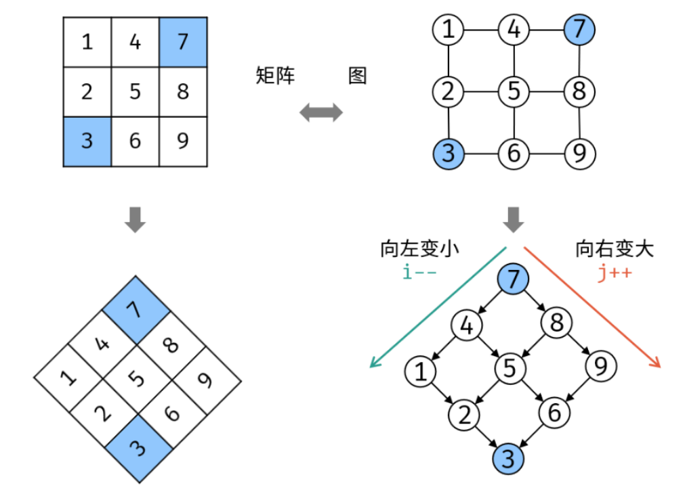

## 剑指 Offer 03. 数组中重复的数字

> https://leetcode.cn/problems/shu-zu-zhong-zhong-fu-de-shu-zi-lcof/?favorite=xb9nqhhg
>
> 找出数组中重复的数字。
>
> 在一个长度为 n 的数组 nums 里的所有数字都在 0～n-1 的范围内。数组中某些数字是重复的，但不知道有几个数字重复了，也不知道每个数字重复了几次。请找出数组中任意一个重复的数字。
>
> ```
> 输入：
> [2, 3, 1, 0, 2, 5, 3]
> 输出：2 或 3
> ```
>
> **限制：**2 <= n <= 100000

### 题解一： 集合Set

使用集合记录数组各个数字，遇到重复数字直接返回。

> 时间复杂度：O(n)，Set查找元素O(1)

```java
public int findRepeatNumber(int[] nums) {
    Set<Integer> set = new HashSet<>();
    for (int num : nums) {
        if (set.contains(num)) {
            return num;
        }
        set.add(num);
    }
    return -1;
}
```

### 题解二： 原地交换数字

1. 遍历数组 nums ，设索引初始值为 i=0 :

   - 若 `nums[i]=i`，说明此数字已在对应索引位置，无需交换，因此跳过；

   - 若 `nums[nums[i]]=nums[i]`， 说明索引`nums[i]`处和索引`i`处的元素值都为`nums[i]`，即找到一组重复值；

   - 否则，交换索引`i`和索引`nums[i]`的元素值，将此数字交换置对应索引位置。

2. 若遍历完未返回，返回-1.

```java
public int findRepeatNumber(int[] nums) {
    int i = 0;
    while (i < nums.length) {
        if (nums[i] == i) {
            i++;
            continue;
        }
        if (nums[i] == nums[nums[i]]) {
            return nums[i];
        }
        // 交换位置，直到nums[i] = i
        int tmp = nums[i];
        nums[i] = nums[tmp];
        nums[tmp] = tmp;
    }
    return -1;
}
```

## 剑指 Offer 04. 二维数组中的查找

> https://leetcode.cn/problems/er-wei-shu-zu-zhong-de-cha-zhao-lcof/?favorite=xb9nqhhg
>
> 在一个 n * m 的二维数组中，每一行都按照从左到右 **非递减** 的顺序排序，每一列都按照从上到下 **非递减** 的顺序排序。请完成一个高效的函数，输入这样的一个二维数组和一个整数，判断数组中是否含有该整数。
>
> ```
> [
> [1,   4,  7, 11, 15],
> [2,   5,  8, 12, 19],
> [3,   6,  9, 16, 22],
> [10, 13, 14, 17, 24],
> [18, 21, 23, 26, 30]
> ]
> ```
>
> 给定 target = `5`，返回 `true`。
>
> 给定 target = `20`，返回 `false`。

### 题解一：二分查找

由于矩阵的行和列都是有序的，所以可以遍历行或者列使用二分查找来判断。

```java
public boolean findNumberIn2DArray(int[][] matrix, int target) {
    if (matrix.length == 0 || matrix[0].length == 0) {
        return false;
    }
    for (int[] ints : matrix) {
        // 二分查找
        int l = 0, r = ints.length - 1;
        while (l <= r) {
            int index = (l + r) / 2;
            if (ints[index] == target) {
                return true;
            } else if (ints[index] < target) {
                l++;
            } else if (ints[index] > target) {
                r--;
            }
        }
    }
    return false;
}
```

### 题解二： 二叉搜索树思想（消去行列）

如下图所示：将矩阵逆时针旋转，可以发现其类似于**二叉搜索树**。即每个元素，左分支元素更小，右分支元素更大。



因此，以左下角元素或者右上角元素为基础`flag`，则有：

- 若`target < flag`：则`target`一定在`flag`所在行的上面，这样`flag`所在**行**就可以消除。
- 若`target > flag`：则`target`一定在`flag`所在列的右方，这样`flag`所在**列**就可以消除。

复杂度分析：

- 时间复杂度：`O(M + N)`，M和N为矩阵行数和列数
- 空间复杂度：`O(1)`

```java
public boolean findNumberIn2DArray(int[][] matrix, int target) {
    // 从左下角元素开始
    int i = matrix.length - 1, j = 0;
    while (i >= 0 && j <= matrix[0].length - 1) {
        if (matrix[i][j] == target) {
            return true;
        } else if (matrix[i][j] > target) {
            // target一定在matrix[i][j]上方，消除行
            i--;
        } else if (matrix[i][j] < target) {
            // target一定在matrix[i][j]右方，消除列
            j++;
        }
    }
    return false;
}
```

## 剑指 Offer 05. 替换空格

> 链接：https://leetcode.cn/problems/ti-huan-kong-ge-lcof/?favorite=xb9nqhhg
>
> 请实现一个函数，把字符串 `s` 中的每个空格替换成"%20"。
>
> 【示例】：
>
> ```
> 输入：s = "We are happy."
> 输出："We%20are%20happy."
> ```

### 题解一：直接调用replace方法

```java
public String replaceSpace(String s) {
    return s.replace(" ", "%20");
}
```

### 题解二：遍历替换

```java
public String replaceSpace(String s) {
    StringBuilder sb = new StringBuilder();
    for (char ch : s.toCharArray()) {
        if (ch == ' ') {
            sb.append("%20");
        } else {
            sb.append(ch);
        }
    }
    return sb.toString();
}
```


## 剑指 Offer 06. 从尾到头打印链表

> https://leetcode.cn/problems/cong-wei-dao-tou-da-yin-lian-biao-lcof/?favorite=xb9nqhhg
>
> 输入一个链表的头节点，从尾到头反过来返回每个节点的值（用数组返回）。
>
> ```
> 输入：head = [1,3,2]
> 输出：[2,3,1]
> ```

### 题解：普通遍历

```java
public int[] reversePrint(ListNode head) {
    List<Integer> res = new ArrayList<>();
    while (head != null) {
        res.add(head.val);
        head = head.next;
    }
    Collections.reverse(res);
    return res.stream().mapToInt(Integer::intValue).toArray();
}
```

## 剑指 Offer 51. 数组中的逆序对

> https://leetcode.cn/problems/shu-zu-zhong-de-ni-xu-dui-lcof/description/
>
> 在数组中的两个数字，如果前面一个数字大于后面的数字，则这两个数字组成一个逆序对。输入一个数组，求出这个数组中的逆序对的总数。
>
> ```
> 输入: [7,5,6,4]
> 输出: 5
> ```

### 题解一：归并排序

**思路**：求逆序对跟归并排序有啥关系？？？

**归并排序和逆序对关系**，比如下面例子：

假设有两个已排序的序列等待合并，`L={8,12,16,22,100}  R={9,26,55,64,91}`。开始我们用指针 `lPtr = 0` 指向 L 的首部，`rPtr = 0` 指向 R 的头部。记已经合并好的部分为M。如下：

```java
L = [8, 12, 16, 22, 100]   R = [9, 26, 55, 64, 91]  M = []
     |                          |
   lPtr                       rPtr
```

发现`lPtr`指向的元素小于`rPtr`指向的元素，于是把`lPtr`指向的元素放入M，并把`lPtr`向后移一位。如下：

```java
L = [8, 12, 16, 22, 100]   R = [9, 26, 55, 64, 91]  M = [8]
        |                       |
      lPtr                     rPtr
```

这时把8放入答案，但是发现右边没有数比8小，所以8对逆序对总数【贡献】为0。

继续合并，**此时发现`lPtr`所指的位置比`rPtr`大，由于归并排序每个子数组都是有序的，则对于`rPtr`而言，`lPtr`右侧的所有数都比它大，即`lPtr`右侧每个数都能和`rPtr`构成一个逆序对。贡献为`mid - lPtr + 1`。**

***

利用上述思路，可以在归并的过程中计算逆序对的个数。

```java
class Solution {
    int res = 0;
    public int reversePairs(int[] nums) {
        this.res = 0;
        mergeSort(nums, 0, nums.length - 1);
        return res;
    }
    
    public void mergeSort(int[] nums, int left, int right) {
        if (left < right) {
            int mid = left + (right - left) / 2;
            mergeSort(nums, left, mid);
            mergeSort(nums, mid + 1, right);
            merge(nums, left, mid, right);
        }
    }
    
    public void merge(int[] nums, int left, int mid, int right) {
        int i = left, j = mid + 1, k = 0;
        int[] tmp = new int[right - left + 1];
        while (i <= mid && j <= right) {
            if (nums[i] > nums[j]) {
                tmp[k++] = nums[j++];
                // 右边当前值比左边当前值都要小，则右边当前值对于左边剩余部分的mid-i+1个数都是逆序
                res += (mid - i + 1);
            } else {
                // 左边当前值小于右边当前值, 不是逆序
                tmp[k++] = nums[i++];
            }
        }
        
        while (i <= mid) {
            tmp[k++] = nums[i++];
        }
        
        while (j <= right) {
            tmp[k++] = nums[j++];
        }
    
        for(int t = 0; t < tmp.length; t++){
            nums[left + t] = tmp[t];
        }
    }
}
```

