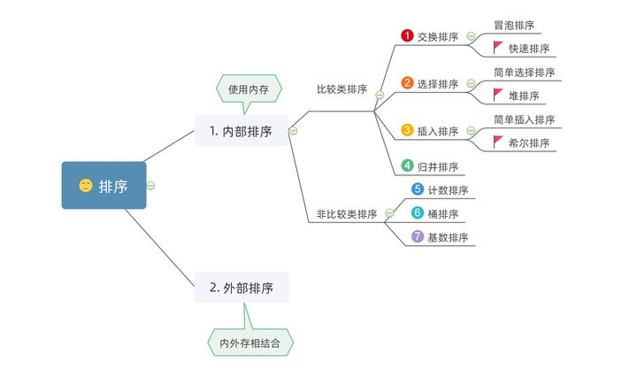

## 排序算法时间复杂度

- **稳定**：如果a原本在b前面，而a=b，排序之后a仍然在b的前面；
- **不稳定**：如果a原本在b的前面，而a=b，排序之后a可能会出现在b的后面；
- **内排序**：所有排序操作都在内存中完成；
- **外排序**：由于数据太大，因此把数据放在磁盘中，而排序通过磁盘和内存的数据传输才能进行；
- **时间复杂度：** 一个算法执行所耗费的时间。
- **空间复杂度**：运行完一个程序所需内存的大小。


**图片名词解释：**

- `n`: 数据规模
- `k`: “桶”的个数
- `In-place`: 占用常数内存，不占用额外内存
- `Out-place`: 占用额外内存



# 2. 冒泡排序

## 2.1 算法描述

- 比较相邻的元素。如果第一个比第二个大，就交换它们两个；
- 对每一对相邻元素作同样的工作，从开始第一对到结尾的最后一对，这样在最后的元素应该会是最大的数；
- 针对所有的元素重复以上的步骤，除了最后一个；
- 重复步骤1~3，直到排序完成。

## 2.2 代码实现

```java
/**
     * 冒泡排序
     *
     * @param array
     * @return
     */
    public static int[] bubbleSort(int[] array) {
        if (array.length == 0)
            return array;
        for (int i = 0; i < array.length; i++)
            for (int j = 0; j < array.length - 1 - i; j++)
                if (array[j + 1] < array[j]) {
                    int temp = array[j + 1];
                    array[j + 1] = array[j];
                    array[j] = temp;
                }
        return array;
    }
```

## 2.3 算法分析

- **平均时间复杂度: `T(n) = O(n²)`**
- **最坏时间复杂度: `T(n) = O(n²)`**：当输入的数据是反序时
- **最好时间复杂度: `T(n) = O(n)`**：当输入的数据已经有序时，只需遍历一遍用于确认数据已有序。
- **空间复杂度: `O(1)`**
- **稳定性: `稳定`**

# 3. 选择排序

工作原理：首先在未排序序列中找到最小（大）元素，存放到排序序列的起始位置，然后，再从剩余未排序元素中继续寻找最小（大）元素，然后放到已排序序列的末尾。以此类推，直到所有元素均排序完毕。 

## 3.1 算法描述

n个记录的直接选择排序可经过n-1趟直接选择排序得到有序结果。具体算法描述如下：

- 初始状态：无序区为R[1..n]，有序区为空；
- 第i趟排序(i=1,2,3…n-1)开始时，当前有序区和无序区分别为R[1..i-1]和R(i..n）。该趟排序从当前无序区中-选出关键字最小的记录 R[k]，将它与无序区的第1个记录R交换，使R[1..i]和R[i+1..n)分别变为记录个数增加1个的新有序区和记录个数减少1个的新无序区；
- n-1趟结束，数组有序化了。

## 3.2 代码实现

```java
public static int[] selectSort(int[] arr) {
    if (arr.length == 0) {
        return arr;
    }

    for (int i = 0; i < arr.length; i++) {
        int minIndex = i;
        for (int j = i; j < arr.length; j++) {
            if (arr[j] < arr[minIndex]) {
                minIndex = j;
            }
        }
        int tmp = arr[i];
        arr[i] = arr[minIndex];
        arr[minIndex] = tmp;
    }
    return arr;
}
```

## 3.3 算法分析

- **平均时间复杂度: `T(n) = O(n²)`**
- **最坏时间复杂度: `T(n) = O(n²)`**
- **最好时间复杂度: `T(n) = O(n²)`**
- **空间复杂度: `O(1)`**
- **稳定性: `不稳定`**

# 4. 插入排序

工作原理是通过构建有序序列，对于未排序数据，在已排序序列中从后向前扫描，找到相应位置并插入。插入排序在实现上，通常采用in-place排序（即只需用到O(1)的额外空间的排序），因而在从后向前扫描过程中，需要反复把已排序元素逐步向后挪位，为最新元素提供插入空间。

## 4.1 算法描述

- 从第一个元素开始，该元素可以认为已经被排序；
- 取出下一个元素，在已经排序的元素序列中从后向前扫描；
- 如果该元素（已排序）大于新元素，将该元素移到下一位置；
- 重复步骤3，直到找到已排序的元素小于或者等于新元素的位置；
- 将新元素插入到该位置后；
- 重复步骤2~5。

## 4.2 代码实现

```java
public static int[] insertSort(int[] arr) {
    if (arr.length == 0) {
        return arr;
    }

    for (int i = 0; i < arr.length - 1; i++) {
        int current = arr[i + 1];
        int preIndex = i;
        while (preIndex >= 0 && arr[preIndex] > current) {
            arr[preIndex + 1] = arr[preIndex];
            preIndex--;
        }
        arr[preIndex + 1] = current;
    }
    return arr;
}
```

## 4.3 算法分析

- **-平均时间复杂度: `T(n) = O(n²)`**
- **最坏时间复杂度: `T(n) = O(n²)`**：输入数组按降序排列（完全逆序）
- **最好时间复杂度: `T(n) = O(n)`**：输入数组按升序排列（基本有序）
- **空间复杂度: `O(1)`**
- **稳定性：`稳定`**

## 4.4 改进方法

改进思路一：查找插入位置时使用二分查找的方式，减少比较次数。

# 5. 希尔排序

**该方法实质上是一种分组插入方法**，希尔排序是基于插入排序的以下两点性质而提出改进方法的：

- 插入排序在对几乎已经排好序的数据操作时，效率高，即可以达到线性排序的效率。
- 但插入排序一般来说是低效的，因为插入排序每次只能将数据移动一位。

## 5.1 算法描述

先将整个待排序的记录序列分割成为若干子序列分别进行直接插入排序，具体算法描述：

1. 选择一个增量序列t1，t2，…，tk，其中ti>tj，tk=1；
2. 按增量序列个数k，对序列进行k 趟排序；
3. 每趟排序，根据对应的增量ti，将待排序列分割成若干长度为m 的子序列，分别对各子表进行直接插入排序。仅增量因子为1 时，整个序列作为一个表来处理，表长度即为整个序列的长度。


## 5.2 代码实现

```java
public static int[] shellSort(int[] arr) {
    int len = arr.length;
    int gap = len / 2;
    while (gap > 0) {
        int temp;
        for (int i = gap; i < len; i++) {
            int preIndex = i - gap;
            temp = arr[i];
            // 寻找前面已排序队列中比temp大的，向后移动，这里和插入排序一直，只是间距不一样
            while (preIndex >= 0 && arr[preIndex] > temp) {
                arr[preIndex + gap] = arr[preIndex];
                preIndex -= gap; 
            }
            arr[preIndex + gap] = temp;
        }
        gap /= 2;
    }
    return arr;
}
```

## 5.2 算法分析

- **平均时间复杂度：`T(n) = O(n^1.5)`**
- **最坏时间复杂度：`T(n) = O(nlog²n）`**
- **空间复杂度: `O(1)`**

- **稳定性: `不稳定`**，由于多次插入排序，我们知道一次插入排序是稳定的，不会改变相同元素的相对顺序，但在不同的插入排序过程中，相同的元素可能在各自的插入排序中移动，最后其稳定性就会被打乱，所以shell排序是不稳定的。

# 6. 归并排序

和选择排序一样，归并排序的性能不受输入数据的影响，但表现比选择排序好的多，因为始终都是O(n log n）的时间复杂度。代价是需要额外的内存空间。

归并排序是建立在归并操作上的一种有效的排序算法。该算法是采用分治法（Divide and Conquer）的一个非常典型的应用。归并排序是一种稳定的排序方法。将已有序的子序列合并，得到完全有序的序列；即先使每个子序列有序，再使子序列段间有序。若将两个有序表合并成一个有序表，称为2-路归并。

## 6.1 算法描述

- 把长度为n的输入序列分成两个长度为n/2的子序列；
- 对这两个子序列分别采用归并排序；
- 将两个排序好的子序列合并成一个最终的排序序列。

## 6.2 代码实现

```java
/**
     * 
     * @param arr
     * @param low 传入数组起始下标，一般为0
     * @param high 传入数组终止下标，一般为 arr.length - 1
     */
public static void mergeSort(int[] arr, int low, int high) {
    if (low < high) {
        int mid = low + (high - low) / 2;
        mergeSort(arr, low, mid);
        mergeSort(arr, mid + 1, high);
        merge(arr, low, mid, high);
    }
}

private static void merge(int[] arr, int low, int mid, int high) {
    int[] help = new int[high - low + 1];
    int left = low;
    int right = mid + 1;

    int index = 0;
    while (left <= mid && right <= high) {
        if (arr[left] < arr[right]) {
            help[index++] = arr[left++];
        } else {
            help[index++] = arr[right++];
        }
    }

    while (left <= mid) {
        help[index++] = arr[left++];
    }

    while (right <= high) {
        help[index++] = arr[right++];
    }

    for (int i = 0; i < help.length; i++) {
        arr[low + i] = help[i];
    }
}
```

## 6.3 算法分析

- **平均情况：`T(n) = O(nlogn)`**
- **最差情况：`T(n) = O(nlogn)`**
- **最佳情况：`T(n) = O(n)`**
- **空间复杂度: `O(n)`**，归并排序需要一个与原数组相同长度的数组做辅助来排序
- **稳定性: `稳定`**

# 7. 快速排序

快速排序的基本思想：通过一趟排序将待排记录分隔成独立的两部分，其中一部分记录的关键字均比另一部分的关键字小，则可分别对这两部分记录继续进行排序，以达到整个序列有序。

## 7.1 算法描述

快速排序使用分治法来把一个串（list）分为两个子串（sub-lists）。具体算法描述如下：

1. 从数列中挑出一个元素，称为 "基准"（pivot）；
2. 重新排序数列，所有元素比基准值小的摆放在基准前面，所有元素比基准值大的摆在基准的后面（相同的数可以到任一边）。在这个分区退出之后，该基准就处于数列的中间位置。这个称为分区（partition）操作；
3. 递归地（recursive）把小于基准值元素的子数列和大于基准值元素的子数列排序。

## 7.2 代码实现

```java
/**
     * 
     * @param arr
     * @param low 传入数组起始下标，一般为0
     * @param high 传入数组终止下标，一般为 arr.length - 1
     */
public static void quickSort(int[] arr, int low, int high) {
    if (low < high) {
        int mid = partition(arr, low, high);
        quickSort(arr, low, mid - 1);
        quickSort(arr, mid + 1, high);
    }
}

private static int partition(int[] arr, int low, int high) {
    int key = arr[low];
    while (low < high) {
        while (low < high && arr[high] >= key) {
            high--;
        }
        swap(arr, low, high);
        while (low < high && arr[low] <= key) {
            low++;
        }
        swap(arr, low, high);
    }
    return low;
}

private static void swap(int[] arr, int i, int j) {
    int temp = arr[i];
    arr[i] = arr[j];
    arr[j] = temp;
}
```

## 7.3 算法分析

- **最佳情况：`T(n) = O(nlogn)`**，快速排序最优的情况就是每一次取到的元素都刚好平分整个数组
- **最差情况：`T(n) = O(n²)`**，最差的情况就是每一次取到的元素就是数组中最小/最大的，这种情况其实就是冒泡排序了(每一次都排好一个元素的顺序)
- **平均情况：`T(n) = O(nlogn)`**
- **稳定性：`不稳定`**

# 8. 堆排序

堆排序（Heapsort）是指利用堆这种数据结构所设计的一种排序算法。堆积是一个近似完全二叉树的结构，并同时满足堆积的性质：即子结点的键值或索引总是小于（或者大于）它的父节点。

## 8.1 算法描述

1. 将初始待排序关键字序列(R1,R2….Rn)构建成大顶堆，此堆为初始的无序区；
2. 将堆顶元素R[1]与最后一个元素R[n]交换，此时得到新的无序区(R1,R2,……Rn-1)和新的有序区(Rn),且满足R[1,2…n-1]<=R[n]；
3. 由于交换后新的堆顶R[1]可能违反堆的性质，因此需要对当前无序区(R1,R2,……Rn-1)调整为新堆，然后再次将R[1]与无序区最后一个元素交换，得到新的无序区(R1,R2….Rn-2)和新的有序区(Rn-1,Rn)。不断重复此过程直到有序区的元素个数为n-1，则整个排序过程完成。

## 8.2 代码实现

```java
public static void heapSort(int[] arr) {
    for (int i = (arr.length / 2) - 1; i >= 0; i--) {
        adjust(arr, i, arr.length);
    }

    for (int i = 0; i < arr.length; i++) {
        swap(arr, 0, arr.length - 1 -i);
        adjust(arr, 0, arr.length - 1 - i);
    }
}

private static void adjust(int[] arr, int index, int len) {
    int leftIndex = 2 * index + 1;
    int rightIndex = 2 * index + 2;
    int bigIndex = index;

    if (leftIndex < len && arr[bigIndex] < arr[leftIndex]) {
        bigIndex = leftIndex;
    }

    if (rightIndex < len && arr[bigIndex] < arr[rightIndex]) {
        bigIndex = rightIndex;
    }

    if (bigIndex != index) {
        swap(arr, index, bigIndex);
        adjust(arr, bigIndex, len);
    }
}

private static void swap(int[] arr, int i, int j) {
    int temp = arr[i];
    arr[i] = arr[j];
    arr[j] = temp;
}
```

## 8.3 算法分析

**调堆：O(h)**
**建堆：O(n)**
**循环调堆：O(nlogn)**
总运行时间`T(n) = O(nlogn) + O(n) = O(nlogn)`。对于堆排序的最好情况与最坏情况的运行时间，因为最坏与最好的输入都只是影响建堆的运行时间O(1)或者O(n)，而在总体时间中占重要比例的是循环调堆的过程，即O(nlogn) + O(1) =O(nlogn) + O(n) = O(nlogn)。因此最好或者最坏情况下，堆排序的运行时间都是O(nlogn)。而且堆排序还是 [原地算法（in-place algorithm）](http://zh.wikipedia.org/wiki/原地算法) 。

- **平均情况：`T(n) = O(nlogn)`**
- **最差情况：`T(n) = O(nlogn)`**
- **最佳情况：`T(n) = O(nlogn)`**
- **空间复杂度：`O(1)`**
- **稳定性：`不稳定`**

# 9. 计数排序

计数排序的核心在于将输入的数据值转化为键存储在额外开辟的数组空间中。 作为一种线性时间复杂度的排序，计数排序要求输入的数据必须是有确定范围的整数。

计数排序(Counting sort)是一种稳定的排序算法。计数排序使用一个额外的数组C，其中第i个元素是待排序数组A中值等于i的元素的个数。然后根据数组C来将A中的元素排到正确的位置。它只能对整数进行排序。

## 9.1 算法描述

- 找出待排序的数组中最大和最小的元素；
- 统计数组中每个值为i的元素出现的次数，存入数组C的第i项；
- 对所有的计数累加（从C中的第一个元素开始，每一项和前一项相加）；
- 反向填充目标数组：将每个元素i放在新数组的第C(i)项，每放一个元素就将C(i)减去1。

## 9.2 代码实现

```java
public static int[] countSort(int[] arr) {
    if (arr.length == 0) return arr;
    int min = arr[0];
    int max = arr[0];
    for (int i = 1; i < arr.length; i++) {
        if (arr[i] > max) {
            max = arr[i];
        }
        if (arr[i] < min) {
            min = arr[i];
        }
    }
    int[] bucket = new int[max - min + 1];
    Arrays.fill(bucket, 0);
    int ans = 0 - min;      // 防止数组中有负数
    for (int i = 0; i < arr.length; i++) {
        bucket[arr[i] + ans]++;
    }

    int index = 0, i = 0;
    while (index < arr.length) {
        if (bucket[i] != 0) {
            arr[index] = i - ans;
            bucket[i]--;    // 该数值个数减1
            index++;
        } else {
            i++;
        }
    }
    return arr;
}
```

## 9.3 算法分析

当输入的元素是n 个0到k之间的整数时，它的运行时间是 O(n + k)。计数排序不是比较排序，排序的速度快于任何比较排序算法。由于用来计数的数组C的长度取决于待排序数组中数据的范围（等于待排序数组的最大值与最小值的差加上1），这使得计数排序对于数据范围很大的数组，需要大量时间和内存。

- **最佳情况：T(n) = O(n+k)  **

- **最差情况：T(n) = O(n+k)  **

- **平均情况：T(n) = O(n+k)**

# 10. 桶排序

桶排序是计数排序的升级版。它利用了函数的映射关系，高效与否的关键就在于这个映射函数的确定。

桶排序 (Bucket sort)的工作的原理：假设输入数据服从均匀分布，将数据分到有限数量的桶里，每个桶再分别排序（有可能再使用别的排序算法或是以递归方式继续使用桶排序进行排

## 10.1 算法描述

- 人为设置一个BucketSize，作为每个桶所能放置多少个不同数值（例如当BucketSize==5时，该桶可以存放｛1,2,3,4,5｝这几种数字，但是容量不限，即可以存放100个3）；
- 遍历输入数据，并且把数据一个一个放到对应的桶里去；
- 对每个不是空的桶进行排序，可以使用其它排序方法，也可以递归使用桶排序；
- 从不是空的桶里把排好序的数据拼接起来。 

**注意，如果递归使用桶排序为各个桶排序，则当桶数量为1时要手动减小BucketSize增加下一循环桶的数量，否则会陷入死循环，导致内存溢出。**


## 10.2 代码实现

```java
/**
     * 桶排序
     * @param array
     * @param bucketSize
     * @return
     */
public static ArrayList<Integer> BucketSort(ArrayList<Integer> array, int bucketSize) {
    if (array == null || array.size() < 2)
        return array;
    int max = array.get(0), min = array.get(0);
    // 找到最大值最小值
    for (int i = 0; i < array.size(); i++) {
        if (array.get(i) > max)
            max = array.get(i);
        if (array.get(i) < min)
            min = array.get(i);
    }
    int bucketCount = (max - min) / bucketSize + 1;
    ArrayList<ArrayList<Integer>> bucketArr = new ArrayList<>(bucketCount);
    ArrayList<Integer> resultArr = new ArrayList<>();
    for (int i = 0; i < bucketCount; i++) {
        bucketArr.add(new ArrayList<Integer>());
    }
    for (int i = 0; i < array.size(); i++) {
        bucketArr.get((array.get(i) - min) / bucketSize).add(array.get(i));
    }
    for (int i = 0; i < bucketCount; i++) {
        if (bucketSize == 1) { // 如果带排序数组中有重复数字时  感谢 @见风任然是风 朋友指出错误
            for (int j = 0; j < bucketArr.get(i).size(); j++)
                resultArr.add(bucketArr.get(i).get(j));
        } else {
            if (bucketCount == 1)
                bucketSize--;
            ArrayList<Integer> temp = BucketSort(bucketArr.get(i), bucketSize);
            for (int j = 0; j < temp.size(); j++)
                resultArr.add(temp.get(j));
        }
    }
    return resultArr;
}
```

## 10.3 算法分析

桶排序最好情况下使用线性时间O(n)，桶排序的时间复杂度，取决与对各个桶之间数据进行排序的时间复杂度，因为其它部分的时间复杂度都为O(n)。很显然，桶划分的越小，各个桶之间的数据越少，排序所用的时间也会越少。但相应的空间消耗就会增大。 

- **最佳情况：T(n) = O(n+k) **

- **最差情况：T(n) = O(n+k)  **

- **平均情况：T(n) = O(n2)**　　

# 11. 基数排序

基数排序也是非比较的排序算法，对每一位进行排序，从最低位开始排序，复杂度为O(kn),为数组长度，k为数组中的数的最大的位数；

基数排序是按照低位先排序，然后收集；再按照高位排序，然后再收集；依次类推，直到最高位。有时候有些属性是有优先级顺序的，先按低优先级排序，再按高优先级排序。最后的次序就是高优先级高的在前，高优先级相同的低优先级高的在前。基数排序基于分别排序，分别收集，所以是稳定的。

## 11.1 算法描述

- 取得数组中的最大数，并取得位数；
- arr为原始数组，从最低位开始取每个位组成radix数组；
- 对radix进行计数排序（利用计数排序适用于小范围数的特点）；

## 11.2 代码实现

```java
/**
     * 基数排序
     * @param array
     * @return
     */
public static int[] RadixSort(int[] array) {
    if (array == null || array.length < 2)
        return array;
    // 1.先算出最大数的位数；
    int max = array[0];
    for (int i = 1; i < array.length; i++) {
        max = Math.max(max, array[i]);
    }
    int maxDigit = 0;
    while (max != 0) {
        max /= 10;
        maxDigit++;
    }
    int mod = 10, div = 1;
    ArrayList<ArrayList<Integer>> bucketList = new ArrayList<ArrayList<Integer>>();
    for (int i = 0; i < 10; i++)
        bucketList.add(new ArrayList<Integer>());
    for (int i = 0; i < maxDigit; i++, mod *= 10, div *= 10) {
        for (int j = 0; j < array.length; j++) {
            int num = (array[j] % mod) / div;
            bucketList.get(num).add(array[j]);
        }
        int index = 0;
        for (int j = 0; j < bucketList.size(); j++) {
            for (int k = 0; k < bucketList.get(j).size(); k++)
                array[index++] = bucketList.get(j).get(k);
            bucketList.get(j).clear();
        }
    }
    return array;
}
```

## 11.3 算法分析

**最佳情况：T(n) = O(n \* k)  最差情况：T(n) = O(n \* k)  平均情况：T(n) = O(n \* k)**

基数排序有两种方法：

MSD 从高位开始进行排序 LSD 从低位开始进行排序 

**基数排序 vs 计数排序 vs 桶排序**

这三种排序算法都利用了桶的概念，但对桶的使用方法上有明显差异：

- 基数排序：根据键值的每位数字来分配桶
- 计数排序：每个桶只存储单一键值
- 桶排序：每个桶存储一定范围的数值

# 12. 总结

**稳定**的排序：**冒泡排序，插入排序，归并排序**
**不稳定**的排序：**选择排序，堆排序，快速排序，希尔排序**

**平均**时间复杂度`T(n) = O(nlogn)`：**希尔排序，归并排序，快速排序，堆排序**
**平均**时间复杂度`T(n) = O(n²)`：**冒泡排序，简单选择排序，插入排序**

**最好**时间复杂度`T(n) = O(n)`：**冒泡排序，插入排序**
**最好**时间复杂度`T(n) = O(nlogn)`：**归并排序，快速排序，堆排序**
**最好**时间复杂度`T(n) = O(n²)`：**简单选择排序**

**最坏**时间复杂度`T(n) = O(nlogn)`：**归并排序，堆排序**
**最坏**时间复杂度`T(n) = O(n²)`：**冒泡排序，简单选择排序，插入排序，快速排序**

空间复杂度`O(1)`：**冒泡排序，简单选择排序，插入排序，希尔排序，堆排序**
空间复杂度`O(n)`：**归并排序**
空间复杂度`O(nlogn)`：**快速排序**

# 13. 参考资料

- https://segmentfault.com/a/1190000021638663
- https://www.cnblogs.com/guoyaohua/p/8600214.html