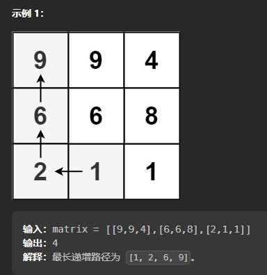

## 剑指 Offer II 083. 没有重复元素集合的全排列

> https://leetcode.cn/problems/VvJkup/description/
>
> 给定一个不含重复数字的整数数组 `nums` ，返回其 **所有可能的全排列** 。可以 **按任意顺序** 返回答案。
>
> ```
> 输入：nums = [1,2,3]
> 输出：[[1,2,3],[1,3,2],[2,1,3],[2,3,1],[3,1,2],[3,2,1]]
> ```

#### 题解：回溯

**可以将此问题看作有`n`个排列成一行的空格，需要从左往右依次填入题目给定的`n`个数，每个数只能用一次。**

定义递归函数`backTrack(res, tmp n, first)`表示从左往右填到第`first`个位置，当前排列为`tmp`，递归分下面两种情况：

- 如果`first==n`说明已经填完了`n`个位置（下标从0开始），找到一个可行的解，将`tmp`放入答案中。
- 如果`first < n`，需要考虑第`first`个位置需要填哪个数。题目要求不能填重复的数，所以需要把填过的数和未填过的数区分开。

如何区分填过的数和未填过的数？

假设已经填到第`first`个位置，则`nums`数组中`[0, first-1]`是已经填过的数的集合，`[first, n-1]`是待填的数的集合。所以肯定用`[first, n-1]`里面的数去填第`first`个数。假设待填的数下标为`i`，填完后将第`i`个数和第`first`个数交换，即能使得在填第 `first+1`个数的时候 `nums`数组的`[0,first]` 部分为已填过的数，`[first+1,n−1]` 为待填的数，回溯的时候交换回来即能完成撤销操作。

举个简单的例子，假设我们有`[2,5,8,9,10]` 这 5 个数要填入，已经填到第 3个位置，已经填了 `[8,9]` 两个数，那么这个数组目前为 `[8,9 ∣ 2,5,10]` 这样的状态，分隔符区分了左右两个部分。假设这个位置我们要填 10这个数，为了维护数组，我们将 2 和 10 交换，即能使得数组继续保持分隔符左边的数已经填过，右边的待填`[8,9,10 ∣ 2,5]` 

```java
public List<List<Integer>> permute(int[] nums) {
    List<List<Integer>> res = new ArrayList<>();
    List<Integer> tmp = new ArrayList<>();
    for (int num : nums) {
        tmp.add(num);
    }
    backTrack(res, tmp, nums.length - 1, 0);
    return res;
}

public void backTrack(List<List<Integer>> res, List<Integer> tmp, int n, int first) {
    if (first == n) {
        // 这里需要拷贝一份，否则后面修改会改变tmp数组的值
        res.add(new ArrayList<>(tmp));
    } else {
        for (int i = first; i <= n; i++) {
            Collections.swap(tmp, first, i);
            backTrack(res, tmp, n, first + 1);
            // 这里需要还原现场，否则first位只交换一次
            Collections.swap(tmp, first, i);
        }
    }
}
```

## 剑指 Offer II 084. 含有重复元素集合的全排列

> https://leetcode.cn/problems/7p8L0Z/
>
> 给定一个可包含重复数字的整数集合 `nums` ，**按任意顺序** 返回它所有不重复的全排列。
>
> ```
> 输入：nums = [1,1,2]
> 输出：
> [[1,1,2],
>  [1,2,1],
>  [2,1,1]]
> ```

#### 题解：回溯

定义递归函数 `backtrack(idx,perm)`表示当前排列为 `perm`，下一个待填入的位置是第 `idx`个位置（下标从 0 开始）。那么整个递归函数分为两个情况：

- 如果`idx == n`，说明已经填完第`n`个位置，找到一个可行的解。
- 如果`idx < n`，需要考虑第`idx`填哪一个数，题目要求不能填已经填过的数，所以需要一个标记数组`visited`标记已经填过的数。在填第`idx`个数的时候遍历题目给的`n`个数，如果没有被标记则填入，然后继续尝试下一个位置，即`backTrack(perm, idx + 1)`。回溯时要撤销该位置填的数和标记。
- 为了解决重复填值的问题，设定一个规则：保证在填第`idx`个数的时候重复数字只填入一次。对原数组进行排序，保证相同数字相邻，然后每次填入的数一定是从左往右第一个未被填过的数字。即`i > 0 && nums[i] == nums[i - 1] && !visited[i - 1]`

```java
public List<List<Integer>> permuteUnique(int[] nums) {
    List<List<Integer>> res = new ArrayList<>();
    List<Integer> tmp = new ArrayList<>();
    // 先把数组排序，这样在回溯中可以防止重复元素
    Arrays.sort(nums);
    // 递归过程中标记该位置元素是否已经使用过
    boolean[] visited = new boolean[nums.length];
    // idx：当前填充的元素位置
    backTrack(nums, res, tmp, visited, 0);
    return res;
}

public void backTrack(int[] nums, List<List<Integer>> res, List<Integer> tmp, boolean[] visited, int idx) {
    // 此时说明得到一个结果
    if (idx == nums.length) {
        // 拷贝一份是因为tmp在递归过程中可能会变
        res.add(new ArrayList<>(tmp));
    } else {
        for (int i = 0; i < nums.length; i++) {
            // 如果i位置元素已经被访问到 或者 nums[i] == nums[i - 1]并且前一个数未被访问 直接跳过
            // 第二个条件：保证每次填入的数是从左到右第一个未被填入的数字
            if (visited[i] || (i > 0 && nums[i] == nums[i - 1] && !visited[i - 1])) {
                continue;
            }
            // 将通过条件的元素添加
            tmp.add(nums[i]);
            // 标记已访问
            visited[i] = true;
            backTrack(nums, res, tmp, visited, idx + 1);
            // 回溯嘛，，需要还原现场，比如获取到一个数组[1,2,3], 还有[1,3,2]，这个2后面可能再用
            visited[i] = false;
            tmp.remove(idx);
        }
    }
}
```

## 200. 岛屿数量

> https://leetcode.cn/problems/number-of-islands/
>
> 给你一个由 `'1'`（陆地）和 `'0'`（水）组成的的二维网格，请你计算网格中岛屿的数量。
>
> 岛屿总是被水包围，并且每座岛屿只能由水平方向和/或竖直方向上相邻的陆地连接形成。
>
> 此外，你可以假设该网格的四条边均被水包围。
>
> ```
> 输入：grid = [
>   ["1","1","1","1","0"],
>   ["1","1","0","1","0"],
>   ["1","1","0","0","0"],
>   ["0","0","0","0","0"]
> ]
> 输出：1
> ```

#### 题解：网格回溯模板

> 参考答案：https://leetcode.cn/problems/number-of-islands/solutions/211211/dao-yu-lei-wen-ti-de-tong-yong-jie-fa-dfs-bian-li-/

主要思路：在递归过程中对每次递归走到的点位赋值，最后统计有多少个岛屿点位即可。例如：每次递归都将能走过的点位置2，这样每次退出递归时该次递归寻找的岛屿都是2（同时原来矩阵中数值也变成2），所以最后只需要统计原来矩阵有多少个1开始遍历的次数即可。

```java
public int numIslands(char[][] grid) {
    int count = 0;
    for (int i = 0; i < grid.length; i++) {
        for (int j = 0; j < grid[0].length; j++) {
            // 从陆地开始递归，
            if (grid[i][j] == '1') {
                dfs(grid, i, j);
                // 因为在递归过程中已经访问过的点标记为2，所以每次递归都会把岛屿的点都变成2，这里使用统计剩下1的数量即可
                count++;
            }
        }
    }
    return count;
}

// 网格递归遍历基本模板
public void dfs(char[][] grid, int i, int j) {
    // 如果超出网格边界，直接返回
    if (i < 0 || i >= grid.length || j < 0 || j >= grid[0].length) {
        return;
    }
    // 如果不是陆地, 结束递归
    if (grid[i][j] != '1') {
        return;
    }
    // 将递归后的陆地标记一下，不然会循环递归
    grid[i][j] = '2';
    dfs(grid, i - 1, j);
    dfs(grid, i + 1, j);
    dfs(grid, i, j - 1);
    dfs(grid, i, j + 1);
}
```

## 剑指 Offer 38. 字符串的排列

> https://leetcode.cn/problems/zi-fu-chuan-de-pai-lie-lcof/
>
> 输入一个字符串，打印出该字符串中字符的所有排列。
>
> 你可以以任意顺序返回这个字符串数组，但里面不能有重复元素。
>
> ```
> 输入：s = "abc"
> 输出：["abc","acb","bac","bca","cab","cba"]
> ```

#### 题解: 回溯

> 题解一样：剑指 Offer II 084. 含有重复元素集合的全排列 https://leetcode.cn/problems/7p8L0Z/

只是将数字换成了字符

```java
public String[] permutation(String s) {
    List<String> res = new ArrayList<>();
    StringBuilder sb = new StringBuilder();
    boolean[] visited = new boolean[s.length()];
    // 将字符串转为数组，这样就和整数数组全排列一致
    char[] chars = s.toCharArray();
    // 排序是为了后面去重
    Arrays.sort(chars);
    backTrack(res, visited, sb, chars, 0);
    return res.toArray(new String[]{});
}

public void backTrack(List<String> res, boolean[] visited, StringBuilder sb, char[] chars, int idx) {
    // 填充元素的下标满足个数后，获取当前结果
    if (idx == chars.length) {
        // 这里sb.toString()里面已经拷贝了一份
        res.add(sb.toString());
    } else {
        for (int i = 0; i < chars.length; i++) {
            // 如果i位置元素已经被访问到 或者 chars[i] == chars[i - 1]并且前一个数未被访问 直接跳过
            // 第二个条件：保证每次填入的数是从左到右第一个未被填入的字符
            if (visited[i] || (i > 0 && chars[i] == chars[i - 1] && !visited[i - 1])) {
                continue;
            }
            // 标记已经被访问
            visited[i] = true;
            sb.append(chars[i]);
            backTrack(res, visited, sb, chars, idx + 1);
            // 回溯嘛，，需要还原现场，比如获取到一个数组[1,2,3], 还有[1,3,2]，这个2后面可能再用
            sb.deleteCharAt(idx);
            visited[i] = false;
        }
    }
}
```

## 22. 括号生成

> https://leetcode.cn/problems/generate-parentheses/
>
> 数字 `n` 代表生成括号的对数，请你设计一个函数，用于能够生成所有可能的并且 **有效的** 括号组合。
>
> ```
> 输入：n = 3
> 输出：["((()))","(()())","(())()","()(())","()()()"]
> ```

#### 题解：回溯

只在序列有效时才添加`(`或`)`：

- 如果左括号数量不大于`n`，则添加一个左括号。
- 如果右括号数量小于左括号数量，可以添加一个右括号。
- 在每次添加完递归出来需要删除进行回溯。

```java
public List<String> generateParenthesis(int n) {
    List<String> res = new ArrayList<>();
    dfs(res, n, new StringBuilder(), 0, 0);
    return res;
}

public void dfs(List<String> res, int n, StringBuilder sb, int open, int close) {
    if (sb.length() == 2 * n) {
        res.add(sb.toString());
        return;
    }
    // 先添加左括号
    if (open < n) {
        sb.append("(");
        dfs(res, n, sb, open + 1, close);
        // 删除完右括号后, 会退出到这里, 删除一个左括号
        // 然后又进入dfs递归, 这时close < open, 就会添加), 即(()
        sb.deleteCharAt(sb.length() - 1);
    }

    // 左括号满后, 添加对应数量的右括号
    if (close < open) {
        sb.append(")");
        dfs(res, n, sb, open, close + 1);
        // 右括号满后, 会从这里开始出栈, 逐步删除右括号
        sb.deleteCharAt(sb.length() - 1);
    }
}
```

## 剑指 Offer II 112. 最长递增路径

> https://leetcode.cn/problems/fpTFWP/description/
>
> 给定一个 `m x n` 整数矩阵 `matrix` ，找出其中 **最长递增路径** 的长度。
>
> 对于每个单元格，你可以往上，下，左，右四个方向移动。 **不能** 在 **对角线** 方向上移动或移动到 **边界外**（即不允许环绕）。
>
> 

#### 题解：回溯

使用记忆化深度优先搜索，当访问到一个单元格 `(i,j)` 时，如果`memo[i][j] !=0 `，说明该单元格的结果已经计算过，则直接从缓存中读取结果，如果` memo[i][j] ==0`，说明该单元格的结果尚未被计算过，则进行搜索，并将计算得到的结果存入缓存中。

- `memo[i][j]`存储当前点位最大路径值。

```java
// 四个方向
private int[][] dirs = {{-1, 0}, {1, 0}, {0, -1}, {0, 1}};
private int rows, cols;
public int longestIncreasingPath(int[][] matrix) {
    if (matrix == null || matrix.length == 0 || matrix[0].length == 0) {
        return 0;
    }
    rows = matrix.length;
    cols = matrix[0].length;
    // 记忆矩阵: 记录遍历当前点位时最大路径
    int[][] memo = new int[rows][cols];
    int ans = 0;
    for (int i = 0; i < rows; i++) {
        for (int j = 0; j < cols; j++) {
            // 遍历每个矩阵点位
            ans = Math.max(ans, dfs(matrix, i, j, memo));
        }
    }
    return ans;
}

public int dfs(int[][] matrix, int i, int j, int[][] memo) {
    // 如果当前点位已经遍历过，返回当前点位时路径长度
    if (memo[i][j] != 0) {
        return memo[i][j];
    }
    // 遍历到当前定位, 则路径+1
    // 这里先把当前这个点路长度算出来，最短就只包含当前点长度1，下面那个dfs中的+1不一定能走的到，不满足递增的话就不走那里了，这样当前点局部最长路径长度依旧要赋值为1
    memo[i][j]++;
    // 遍历四个方向
    for (int[] dir : dirs) {
        int newI = i + dir[0], newJ = j + dir[1];
        // 1. 判断是否越界
        // 2. 判断下一步遍历的点位值是否比当前值大(贪心)
        if (newI >= 0 && newI < rows && newJ >= 0 && newJ < cols && matrix[newI][newJ] > matrix[i][j]) {
            // 每次递归路径值+1, 最后获取最大值
            memo[i][j] = Math.max(memo[i][j], dfs(matrix, newI, newJ, memo) + 1);
        }
    }
    return memo[i][j];
}
```

