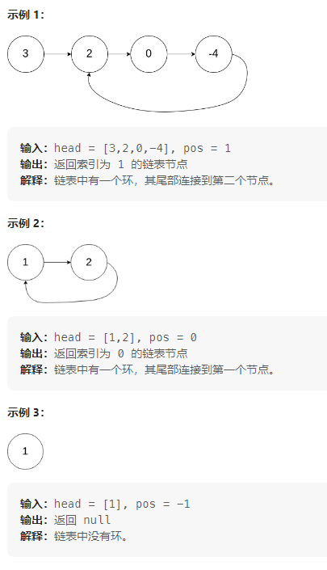
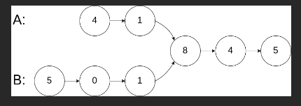
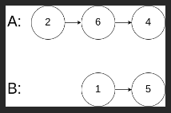

## 92. 反转链表 II

> 给你单链表的头指针 `head` 和两个整数 `left` 和 `right` ，其中 `left <= right` 。请你反转从位置 `left` 到位置 `right` 的链表节点，返回 **反转后的链表** 。
>
> 
>
> ```
> 输入：head = [1,2,3,4,5], left = 2, right = 4
> 输出：[1,4,3,2,5]
> ```
>
> ```
> 输入：head = [5], left = 1, right = 1
> 输出：[5]
> ```

#### 题解：穿针引线

思路很简单，分两步：


1. 先将区间部分链表反转
2. 把`pre.next`的`next`指向反转以后的链表头结点，把反转以后的链表尾结点 `next`指针指向`succ`。

```java
/**
 * Definition for singly-linked list.
 * public class ListNode {
 *     int val;
 *     ListNode next;
 *     ListNode() {}
 *     ListNode(int val) { this.val = val; }
 *     ListNode(int val, ListNode next) { this.val = val; this.next = next; }
 * }
 */
class Solution {
    public ListNode reverseBetween(ListNode head, int left, int right) {
        ListNode header = new ListNode(-1);
        header.next = head;
        
        ListNode pre = header;
        // 寻找到left的前一个节点
        for (int i = 0; i < left - 1; i++) {
            pre = pre.next;
        }
        
        ListNode rightNode = pre;
        for (int i = left; i <= right; i++) {
            rightNode = rightNode.next;
        }
        
        // 记录区间左节点
        ListNode leftNode = pre.next;
        // 记录区间右节点
        ListNode tailNode = rightNode.next;
        // 切断链表关系
        pre.next = null;
        rightNode.next = null;
        
        reverseLink(leftNode);
        
        // 经过反转后, rightNode变成了头结点
        pre.next = rightNode;
        // 尾结点变成了头结点
        leftNode.next = tailNode;
        return header.next;
    }
    
    public void reverseLink(ListNode head) {
        ListNode pre = null;
        ListNode cur = head;
        while (cur != null) {
            // 先将下一个节点保存
            ListNode next = cur.next;
            // 当前节点的next指向尾结点
            cur.next = pre;
            // pre指向当前节点, 作为尾结点
            pre = cur;
            // 当前指针后移一个节点
            cur = next;
        }
    }
}
```

## 25. K 个一组翻转链表

> https://leetcode.cn/problems/reverse-nodes-in-k-group/
>
> 给你链表的头节点 `head` ，每 `k` 个节点一组进行翻转，请你返回修改后的链表。
>
> `k` 是一个正整数，它的值小于或等于链表的长度。如果节点总数不是 `k` 的整数倍，那么请将最后剩余的节点保持原有顺序。
>
> 你不能只是单纯的改变节点内部的值，而是需要实际进行节点交换。
>
> 
>
> ```
> 输入：head = [1,2,3,4,5], k = 2
> 输出：[2,1,4,3,5]
> ```
>
> 
>
> ```
> 输入：head = [1,2,3,4,5], k = 3
> 输出：[3,2,1,4,5]
> ```

#### 题解：寻找区间后反转区间链表

**思路**：

- 初始需要两个变量`pre`和`end`：`pre`记录每次需要反转链表的前一个节点，`end`记录每次反转链表的尾结点。
- 每次寻找k个节点，`end`指向每次反转链表的尾结点。如果`end`为`null`，说明不足k个。
- `next`指向`end.next`：目的是为了反转后将链表接回到原链表。
- `end.next = null`：每次反转前要断开与原链表的联系。
- `start`指向反转链表头结点：目的是为了反转链表和将反转链表链接回原链表。
- 一次反转后，连接反转链表注意：原来的`next`变成了头结点；原来的`start`变成了尾结点。
- 一次反转后，`pre`和`end`指向`start`，即下一次反转链表的前一个节点。

```java
class Solution {
    public ListNode reverseKGroup(ListNode head, int k) {
        if (head == null || head.next == null) {
            return head;
        }
        // 构建一个假节点
        ListNode dummy = new ListNode(-1);
        dummy.next = head;
        
        // 指向每次要反转链表的头结点的上一个节点
        ListNode pre = dummy;
        // 指向每次要反转链表的尾结点
        ListNode end = dummy;
        while (end.next != null) {
            // 循环k次, 找到需要反转的链表的结尾, 需要判断end是否为空, 不然end.next会报错
            for (int i = 0; i < k && end != null; i++) {
                end = end.next;
            }
            // end为null则说明反转的链表的节点数小于k, 不执行反转
            if (end == null) {
                break;
            }
            
            // 记录需要反转的链表的下一个节点
            ListNode next = end.next;
            // 断开要反转的链表
            end.next = null;
            // 记录要反转的链表的头结点
            ListNode start = pre.next;
            // 反转链表, pre.next指向反转后的链表
            pre.next = reverse(start);
            // 反转后, 原来的链表头结点变成了尾结点, 需要链接到之前的next
            start.next = next;
            // pre和end指向下一次要反转链表的前一个节点
            pre = start;
            end = start;
        }
        return dummy.next;
    }
    
    // 要求背诵
    public ListNode reverse(ListNode head) {
        ListNode cur = head;
        ListNode pre = null;
        while (cur != null) {
            ListNode next = cur.next;
            cur.next = pre;
            pre = cur;
            cur = next;
        }
        return pre;
    }
}
```

## 剑指 Offer 25. 合并两个排序的链表

> https://leetcode.cn/problems/he-bing-liang-ge-pai-xu-de-lian-biao-lcof/description/
>
> 输入两个递增排序的链表，合并这两个链表并使新链表中的节点仍然是递增排序的。
>
> ```
> 输入：1->2->4, 1->3->4
> 输出：1->1->2->3->4->4
> ```

#### 题解：归并排序思路

设置一个虚拟头结点，遍历比较两个链表，最后记得将剩余链表直接添加上去。

```java
/**
 * Definition for singly-linked list.
 * public class ListNode {
 *     int val;
 *     ListNode next;
 *     ListNode(int x) { val = x; }
 * }
 */
class Solution {
    public ListNode mergeTwoLists(ListNode l1, ListNode l2) {
        ListNode dummy = new ListNode(-1);
        ListNode cur1 = l1, cur2 = l2, cur = dummy;
        while (cur1 != null && cur2 != null) {
            if (cur1.val < cur2.val) {
                cur.next = new ListNode(cur1.val);
                cur1 = cur1.next;
            } else {
                cur.next = new ListNode(cur2.val);
                cur2 = cur2.next;
            }
            cur = cur.next;
        }
        
        while (cur1 != null) {
            cur.next = cur1;
            cur1 = cur1.next;
            cur = cur.next;
        }

        while (cur2 != null) {
            cur.next = cur2;
            cur2 = cur2.next;
            cur = cur.next;
        }
        return dummy.next;
    }
}
```

## 剑指 Offer II 078. 合并排序链表

> https://leetcode.cn/problems/vvXgSW/description/
>
> 给定一个链表数组，每个链表都已经按升序排列。
>
> 请将所有链表合并到一个升序链表中，返回合并后的链表。
>
> ```
> 输入：lists = [[1,4,5],[1,3,4],[2,6]]
> 输出：[1,1,2,3,4,4,5,6]
> 解释：链表数组如下：
> [
>   1->4->5,
>   1->3->4,
>   2->6
> ]
> 将它们合并到一个有序链表中得到。
> 1->1->2->3->4->4->5->6
> ```
>
> ```
> 输入：lists = []
> 输出：[]
> ```
>
> ```
> 输入：lists = [[]]
> 输出：[]
> ```

#### 题解一：遍历+两个有序链表合并

- 已经有两个有序链表合并的算法，所以直接遍历这个链表数组进行合并即可。
- 初始化一个空链表，让它与第一个链表合并。

```java
class Solution {
    public ListNode mergeKLists(ListNode[] lists) {
        // 初始化一个空链表，用来和第一个链表合并
        ListNode ans = null;
        for (ListNode list : lists) {
            // 用每次合并后的链表去和下一个链表合并
            ans = mergTwoList(ans, list);
        }
        return ans;
    }

    // 合并两个有序链表
    private ListNode mergTwoList(ListNode a, ListNode b) {
        if (a == null || b == null) {
            return a == null ? b : a;
        }

        ListNode dummy = new ListNode(-1);
        ListNode head = dummy;
        while (a != null && b != null) {
            if (a.val < b.val) {
                head.next = a;
                a = a.next;
            } else {
                head.next = b;
                b = b.next;
            }
            head = head.next;
        }
        // 注意这里处理，直接将剩余链表连接即可
        head.next = a == null ? b : a;
        return dummy.next;
    }
}
```

#### 题解二：归并

- 既然每个数组都是有序，那自然可以想到归并的思路来解。
- 归并排序到最后也是合并两个链表，所以核心算法还是合并两个有序链表（已有）
- 分而治之：考虑将k个链表配对，每两个合并，这就使用到递归分治。
- 递归退出的条件：参考归并排序
  - 当`left < right`：继续递归。
  - 当`left > right`：范围不对，直接返回`null`。
  - 当`left == right`： 说明两个链表一样，此时直接返回任意一个即可。

```java
/**
 * Definition for singly-linked list.
 * public class ListNode {
 *     int val;
 *     ListNode next;
 *     ListNode() {}
 *     ListNode(int val) { this.val = val; }
 *     ListNode(int val, ListNode next) { this.val = val; this.next = next; }
 * }
 */
class Solution {
    public ListNode mergeKLists(ListNode[] lists) {
        return mergeSort(lists, 0, lists.length - 1);
    }

    public ListNode mergeSort(ListNode[] list, int i, int j) {
        // 边界出错，直接返回null
        if (i > j) {
            return null;
        }
        // 两个链表一样，此时直接返回任意一个即可
        if (i == j) {
            return list[i];
        }
        int mid = (i + j) / 2;
        ListNode l1 = mergeSort(list, i, mid);
        ListNode l2 = mergeSort(list, mid + 1, j);
        // 两两合并
        return mergeTwoList(l1, l2);
    }

    public ListNode mergeTwoList(ListNode a, ListNode b) {
        if (a == null || b == null) {
            return a == null ? b : a;
        }

        ListNode dummy = new ListNode(-1);
        ListNode head = dummy;
        while (a != null && b != null) {
            if (a.val < b.val) {
                head.next = a;
                a = a.next;
            } else {
                head.next = b;
                b = b.next;
            }
            head = head.next;
        }
        head.next = a == null ? b : a;
        return dummy.next;
    }
}
```

## 剑指 Offer II 022. 链表中环的入口节点

> https://leetcode.cn/problems/c32eOV/description/
>
> 给定一个链表，返回链表开始入环的第一个节点。 从链表的头节点开始沿着 `next` 指针进入环的第一个节点为环的入口节点。如果链表无环，则返回 `null`。
>
> 为了表示给定链表中的环，我们使用整数 `pos` 来表示链表尾连接到链表中的位置（索引从 0 开始）。 如果 `pos` 是 `-1`，则在该链表中没有环。**注意，`pos` 仅仅是用于标识环的情况，并不会作为参数传递到函数中。**
>
> **说明：**不允许修改给定的链表。
>
> 
>
> 

#### 题解：快慢指针

快慢指针找到相遇位置并且同时能够判断是否有环。

**关键点**： 在相等节点处, 相遇指针继续向下走的距离就等于起始指针走到环入口的距离。

```java
/**
 * Definition for singly-linked list.
 * class ListNode {
 *     int val;
 *     ListNode next;
 *     ListNode(int x) {
 *         val = x;
 *         next = null;
 *     }
 * }
 */
public class Solution {
    public ListNode detectCycle(ListNode head) {
        // 定义一个快慢指针
        ListNode fast = head, slow = head;
        // 遇到节点为空说明没有环
        while (fast != null && fast.next != null) {
            // 快指针每次走两步
            fast = fast.next.next;
            // 慢指针每次走一步
            slow = slow.next;
            // 如果两个指针相等，说明有环
            if (fast == slow) {
                // 在相等节点处, 相遇指针继续向下走的距离就等于起始指针走到环入口的距离
                ListNode res = head;
                while (res != slow) {
                    res = res.next;
                    slow = slow.next;
                }
                return res;
            }
        }
        return null;
    }
}
```

## 剑指 Offer 22. 链表中倒数第k个节点

> https://leetcode.cn/problems/lian-biao-zhong-dao-shu-di-kge-jie-dian-lcof/description/
>
> 输入一个链表，输出该链表中倒数第k个节点。为了符合大多数人的习惯，本题从1开始计数，即链表的尾节点是倒数第1个节点。
>
> 例如，一个链表有 `6` 个节点，从头节点开始，它们的值依次是 `1、2、3、4、5、6`。这个链表的倒数第 `3` 个节点是值为 `4` 的节点。
>
> ```
> 给定一个链表: 1->2->3->4->5, 和 k = 2.
> 
> 返回链表 4->5.
> ```

#### 题解：遍历

先求链表长度，然后再计算走到k需要几步

```java
class Solution {
    public ListNode getKthFromEnd(ListNode head, int k) {
        ListNode cur = head;
        // 先求链表长度, 这里是0，因为结束条件是cur!=null, 会多遍历一次
        int len = 0;
        while (cur != null) {
            cur = cur.next;
            len++;
        }
        cur = head;
        // 计算从头到k需要走几步: len - k
        for (int i = 1; i <= len - k; i++) {
            cur = cur.next;
        }
        return cur;
    }
}
```

## 剑指 Offer II 021. 删除链表的倒数第 n 个结点

> https://leetcode.cn/problems/SLwz0R/description/
>
> 给定一个链表，删除链表的倒数第 `n` 个结点，并且返回链表的头结点。
>
> ```
> 输入：head = [1,2,3,4,5], n = 2
> 输出：[1,2,3,5]
> 
> 输入：head = [1], n = 1
> 输出：[]
> 
> 输入：head = [1,2], n = 1
> 输出：[1]
> ```

#### 题解：寻找待删除节点的前一个节点

- 链表删除节点，必须之前待删除节点的前一个节点。
- 删除节点操作：`pre.next = cur.next;`注意判空。
- 为了方便处理一个节点和空链表的情况，初始化一个虚拟节点作为`pre`。

```java
class Solution {
    public ListNode removeNthFromEnd(ListNode head, int n) {
        ListNode cur = head;
        int len = 0;
        while (cur != null) {
            cur = cur.next;
            len++;
        }

        // 方便处理一个节点的情况
        ListNode dumy = new ListNode(-1);
        dumy.next = head;
        ListNode pre = dumy;
        // 寻找到要删除节点的前一个节点
        for (int i = 1; i <= len - n; i++) {
            pre = pre.next;
        }
        // 得到要删除的节点
        cur = pre.next;
        // 这里需要判空
        if (cur != null) {
            pre.next = cur.next;
        }
        return dumy.next;
    }
}
```

## 剑指 Offer 52. 两个链表的第一个公共节点

> https://leetcode.cn/problems/liang-ge-lian-biao-de-di-yi-ge-gong-gong-jie-dian-lcof/description/
>
> 输入两个链表，找出它们的第一个公共节点。
>
> 
>
> ```
> 输入：intersectVal = 8, listA = [4,1,8,4,5], listB = [5,0,1,8,4,5], skipA = 2, skipB = 3
> 输出：Reference of the node with value = 8
> 输入解释：相交节点的值为 8 （注意，如果两个列表相交则不能为 0）。从各自的表头开始算起，链表 A 为 [4,1,8,4,5]，链表 B 为 [5,0,1,8,4,5]。在 A 中，相交节点前有 2 个节点；在 B 中，相交节点前有 3 个节点。
> ```
>
> 
>
> ```
> 输入：intersectVal = 0, listA = [2,6,4], listB = [1,5], skipA = 3, skipB = 2
> 输出：null
> 输入解释：从各自的表头开始算起，链表 A 为 [2,6,4]，链表 B 为 [1,5]。由于这两个链表不相交，所以 intersectVal 必须为 0，而 skipA 和 skipB 可以是任意值。
> 解释：这两个链表不相交，因此返回 null。
> ```
>
> **注意：**
>
> - 如果两个链表没有交点，返回 `null`.
> - 在返回结果后，两个链表仍须保持原有的结构。
> - 可假定整个链表结构中没有循环。
> - 程序尽量满足 O(*n*) 时间复杂度，且仅用 O(*1*) 内存。
> - 本题与主站 160 题相同：https://leetcode-cn.com/problems/intersection-of-two-linked-lists/

 

#### 题解：双指针

```java
ListNode getIntersectionNode(ListNode headA, ListNode headB) {
    ListNode pA = headA, pB = headB;
    while (pA != pB) {
        // 这里如果对pA.next进行判空，就会进入无限循环出不来
        // 假设链表如下：
        // 1 -> 3 -> 5 -> null
        //      2 -> 4 -> null
        // 如果对pA.next判空，则每次指针到5或4都会跳转到2或1,
        // 但如果对pA本身判空，则总会存在一个null相等跳出循环
        // pA = pA.next == null ? headB : pA.next;
        // pB = pB.next == null ? headA : pB.next;
        pA = pA == null ? headB : pA.next;
        pB = pB == null ? headA : pB.next;
    }
    return pA;
}
```

