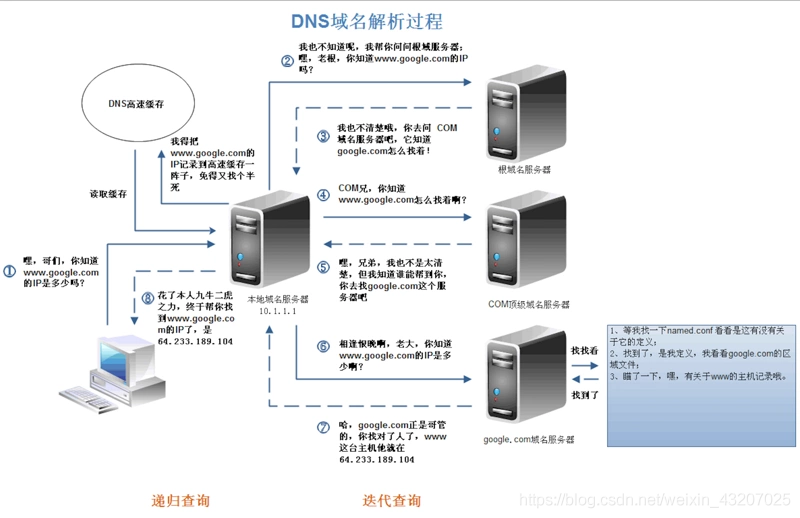
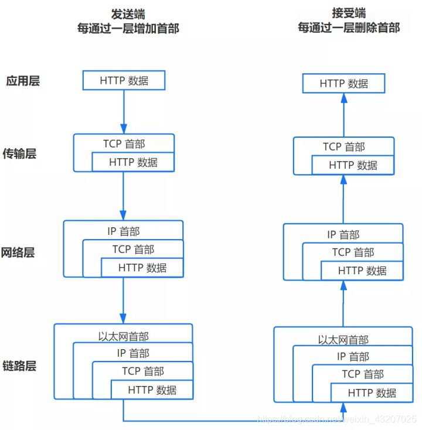
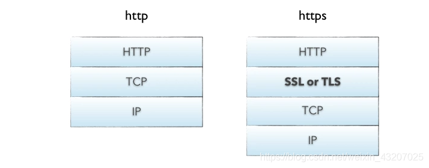
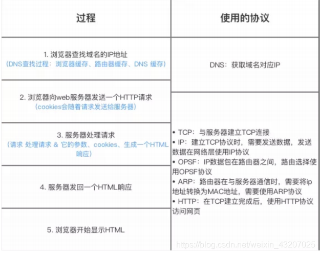

分为以下几个过程：

 1. DNS解析
 2. TCP连接
 3. 发送HTTP请求
 4. 服务器处理请求并返回HTTP报文
 5. 浏览器解析渲染页面
 6. 连接结束

## 1. DNS解析

**网址到IP地址的转换**。

上述图片是查找www.google.com的IP地址过程。**首先在本地域名服务器中查询IP地址**，如果没有找到的情况下，**本地域名服务器会向根域名服务器发送一个请求**，如果根域名服务器也不存在该域名时，**本地域名会向com顶级域名服务器发送一个请求**，依次类推下去。直到最后本地域名服务器得到google的IP地址并把它缓存到本地，供下次查询使用。从上述过程中，可以看出网址的解析是一个从右向左的过程: com -> google.com -> www.google.com。但是你是否发现少了点什么，根域名服务器的解析过程呢？事实上，真正的网址是www.google.com.，并不是我多打了一个.，这个.对应的就是根域名服务器，默认情况下所有的网址的最后一位都是.，既然是默认情况下，为了方便用户，通常都会省略，浏览器在请求DNS的时候会自动加上，所有网址真正的解析过程为: . -> .com -> google.com. -> www.google.com.。

#### DNS缓存
DNS存在着多级缓存，从离浏览器的距离排序的话，有以下几种: 浏览器缓存，系统缓存，路由器缓存，IPS服务器缓存，根域名服务器缓存，顶级域名服务器缓存，主域名服务器缓存。

#### DNS负载均衡
大型的网站通常由多个服务器，DNS可以返回一个合适的服务器的IP给用户，这种过程就是DNS负载均衡，又叫做DNS重定向。DNS服务器会返回一个跟用户最接近的点的IP地址给用户，CDN节点的服务器负责响应用户的请求，提供所需的内容。

### 2.TCP连接

#### 2.1 应用层：发送 HTTP 请求
在前面的步骤我们已经得到服务器的 IP 地址，浏览器会开始构造一个 HTTP 报文，其中包括：

- 请求报头（Request Header）：请求方法、目标地址、遵循的协议等等
- 请求主体（其他参数）

浏览器只能发送 GET、POST 方法，而打开网页使用的是 GET 方法
#### 2.2 传输层：TCP 传输报文
传输层会发起一条到达服务器的 TCP 连接，为了方便传输，会对数据进行分割（以报文段为单位），并标记编号，方便服务器接受时能够准确地还原报文信息。

在建立连接前，会先进行 TCP 三次握手。

#### 2.3 网络层：IP协议查询Mac地址
将数据段打包，并加入源及目标的IP地址，并且负责寻找传输路线。

判断目标地址是否与当前地址处于同一网络中，是的话直接根据 Mac 地址发送，否则使用路由表查找下一跳地址，以及使用 ARP 协议查询它的 Mac 地址。

>注意：在 OSI 参考模型中 ARP 协议位于链路层，但在 TCP/IP 中，它位于网络层。
#### 2.4 链路层：以太网协议
**以太网协议**

根据以太网协议将数据分为以“帧”为单位的数据包，每一帧分为两个部分：

标头：数据包的发送者、接受者、数据类型
数据：数据包具体内容

**Mac 地址**

以太网规定了连入网络的所有设备都必须具备“网卡”接口，数据包都是从一块网卡传递到另一块网卡，网卡的地址就是 Mac 地址。每一个 Mac 地址都是独一无二的，具备了一对一的能力。

**广播**

发送数据的方法很原始，直接把数据通过 ARP 协议，向本网络的所有机器发送，接收方根据标头信息与自身 Mac 地址比较，一致就接受，否则丢弃。

注意：接收方回应是单播。

### 3. HTTPS协议

HTTPS在传输数据之前需要客户端与服务器进行一个握手(TLS/SSL握手)，在握手过程中将确立双方加密传输数据的密码信息。TLS/SSL使用了非对称加密，对称加密以及hash等。
HTTPS相比于HTTP，虽然提供了安全保证，但是势必会带来一些时间上的损耗，如握手和加密等过程，是否使用HTTPS需要根据具体情况在安全和性能方面做出权衡。

### 4. 服务器处理请求并返回HTTP报文
HTTP响应报文也是由三部分组成: 状态码, 响应报头和响应报文。
#### 状态码
状态码是由3位数组成，第一个数字定义了响应的类别，且有五种可能取值:

- 1xx：指示信息–表示请求已接收，继续处理。

- 2xx：成功–表示请求已被成功接收、理解、接受。

- 3xx：重定向–要完成请求必须进行更进一步的操作。

- 4xx：客户端错误–请求有语法错误或请求无法实现。

- 5xx：服务器端错误–服务器未能实现合法的请求。

### 5. 浏览器解析渲染页面
浏览器是一个边解析边渲染的过程。首先浏览器解析HTML文件构建DOM树，然后解析CSS文件构建渲染树，等到渲染树构建完成后，浏览器开始布局渲染树并将其绘制到屏幕上。这个过程比较复杂，涉及到两个概念: `reflow(回流)`和`repain(重绘)`。

DOM节点中的各个元素都是以盒模型的形式存在，这些都需要浏览器去计算其位置和大小等，这个过程称为`（回流)relow`;

当盒模型的位置,大小以及其他属性，如颜色,字体,等确定下来之后，浏览器便开始绘制内容，这个过程称为`(重绘)repain`。

页面在首次加载时必然会经历reflow和repain。reflow和repain过程是非常消耗性能的，尤其是在移动设备上，它会破坏用户体验，有时会造成页面卡顿。所以我们应该尽可能少的减少reflow和repain。

JS的解析是由浏览器中的JS解析引擎完成的。JS是单线程运行，也就是说，在同一个时间内只能做一件事，所有的任务都需要排队，前一个任务结束，后一个任务才能开始。但是又存在某些任务比较耗时，如IO读写等，所以需要一种机制可以先执行排在后面的任务，这就是：同步任务(synchronous)和异步任务(asynchronous)。

JS的执行机制就可以看做是一个主线程加上一个任务队列(task queue)。同步任务就是放在主线程上执行的任务，异步任务是放在任务队列中的任务。所有的同步任务在主线程上执行，形成一个执行栈。异步任务有了运行结果就会在任务队列中放置一个事件；脚本运行时先依次运行执行栈，然后会从任务队列里提取事件，运行任务队列中的任务，这个过程是不断重复的，所以又叫做**事件循环**(Event loop)。

浏览器在解析过程中，如果遇到请求外部资源时，如图像,iconfont,JS等。浏览器将重复1-6过程下载该资源。请求过程是异步的，并不会影响HTML文档进行加载，但是当文档加载过程中遇到JS文件，HTML文档会挂起渲染过程，不仅要等到文档中JS文件加载完毕还要等待解析执行完毕，才会继续HTML的渲染过程。原因是因为JS有可能修改DOM结构，这就意味着JS执行完成前，后续所有资源的下载是没有必要的，这就是JS阻塞后续资源下载的根本原因。CSS文件的加载不影响JS文件的加载，但是却影响JS文件的执行。JS代码执行前浏览器必须保证CSS文件已经下载并加载完毕。

### 参考文章：
[https://segmentfault.com/a/1190000006879700](https://segmentfault.com/a/1190000006879700)
