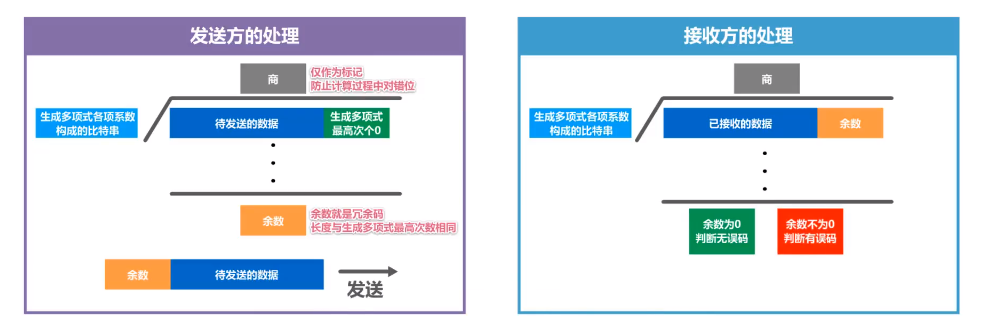
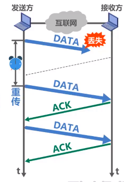
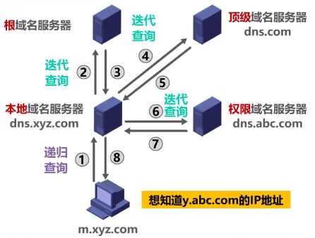

# 一. 概述

## 1.1 计算机网络体系结构

### 1.1.1 OSI体系结构

- 应用层
- 表示层
- 会话层
- 运输层
- 网络层
- 数据链路层
- 物理层

### 1.1.2 TCP/IP体系结构

- 应用层
- 运输层
- 网际层
- 网络接口层

### 1.1.3 五层协议

- 应用层 ：任务是通过应用进程间的交互来完成特定网络应用。应用层交互的数据单元称为**报文**。
- 运输层：解决进程之间基于网络的通信问题。
  主要使用下面两种协议：

1. 传输控制协议TCP——提供面向连接的、可靠的数据传输服务，其数据传输的单位是**报文段**

2. 用户数据协议UDP——提供无连接的、尽最大努力的数据传输服务（不保证数据传输的可靠性），数据传输单位是**用户数据报**

- 网络层：解决分组在多个网络上传输（路由）的问题。分组也叫做**IP数据报**
- 数据链路层：解决分组在一个网络上传输的问题。将网络层交下来的IP数据报组装成**帧**，在两个相邻节点的链路上传送帧，每一帧包括数据和必要的控制信息
- 物理层：物理层上传输的数据单位是**比特**。接收比特信息，确定链接电缆的插头，以及接收方如何识别发送方发送的比特。

OSI参考模型把对等层次之间传送的数据单位称为该层的**协议数据单元PDU**

### 1.1.4 专用术语

#### 实体

任何可发送或接受信息的硬件或软件进程。

#### 对等实体

收发双方相同层次的实体。

#### 协议

控制两个对等实体进行逻辑通信的规则的集合。

##### 协议三要素

- 语法：定义交换信息的格式
- 语义：定义通信收发双方所要完成的操作
- 同步：定义通信收发双方的时序关系

#### 服务

在协议的控制下，两个对等实体间的逻辑通信使得**本层能够向上一层**提供服务

要实现本层协议，还要使用下一次提供的服务

实体看得见下层提供的服务，但不知道该服务实行的具体协议（下面协议对上面的实体是透明的）

- 服务访问点：相邻两层的实体交换信息的逻辑接口，用于区分不同的服务类型
- 服务原语：上传使用下层提供的服务必须通过与下层交换一些命令，这些命令就是服务原语

#### 协议数据单元PDU

对等层次之间传输的数据包。

- 物理层：比特流

- 链路层：帧

- 网络层：IP数据报或分组

- 传输层：TCP报文段或UDP用户数据段

- 应用层：报文

#### 服务数据单元SDU

层与层之间交换的数据包

多个SDU可以合成一个PDU，一个SDU也可以划分为多个PDU

***

## 1.2 计算机网络性能指标

### 比特

计算机中的数据量单位，一个比特就是二进制数字中的1或0。

常用的数据量单位：单位换算是：$*2^{10}$

​					$$8 bit = 1 Byte$$

​					$$KB = 2^{10} B$$

​					$$MB = K·KB = 2^{10}·2^{10} B = 2^{20} B$$

​					$$GB = K·MB = 2^{10}·2^{20} B = 2^{30} B$$

​					$$TB = K·GB = 2^{10}·2^{30} B = 2^{40} B$$

### 1.2.1 速率

- 定义：网络技术中的速率指的是数据的传送速率，也称为数据率或比特率。

- 单位：**bit/s** 或者 **b/s** 或者 **bps**（比特每秒）。单位换算：$*10^3$

  ​					$kb/s = 10^3 b/s(bps)$

  ​					$Mb/s=10^6b/s(bps)$

  ​					$Gb/s=10^9b/s(bps)$

  

### 1.2.2 带宽

- 带宽在**模拟信号**中的意义：
  信号所包含的各种不同频率成分所占据的频率范围。单位：Hz（KHz, MHz, GHz)

- 带宽在**计算机网络**中的意义：
  用来表示网络的通信线路所能传送数据的能力，因此网络带宽表示在单位时间内从网络中的某一点到另一点所能通过的“最高数据率”（速率最大值）。单位：bit/s（比特每秒）（kbit/s, Mbit/s, Gbit/s, Tbit/s)

两种表述联系：一条通信线路的“频带宽度”越宽，其传输数据的“最高数据率”也越高。

### 1.2.3 吞吐量

在单位时间内通过某个网络（或信道，接口）的实际**数据量**。

吞吐量受网络的带宽或额定速率的限制。

有时吞吐量还可以用**每秒传送的字节或帧数**来表示。

### 1.2.4 时延

时延是指数据从网络的一端到另一端所需的时间。

发送时延在机器内部发生，与**传输信道长度**没有任何关系；传播时延在传输媒体上，与**信号的发送速率**没有关系。

总时延 = 发送时延 + 传播时延 + 处理时延 + 排队时延

#### 发送时延

发送时延是主机或路由器发送数据帧所需要的时间。也就是从发送数据帧的第一个比特开始，到该帧最后一个比特发送完所需时间。

​							$$发送时延 = \dfrac{分组长度(bit)}{发送速率(bit/s)}$$

发送速率取决于网卡发送速率、信道带宽、接口速率的最小值。

#### 传播时延

传播时延是电磁波在信道中传播一定距离需要花费的时间。

​							$$传播时延=\dfrac{信道长度(m)}{电磁波在信道上的传输速率(m/s)}$$

电磁波的传播速率：自由空间：3 x $10^8$ m/s；铜线：2.3 x $10^8$ m/s ；光纤： 2.0 x $10^8$ m/s

#### 处理时延

主机或路由器收到分组时要花费一定的时间进行处理。

#### 排队时延

分组在进过网络传输时，要经过很多路由器，分组进入路由器后要先在输入队列中排队处理。

### 1.2.5 时延带宽积

又称为**以比特为单位的链路长度**：

​					$$时延带宽积=传播时延*带宽$$

### 1.2.6 往返时间RTT

从源主机发送分组开始，直到源主机收到来自目的主机的确认分组为止所需要额定时间。

### 1.2.7 利用率

#### 信道利用率

用来表示某信道有百分之几的时间是被利用的（有数据通过）。信道利用率并不是越高越好。

#### 网络利用率

全网络的信道利用率的加权平均。

$D_0$表示网络空闲时延，D表示网络当前时延，则$D_0$, D 和利用率U之间的关系：

​						$$D = \dfrac{D_0}{1-U}$$

可以写成这样：$D*(1-U)=D_0$  即网络当前时延没有被利用的是空闲时延。

信道或网络的利用率过高会产生非常大的时延：

### 1.2.8 丢包率

即分组丢失率，指在一定的时间范围内，传输过程中丢失的分组数量与总分组数量的比率。

具体分为：接口丢包率，节点丢包率，链路丢包率，路径丢包率，网络丢包率。

分组丢失的两种情况：

1. 在传输过程中出现误码，被节点丢弃。
2. 分组到达一台队列已满的分组交换机时被丢弃，在通信量较大时可能造成网络阻塞

***

## 1.3 电路交换

### 1.3.1 三个步骤

1. 建立连接：建立一条专用的物理链路，以保证双方通话时所需的通信资源在通信时不会被其他用户占用
2. 数据传送：主叫和被叫双方互相通电话
3. 释放连接：通话完毕后，释放刚才使用的这条专用的物理通路

####  优点：

- 通信时延小。通信线路为通信双方用户专用，数据直达。
- 有序传输。只有一条专用的线路，所以不存在数据失序问题。
- 没有冲突。不同的通信双方拥有不同的通信信道。
- 适用范围广。既可以用于传送数字信号，也可以传送模拟信号。
- 实时性强。得益于通信时延小的优点。
- 控制简单。

#### 缺点：

- 建立连接时间长
- 线路独占，适用效率低
- 灵活性差
- 难以规格化

### 1.3.2 分组交换

#### 组成

1. 发送方：构造分组，发送分组
2. 路由器：缓存分组，转发分组
3. 接收方：接收分组，还原报文

#### 优点：

- 无需建立连接。不存在建立连接的时延，用户可以随时发送分组。
- 线路利用率高。通信双方不是固定占用一条数据链路。
- 简化存储管理（相对于报文交换）。分组长度固定，相应的缓冲区大小也固定。
- 加速传输。分组时逐个进行传输的，所以下一个分组的存储操作与上一个分组的转发操作可以同时进行。
- 减少出错概率和重发数据量。因为分组比报文小，即便分组出错，只需要重传出错部分的分组。

#### 缺点：

- 引起转发时延。
- 需要传输额外的信息量。将原始报文分割成等长的数据块，每个数据块都要加上源地址、目的地址等控制信息。
- 对于数据报服务，存在失序、丢失或重复分组的问题；对于虚电路服务，存在呼叫建立、数据传输、和虚电路释放三个过程。

### 1.3.3 报文连接

#### 优点：

- 无需建立连接。
- 动态分配线路。节点交换机选择一条合适的线路，将接收到的报文发送出去。
- 提高线路可靠性。如果某一条路径发生故障，将提供另一条路径传输数据。
- 提高线路利用率。通信双方不是固定占用一条通信链路。
- 提供多目标服务。一个报文可以同时发送给多个目的地址。

#### 缺点：

- 引起转发时延。报文在节点交换机上要经历存储转发的过程。
- 需要较大的存储缓存空间。因为报文交换对报文大小没有限制。
- 需要传输额外的信息量。报文需要携带目标地址、源地址信息。

### 1.3.4 电路交换、报文交换、分组交换对比

可以看出，若要传输大量数据，且数据传送时间远大于链接建立时间，则电路交换的方式更快。报文交换和分组交换在传输突发数据时可以提高网络信道的利用率。

***

# 二. 物理层

## 2.1 物理层协议主要任务

- 机器特性：指明接口所用接线器的形状和尺寸、引脚数目和排列、固定和锁定装置
- 电器特性：指明在接口电缆的各条线上出现的**电压的范围**
- 功能特性：指明某一线上出现的某一**电压表示的何种意义**
- 过程特性：指明对于不同功能的各种可能事件的出现顺序

## 2.2 传输方式

- 串行传输
- 并行传输
- 同步传输：内同步：发送端将时钟同步信号编码到发送数据中一起传输；外同步：在收发双方之间添加一条单独的时钟信号线。
- 异步传输：字节之间异步（字节之间的时间间隔不定）；字节中每个比特仍然需要同步（各比特的持续时间是相同的）
- 单向通信（单工）：只能有一个方向的通信而没有反方向的交互。
- 双向交替通信（半双工）：通信双方都可以发送信息，但不能双方同时发送。
- 双向同时通信（全双工）：通信双方可以同时发送和接收信息。

## 2.3 编码与调制

### 编码

- 归零编码：相当于把归零方式编码在数据之内，称为	“自同步信号”。但编码效率低
- 不归零编码：存在同步问题
- 反向不归零编码：在码元时间内不会出现零电平。若后一个码元时间内所持续的电平与前一个码元时间内所持续的电平不同则表示0， 若电平保持不变则表示1.
- 曼切斯特编码：码元中间时刻的跳变即表示时钟，又表示数据
- 差分曼切斯特编码：跳变仅表示时钟；码元开始处电平是否变化表示数据：变化表示1，不变化表示0.

### 调制

## 2.4 信道的极限容量

### 奈氏准则

在理想条件下，为避免码间串扰，码元传输速率是有上限的。

**理想<u>低通信道</u>的最高码元传输速率** = 2W Baud = 2W **码元/秒**

**理想<u>带通信道</u>的最高码元传输速率** = W Baud = W **码元/秒**

W: 信道带宽（单位为Hz）

Baud：波特，即码元/秒

码元传输速率又称为波特率、调制速率、波形速率或符号速率。

它与比特率有一定关系：(香农公式的单位是**b/s**，因此要用)

- 当1个码元只携带1比特的信息量时，则波特率（码元/秒）与比特率（比特/秒）在数值上是相等的。
- 当1个码元携带n比特的信息量时，则波特率转换为比特率时，数值要乘以n。

### 香农公式

带宽受限且有高斯白噪声干扰的信道的极限信息传输速率。

​						$$c = W * log_2 (1 + S/N)$$

c：信道的极限信息传输速率（单位：**b/s**)

W：信道带宽（单位：Hz）

S：信道内所传信号的平均功率

N：信道内的高斯噪声功率

S/N：信噪比，使用分贝（dB）作为度量单位. $$信噪比(dB)= 10 * log_{10}(S/N) (dB)$$

​						$$数据传输速率 = 波特率（码元传输速率） * 每个码元携带的信息量$$

****

# 三. 数据链路层

## 3.1 封装成帧

### 3.1.1 透明传输

透明传输是指**数据链路层对上层交付的传输数据没有任何限制**，就好像数据链路层不存在一样。

### 3.1.2 字节填充

面向**字节**的物理链路使用字节填充（或字符填充）的方法实现透明传输。

- 在帧的头之前和尾之后加一个特殊的字符(flag)，只要读到这个字符帧就开始了，再次读到就认为这个帧结束了。
- 如果正文里面出现了flag特殊字符，解决办法是在正文里面flag字符前面加上转义字符esc，这样读到flag之前如果没有转义字符esc，那么认为帧结束，如果有esc那么认为他就是普通的数据就行。问题又来了，那么正文里面如果有esc字符呢？那么就在esc前面再加一个esc就行了，这两个的处理是一样的。

### 3.1.3 比特填充

面向**比特**的物理链路使用比特填充的方法实现透明传输。

**零比特填充法**：前后加上FLAG，中间每5个连续的1后面插入一个比特0

### 3.1.4 字符计数

用一个帧的第一字节来说明帧的总长度（总长度包含这个帧头）

## 3.2 差错检测

检错码只能检测帧在传输过程中出现了差错，但不能定位错误，所以无法纠正错误。

### 3.2.1 奇偶校验

在发送的数据后面添加1位奇偶校验位，使整个数据（包括所添加的校验位在内）中“1”的个数为奇数（奇校验）或偶数（偶校验）

- 如果有奇数个位发生误码，则奇偶性发生变化，可以检查出误码
- 如果偶数个位发生误码，则奇偶性不发生变化，不能检查出误码

### 3.2.2 循环冗余校验CRC

- 收发双方约定好一个生产多项式
- 发送方基于待发送的数据和生成多项式计算出差错检测码（冗余码，位数不够在前面凑0），将其添加到待传输数据后面一起传输
- 接收方通过生成多项式来计算收到的数据是否产生了误码

### 3.2.3 汉明码——纠错码

这篇文章讲的很好：https://www.cnblogs.com/Philip-Tell-Truth/p/6669854.html

## 3.3 可靠传输

### 3.3.1 基本概念

- 不可靠传输服务：仅仅丢弃有误码的帧，其他什么也不做

- 可靠传输服务：发送端发送什么，接收端就收到什么

一般情况下，有线链路的误码率比较低，为了减小开销	，并不要求数据链路层向上提供可靠传输服务。

而无线链路易受干扰，误码率比较高，因此要求数据链路层必须向上层提供可靠传输服务。

### 3.3.2 停止等待协议SW

发送方每发送一个数据分组后，就停止发送下一个数据分组，并将该分组存储起来，等待来自接收方的确认分组和否认分组。若收到确认分组，则继续发送下一个数据分组；若收到否认分组，则重发之前发送的那个数据分组。

### 3.3.3 超时重传

如果接收方接收不到数据分组，就不会发送ACK或NAK数据。如果不采取措施，发送方就会一直处于等待接受ACK或NAK的状态。

为解决该问题，在发送方发送完数据分组时，启动一个超时计时器。超过超时计时器设置的重传时间，则重传原来的分组。

重传时间设为**从发送方到接收方的平均往返时间**。

### 3.3.4 给数据分组编号

### 3.3.5 给确认分组编号

数据链路层一般不会出现ACK分组迟到的情况，因此在数据链路层可以不用编号。

### 3.3.6 信道利用率

### 3.3.7 回退N帧协议

#### 累积确认

接收方不一定对收到的数据分组逐个发送确认，而是可以在收到几个数据分组后（由具体实现决定），对按序到达的最后一个数据分组发送确认。

**ACKn表示序号为n及以前的所有数据分组都已正确接收。**累积确认序号之间的都已经发送。

**好处：**即使确认分组丢失，发送方也不必重传。

**缺点**：不能向发送方及时的反应接收方已经接收的正确分组的信息。

发送方收到重复的确认，就说明之前发送的数据分组出现了差错。

### 3.3.8 选择重传协议

视频链接：https://www.bilibili.com/video/BV1c4411d7jb?p=27

接收窗口尺寸不应该等于1，而是大于1。以便接收方先收下失序到达但无误码并且序号落在接收窗口内的那些数据分组，等到所缺分组收齐后再一并送交上层。

为了使双方仅重传出现差错的分组，接收方不能再采用累积确认，需要对每个正确接收到的数据分组进行逐一确认。

#### 发送方

发送方窗口尺寸必须满足：$1 < W_t <= 2^{n-1}$

其中，n 是构成分组序号的比特数量。

- 若$W_t = 1$：与停止-等待协议相同
- 若$W_t > 2^{n-1}$：造成接收方无法分辨新、旧数据分组的问题
- 发送方可在未收到接收方确认分组情况下，将序号落在发送窗口内的多个数据分组全部发送出去。
- 发送方只有按序收到对已发送数据分组的确认时，发送窗口才能向前相应滑动；若收到未按序到达的确认分组时，对其进行记录，以防止其相应数据分组的超时重发，但发送窗口不能向前滑动。

#### 接收方

接收方的接收窗口尺寸$W_r$必须满足：$1 < W_r <= W_t$

- 若$W_r = 1$，与回退N帧协议相同
- 若$W_r > W_t$：无意义
- 接收方可接收未按序到达但没有误码并且序号落在接收窗口内的数据分组；
  - 为了使发送双方仅重传出现差错的分组，接收方不能再采用累积确认，而需要对每个正确接收到的数据分组进行逐一确认
- 接收方只有在按序接收数据分组后，接收窗口才能向前相应滑动。

****

## 3.4 点对点协议PPP

### 3.4.1 PPP协议的组成

- 对各种协议数据报的封装方法(封装成帧)
- 链路控制协议LCP：用于建立、配置以及测试数据链路的链接
- 一套网络控制协议NCPs：其中的每一个协议支持不同的网络层协议

### 3.4.2 PPP协议的帧格式

### 3.4.3 透明传输

#### 字符填充法

发送方的处理：

- 出现的每一个7E（PPP帧的定界符）字节转变成2字节序列（7D，5E）
- 出现的每一个7D（转义字符）字节转变成2字节序列（7D，5D）
- 出现的每一个ASCII码控制的字符（数值小于0x20的字符），则在该字符前面插入一个7D字节，同时将该字符的编码加上0x20.

接收方处理：

进行反变换即可恢复

#### 比特填充法

发送方处理：

- 只要发现5个连续的比特1，立即填充1个比特0.

接收方处理：

- 只要发现5个连续的比特1，就把其后的1个比特0删除。

****

## 3.5 动态接入控制

### 3.5.1 载波监听多址接入/碰撞检测 CSMA/CD

**总线局域网使用协议(有线网络)**

#### 载波监听CS

每一个站在发送帧之前先要检测一下总线上是否有其他站点在发送帧（先听后说）

- 若检测到总线空闲96比特时间，则发送这个帧
- 若检测到总线忙，则继续检测并等待总线转为空闲96比特时间，然后发送这个帧

#### 多址接入MA

多个站点链接在一条总线上，竞争使用总线

#### 碰撞检测CD

每个正在发送帧的站边发送边检测碰撞（边说边听）

当检测到碰撞后，除了立即停止发送帧以外，还要发送32比特或48比特的认为干扰信号，以便有足够多的碰撞信号使所有站点能够检测到碰撞

#### 争用期

- 主机最多经过2τ的时长就可检测到本次发送是否遭受了碰撞
- 以太网端到端往返传播时延2τ称为争用期或碰撞窗口
- 经过争用期这段时间还没有检测到碰撞，才能肯定这次发送不会发生碰撞
- 每个主机在自己发送帧之后的一小段时间内，存在者遭遇碰撞的可能性。这一小段时间是不确定的，它取决于另一个发送帧的主机到本主机的距离，但不会超过总线的端到端往返传播时延，即一个争用期时间。
- 在以太网中，发送帧的主机越多，端到端往返传播时延越大。因此，共享式以太网不能连接太多主机，使用的总线也不能太长。

#### 最小帧长

- 以太网规定最小帧长为64字节，即512比特（512比特时间即为争用期）

- 如果要发送的数据非常小，必须加入一些填充字节，使帧长不小于64字节

- **以太网的最小帧长确保了主机可在帧发送完成之前就检测到该帧的发送过程中是否遭遇了碰撞**

- 如果在争用期（共发送64字节）没有检测到碰撞，那么后续发送的数据就一定不会发生碰撞

- 如果在争用期内检测到碰撞，就立即终止发送，这时已经发送出去的数据一定小于64字节。因此，凡长度小于64字节的帧都是由于碰撞二异常终止的无效帧。

  ​					$$最小帧长=争用期*数据传输速率$$

#### 最大帧长

- 以太网V2的MAC帧（最大长度为1518字节）数据载荷1500字节不小于46字节，目的地址6字节，原地址6字节，类型2字节，FCS是4字节
- 插入VLAN标记后的802.1Q帧（最大长度为1522字节）数据载荷42~1500字节，目的地址6字节，原地址6字节，VLAN标记4字节，类型2字节，FCS是4字节

#### 截断二进制指数退避算法

退避时间 = 基本退避时间 x 随机数 r

- 基本退避时间——争用期 2τ
- 随机数 r ——从离散整数集合0~$2^{k-1}$中随机挑选，k = min(重传次数，10)

- 若连续发生多次碰撞，表明可能有较多的主机参与竞争信道。使用退避算法可使重传需要推迟的平均时间随重传次数而增大（也称动态退避），因而减小发生碰撞的概率，有利于整个系统的稳定
- 当重传达到16次仍不能成功时，表明同时打算发送帧的主机太多，以至于连续发生碰撞，则丢弃该帧，并向高层报告

#### 信道利用率

发送时间/发送时间+τ

#### CSMA/CD 发送流程图

#### CSMA/CD接收流程图

### 3.5.2 载波监听多址接入/碰撞避免CSMA/CA

**无线局域网使用的协议**

#### 802.11标准

802.11MAC层标准定义了两种不同的媒体接入方式：

- **分布式协调功能DCF**。在DCF方式下，没有中心控制站点，每个站点使用CSMA/CA协议通过争用信道来获取发送权
- **点协调功能PCF**。PCF方式使用集中控制的接入算法（一般在接入点AP实现集中控制），是802.11定义的可选方式，在实际中较少使用

#### 帧间间隔IFS

- 802.11标准规定，所有的站点都必须在持续监测到信道空闲一段指定时间后才能发送帧，这段时间为帧间间隔IFS

帧间间隔的长短取决于该站点要发送的帧的类型：

1. 高优先级需要等待的时间较短，可优先获得发送权。

2. 低优先级需要等待的时间较长。若某个站的低优先级帧还没来得及发送，而其他站的高优先级帧已发送到信道上，则信道变为忙态，因而低优先级帧就只能推迟发送

#### 短帧间间隔SIFS(28us)

是最短的帧间间隔，**用来分隔开属于一次对话的各帧**。**一个站点应该能够在这段时间内从发送方式切换到接收方式**。使用SIFS的帧类型有ACK帧、CTS帧、由过长的MAC帧分片后的数据帧、以及所有回答AP探询的帧和在PCF方式中接入点AP发送出的任何帧。

#### DCF帧间间隔DIFS(128us)

比短帧间间隔SIFS要长的多，在DCF方式中用来发送数据帧和管理帧。

#### 退避算法

在执行退避算法时，站点为退避计时器设置一个随机的退避之间

- 当退避计时器的时间减小到零时，就开始发送数据
- 当退避计时器还未减小到零时而信道又转变为忙状态，这时就冻结退避计时器的数值，重新等待信道变为空闲，再经过时间DIFS后，继续启动退避计时器

在执行第i次退避时，退避时间在时隙编号2的n次方中随机选择一个，然后乘以基本退避时间（也就是基本时隙长度）就可以得到随机的退避时间。使站点选择相同退避时间的概率减少。当时隙编号到255时（即第六次）就不再增加

#### 信道预约和虚拟载波监听

为尽可能减少碰撞概率和降低碰撞的影响，802.11标准允许要发送数据的站点对信道进行预约。

1. 源站在发送数据帧之前先发送一个短的数据帧，称为请求发送RTS，包括源地址、目的地址以及这次通信所需的持续时间
2. 若目的站正确收到源站发来的RTS帧，且媒体空闲，就发送一个响应控制帧，称为允许发送CTS，也包括此次通信所需的持续时间
3. 源站收到CTS帧后，再等待一段时间SIFS后，就可发送其数据帧
4. **若目的站正确收到了源站发来的数据帧，在等待时间SIFS后，就向源站发送确认帧ACK**

除源站和目的站以外的其他各站，在收到CTS帧（或数据帧）后就推迟接入到无线局域网中。这样就保证源站和目的站之间的通信不会受到其他站的干扰。

如果RTS帧发生碰撞，源站就收不到CTS帧，需执行退避算法重传RTS帧。

**除RTS帧和CTS帧携带通信所需要的时间，数据帧也能携带通信所需要的时间，称为802.11的虚拟载波监听机制**

**使用虚拟载波监听机制，站点只需要监听到RTS、CTS帧或数据帧中的任何一个，就能知道信道占用的时间**

### 3.5.3 总结

- 在无线局域网中，仍然可以使用CSMA协议：即在发送帧之前先对传输媒体进行载波监听。若发现有其他站在发送帧，就推迟发送以免发生故障
- **在无线局域网中不能使用CD协议**，原因如下：1. 无线信道的传输条件特殊，信号强度的动态范围非常大，无线网卡接受到的信号强度远远小于发送信号的强度。如果要在无线网卡山实现碰撞检测CD，对硬件的要求非常高。2. 即使能够在硬件上实现无线局域网的碰撞检测功能，但由于无线电波传播的特殊性（存在隐蔽站问题），进行碰撞检测的意义也不大
- CSMA/CD和CSMA/CA都能在有线局域网中使用

****

## 3.6 集线器和交换机的区别

### 3.6.1 集线器

- 使用集线器的以太网在逻辑上仍是一个总线网，各站共享总线资源，使用的还是CSMA/CD协议。集线器互连起来的所有主机共享总线带宽，属于同一个碰撞域和广播域。
- **集线器只工作在物理层**，它的每个接口仅简单的转发比特，不进行碰撞检测
- 集线器一般都有少量的容错能力和网络管理能力
- 使用**集线器在物理层**扩展以太网

### 3.6.2 以太网交换机

- 以太网交换机通常有多个接口。每个接口都可直接与一台主机或另一个以太网交换机相连。一般都工作在全双工方式.
- 以太网交换机具有并行性，能同时联通多对接口，使多对主机能同时通信，无碰撞（不适用CSMA/CD协议）
- 以太网交换机一般都具有多种速率的接口。
- **以太网交换机工作在数据链路层（也包括物理层）**，它收到帧后，在帧交换表中查找帧的目的MAC地址对应的接口号，然后通过该接口转发帧。
- 以太网交换机是一种即插即用设备，其内部帧交换表是通过自学习算法自动地逐渐建立起来的。

帧的两种转发方式：

- **存储转发**
- **直通交换**：采用基于硬件的交叉矩阵（交换时延非常小，但不检查帧是否有差错）

### 3.6.3 区别

对于单播帧：

- 集线器是把帧发送到每一个主机，然后根据帧交换表来确定哪一个主机接收帧
- 交换机是直接把帧发送到目的主机

对于广播帧：

两种方式从效果上没有什么区别

集线器即扩大了广播域，也扩大了碰撞域。

交换机只扩大了广播域，隔离了碰撞域。

### 3.6.4 以太网交换机自学习和转发帧的流程

湖科大老师的视频，必须安利一波，讲的太好啦！https://www.bilibili.com/video/BV1c4411d7jb?p=37

### 3.6.5 以太网交换机生成树协议STP

可以在增加冗余链路来提高网络可靠性的同时又避免网络环路带来的各种问题。

但是，冗余链路也会带来负面效应——形成网络环路

网络环路会带来以下问题：

- 广播风暴：大量消耗网络资源，使得网络无法正常转发其他数据帧。
- 主机收到重复的广播帧：大量消耗主机资源
- 交换机的帧交换表震荡（飘移）

生成树协议：Spanning Tree Protocol

- 不论交换机之间采用怎样的物理连接，交换机都能够自动计算并构建一个逻辑上没有环路的网络，其逻辑拓扑结构必须是树形的（无逻辑环路）
- 最终生成的树形逻辑拓扑要确保联通整个网络
- 当首次连接交换机或网络物理拓扑发生变化时，交换机都将进行生成树的重新计算

****

## 3.7 静态划分信道

### 3.7.1 信道复用

- 复用就是通过一条物理线路同时传输多路用户信号
- 当传输媒体的传输容量大于多条单一信道传输的总通信量时，可利用复用技术在一条物理线路上建立多条通信信道来充分利用传输媒体的带宽。

复用和多址：

- **复用**是将单一媒体的频带资源划分为很多子信道，这些子信道之间相互独立，互不干扰。从媒体的整体频带资源上看，每个子信道只占用该媒体频带资源的一部分
- **多址**处理的是动态分配信道给用户。相反，在信道永久性地分配给用户的应用中，多址是不需要的

### 3.7.2 频分复用FDM

所用用户同时占用不同的频带资源进行通信

### 3.7.3 时分复用TDM

所用用户在不同的时间占用同样的频带宽度

### 3.7.4 波分复用WDM

光的频分复用

### 3.7.5 码分复用CDM

- 是另一种共享信道的方法。由于该技术主要用于多址接入，更长用名词是码分多址CMDA.
- 频分复用FDM和时分复用TDM同样可用于多址接入，相对应的名词是频分多址FDMA，时分多址TDMA
- 与频分复用FDM和时分复用TDM不同，码分复用CDM每个用户可以在同样的时间使用同样的频带进行通信

**码片**：在CDMA中，每个人比特时间再划分为m个短的间隔.

使用CDMA的每一个站被指派一个唯一的m bit码片序列

- 一个站如果要发送比特1，则发送它自己的 m bit 码片序列
- 一个站如果要发送比特0，则发送它自己的 m bit 码片序列的二进制反码
- 通常用向量来表示码片序列，-1表示0。+1表示1。

码片序列挑选规则如下：

1. 分配给每个站的码片序列必须各不相同，实际采用伪随机码序列
2. 分配给每个站的码片序列必须相互正交 （规格化内积为0）

码片的计算：

- 计算结果为数值1，被判断方发送了比特1
- 计算结果为数值-1，被判断方发送了比特0
- 计算结果为数值0，被判断方未发送

****

## 3.8 虚拟网VLAN

分割广播域的方法：使用路由器可以隔离广播域。

将局域网内的设备划分成与物理位置无关的逻辑组的技术，这些逻辑组具有某些共同的需求。

### 3.8.1 802.1Q帧

**概念**：对以太网的MAC格式进行了扩展，插入了4字节的VLAN标记。

VLAN标记的最后12比特称为VLAN标识符VID，它唯一标志了以太网帧属于哪一个VLAN

- **VID的取值范围**是0~4095
- 0和4095都不用来表示VLAN，所以VID的有效取值范围是1~4094

802.1Q帧是由交换机来处理的，而不是用户主机处理

- 当交换机收到普通的以太网帧时，会将其插入4字节的VLAN标记转变为802.1Q帧，简称“打标签”
- 当交换机转发802.1Q帧时，可能会删除4字节VLAN标记转变为普通以太网帧，简称“去标签”

### 3.8.2 交换机端口类型

#### Access

- 一般用于连接用户计算机
- 只能属于一个VLAN
- PVID值与端口所属VLAN的ID相同（默认为1）

**发送处理方法**：

若帧中的VID与端口的PVID相等，则“去标签”并转发该帧，否则不转发。

**接收处理方法**：

一般只接收“未打标签”的普通以太网MAC帧。根据接收帧的端口的PVID给帧“打标签”，即插入四字节VLAN标记字段，字段中的VID取值与端口的PVID取值相等

#### Trunk

- 一般用于交换机之间或交换机与路由器之间的互连
- 可以属于多个VLAN
- 用户可以设置Trunk端口的PVID值。默认情况下，Trunk端口的PVID值为1

**Trunk端口发送处理方法**：

- 对VID等于PVID的帧，“去标签”再转发
- 对VID不等于PVID的帧，直接转发

**Trunk端口的接收处理方法**：

- 接收未打标签的帧，根据接收帧的端口的PVID给帧“打标签”，即插入4字节VLAN标记字段，字段中的VID取值与端口的PVID	取值相等
- 接收“已打标签的帧”

#### Hybird

1. Hybird端口即可用于交换机之间或交换机与路由器之间（Trunk端口），也可用于交换机与用户之间（Access端口）
2. Hybird端口可以属于多个VLAN（同Trunk端口）
3. 用户可以设置Hybird端口的PVID值。默认情况下Hybird端口的PVID值为1（同Trunk端口）

**Hybird端口发送处理方法（与Trunk不同）**：

查看帧的VID是否在端口的"去标签"列表中

- 若存在，则“去标签”后再转发
- 若不存在，则直接转发

**Hybird端口接收处理方法：（同Trunk端口）：**

- 接收未打标签的帧，根据接收帧的端口的PVID给帧“打标签”，即插入4字节VLAN标记字段，字段中的VID取值与端口的PVID	取值相等
- 接收“已打标签的帧”

****

## 3.9 MAC地址、IP地址以及ARP协议

- MAC地址是以太网的MAC子层所使用的地址。
- IP地址是TCP/IP体系结构网际层使用的地址。
- ARP协议属于TCP/IP体系结构的网际层，其作用是已知设备所分配到的IP地址，使用ARP协议可通过该IP地址获取到设备的MAC地址。

### 3.9.1 MAC地址

在每个主机发送的**帧中必须携带标识发送主机和接收主机的地址**。由于这类地址是用于媒体接入控制MAC，因此这类地址被称为MAC地址。

MAC地址是对于网络上各接口的唯一标识，而不是对网络上各设备的唯一标识。

### 3.9.2 多播MAC地址

### 3.9.3 IP地址

IP地址是因特网上的主机和路由器所使用的地址，用于标识两部分信息：

- 网络编号：标识因特网上数以百万计的网络
- 主机编号：标识同一网络上不同主机（或路由器各接口）

- 数据包在转发过程中，源IP地址和目的IP地址保持不变
- 数据包在转发过程中，源MAC地址和目的MAC地址逐个链路或逐个网络改变

### 3.9.4 ARP协议

通过目的主机的IP地址获取它的MAC地址。

**只能在一段链路或一个网络上使用**，不能跨网络使用。

ARP高速缓存表：记录IP地址和MAC地址的对应关系。

表中的记录分为两种类型：

- 动态：自动获取，生命周期默认为两分钟
- 静态：手工设置，不同操作系统下的生命周期不同。

ARP请求报文被封装在MAC帧中发送，目的地址为广播地址

****

## 3.10 802.11标准协调功能

### 分布式协调功能DCF

不采用任何中心控制，而是在每个节点使用CSMA机制的分布式接入算法，让各个站通过争用信道来获取发送权。

### 点协调功能PCF

PCF是选项，PCF使用集中控制的接入算法，用类似探询的方法把发送数据权轮流交给各个站，从而避免了碰撞的产生。

### 短帧间间隔SIFS

长度为28$\mu s$，SIFS是最短额帧间间隔，用来分隔开属于一次对话各帧。

### 分布协调功能帧间间隔DIFS

比SIFS的帧间间隔要长的多，长度为128$\mu s$。DIFS用来发送数据帧和管理帧

****

# 四. 网络层

## 4.1 划分子网的IPv4地址

### 4.1.1 子网掩码

- 32比特的子网掩码可以表明分类IP地址的$\color{red}{主机号部分}$被借用了几个比特作为子网号  （**即子网掩码中主机号部分1比特的个数为子网号占用比特个数**）
- 使用连续的比特1来对应网络号和子网号
- 使用连续的比特0来对应主机号
- 将划分子网的$\color{red}{IPv4地址}$与$\color{red}{子网掩码}$进行$\color{red}{逻辑与运算}$就可得到该IPv4地址$\color{red}{所在子网的网络地址}$
- 将划分子网的$\color{red}{IPv4地址}$与$\color{red}{子网掩码取反}$进行$\color{red}{逻辑与运算}$就可得到该IPv4地址$\color{red}{所在子网的主机号地址}$

### 子网划分题目

### 4.1.2 默认子网掩码

默认子网掩码是指在未划分子网的情况下使用的子网掩码。

网络号部分都为1，主机号部分都为0；表示该类网络的默认子网掩码

### 4.1.3 无分类编址的IPv4地址

- CIDR使用**斜线记法**，在IPv4地址后面加上"/"，在$\color{red}{斜线后面写上网络前缀所占的比特数量}$。
  

- CIDR将网络前缀都相同的连续的IP地址组成一个“CIDR地址块”。
  

- 地址数量就是（$2^{主机比特数}$）个，主机部分全为0是最小地址（网络地址），全为1是最大地址（广播地址），这两个地址不能作为主机地址
- 聚合C类网的数量 = 地址数量 / 2^8（2^8就是C类网的主机号数量）
- 地址掩码：网络前缀全为1，主机号全为0

### 4.1.4 路由聚合（构造超网）

寻找同一个路由下相同部分的网络前缀，然后把后面的全部记为0，采用无分类编址的方法记录

- 网络前缀越长，地址块越小，路由越具体
- 若路由器转发分组时有多条路可选，则选择网络前缀最长的那条，称为$\color{red}{最长前缀匹配}$，因为这样的路由更具体

### IPv4地址应用规划

视频讲解，非常清楚：https://www.bilibili.com/video/BV1c4411d7jb?p=47

### 4.1.5 定长的子网掩码FLSM

从网络个数分配，选取最小的子网个数，定长掩码。

- 使用同一个子网掩码来划分子网
- 每个子网所分配的IP地址数量相同，造成IP地址浪费

### 4.1.6 变长的子网掩码VLSM

从主机号开始分配，选取最小的主机号位数，变长掩码。

- 使用不同的子网掩码来划分子网
- 每个子网所分配的IP地址数量可以不同，尽可能减少对IP地址的浪费

****

## 4.2 路由选择协议

### 默认路由配置

目的网络是0.0.0.0/0，下一条要进行转发的路由器的接口地址

### 特定主机路由

地址是特定主机的IP地址，路由是要转发的路由接口地址

- 为了防止IP数据报在路由环路中永久兜圈，在IP数据报首部设有生存时间TTL子段。IP数据报每次进入路由器后，TTL子段减一，若TTL的值不等于0，则被路由器转发，否则被丢弃
- 聚合了不存在的网络而导致路由环路。解决方法：添加不存在网络的黑洞路由

https://www.bilibili.com/video/BV1c4411d7jb?p=49

### 4.2.1 路由选择协议

#### 静态路由选择

一般在小规模网络中使用，不能及时适应网络状态的变化

#### 动态路由选择

适用于大型网络，能较好的适应网络状态的变化

#### 分层次路由选择协议

- 自治系统内部的路由选择为域内路由选择，采用内部网关协议IGP
- 自治系统之间的路由选择为域间路由选择，采用外部网关协议EGP
- 每个自治系统使用的内部网关协议可以不同

#### 内部网关协议IGP

下面两种是基于距离向量：

- 路由信息协议RIP
- 内部网关路由协议IGRP

- 增强型内部网关路由协议EIGRP

下面两种是基于链路状态：

- 开放式最短路径优先OSPF
- 中间系统到中间系统IS-IS

#### 外部网关协议EGP

- 边界网关协议BGP

#### 路由信息协议RIP

RIP要求自治系统内每一个路由器都要维护从它自己到自治系统内其它网络的距离记录，称为**距离向量D-V**

RIP使用跳数来衡量到达目的的网络距离

- 路由器到直连网络的距离定义为1
- 路由器到非直连网络的距离定义为所经过的路由器加1
- 允许一条路径最多只能包含15个路由器。$\color{red}{“距离”等于16时相当于不可达}$。

所以，RIP只适用于小型互联网

- RIP规定，好的路由就是距离短的路由
- 当有多个距离相等的路由时，RIP进行等价负载均衡，将通信量均衡分布在多条等价路由上。

RIP包含下面三个要点：

- 和谁交换信息 ——仅和相邻路由器交换信息
- 交换什么信息——自己的路由表
- 何时交换信息——周期性交换

更新规则：

- 到达目的网络，相同的下一跳，最新消息
- 发现了新网络，添加
- 到达目的网络，不同下一跳，新路由为优势，更新
- 到达目的网络，不同的下一跳，距离相等，可以等价负载均衡，添加
- 到达目的网络，不同的下一跳，新路由距离长，不更新

### 4.2.2 开放最短路径优先OSPF协议

#### 基本概念

- OSPF基于链路状态
- OSPF采用SPF算法，保证了不会产生路由环路
- OSPF不限制网络规模，更新效率高，收敛速度快
- 链路状态是指路由器都和哪些路由器相邻，以及相应链路的代价
- OSPF相邻路由器之间通过问候分组，建立和维护邻居关系 

使用OSPF每个路由器都会产生链路状态通告LSA，包含以下内容：

- 直连网络的链路状态信息
- 邻居路由器的链路状态信息

使用OSPF各路由器基于LSDB进行最短路径优先SPF计算，构建出各自到达其他路由器的最短路径，构建各自的路由表

#### 问候(Hello)分组

用来建立和维护邻居路由器的可达性

- Hello分组封装在IP数据报中，发往组播地址224.0.0.5
- 发送周期为10秒
- 40秒未收到来自邻居路由器的Hello分组，则认为该邻居路由器不可达

#### 链路状态通告LSA

- 直连网络的链路状态信息
- 邻居路由器的链路状态信息

#### 链路状态数据库LSDB，存储LSA

- 通告各路由器洪泛发送封装有自己LSA的LSU分组，各路由器的LSDB最终将达到一致

#### 最短路径计算

各路由器基于LSDB进行最短路径优先SPF计算，构建出各自到达其他各路由器的最短路径，即构建各自的路由表

#### 五种类型

##### 问候分组

用来发现和维护邻居路由器的可达性

##### 数据库描述

向邻居路由器给出自己的链路状态数据库中的所有链路状态项目的摘要信息

##### 链路状态请求

向邻居路由器请求发送某些链路状态项目的详细信息

##### 链路状态更新

将路由器链路状态洪泛发送，对全网更新链路状态

##### 链路状态确认

对链路状态更新分组的确认分组

#### DR和BDR路由器

- 减少链接关系
- 所有非DR/BDR只与DR/BDR建立连接关系
- 非DR/BDR之间通过DR/BDR交换信息

#### 区域

OSPF把一个自治系统再划分为若干个更小的范围，叫做区域。

##### 区域内路由器IR

##### 区域边界路由器ABR

##### 主干路由器BBR

##### 自治系统边界路由器ASBR

#### 边界网关协议BGP

##### OPEN(打开)报文

用来与相邻的另一个BGP发言人建立关系，使通信初始化

##### UPDATE(更新)报文

用来通告某一路由的信息，以及列出要撤销的多条路由

##### KEEPALIVE(保活)报文

用来周期性证实邻站的连通性

##### NOTIFICATION(通知)报文

用来发送检测到的差错

#### 封装关系

封装RIP的协议是：UDP

封装OSPF的协议是：IP

封装BGP的协议是：TCP

****

## 4.3 网际报文协议ICMP

### Internet Control Message Protocol (ICMP)

- 主机和路由器使用ICMP来发送差错报告报文和询问报文
- ICMP报文被封装在IP数据报中发送

### 4.3.1 差错报告报文

#### 终点不可达

当路由器或主机不能交付数据报时，就像源点发送终点不可达报文

#### 源点抑制

当路由器或主机由于拥塞而丢弃数据报时，就向源点发送源点抑制报文，使源点知道应当把数据报的发送速率放慢

#### 时间超过

- 当路由器收到一个目的IP地址不是自己的IP数据报，会将其生存时间TTL字段的值减1。若结果不为0，则将该IP数据报转发出去；若结果为0，除了丢弃IP数据报之外，还要向源点发送时间超过报文
- 当终点在预先规定时间内不能收到一个数据报的全部数据报片时，就把已收到的数据报片都丢弃，也会向源点发送时间超过报文

#### 参数问题

- 当路由器或主机在收到IP数据报后，根据其首部中的检验和字段发现首部在传输过程中出现了误码，就丢弃该数据报，并向源点发送参数问题报文

#### 改变路由（重定向）

- 路由器把改变路由报文发送给主机，让主机知道下次将数据报发送给另外的路由器（可通过更好的路由）

#### 不发送ICMP差错报告报文

- 对ICMP差错报告报文不再发送ICMP差错报告报文
- 对第一个分片的数据报片的所有后续数据报片都不发送ICMP差错报告报文
- 对具有多播地址的数据报都不发送ICMP差错报告报文
- 对具有特殊地址的数据报不发送ICMP差错报告报文

### 4.3.2 ICMP询问报文

#### 回送请求和回答

由主机或路由器向一个特定的目的主机发出询问。收到此报文的主机必须给源主机或路由器发送ICMP回送回答报文。

检测目的站点是否可达

#### 时间戳请求和回答

请求某个主机或路由器回答当前额日期和时间。在ICMP时间戳回答报文中有一个32位的字段，其中写入的整数代表从1900年1月1日起到当前时刻一共有多少秒。

进行时钟同步和测量时间

### 4.3.3 ICMP应用

#### 分组网间探测PING

- 用来测试主机或路由器间的连通性
- 应用层直接使用网际层的ICMP（没有通过运输层的TCP或UDP）
- 使用ICMP回送请求和回答提交

#### 跟踪路由

- 用来测试IP数据报从源主机到达目的主机要经过哪些路由器

Windows版本：

- tracert命令
- 应用层直接使用网际层ICMP
- 使用ICMP回送请求和回答报文以及差错报告报文

Unix版本

- traceroute命令
- 在运输层使用UDP协议
- 仅使用ICMP差错报告原文

****

## 4.4 网络层两种服务

### 4.4.1 面向连接的虚电路服务

- 可靠通信由网络来保证
- 必须建立网络层的连接——虚电路VC
- 通信双方沿着已建立的虚电路发送分组
- 目的主机的地址仅在连接建立阶段使用，之后每个分组首部只需携带一条虚电路的编号
- 这种通信方式如果再使用可靠传输的网络协议，就可使发送的分组正确到达接收方（无差错按序到达、不丢失、不重复）
- 通信结束后，需要释放之前所建立的虚电路

### 4.4.2 无连接的数据包服务

- 可靠通信由用户主机来保证
- 不需要建立网络层连接
- 每个分组可走不同路径
- 每个分组的首部必须携带目的主机的完整地址
- 这种通信方式所传送的分组可能误码、丢失、重复和失序
- 由于网络本身不提供端到端的可靠传输服务，这可使网络中的路由器可以做的比较简单

****

## 4.5 五种拥塞控制

​	准入控制

###  负载脱落

见效最快。主动抛弃数据包

### 流量感知路由

### 网络供给

更换设备、网线。见效最慢

### 流量限制/流量调节

****

## 4.6 虚拟专用网VPN和网络地址转换NAT

### 4.6.1 虚拟专用网VPN

- 利用公用的因特网作为本机构专用网之间的通信载体，专用网成为虚拟专用网
- 虚拟专用网中的各主机所分配的地址应该是本机构可自由分配的专用地址，不需要申请。
- 私有地址只能用作本地地址，而不能用作全球地址。因特网中的所有路由器，对目的地址是私有地址的IP数据报一律不进行转发。

### 4.6.2 内联网VPN

同一机构内不同部门的内部网络所构成的虚拟专用网VPN又称为内联网VPN

### 4.6.3 外联网VPN

一个机构的VPN需要有某些外部机构参加进来，这样的VPN称为外联网VPN

### 4.6.4 远程接入VPN

在外地工作的员工需要访问公司内部的专用网络时，只需要在任何地点接入到因特网，运行驻留在员工PC中的VPN软件，在员工的PC和公司的主机之间建立VPN隧道，即可访问专用网络中的资源。

### 4.6.5 网络地址转换NAT

NAT能使大量使用内部专用地址的专用网络用户共享少量外部全球地址来访问因特网上的主机和资源。

- 将私有地址转换成全球IP地址，然后再发送到互联网上
- 使用私有地址的主机不能充当因特网服务器
- 如果NAT路由器具有N个全球IP地址，那么至多只能有N个内网主机能够同时和因特网上的主机通信
- NAT对外网屏蔽了内网主机的网络地址，能为内网主机提供一定的安全保护

### 4.6.6 NAPT

由于绝大多数的网络应用都是使用运输层协议TCP或UDP来传送数据，因此可以**利用运输层的端口号和IP地址一起进行转换**。

这样，用一个全球IP地址就可以使多个拥有本地地址的主机同时和因特网上的主机进行通信。这种将端口号和IP地址一起进行转换的技术叫做$\color{red}{网络地址与端口号转换NAPT}$(Network Address and Port Translation)

## 4.7 IP数据报的发送和转发过程

### 中继器和集线器

工作在物理层，几步隔离冲突域，也不隔离广播域

### 网桥和交换机

工作在数据链路层，可以隔离冲突域，但不能隔离广播域

### 路由器

工作在网络层

- 既隔离冲突域，也隔离广播域
- IP路由器工作在TCP/IP体系结构的网际层，网际层并不负责可靠传输，不能确保传输的IP分组不丢失
- IP路由器对接收到的IP分组头进行差错校验，当发现错误时丢弃IP分组并向源主机发送差错报告

### 如何判断主机处于同一个网络？

将主机的IP地址和子网掩码相与，得到主机的网络地址，判断网络地址是否相同

## 4.8 IPv4地址

### 4.8.1 IPv4地址概述

- IPv4地址就是给因特网上的每一台主机的每一个接口分配一个在全世界范围内是唯一的32比特的标识符

- 采用点分十进制方法表示以便用户使用

- 将每8个比特分为一组，转换成十进制，中间用点隔开

### 4.8.2 分类编址的IPv4地址

- 只有A类、B类、C类地址可分配给网络中的主机或路由器的各接口
- 主机号为“**全0**”的地址是网络地址，不能分配给主机或路由器额各接口
- 主机号为“**全1**”的地址是广播地址，不能分配给主机或路由器的各接口

### 4.8.3 A类地址

- 网络号8位，主机号24位
- 最小网络号0，保留不指派
- 第一个可指派的网络号为1，对应网络号二进制位 0000 0001，点分十进制网络地址为1.0.0.0
- 最大网络号为127，对应网络号二进制为 0111 1111，作为本地环回测试地址，不指派
  - 最小的本地环回测试地址为127.0.0.1			
  - 最大的本地环回测试地址为127.255.255.254          
- 最后一个课指派的网络号为126，网络地址为126.0.0.0        
- A类地址可指派的**网络数量**为 $2^{8-1}-2=126$,（减2是因为除去最小网络号0和最大网络号127）
- 每个网络和分配的IP地址数量为：$2^{24} - 2=16777214$,（减二的原因是除去主机号全为0的网络地址和全1的广播地址）

特殊情况：

- 地址0.0.0.0是一个特殊的IPv4地址，只能作为源地址使用，表示“在本网络上的本主机”。封装有DHCP Discovery报文的IP分组的源地址使用0.0.0.0;
- 以127开头且后面三个字节非“全0”或“全1”的IP地址是一类特殊的IPv4地址，既可以作为源地址使用，也可以作为目的地址使用。
- 地址255.255.255.255是一个特殊的IPv4地址，只能作为目的地址使用，表示“只在本网络上进行广播（个路由器均不转发）

### 4.8.4 B类地址

- 网络号是16位，网络号前两位固定为10；主机号16位
- 最小网络号也是第一个可指派的网络号128.0，网络地址为：128.0.0.0        
- 最大网络号也是最后一个可指派的网络号：191.255，网络地址：191.255.0.0        
- B类编址可指派的网络数量：$2^{16-2}$. (网络号有16位，最高两位固定为10，所以有14位组合)
- **每个网络**（不是所有)可指派的IP地址数量为：$2^{16} - 2$（减2是因为除去**主机号**全为0的**网络地址**和全1的**广播地址**）

### 4.8.5 C类地址

- 网络号占24位，网络号开头固定为110；主机号占8位
- 最小网络号也是第一个可指派的网络号192.0.0，网络地址为192.0.0.0      
- 最大网络号也是最后一个可指派的网络号233.255.255，网络地址为233.255.255.0     
- C类编址可指派的网络数量为：$2^{24-3}$
- **每个网络**(不是所有)可分配的IP地址数量为：$2^8 - 2$（减2是因为除去为全0的网络地址和全1的广播地址）

### 4.8.6 不能指派

- A类网络号0和127
- 主机号为“全0”，这是网络地址
- 主机号为“全1”，这是广播地址

## 4.9 IPv4数据报首部格式

### 4.9.1 版本字段

占4个比特，表示IP协议的版本，通信双方版本字段必须一致

### 4.9.2 首部长度

- 占四个比特，表示IP数据报首部的长度，该字段取值$\color{red}{以4字节为单位}$
- 最小十进制取值为5，表示IP数据报只有20字节固定部分
- 最大取值为15，表示IP数据报首部包含20字节固定部分和最大40字节可变部分

### 4.9.3 可选字段

- 长度从1个字节到10个字节不等。用来支持排错、测量及安全措施
- 增加了IP数据报的功能，同时也使IP数据报的首部长度成为可变的。增加了每一个路由器处理IP数据报的开销

### 4.9.4 填充字段

确保首部长度为4字节的整数倍，使用全0进行填充

### 4.9.5 区分服务字段

- 占8比特，用来获取更好的服务
- 利用该字段的不同数值可提供不同等级的服务质量
- 只有在使用区分服务时，该字段才起作用

### 4.9.6 总长度字段

- 占16比特，表示IP数据报的总长度（首部+数据载荷）
- 最大取值为十进制的65535，$\color{red}{以字节为单位}$

### 4.9.7 数据载荷长度计算

数据载荷长度 = 总长度($\color{red}{以字节为单位}$) - 首部长度字段($\color{red}{以4字节为单位}$)

### 4.9.8 标识字段

- 占16比特，属于同一个数据报的各分片的数据报应该具有相同的标识
- 每产生一个数据报，计数器值加一赋值给标识字段

### 4.9.9 标志字段

占3个比特，各比特含义如下：

- DF位：1表示不允许分片，0表示允许分片
- MF位：1表示后面还有分片，0表示这是最后一个分片
- 保留位：必须为0

### 4.9.10 片偏移字段

- 占13个比特，指出分片数据报的数据载荷部分偏移其在原数据报的位置有多少个单位
- $\color{red}{以8个字节为单位，必须是整数}$

### 4.9.11 IP数据报的分片

IPv4数据报在数据链路层封装成帧，帧的数据载荷长度受限于最大传输单元MTU（1500字节），当IPv4数据报总长度超过MTU时，无法封装，需要进行切片。

分片后的片偏移量必须是整数，所以分片时根据情况选取分片大小。

### 4.9.12 生存时间字段TTL

- $\color{red}{占8比特}$，以秒为单位，最大生存周期为255秒
- **以秒为单位**：路由器转发IP数据报时，将IP数据报该字段的值减去IP数据报在本路由上所消耗的时间，不为0就转发，否则就丢弃
- **以跳数为单位**：路由器转发IP数据报时，将IP数据报首部中的该字段的值减1，若不为0就转发，否则就丢弃
- 保证IP数据报不会兜圈

### 4.9.13 协议字段

- 占8个比特，指明IPv4数据报部分是何种协议数据单元

常用协议和字段值如下：

- ICMP——1
- IGMP——2
- TCP——6
- UDP——17
- IPv6——41
- OSPF——89

### 4.9.14 首部检验和字段

- 占16比特，检测首部在传输过程中是否出现差错
- IP数据报每经过一个路由器，都要检查首部检验和，耗时操作。所以IPv6不计算首部检验和，从而更快转发IP数据报

### 4.9.15 源IP地址和目的IP地址字段

各占32比特，用来填写发送IP数据报的源主机的IP地址和接收IP数据报的目的主机的IP地址

****

# 五. 运输层

## 5.1运输层概述

### 5.1.1 运输层概述

- 运输层直接为应用进程间的逻辑通信提供服务
- 向高层用户屏蔽了下面网络核心的细节（如，网络拓扑、采用的路由协议）使应用进程好像在两个运输层实体之间有一条端到端的逻辑通信信道
- 面向链接的TCP和无连接的UDP

### 5.1.2 运输层端口号、复用与分用

TCP/IP体系协议使用端口号来区分应用层不同应用进程：

- 端口号使用16比特表示，取值范围为0~65535
- 端口号只具有本地意义，只是为了标识本计算机应用层中的各进程。不同计算机的相同端口号没有联系

### 5.1.3 熟知端口号

范围：0~1023。

IANA把这些端口号指派给了TCP/IP体系中最重要的一些应用协议。例如：FTP使用21/20，HTTP使用80，DNS使用53。

UDP协议：协议字段 = 17

- RIP ：520
- DNS：53
- TFTP：69
- SNMP：161
- DHCP：67或68

TCP协议：协议字段 = 6

- SMTP：25
- FTP：21 or 20
- BGP：179
- HTTP：80
- HTTPS：443

上面协议在网络层都封装为IP协议

### 5.1.4 登记端口号

范围：1024~49151。

被没有熟知端口号的应用程序使用，必须在IANA登记，以避免重复

### 5.1.5 短暂端口号

范围：49152~65535。

留给客户进程选择暂时使用。当服务器进程收到客户进程时，就知道客户进程所使用的动态端口号。通信结束后可供其他客户进程以后使用。

### 5.1.6 复用和分用

### 5.1.7 UDP和TCP对比

#### 用户数据报协议UDP(User Datagram Protocol)

- 支持单播、多播和广播，$\color{red}{无连接}$，支持一对一，一对多，多对多
- 面向应用报文
- 向上层提供无连接不可靠传输服务（适用于实时应用，电话、会议）
- 用户数据首部只有8个字节
- 不使用流量控制和拥塞控制

#### 传输控制协议TCP(Transmission Control Protocol)

- 仅支持单播，$\color{red}{面向连接}$，只能是一对一通信
- 面向字节流
- 向上层提供面向连接的可靠传输服务（适用于要求可靠传输的应用，比如文件传输）
- 首部最小长度20字节，最大60字节
- 支持全双工传输
- 使用流量控制和拥塞控制

## 5.2 TCP报文段首部格式

一个TCP报文段由**首部**和**数据载荷**两部分组成。

由20字节固定首部和最大20字节的扩展首部构成

TCP数据部分最多有$65535-20-20=65495$个字节，65535也就是64k，减去IP头20，减去TCP头20

TCP数据部分通常有1460字节，因为可能经过以太网，MTU最大字节是1500，数据部分就是1460字节

### 5.2.1 源端口字段

- 占16比特，写入源端口号，用来标识发送该TCP报文段的应用进程

### 5.2.2 目的端口

- 占16比特，写入目的端口号，用来标识接收该TCP报文段的应用进程

### 5.2.3 序号字段

- 占32个比特，取值范围是[0, $2^{32} - 1$]，序号增加到最后一个后，下一个序号又回到0
- 指出本TCP报文段数据载荷的第一个字节的序号

### 5.2.4 确认号字段

- 占32比特，取值范围[0, $2^{32} - 1$]，确认号增加到最后一个后，下一个确认号又回到0
- 指出期望收到对方下一个TCP报文段的数据载荷的第一个字节的序号，同时也是对之前收到的所有数据的确认

若确认号为n，则表明到序号n-1为止的所有数据都已正确接收，期望接收序号为n的数据

### 5.2.5 ACK

- 确认标志位：取值为1时确认字段才有效；取值为0时确认号字段无效

TCP规定，在连接建立后，所有传送的TCP报文段都必须把ACK置1

### 5.2.6 数据偏移字段

- 占4比特，并$\color{red}{以4字节为单位}$
- 用来指出TCP报文段的数据载荷部分得的起始处距离TCP报文段的起始处有多远（实际上指出了TCP报文段的首部长度）由于首部固定长度为20字节，因此，数据偏移字段的最小值为二进制的0101。首部最大长度为60字节，二进制为1111

### 5.2.7 保留字段

- 占6比特，保留位今后使用，目前置为0

### 5.2.8 窗口字段

- 占16比特，$\color{red}{以字节为单位}$
- 指出发送本报文的一方的接收窗口
- 窗口值作为接收方让发送方设置其发送窗口的依据
- 以接收方的接收能力来控制发送方的的发送能力，称为流量控制
- 发送窗口大小从拥塞窗口和接收窗口中取小者

### 5.2.9 校验和字段

- 占16比特，用来检查包括TCP报文段的首部和数据载荷两部分。
- 在计算校验和时，要在TCP报文段的前面加上12字节的伪首部
- 把伪首部第4个字段中的17改为6。UDP是17，TCP是6

### 5.2.10 同步标志为SYN

- 在TCP连接建立时用来同步序号。

### 5.2.11 终止标志位FIN

- 用来释放TCP连接，FIN=1表明是TCP连接释放报文段

### 5.2.12 复位标志RST

- 用来复位TCP连接
- 当RST=1时，表明TCP连接出现了异常，必须释放连接，然后再重新建立连接
- RST置1还可以用来拒绝一个非法的报文段或拒绝打开一个TCP连接

### 5.2.13 推送标志位PSH

- 接收方的TCP收到该标志位为1的报文段会尽快上交应用进程，而不必等到接收缓存都填后再向上交付

### 5.2.14 紧急标志位URG

- 取值为1时紧急指针字段有效；取值为0时紧急指针字段无效

### 5.2.15 紧急指针

- 占16比特，$\color{red}{以字节为单位}$，用来指明紧急数据的长度
- 当发送方有紧急数据时，可将紧急数据插队到发送缓存的最前面，并立刻封装到一个TCP报文段中进行发送。紧急指针会指出本报文段数据载荷部分包含多长的紧急数据，紧急数据之后是普通数据

### 5.2.16 选项部分

- 最大报文段长度MSS选项：TCP报文段数据载荷部分的最大长度
- 窗口扩大选项：为了扩大窗口，提高吞吐率
- 时间戳选项：用来计算往返时间RRT；用来处理序号超范围情况，又称为防止序号绕回PAWS
- 选择确认选项：用来实现选择确认功能

### 5.2.17 填充

- 由于选项的长度可变，因此使用填充来确保报文段首部能被4整除（因为数据偏移字段，也就是首部长度字段，是$\color{red}{以4字节为单位}$）

## 5.3 TCP超时重传时间的选择

学习视频：https://www.bilibili.com/video/BV1c4411d7jb?p=62

### 5.3.1 $RTT_S$计算方法

- 超时重传时间RTO的值应该设置为**略大于**报文段往返时间RTT的值
- 不能直接使用某次测量得到的RTT样本来计算超时重传时间RTO
- 利用每次测量得到的RTT样本，计算加权平均往返时间RTT（又称为平滑的往返时间）

​					$$RTT_{S1}=RTT_1$$

​					$$新的RTT_S=(1-\alpha)*旧的RTT_s+\alpha*新的RTT样本,   0\le\alpha<1$$

- 若$\alpha$很接近于0，则新样本对RTTs影响不大

- 若$\alpha $很接近于1，则新样本对RTTs影响较大

- 推荐$\alpha $值为 1 / 8，即0.125

超时重传时间RTO的值应略大于加权平均往返时间

### 5.3.2 $RTT_D$计算方法

​						$$RTT_{D1} = RTT_1 \div 2$$

​						$$新的RTT_D = (1 - \beta) \times 旧的RTT_D + \beta \times | RTT_S - 新的RTT样本|\\\beta =0.25$$

### 5.3.3 $RTO$计算方法

​						$RTO = RTT_S + 4 * RTT_D$

- 针对出现超时重传无法测准往返时间RTT问题，在计算加权平均往返时间RTTs时，只要报文重传，就不采用其往返时间RTT样本
- 改进算法：报文重传一次，就将超时重传时间RTO增大一些：$新RTO = 2倍旧RTO$

## 5.4 TCP可靠传输的实现

TCP基于以字节单位的滑动窗口来实现可靠传输

发送窗口的后沿的后面部分是已发送并收到确认可以删除

发送窗口的前沿的前面部分是不允许发送的序号

后沿移动情况：

- 不动（没有收到新的确认）
- 前移（收到了新的确认）

前沿移动：

- 通常是不断向前移动
- 不动：
  - 没有收到新的确认，对方通知窗口大小也不变；
  - 收到新确认但对方通知的窗口缩小，使发送窗口前沿正好不动。
- 向后收缩（对方通知窗口缩小）

### 如何确认发送窗口的状态？

使用三个指针P1，P2，P3分别指向相应的字节序号

- 小于P1的是已发送并已收到确认的部分
- 大于等于P3的是不允许发送的部分
- P3 - P1 = 发送窗口的尺寸
- P2 - P1 = 已发送但尚未收到确认的字节数
- P3 - P2 = 允许发送但当前尚未发送的字节数（又称为可用窗口或有效窗口）

### 几点注意

- 虽然发送方的发送窗口是根据接收方的接收窗口设置的，但在同一时刻，发送方的发送窗口并不总是和接收窗口一样大。
- 网络传送窗口值需要经历一定的时间，并且这个时间还不是确定的
- 发送方可以根据网络当时的拥塞情况适当减小自己的发送窗口尺寸
- 对于不按序到达的数据应如何处理，TCP并无明确规定
- TCP通常对不按序到达的数据是先临时存放在接收窗口中，等到字节流中所缺少的字节收到后，再按序交付上层的应用进程
- TCP要求接收方必须有累计确认和稍待确认机制，这样可以减小传输开销。接收方可以在合适的时候发送确认，也可以在自己有数据要发送时把确认信息顺便带上
- 接收方不应该过分推迟确认，否则会导致发送方不必要的超时重传
- TCP的通信时全双工通信，通信中的每一方都在发送和接收报文段，因此，每一方都有自己的发送窗口和接收窗口。

## 5.5 TCP流量控制和拥塞控制

### 5.5.1 流量控制

让发送方发送的数据不要太快，要让接收方来得及接收

利用滑动窗口机制来实现对发送方的流量控制：

- TCP接收方利用自己接收窗口的大小来限制发送方发送窗口的大小
- TCP发送方收到接收方的零窗口通知后，启动持续计时器。持续计时器超时后，向接收方发送零窗口探测报文。

TCP规定，即使接收窗口为0，也必须接受零窗口探测报文段，确认报文段， 以及携带有紧急数据的报文段。

### 5.5.2 拥塞控制

在某段时间，对网络中某一资源的需求超过了该资源所能提供的可用部分，网络性能就要变坏，这种情况叫做拥塞

发送方维护一个拥塞窗口的变量，其值取决于网络的拥塞程度，并且动态变化

- 拥塞窗口cwnd维护原则：只要网络没有出现拥塞，拥塞窗口就再增大一些；但只要网络出现拥塞，拥塞窗口就减少一些。
- 判断出现网络拥塞的证据：没有按时收到应当到达的确认报文（即发生超时重传）

发送方将拥塞窗口作为发送窗口swnd，swnd=cwnd

### 5.5.3 慢开始

维护一个**慢开始门限**ssthresh状态变量：

- 当cwnd < ssthresh时，使用慢开始算法
- 当cwnd > ssthresh时，停止使用慢开始算法而改变拥塞避免算法
- 当cwnd = ssthresh时，即可使用慢开始算法，也可使用拥塞避免算法

慢开始算法，**拥塞窗口指数增大。**

### 5.5.4 拥塞避免

当拥塞窗口cwnd的值达到慢开始门限值ssthresh时，执行拥塞避免算法，拥塞窗口的指$\color{red}{按线性加一方式增大}$

当网络出现重传（即重传计时器超时）：

- **将ssthresh值更新为发生拥塞时cwnd值的一半**
- **将cwnd值减小为1，并重新开始执行慢开始算法**

慢开始和拥塞避免示意图：

### 5.5.5 快重传

采用快重传的原因：

​		有时，个别报文段会在网络中丢失，但实际上网络并未发生拥塞。这将导致发送方超时重传，并误认为网络发生了拥塞；发送方把拥塞窗口cwnd又设置为最小值1，并错误的启动慢开始算法，因而降低了传输效率。

采用快重传算法可以让发送方尽早知道发生了个别报文段的丢失。

使发送方尽快进行重传，而不是等超时重传计时器超时再重传

- 要求接收方不要等待自己发送数据时才进行捎带确认，而是要立即发送确认
- 即使收到失序的报文段也要立即发出对已收到的报文段的重复确认
- 发送方一旦$\color{red}{收到3个连续的重复确认}$，就将相应的报文段立即重传，而不是等该报文段超时重传计时器超时再重传
- 对于个别丢失的报文段，发送方不会出现超时重传，也就不会误认为出现了拥塞（进而降低拥塞窗口cwnd为1）

### 5.5.6 快恢复

发送方收到3个重复确认，就知道只是丢失了个别报文段，执行快恢复算法：

- 发送方将$\color{red}{慢开始门限ssthresh值和拥塞窗口cwnd值调整为当前窗口一半}$，开始执行拥塞避免算法

也可以把快恢复开始时的拥塞窗口cwnd值再增大一些，即等于新的ssthresh + 3

- 既然发送方收到3个重复的确认，就表明有3个数据报已经离开了网络
- 这三个数据报不再消耗网络资源而是停留在接收方的接受缓存中
- 可见在网络中不是堆积了报文段而是减少了3个报文段。因此可以适当把拥塞窗口扩大些

### 5.5.7 算法示意图

## 5.6 TCP三报文握手和四报文挥手

### 5.6.1 三报文“握手”

TCP规定：`SYN=1`的报文段$\color{red}{不能携带数据}$。普通的TCP报文段可以携带数据，但如果不携带数据，则不消耗序号。

1. 最初，客户端 和 服务器 都是处于$\color{red}{关闭状态}$。TCP服务器进程首先$\color{red}{创建传输控制块}$，用来存储TCP链接中的一些重要信息，之后就准备接受TCP客户进程的连接请求。此时，TCP服务器进程就会进入$\color{red}{监听状态}$，等待客户的请求。TCP服务器进程是被动等待来自TCP客户进程的连接请求，而不是主动发起，因此称为$\color{red}{被动打开连接}$。
2. TCP客户进程也是首先建立连接控制块，然后向TCP服务器发送$\color{red}{TCP连接请求报文段}$`[SYN=1, seq=x]`，并进入同步已发送状态，称为$\color{red}{主动打开连接}$。`SYN=1`表明这是一个TCP链接请求报文段，序号字段`seq=x`，作为TCP客户进程所选择的初始序号。
3. TCP服务器进程收到客户端发来的连接请求报文段后，如果同意建立连接，则向TCP客户进程发送$\color{red}{TCP连接确认报文段}$`[SYN=1, ACK=1, seq=y, ack=x+1]`，并进入同步已接收状态。`SYN=1, ACK=1`表明这是一个TCP连接请求确认报文段，`seq=y`作为TCP服务器进程所选择的初始序号，`ack=x+1`这是对TCP客户进程所选择的初始序号的确认。
4. TCP客户进程收到TCP连接请求确认报文段后，还要向TCP服务器进程发送一个$\color{red}{普通的TCP确认报文段}$`[ACK=1, seq=x+1, ack=y+1]`，并$\color{red}{进入连接已建立状态}$。`ACK=1`表明这是一个普通的TCP确认报文段，序号字段`seq=x+1`是因为TCP客户进程发送的第一个TCP报文段的序号为x，并且不携带数据。确认段`ack=y+1`是对TCP服务器进程所选择的初始序号的确认。TCP服务器进程收到该确认报文段后也进入$\color{red}{连接已建立状态}$.

#### 几个问题？

##### 可不可以只握手两次？即不发送最后一次的普通TCP确认报文段

$\color{red}{不可以}$。假设TCP客户进程发出一个TCP连接请求报文段，但该报文段在某些网络结点长时间滞留了，这必然会造成对该报文段的超时重传。假设重传的报文段被TCP服务器进程正常接收，TCP服务器进程向TCP客户进程发送一个TCP连接请求确认报文段，并进入$\color{red}{连接已建立状态}$。由于这是已经改为**两报文握手**，因此TCP服务器进程发送完TCP连接请求确认报文段后，进入的是连接已建立状态，而不像三报文握手那样进入**同步已接收状态**。TCP客户进程收到连接请求确认报文段后也进入连接建立状态。**现在TCP双方都处于连接已建立状态**，它们可以相互传输数据，之后再通过四报文挥手来释放连接，TCP双方都进入关闭状态。$\color{red}{一段时间后}$，之前滞留在网络中失效的TCP连接请求报文段到达了TCP服务器进程，TCP服务器进程会误认为这是TCP客户进程又发起了一个新的TCP连接请求，于是给TCP客户进程发送TCP连接请求确认报文段，并进入**连接已建立状态**。该报文段到达TCP客户进程，**由于TCP客户进程实际上没有发送新的TCP连接请求**，并且处于关闭状态，因此**不会理会该报文段**。但是TCP服务器进程已经进入了连接已建立状态，他认为新的TCP链接已经建立好了，并一直等待TCP客户进程发来数据，这将白白浪费TCP服务器进程所在主机的很多资源！

如果采用的是三次握手，就算那一次失效的报文传送过来了，服务器收到了失效的报文并回复了确认报文，但是客户端不会再次发出确认。由于服务器收不到确认，就知道客户端并没有请求连接。

### 5.6.2 四报文“挥手”

TCP规定：终止位FIN=1的报文段即使不携带数据，也要消耗一个序号。

1. TCP客户进程主动关闭TCP连接，TCP客户进程会发送TCP连接释放报文段`[FIN=1, seq=u]`，并进入**终止等待-1**状态。`seq=u`的 $u = 结束报文段序号+1$，`FIN=1`是终止报文段。
2. 服务器接收到客户端发来的FIN包之后，会发送一条普通的TCP确认报文段`[ACK=1, seq=v, ack=u+1]`，并进入关闭等待状态。`ACK=1`表明这是一个普通的TCP确认报文段，序号`seq=v`中的 v 等于TCP服务器进程之前已传送过的数据的最后一个字节的序号加1，确认段`ack=u+1`是对TCP连接释放报文段的确认。TCP服务器进程会告诉高层应用进程，TCP客户进程要断开与自己的TCP连接。此时，从TCP客户进程到TCP服务器进程这个方向的连接就释放了。这时TCP连接属于半关闭状态，即TCP客户进程没有数据要发送了，但TCP服务器进程如果有数据要发送，TCP客户进程仍要接收。**从TCP服务器进程到TCP客户进程这个方向的连接并未关闭**。
3. TCP客户进程收到TCP服务器进程的确认段后，进入**终止等待-2**状态。TCP服务器进程发送TCP连接释放报文段`[FIN=1, ACK=1, seq=w, ack=u+1]`，并进入$\color{red}{最后确认状态}$。`FIN=1, ACK=1`表明这是TCP连接释放报文段，同时也对之前收到的报文段进行确认。`seq=w`是对之前TCP客户进程发送数据的字节序号。`ack=u+1`这是对之前收到的TCP连接释放报文段额重复确认。 
4. TCP客户进程收到上面报文段后，又对TCP服务器进程发送一个普通的TCP确认报文段`[ACK=1, seq=u+1, ack=w+1]`，之后进入时间等待状态。`ACK=1`表明这是普通的TCP确认报文段，序号`seq=u+1`是因为TCP客户进程之前发送的TCP连接释放报文段虽然不携带数据，但要消耗一个序号。确认段`ack=w+1`这是对所收到的TCP连接释放报文段的确认。**TCP服务器进程收到该报文段后就进入关闭状态，而TCP客户进程还要经过2MSL后才能进入关闭状态**。MSL是最长报文段寿命，建议为2分钟。

#### 几个问题？

##### 为什么客户进程最后要等待2MSL时间？

防止客户进程最后发去的 ACK 没传送到服务器，如果服务器没收到客户端的 ACK，肯定会选择重发一次 FIN 包，那么此时如果客户端已经关闭了，客户端就不能再发 ACK 确认收到了。这会造成TCP服务器进程反复重传TCP连接释放字段，无法进入关闭状态。2MSL等待时长可以确保收到最后一个服务器发送的TCP确认报文段而进入关闭状态。另外TCP客户进程再经历2MSL时间就可以使本次连接所产生的所有报文段都从网络中消失。

##### 为什么不能三次挥手呢？

- 首先如果去掉最后一次挥手，那么服务器端就不知道自己要关闭的确认报文有没有传输成功，可能半路上就失败了，但是此时客户端不知道，导致客户端一直在等待服务器关闭，但是此时服务器端直接就关闭了；

##### 如果已经建立了连接，但是客户端突然出现故障了怎么办？

TCP还设有一个保活计时器，显然，客户端如果出现故障，服务器不能一直等下去，白白浪费资源。

- 服务器每收到一次客户端的请求后都会重新复位这个计时器，时间通常是设置为2小时。	
- 若两小时还没有收到客户端的任何数据，服务器就会发送一个探测报文段，以后每隔75秒发送一次。若一连发送10个探测报文仍然没反应，服务器就认为客户端出了故障，接着就关闭连接。

写的好的文章：https://blog.csdn.net/qzcsu/article/details/72861891

## 5.7 UDP首部格式

### 源端口号

可有可无

### 目的端口号

一定要有

### UDP长度

指的是整个UDP数据报的长度

### UDP检验和

检测整个UDP数据报是否出错，错就丢弃

- 伪首部只有在计算校验和的时候才出现，不向下传送，也不向上提交。
- 17：封装UDP报文的IP数据报首部协议字段是17
- UDP长度：UDP首部8B + 数据部分长度（不包括伪首部）

****

# 六. 应用层

## 6.1 电子邮件

电子邮件系统采用**客户/服务器**方式。
电子邮件系统的三个主要组成构件：**用户代理**，**邮件服务器**，以及**电子邮件所需的协议**。

- **用户代理**是用户与电子邮件的接口，又称为电子邮件客户端软件。
- **邮件服务器**是电子邮件系统的基础设施。因特网上所有的ISP都有邮件服务器，其功能是**发送和接收邮件**，同时还要负责维护用户的邮箱。
- **协议**包括邮件**发送协议**（例如SMTP）和邮件**读取协议**（例如POP3，IMAP）

### 6.1.1 邮件发送过程：

1. 发送方用户代理SMTP客户使用SMTP发送邮件发送到发送方的SMTP服务器，使用的是TCP连接。
2. 发送方的邮件服务器中的SMTP客户使用SMTP发送邮件到接收方邮件服务器中的SMTP服务器。建立TCP连接。
3. POP3客户再从接收方服务器的POP3服务器中读取邮件

### 6.1.2 简单邮件传送协议SMTP(Simple Mail Transfer Protocol)

1. 发送方周期性的扫描邮件缓存，如果发现有待转发的邮件，则发送方邮件服务器中的SMTP客户会与接收方邮件服务器中的SMTP服务器进行TCP连接，端口号为25。
2. SMTP客户基于这条TCP连接给SMTP服务器发送SMTP命令，共14条。SMTP服务器也会给SMTP客户发送相应的应答，共21种。
3. SMTP客户与SMTP服务器之间用命令和应答的方式，实现发送邮件。
   

- **SMTP协议只能传送ASCII码文本数据**，不能传送可执行文件或其他的二进制对象。
- 只支持传输7比特ASCII码内容
- SMTP不能满足传送多媒体邮件（例如带有图片、音频和视频数据）的需要。并且许多其他非英语国家的文字也无法用SMTP传送。
- 为解决SMTP传送非ASCII码文本的问题，提出了**多用途因特网邮件拓展MIME**。将非ASCII码转化为ASCII码。
  - 增加了**5个新的邮件首部字段**，这些字段提供了有关邮件主体的信息。
  - 定义了**许多邮件内容的格式**，对多媒体电子邮件的表示方法进行了标准化。
  - 定义了**传送编码**，可对任何内容格式进行转换，而不会被邮件系统改变。
- MIME不仅仅用于SMTP，也用于面向ASCII字符的HTTP.

### 6.1.3 电子邮件的信息格式

由RFC 5322文档定义：一个电子邮件有**信封**和**内容**两部分。而内容又由**首部**和**主体**两部分构成。

### 6.1.4 邮件读取协议：

- **邮局协议POP**（Post Office Protocol）：POP3是正式版本，是因特网正式标准。
  非常简单、功能有限的有限的邮件读取协议。用户只能以**下载并删除**的方式或**下载并保留**的方式从邮件服务器下载邮件到用户计算机。**不允许用户在邮件服务器上管理自己的邮件**。（例如创建文件夹，对邮件进行分类管理等）
- **因特网邮件访问协议IMAP**（Internet Message Access Protocol）：
  功能比POP3强大的邮件读取协议。**用户在自己的计算机上就可以操作邮件服务器中的邮箱**，就像在本地操作一样，因此IMAP是一个联机协议。
- POP3和IMAP4都采用**基于TCP连接的客户/服务器方式**。**POP3使用熟知端口110，IMAP4使用熟知端口143.**

### 6.1.5 基于万维网的电子邮件

- 通过浏览器登录**邮件服务器万维网网站**就可以撰写、收发、阅读和管理电子邮件。这种工作模式和IMAP相似，不同的是用户只需要使用浏览器。

## 6.2 动态主机配置协议HDCP

### 6.2.1 DHCP作用

### 6.2.2 DHCP工作过程

- DHCP服务器被动打开UDP端口67，等待客户端发来的报文
- DHCP客户从UDP端口68发送DHCP发现报文
- 凡收到DHCP发现报文的DHCP服务器都发出DHCP提供报文，因此DHCP客户可能收到多个DHCP提供报文
- DHCP客户从几个DHCP服务器中选择其中一个，并向所选择的DHCP服务器发送DHCP请求报文
- DHCP发现报文：源ip地址为：0.0.0.0，因为还没有分配到ip地址；目的ip地址为255.255.255.255，进行广播发送，因为不知道有多少个DHCP服务器
- DHCP报文中封装有事务ID和DHCP客户端的MAC地址
- DHCP服务器接收到发现报文后，向主机发送报文，源IP地址为DHCP服务器的IP地址，目的IP仍为广播IP地址，因为主机还没有收到IP地址
- DHCP在挑选IP地址时会使用ARP确保所选IP地址未被网络中其它主机占用。若被占用，会给DHCP服务器发送"DHCP DECLINE"报文撤销IP地址租约，并重新发送"DHCP DISCOVER" 报文.
- 当租用期过了一半时，DHCP客户会向DHCP服务器发送DHCP请求报文，来请求更新租用期。封装该IP数据报的源IP地址为DHCP客户之前租用的IP地址，目的IP地址为DHCP服务器的地址。DHCP若同意，则发回DHCP确认报文，这样DHCP客户就得到了新的租用期。DHCP若不同意，则发出DHCP否认报文，这时DHCP客户必须立即停止使用之前租用的IP地址，并重新发送DHCP发现报文申请IP地址
- 主机根据事务ID来判断报文是不是之前请求的报文。DHCP报文中包含：IP地址，子网掩码，地址租期，默认网关，DNS服务器等

### 6.2.3 DHCP中继代理

可以减少网络中DHCP服务器的数量。

## 6.3 客户服务器方式和对等方式

### 6.3.1 客户服务器方式(Client/Server, C/S)

- 客户和服务器是指通信中所涉及的两个应用进程
- 客户/服务器方式所描述的是进程之间服务和被服务的关系
- 客户是服务请求方，服务器是服务提供方
- 服务器总是处于运行状态，并等待客户的服务请求。服务器具有固定的端口号，而运行服务器的主机也有固定的IP地址

不足：

- 常会出现服务器计算机跟不上众多客户机请求的情况
- 常用计算机群集构建一个强大的虚拟服务器

### 6.3.2 对等方式(Peer-to-Peer, P2P)方式

- 没有固定的服务请求者和服务提供者，分布在网络边缘各端系统中的应用进程是对等的，被称为对等方。对等方相互之间直接通信，每个对等方既是服务的请求者，又是服务的提供者。
- 最显著的特点是：可扩展性。系统每增加一个对等方，不仅增加的是服务的请求者，同时也增加服务的提供者，系统性能不会因规模的增大而降低
- 成本也比较低。因为不需要庞大的服务器设施和服务器带宽。

## 6.4 万维网WWW

### 万维网使用统一资源定位符URL来指明资源位置

URL的形式：`<协议>://<主机>:<端口>/<路径>`

### 6.4.1 HTTP（HyperText Transfet Protocol）

HTTP定义了浏览器怎么向万维网请求万维网文档，以及万维网服务器怎样把万维网文档传送给浏览器。

- HTTP/1.0采用**非持续连接**方式。在该方式下，每次浏览器要请求一个文件都要与服务器建立TCP连接，当收到响应后就立即关闭连接。
  - 每请求一个文档就要有两倍的RTT开销。若一个网页上有很多引用对象，那请求每个对象都会花费2RTT时间。
  - 为了减少时延，浏览器通常会建立多个并行的TCP连接同时请求对个对象。这会大量占用服务器资源。
- HTTP/1.1采用**持续连接**方式。万维网在发送相应后保持该连接，使同一个浏览器和该服务器可以继续在这条连接上传送后续的HTTP请求报文。这并不局限于初始传送同一个页面上引用的对象，而是只要这些文档都在同一个服务器上就行。
  - 为提高效率，HTTP/1.1持续连接还可以使用流水线方式工作，即在浏览器收到HTTP响应报文之前就连续发送多个请求报文。

#### HTTP报文格式

HTTP是**面向文本**的，其报文每个**字段**都是一些**ASCII码串**，并且每个字段的**长度**都是**不确定**的。
Connection为close的话表示非持续连接，即请求完文档后就释放连接。 

### 6.4.2 使用Cookie查看服务器上记录用户信息

- Cookie是一种对无状态的HTTP进行状态化的技术。
- Cookie的工作原理：

> 用户主机向服务器建立一个TCP连接，当主机发送HTTP请求时，服务器进程就会为其产生一个唯一的Cookie识别码，并以此为索引在服务器的后端数据库中创建一个项目，用来记录该用户访问该网站的各种信息；
> 接着给浏览器发送响应报文，报文中包含一个首部为Set-Cookie的首部行，取值就是Cookie识别码。
> 浏览器收到相应报文后，就在一个特定的Cookie文件中添加一行，记录该服务器的域名和Cookie的识别码。
> 当用户再次使用这个浏览器访问这个网站时，每发送一个HTTP请求报文，浏览器都会从Cookie文件中取出该网站的Cookie识别码，并放到HTTP请求报文的Cookie首部行中，服务器根据Cookie识别码就可以识别出该用户，并返回该用户的个性化网页。

### 6.4.3 万维网缓存和代理服务器

 - 可以使用缓存机制提高万维网的效率
 - 万维网缓存又称**Web缓存**，可位于客户机，也可位于中间系统上，位于中间系统上的Web缓存又称为**代理服务器**。
 - Web把最近的一些请求和响应暂存在本地磁盘中。**当新请求到达时，若发现这个请求与暂时存放的请求相同，就返回暂存的响应，而不需要按URL的地址再次去因特网访问该资源。**

## 6.5 文件传送协议FTP

### 6.5.1 FTP常见用途

- 在计算机之间传输文件，尤其是用于批量传输文件
- 让网站设计者将构成网站内容的大量文件批量上传到他们的Web服务器

### 6.5.2 文件传送协议FTP(File Transfer Protocol)

- FTP提供**交互式的访问**，允许客户**指明文件的类型与格式**（如指明是否使用ASCII码），并**允许文件具有存取权限**（如访问文件的用户 必须经过授权，并输入有效的口令）
- FTP屏蔽了各计算机系统的细节，因而适用于在异构网络中任意计算机之间传送文件。

### 6.5.3 FTP的基本工作原理：

#### 主动模式：

1. FTP **客户** 选择一个临时端口号与其**建立TCP链接**。**用于传输命令**。FTP服务器监听**熟知端口号21**
2. 这是用于传输控制命令的TCP链接。有数据要传输时，FTP客户通过命令通道告知FTP服务器来与自己的另一个临时端口号建立TCP连接，**建立数据通道**。
3. FTP **服务器** 发起一个 **TCP连接**，与FTP服务器**端口号为20**的链接。这条链接**用于传送文件**。**建立数据通道时，FTP服务器主动连接FTP客户**（主动模式）

**控制连接在整个回话期间一直打开，用于传送FTP相关的控制命令。**
**数据连接用于文件传输，在每次文件传输时才建立，传输结束就关闭。**
**控制连接的端口号为21，数据连接的端口号与模式有关，主动模式为20，被动模式协商而定。**

#### 被动模式：

不同之处在于：有数据要传输时，**FTP客户通过命令通道告知FTP服务器开启某个临时端口被动等待TCP连接，建立数据通道。**

## 6.6 域名系统DNS

**DNS服务器作用**：DNS服务器中有域名和网络IP地址映射关系的数据库，能通过域名查到其对应的IP地址。

### 6.6.1 DNS服务器规定：

因特网采用层次树状的域名结构。
域名由若干个分量组成，各分量之间用“点”隔开，分别代表不同的域名。

 - 每一级的域名都由英文字母和数字组成，不超过63个字符，不区分大小写字母。
- 级别最低的域名写在最左边，而级别最高的顶级域名写在最右边。
- 完成的域名不超过255个字符

各级域名由其上一级的域名管理机构管理，最高的顶级域名则由因特网名称与数字地址分配机构ICANN进行管理。

### 6.6.2 顶级域名

 - **国家顶级域名nTLD**：如：cn表示中国，us表示美国，uk表示英国
 - **通用顶级域名gTLD**：常见通用顶级域名由七个：com(公司企业)，net(网络服务机构)，org(非营利性组织)，int(国际组织)，edu（美国教育机构），gov（美国政府部门），mil（美国军事部门）
 - **反向域arpa**：用于反向域名解析，即IP地址反向解析为域名

**在国家顶级域名下注册的二级域名均有国家自行确定**

**域名和IP地址的映射关系必须保存在域名服务器中，供所有其他应用查询。**
**域名服务器可以划分为以下四种不同的类型**：

 - **根域名服务器**
   根域名服务器并不直接对域名进行解析，而是返回该域名所属顶级域名服务器的IP地址
 - **顶级域名服务器**
   这些域名服务器负责管理在该顶级域名服务器注册的所有二级域名。
- **权限域名服务器**
  负责管理某个区的域名。每个主机的域名都必须在某个权限域名服务器处注册登记。因此权限域名服务器知道其管辖的域名与各IP地址的映射关系。另外，权限域名服务器还知道其下级域名服务器的地址。
- **本地域名服务器**
  本地域名服务器不属于上述的域名服务器的登记结构。当一个主机发出DNS请求报文时，这个报文先被送到该主机的本地域名服务器。本地域名服务器起到代理的作用，会将该报文转发到上述的域名服务器的登记结构中。

### 6.6.3 域名查询方式

 - **递归查询**
   从**本地域名服务器**、**根域名服务器**、**顶级域名服务器**、**权限域名服务器**逐级查询。
   对被查询的域名服务器负担太大，通常采用以下格式：从请求主机到本地域名服务器的查询是递归查询，其余的是迭代查询。
   

 - **迭代查询**
   由**本地域名服务器**依次向**根域名服务器**、**顶级域名服务器**、**权限域名服务器**发送DNS查询请。

  

### 6.6.4 高速缓存

- 高速缓存用来**存放最近查询过的域名**以及从何处获得域名映射信息的记录。

- 为保证高速缓存的内容正确，域名服务器应**为每项内容设置计时器并删除超过合理时间的项**
- 不但本地服务器中有高速缓存，用户主机中也需要。用户主机在启动时从本地域名服务器下载域名和IP地址的全部数据库，维护存放自己最近使用的域名的高速缓存，同时保证高速缓存的正确性

**DNS报文使用运输层的UDP协议进行封装，运输层的端口号为53**

